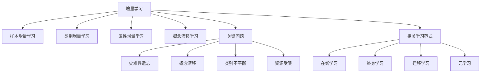
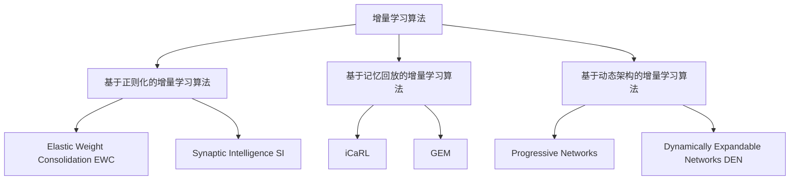

# Incremental Learning原理与代码实例讲解

## 1. 背景介绍

### 1.1 增量学习的定义与特点

增量学习(Incremental Learning)是一种机器学习范式,它允许模型在接收新数据时不断学习和更新,而无需从头开始重新训练整个模型。与传统的批量学习(Batch Learning)不同,增量学习能够持续地学习和适应新的数据,使模型能够在动态变化的环境中保持良好的性能。

增量学习的主要特点包括:

1. 连续学习:模型能够持续地接收和学习新的数据,不断更新和完善自身的知识。
2. 知识保留:在学习新知识的同时,模型能够保留先前学习到的知识,避免灾难性遗忘(Catastrophic Forgetting)。
3. 资源效率:增量学习通常只需要存储新增的数据,而不需要保留所有历史数据,因此在存储和计算资源方面更加高效。
4. 适应性强:模型能够适应数据分布的变化,并及时调整自身的决策边界和参数。

### 1.2 增量学习的应用场景

增量学习在许多实际应用中都有广泛的需求,例如:

1. 在线学习:对于实时数据流的处理,如在线广告点击率预测、股票价格预测等,需要模型能够实时更新和适应新的数据。
2. 终身学习:对于需要不断学习和进化的智能体,如自动驾驶汽车、智能客服等,需要模型能够持续地学习新知识,同时保留已有的知识。
3. 数据隐私保护:在某些场景下,由于数据隐私保护的要求,无法一次性获取所有数据进行批量训练,需要模型能够增量地学习新的数据。
4. 大规模数据处理:当数据量非常庞大时,一次性加载所有数据进行训练可能会耗尽计算资源,增量学习可以分批次地处理数据,减轻计算压力。

## 2. 核心概念与联系

### 2.1 增量学习的分类

增量学习可以分为以下几类:

1. 样本增量学习(Sample Incremental Learning):每次增量学习时,会加入新的样本数据,但类别标签不会增加。
2. 类别增量学习(Class Incremental Learning):每次增量学习时,不仅会加入新的样本数据,还会引入新的类别标签。
3. 属性增量学习(Feature Incremental Learning):每次增量学习时,数据的属性或特征维度会发生变化,需要模型适应新的属性。
4. 概念漂移学习(Concept Drift Learning):数据的分布会随时间发生变化,需要模型能够适应概念漂移,及时调整决策边界。

### 2.2 增量学习的关键问题

增量学习面临的主要挑战和关键问题包括:

1. 灾难性遗忘(Catastrophic Forgetting):在学习新知识的过程中,模型可能会遗忘之前学习到的知识,导致性能下降。如何在学习新知识的同时保留旧知识是一个关键问题。
2. 概念漂移(Concept Drift):数据分布可能会随时间发生变化,导致模型的决策边界不再适用。如何检测和适应概念漂移是另一个关键问题。
3. 类别不平衡(Class Imbalance):在增量学习过程中,新加入的数据可能会导致类别分布不平衡,影响模型的学习效果。如何处理类别不平衡问题也是一个重要的研究方向。
4. 资源受限(Resource Constraint):增量学习通常需要在有限的计算和存储资源下进行,如何设计高效的增量学习算法是一个挑战。

### 2.3 增量学习与其他学习范式的关系

增量学习与其他机器学习范式有着密切的联系,例如:

1. 在线学习(Online Learning):增量学习可以看作是在线学习的一种特殊形式,它们都强调模型能够实时地学习和更新。
2. 终身学习(Lifelong Learning):增量学习是实现终身学习的重要手段,它允许模型不断地学习新知识,同时保留已有的知识。
3. 迁移学习(Transfer Learning):增量学习与迁移学习都关注知识的迁移和复用,但增量学习更强调连续性和实时性。
4. 元学习(Meta Learning):元学习旨在学习如何学习,增量学习可以借鉴元学习的思想,学习如何更好地进行增量学习。

下面是增量学习的核心概念与联系的Mermaid流程图:

## 3. 核心算法原理具体操作步骤

增量学习的核心算法主要包括以下几类:

### 3.1 基于正则化的增量学习算法

基于正则化的增量学习算法通过在损失函数中引入正则化项,来平衡新知识的学习和旧知识的保留。常见的算法包括:

1. Elastic Weight Consolidation (EWC):通过Fisher信息矩阵来度量参数的重要性,在损失函数中添加L2正则化项,惩罚那些对先前任务重要的参数的大幅改变。
2. Synaptic Intelligence (SI):通过记录每个参数在学习过程中的重要性,在损失函数中添加正则化项,惩罚那些对先前任务重要的参数的大幅改变。

具体操作步骤如下:

1. 在初始任务上训练模型,得到初始参数。
2. 对于每个新任务:
   a. 计算当前参数对先前任务的重要性(如Fisher信息矩阵或参数重要性度量)。
   b. 在损失函数中添加正则化项,惩罚那些对先前任务重要的参数的大幅改变。
   c. 在新任务的数据上训练模型,更新参数。
3. 重复步骤2,直到所有任务学习完毕。

### 3.2 基于记忆回放的增量学习算法

基于记忆回放的增量学习算法通过存储一部分先前任务的数据,在学习新任务时重放这些数据,来缓解灾难性遗忘。常见的算法包括:

1. iCaRL (Incremental Classifier and Representation Learning):在每个增量阶段,选择一部分样本作为exemplars进行存储,在学习新任务时与新数据一起重放。
2. GEM (Gradient Episodic Memory):在每个增量阶段,存储一部分样本的梯度信息,在学习新任务时利用这些梯度信息来约束优化方向,避免对先前任务的性能造成破坏。

具体操作步骤如下:

1. 在初始任务上训练模型,得到初始参数。
2. 对于每个新任务:
   a. 从先前任务中选择一部分样本进行存储(如iCaRL的exemplars或GEM的梯度信息)。
   b. 在新任务的数据上训练模型,同时重放存储的样本或利用梯度信息约束优化方向。
   c. 更新参数,同时更新存储的样本或梯度信息。
3. 重复步骤2,直到所有任务学习完毕。

### 3.3 基于动态架构的增量学习算法

基于动态架构的增量学习算法通过动态地调整模型的架构,来适应新任务的学习,同时保留先前任务的知识。常见的算法包括:

1. Progressive Networks:为每个新任务创建一个新的子网络,并通过横向连接将其与先前任务的子网络连接起来,实现知识的复用和迁移。
2. Dynamically Expandable Networks (DEN):根据新任务的复杂度,动态地扩展网络的宽度和深度,同时通过知识蒸馏等技术来保留先前任务的知识。

具体操作步骤如下:

1. 在初始任务上训练模型,得到初始架构和参数。
2. 对于每个新任务:
   a. 根据新任务的复杂度,动态地调整模型的架构(如增加子网络或扩展网络宽度和深度)。
   b. 在新任务的数据上训练模型,同时通过知识蒸馏等技术来保留先前任务的知识。
   c. 更新参数,同时更新模型架构。
3. 重复步骤2,直到所有任务学习完毕。

下面是增量学习的核心算法原理具体操作步骤的Mermaid流程图:

## 4. 数学模型和公式详细讲解举例说明

### 4.1 Elastic Weight Consolidation (EWC)

EWC通过在损失函数中引入Fisher信息矩阵作为正则化项,来惩罚那些对先前任务重要的参数的大幅改变。其数学模型如下:

假设我们有一系列任务 $\{T_1,T_2,\dots,T_N\}$,对应的数据集为 $\{D_1,D_2,\dots,D_N\}$,模型参数为 $\theta$。在学习任务 $T_i$ 时,EWC的损失函数为:

$$
L(\theta) = L_i(\theta) + \sum_{j=1}^{i-1} \frac{\lambda}{2} F_j(\theta - \theta_j^*)^2
$$

其中, $L_i(\theta)$ 是任务 $T_i$ 的经验风险, $F_j$ 是任务 $T_j$ 的Fisher信息矩阵, $\theta_j^*$ 是在任务 $T_j$ 上训练得到的参数, $\lambda$ 是平衡经验风险和正则化项的超参数。

Fisher信息矩阵 $F_j$ 的计算公式为:

$$
F_j = \mathbb{E}_{x \sim D_j} \left[ \left( \frac{\partial \log p(x|\theta)}{\partial \theta} \right)^2 \right]
$$

其中, $p(x|\theta)$ 是模型在任务 $T_j$ 上的条件概率分布。

举例说明:假设我们有两个任务,分别是手写数字识别(Task A)和字母识别(Task B)。我们首先在Task A上训练模型,得到参数 $\theta_A^*$,然后计算Task A的Fisher信息矩阵 $F_A$。在学习Task B时,损失函数为:

$$
L(\theta) = L_B(\theta) + \frac{\lambda}{2} F_A(\theta - \theta_A^*)^2
$$

通过添加正则化项,EWC惩罚了那些对Task A重要的参数的大幅改变,从而在学习Task B的同时保留了Task A的知识。

### 4.2 iCaRL (Incremental Classifier and Representation Learning)

iCaRL通过选择一部分样本作为exemplars进行存储,在学习新任务时与新数据一起重放,来缓解灾难性遗忘。其数学模型如下:

假设我们有一系列任务 $\{T_1,T_2,\dots,T_N\}$,对应的数据集为 $\{D_1,D_2,\dots,D_N\}$,模型参数为 $\theta$。在学习任务 $T_i$ 时,iCaRL的损失函数为:

$$
L(\theta) = L_i(\theta) + \frac{1}{|P|} \sum_{(x,y) \in P} L(f_\theta(x), y)
$$

其中, $L_i(\theta)$ 是任务 $T_i$ 的经验风险, $P$ 是从先前任务中选择的exemplars集合, $f_\theta(x)$ 是模型的输出, $L(f_\theta(x), y)$ 是exemplars上的损失函数。

在每个增量阶段,iCaRL从先前任务中选择一部分样本作