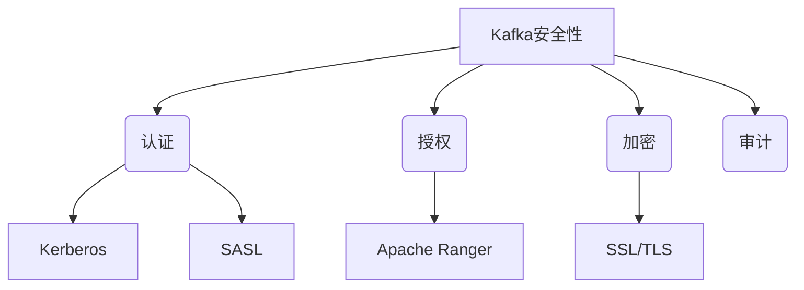
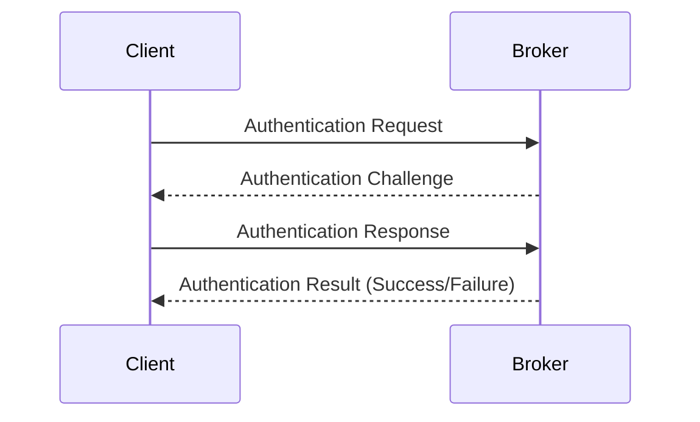
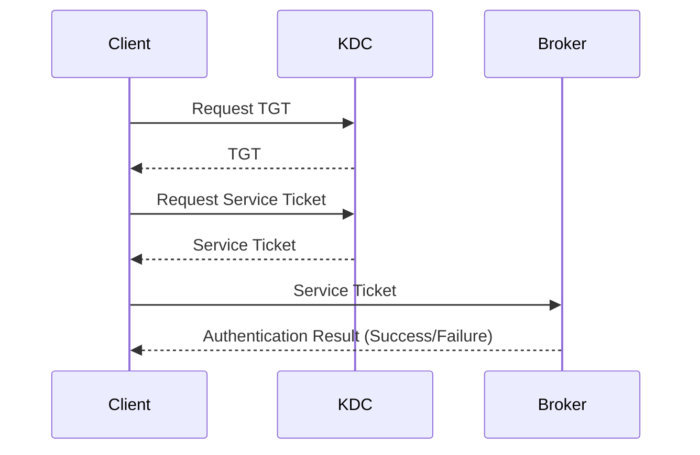
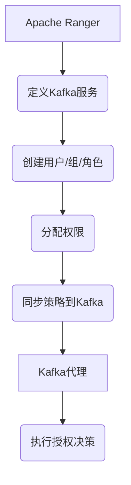
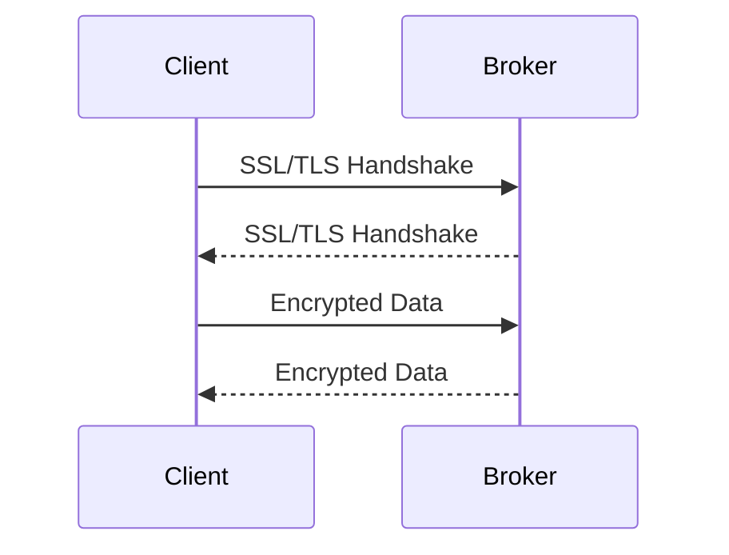
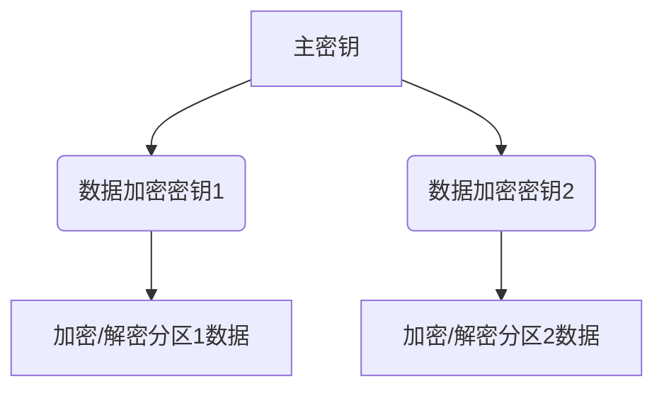
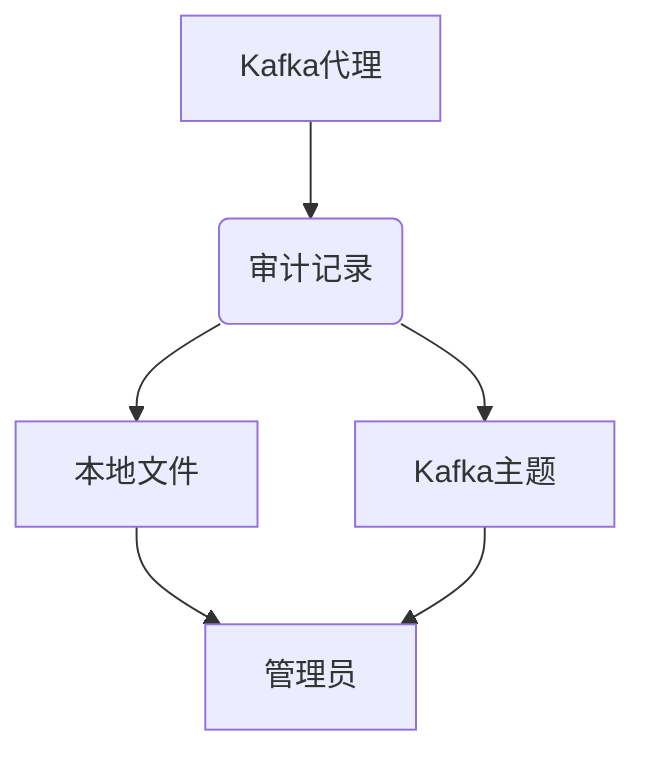

# Kafka安全性：保护数据的堡垒-Kafka安全机制详解

## 1.背景介绍

### 1.1 数据安全的重要性

在当今的数字时代,数据已经成为企业最宝贵的资产之一。无论是金融交易记录、客户信息还是业务智能分析,确保数据的安全性和隐私性对于任何组织的运营都至关重要。一旦数据遭到破坏或泄露,可能会导致严重的财务损失、信誉受损,甚至面临法律诉讼。

### 1.2 Apache Kafka简介

Apache Kafka是一个分布式流处理平台,被广泛用于构建实时数据管道、流处理应用程序和数据集成解决方案。它的设计目标是提供一个统一、高吞吐量、可扩展的平台,用于处理大量的实时数据流。Kafka已经成为许多大型公司的核心基础设施,包括PayPal、Netflix、LinkedIn等。

### 1.3 Kafka安全性的重要性

由于Kafka经常被用于处理敏感数据,如金融交易、个人身份信息等,因此确保Kafka系统的安全性就显得尤为重要。攻击者如果能够访问或篡改Kafka中的数据,后果将不堪设想。因此,为Kafka集群实施适当的安全控制措施,保护数据的机密性、完整性和可用性,是任何企业部署Kafka时必须考虑的关键因素。

## 2.核心概念与联系

### 2.1 Kafka安全性概述

Kafka的安全性主要包括以下几个方面:

- **认证(Authentication)**: 确保只有授权的客户端能够连接到Kafka集群。
- **授权(Authorization)**: 控制客户端对Kafka主题(topics)和其他资源的访问权限。
- **加密(Encryption)**: 保护数据在传输过程中和静态存储时的机密性。
- **审计(Auditing)**: 记录和监控对Kafka集群的访问和操作。

这些安全性措施相互关联,共同构建了一个全面的安全防护体系。

### 2.2 Kafka安全性架构

Kafka的安全性架构主要包括以下几个核心组件:

- **SSL/TLS**: 用于加密Kafka集群内部和外部的通信。
- **Kerberos**: 一种网络认证协议,可用于Kafka客户端和代理之间的相互认证。
- **SASL(Simple Authentication and Security Layer)**: 一种用于Kafka认证和授权的框架。
- **Apache Ranger**: 一个集中式安全管理平台,可用于管理Kafka的授权策略。

这些组件可以单独使用,也可以组合使用,构建出一个强大而灵活的安全防护体系。

## 3.核心算法原理具体操作步骤

### 3.1 认证(Authentication)

#### 3.1.1 SASL认证

SASL(Simple Authentication and Security Layer)是Kafka中实现认证的主要机制。它支持多种认证方式,包括:

- **PLAIN**: 使用用户名和密码进行认证,数据以明文形式传输。
- **SCRAM**: 使用加盐哈希密码进行认证,密码不会以明文形式传输。
- **GSSAPI(Kerberos)**: 使用Kerberos协议进行认证,提供了更强的安全性。

SASL认证的工作流程如下:

1. 客户端向Kafka代理发送认证请求。
2. 代理返回一个认证挑战(challenge)。
3. 客户端使用相应的认证机制(如PLAIN或SCRAM)生成响应(response),并将其发送回代理。
4. 代理验证响应,如果有效则允许客户端连接,否则拒绝连接。

#### 3.1.2 Kerberos认证

Kerberos是一种网络认证协议,可以为Kafka集群提供强大的相互认证功能。在Kerberos认证中,每个客户端和服务器都需要从Kerberos认证服务器(KDC)获取一个票据(ticket)。

Kerberos认证的工作流程如下:

1. 客户端向KDC请求一个票据授予票据(TGT)。
2. KDC验证客户端的身份,并发放TGT。
3. 客户端使用TGT向KDC请求一个服务票据(service ticket)。
4. KDC发放服务票据。
5. 客户端使用服务票据连接到Kafka代理。
6. 代理验证服务票据,如果有效则允许客户端连接。

### 3.2 授权(Authorization)

#### 3.2.1 ACL(Access Control Lists)

Kafka使用ACL(Access Control Lists)来控制对主题、消费者组和其他资源的访问权限。ACL由以下几个部分组成:

- **Principal**: 被授予权限的用户或组。
- **Resource Pattern**: 受控资源的模式,如主题名称。
- **Operation**: 允许的操作,如读(Read)、写(Write)等。
- **Permission Type**: 权限类型,如允许(Allow)或拒绝(Deny)。
- **Host**: 可选的主机名或IP地址。

ACL可以在代理级别或集群级别进行配置和管理。

#### 3.2.2 Apache Ranger

Apache Ranger是一个集中式安全管理平台,可用于管理Kafka的授权策略。它提供了一个基于Web的用户界面和REST API,允许管理员定义和管理细粒度的授权策略。

使用Apache Ranger管理Kafka授权的工作流程如下:

1. 在Ranger中定义Kafka服务。
2. 创建用户、组和角色。
3. 为用户、组和角色分配权限。
4. 将授权策略同步到Kafka集群。
5. Kafka代理根据同步的策略执行授权决策。

### 3.3 加密(Encryption)

#### 3.3.1 SSL/TLS加密

Kafka支持使用SSL/TLS协议对通信进行加密,以保护数据在传输过程中的机密性和完整性。SSL/TLS加密涉及以下几个关键步骤:

1. 生成SSL/TLS证书和密钥。
2. 配置Kafka代理和客户端以使用SSL/TLS。
3. 建立SSL/TLS会话,协商加密算法和密钥。
4. 使用协商的密钥对通信数据进行加密和解密。

#### 3.3.2 数据文件加密

除了传输加密,Kafka还支持对存储在磁盘上的数据文件进行加密。这可以进一步增强数据的安全性,防止未经授权的访问。

Kafka使用透明数据加密(TDE)技术来加密数据文件。TDE的工作原理如下:

1. 生成一个主密钥(master key),用于保护数据加密密钥。
2. 为每个分区生成一个独立的数据加密密钥(data encryption key)。
3. 使用数据加密密钥对分区数据进行加密和解密。
4. 将加密后的数据写入磁盘。

### 3.4 审计(Auditing)

Kafka支持对集群的访问和操作进行审计,以便追踪和监控潜在的安全威胁。审计记录包括以下信息:

- 客户端IP地址和主机名。
- 认证的主体(principal)。
- 执行的操作(如读、写等)。
- 操作的资源(如主题、消费者组等)。
- 操作的结果(成功或失败)。

审计记录可以写入本地文件或集中式日志系统(如Apache Kafka自身)。管理员可以定期检查审计日志,识别潜在的安全问题或异常活动。

## 4.数学模型和公式详细讲解举例说明

在Kafka安全性中,有几个涉及到密码学和加密算法的重要数学模型和公式,值得详细讲解。

### 4.1 SCRAM(Salted Challenge Response Authentication Mechanism)

SCRAM是一种基于挑战-响应的认证机制,它使用加盐哈希密码来保护密码的机密性。SCRAM的工作原理如下:

1. 客户端和服务器共享一个密码$P$。
2. 服务器生成一个随机的盐值$S$,并计算密码的加盐哈希值$H=H(S,P)$,其中$H$是一个加密哈希函数,如SHA-256。
3. 服务器将盐值$S$和哈希值$H$存储在数据库中,而不存储明文密码$P$。
4. 在认证过程中,服务器生成一个随机的挑战$C$,并将其发送给客户端。
5. 客户端使用密码$P$和盐值$S$计算$H'=H(S,P)$,然后使用$H'$和挑战$C$生成响应$R=F(H',C)$,其中$F$是一个定义的函数。
6. 客户端将响应$R$发送给服务器。
7. 服务器使用存储的哈希值$H$和挑战$C$计算$R'=F(H,C)$,并将$R'$与客户端发送的$R$进行比较。如果相等,则认证成功。

SCRAM的优点是即使服务器的密码数据库被泄露,攻击者也无法直接获取明文密码,因为只有加盐哈希值被存储。

### 4.2 SSL/TLS密钥交换

SSL/TLS使用密钥交换算法在客户端和服务器之间协商一个共享的会话密钥,用于加密通信数据。最常用的密钥交换算法是基于Diffie-Hellman密钥交换的变体。

假设客户端和服务器分别选择两个大质数$p$和$g$,以及各自的私钥$a$和$b$。它们执行以下步骤:

1. 客户端计算$A=g^a \bmod p$,并将$A$发送给服务器。
2. 服务器计算$B=g^b \bmod p$,并将$B$发送给客户端。
3. 客户端计算$s=B^a \bmod p$。
4. 服务器计算$s=A^b \bmod p$。

现在,客户端和服务器共享相同的会话密钥$s$,可用于加密通信数据。

$$s = B^a \bmod p = (g^b)^a \bmod p = g^{ab} \bmod p$$
$$s = A^b \bmod p = (g^a)^b \bmod p = g^{ab} \bmod p$$

这种方法的安全性基于离散对数问题的困难性,即给定$g$、$p$和$A(或B)$,很难计算出$a(或b)$。

### 4.3 透明数据加密(TDE)

Kafka使用透明数据加密(TDE)技术来加密存储在磁盘上的数据文件。TDE的核心是使用一个主密钥(master key)来保护多个数据加密密钥(data encryption keys)。

假设我们有一个主密钥$K_m$和两个数据加密密钥$K_1$和$K_2$。加密和解密过程如下:

1. 使用对称加密算法(如AES)和主密钥$K_m$加密数据加密密钥$K_1$