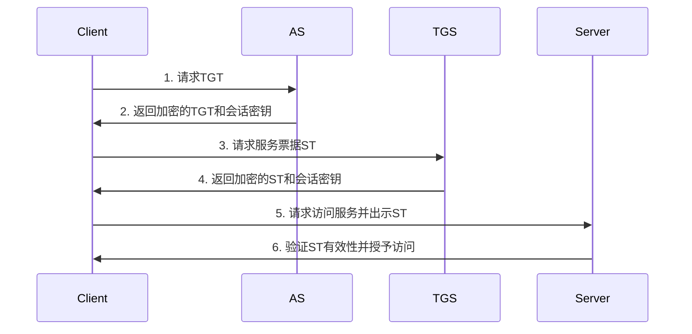

# Kerberos原理与代码实例讲解

## 1. 背景介绍

### 1.1 Kerberos的起源与发展历程

Kerberos是一种网络认证协议,由麻省理工学院(MIT)开发,旨在通过使用强加密技术为客户端/服务器应用程序提供强大的身份验证。Kerberos协议基于对称密钥加密和信任第三方的概念。它提供了一种在不安全的网络环境中安全地证明身份的方法。

Kerberos最初是作为Project Athena的一部分开发的,该项目是MIT在1983年启动的一项教育计算项目。Kerberos第一个测试版本于1988年发布。随后,Kerberos成为一个广泛使用的网络安全标准,被各种操作系统和应用程序所采用,包括Microsoft Windows、Apple macOS、Linux、Solaris等。

### 1.2 Kerberos解决的核心问题

在开放的网络环境中,面临着各种安全威胁,如窃听、篡改、冒充等。Kerberos旨在解决以下核心安全问题:

1. 身份验证:确保通信双方的身份真实可信。Kerberos使用票据(Ticket)机制来验证客户端和服务器的身份。

2. 保密性:防止数据在网络传输过程中被窃听。Kerberos使用对称加密算法(如AES)对通信数据进行加密。  

3. 完整性:防止数据在传输过程中被篡改。Kerberos使用消息认证码(MAC)来验证数据完整性。

4. 防止重放攻击:防止攻击者捕获认证数据并重新发送。Kerberos在票据中嵌入时间戳,服务器可以检测和拒绝过期或重复的票据。

5. 单点登录(SSO):用户只需要登录一次,就可以访问多个服务器上的资源。Kerberos提供了一种SSO机制。

## 2. 核心概念与联系

### 2.1 Kerberos中的核心实体

- 客户端(Client):需要访问服务的用户或进程。
- 服务端(Server):提供服务的实体,如应用服务器。
- 认证服务器(Authentication Server, AS):负责验证用户身份并颁发票据授权票据(TGT)。
- 票据授予服务器(Ticket Granting Server, TGS):负责颁发用于访问服务器的服务票据(ST)。
- 密钥分发中心(Key Distribution Center, KDC):由AS和TGS组成,是Kerberos的核心组件。

### 2.2 Kerberos中的关键概念

- 领域(Realm):Kerberos管理的一个逻辑组,通常对应一个组织或域。不同领域之间可以建立信任关系。
- 委托人(Principal):Kerberos中的用户或服务的唯一标识符,格式为`name/instance@REALM`。
- 票据(Ticket):包含客户端身份、会话密钥等信息的一个数据结构,用于在客户端和服务器之间安全地传输。
- 票据授权票据(Ticket Granting Ticket, TGT):由AS颁发,用于向TGS请求服务票据。
- 服务票据(Service Ticket):由TGS颁发,用于向特定服务器请求访问。
- 认证者(Authenticator):包含客户端身份、时间戳等信息的一个数据结构,用于防止重放攻击。

### 2.3 Kerberos的认证流程

Kerberos的认证流程可以分为以下几个步骤:

1. 客户端向AS请求TGT。
2. AS验证客户端身份,并返回加密的TGT和会话密钥。
3. 客户端使用TGT向TGS请求服务票据。
4. TGS验证TGT有效性,并返回加密的服务票据和会话密钥。
5. 客户端使用服务票据向服务器请求访问。
6. 服务器验证服务票据有效性,并授予客户端访问权限。

下图展示了Kerberos的认证流程:



## 3. 核心算法原理具体操作步骤

### 3.1 对称加密算法

Kerberos使用对称加密算法来保护通信数据的机密性。常用的对称加密算法包括:

- DES(Data Encryption Standard):早期版本使用,现已被认为是不安全的。
- 3DES(Triple DES):DES的增强版,提供更高的安全性。
- AES(Advanced Encryption Standard):目前广泛使用的对称加密标准,提供高安全性和效率。

对称加密的基本步骤如下:

1. 发送方和接收方共享一个密钥。
2. 发送方使用共享密钥对明文进行加密,得到密文。
3. 发送方将密文发送给接收方。
4. 接收方使用相同的共享密钥对密文进行解密,得到原始明文。

### 3.2 密钥派生函数

Kerberos使用密钥派生函数从长期密钥(如用户密码)中派生出会话密钥和其他短期密钥。常用的密钥派生函数包括:

- PBKDF2(Password-Based Key Derivation Function 2):基于密码的密钥派生函数,使用伪随机函数(如HMAC)和盐值来生成密钥。

PBKDF2的基本步骤如下:

1. 选择一个伪随机函数PRF(如HMAC-SHA256)。
2. 设置迭代次数C和输出密钥长度dkLen。
3. 生成一个随机盐值Salt。
4. 将密码、盐值、迭代次数和输出密钥长度作为输入,应用PRF进行多次迭代,得到最终的派生密钥。

```
DK = PBKDF2(PRF, Password, Salt, C, dkLen)
```

### 3.3 消息认证码

Kerberos使用消息认证码(MAC)来验证数据完整性和真实性。常用的MAC算法包括:

- HMAC(Hash-based Message Authentication Code):基于密码散列函数(如SHA-256)和共享密钥构造的MAC。

HMAC的基本步骤如下:

1. 发送方和接收方共享一个密钥K。
2. 发送方对消息M应用密码散列函数(如SHA-256),得到散列值H(M)。
3. 发送方使用共享密钥K和H(M)计算HMAC值:HMAC = H(K ⊕ opad || H(K ⊕ ipad || M))。
4. 发送方将消息M和HMAC值发送给接收方。
5. 接收方使用相同的共享密钥K和收到的消息M计算HMAC值,并与收到的HMAC值进行比较,验证消息完整性和真实性。

## 4. 数学模型和公式详细讲解举例说明

### 4.1 对称加密的数学模型

对称加密可以用以下数学模型来表示:

$C = E_K(M)$

$M = D_K(C)$

其中:
- M表示明文消息
- C表示密文
- K表示共享密钥
- E表示加密函数
- D表示解密函数

举例说明:
假设Alice要给Bob发送一条加密消息,他们共享一个密钥K。Alice使用加密函数E和密钥K对明文消息M进行加密,得到密文C:

$C = E_K(M)$

Alice将密文C发送给Bob。Bob收到密文C后,使用解密函数D和相同的密钥K对密文C进行解密,得到原始明文M:

$M = D_K(C)$

### 4.2 PBKDF2的数学模型

PBKDF2可以用以下数学模型来表示:

$DK = PBKDF2(PRF, Password, Salt, C, dkLen)$

其中:
- PRF表示伪随机函数
- Password表示用户密码
- Salt表示盐值
- C表示迭代次数
- dkLen表示输出密钥长度
- DK表示派生密钥

举例说明:
假设要使用PBKDF2从用户密码中派生出一个128位的密钥。选择HMAC-SHA256作为PRF,迭代次数C为10000,随机生成一个16字节的盐值Salt。

$DK = PBKDF2(HMAC-SHA256, Password, Salt, 10000, 128)$

PBKDF2将密码、盐值、迭代次数和输出密钥长度作为输入,应用HMAC-SHA256进行10000次迭代,最终得到一个128位的派生密钥DK。

### 4.3 HMAC的数学模型

HMAC可以用以下数学模型来表示:

$HMAC(K, M) = H((K' ⊕ opad) || H((K' ⊕ ipad) || M))$

其中:
- H表示密码散列函数(如SHA-256)
- M表示消息
- K表示共享密钥
- K'表示从共享密钥K派生出的密钥(如果K的长度小于散列函数的块大小,则K'=K;否则K'=H(K))
- ipad表示内部填充,一个固定值(0x36)
- opad表示外部填充,一个固定值(0x5C)
- ||表示拼接操作
- ⊕表示异或操作

举例说明:
假设Alice要给Bob发送一条消息M,并使用HMAC-SHA256对消息进行认证。他们共享一个密钥K。

1. Alice对消息M应用SHA-256,得到散列值H(M)。
2. Alice从共享密钥K派生出K',然后计算HMAC值:

$HMAC = SHA256((K' ⊕ opad) || SHA256((K' ⊕ ipad) || M))$

3. Alice将消息M和HMAC值发送给Bob。
4. Bob使用相同的共享密钥K和收到的消息M计算HMAC值,并与收到的HMAC值进行比较,验证消息完整性和真实性。

## 5. 项目实践:代码实例和详细解释说明

下面是一个使用Python实现Kerberos认证的简化示例代码:

```python
import hashlib
import hmac
import os
import time

# 定义Kerberos实体
class Client:
    def __init__(self, id, key):
        self.id = id
        self.key = key
        
    def request_tgt(self, as_id):
        timestamp = str(int(time.time()))
        message = f"{self.id}|{as_id}|{timestamp}"
        mac = hmac.new(self.key, message.encode(), hashlib.sha256).hexdigest()
        return f"{message}|{mac}"
        
    def request_st(self, tgs_id, tgt, session_key):
        timestamp = str(int(time.time()))
        message = f"{self.id}|{tgs_id}|{timestamp}"
        mac = hmac.new(session_key, message.encode(), hashlib.sha256).hexdigest()
        return f"{tgt}|{message}|{mac}"
        
    def request_service(self, server_id, st, session_key):
        timestamp = str(int(time.time()))
        message = f"{self.id}|{server_id}|{timestamp}"
        mac = hmac.new(session_key, message.encode(), hashlib.sha256).hexdigest()
        return f"{st}|{message}|{mac}"
        
class AuthenticationServer:
    def __init__(self, key):
        self.key = key
        
    def issue_tgt(self, request):
        client_id, as_id, timestamp, mac = request.split("|")
        message = f"{client_id}|{as_id}|{timestamp}"
        
        # 验证请求完整性
        expected_mac = hmac.new(self.key, message.encode(), hashlib.sha256).hexdigest()
        if mac != expected_mac:
            raise Exception("Invalid request")
            
        # 颁发TGT
        session_key = os.urandom(16)
        tgt = f"{client_id}|{session_key.hex()}"
        tgt_mac = hmac.new(self.key, tgt.encode(), hashlib.sha256).hexdigest()
        return f"{tgt}|{tgt_mac}", session_key
        
class TicketGrantingServer:
    def __init__(self, key):
        self.key = key
        
    def issue_st(self, request):
        tgt, client_id, tgs_id, timestamp, mac = request.split("|")
        message = f"{client_id}|{tgs_id}|{timestamp}"
        
        # 验证TGT有效性
        tgt_content, tgt_mac = tgt.split("|")
        expected_tgt_mac = hmac.new(self.key, tgt_content.encode(), hashlib.sha256).hexdigest()
        if tgt_mac != expected_tgt_mac:
            raise Exception("Invalid TGT")