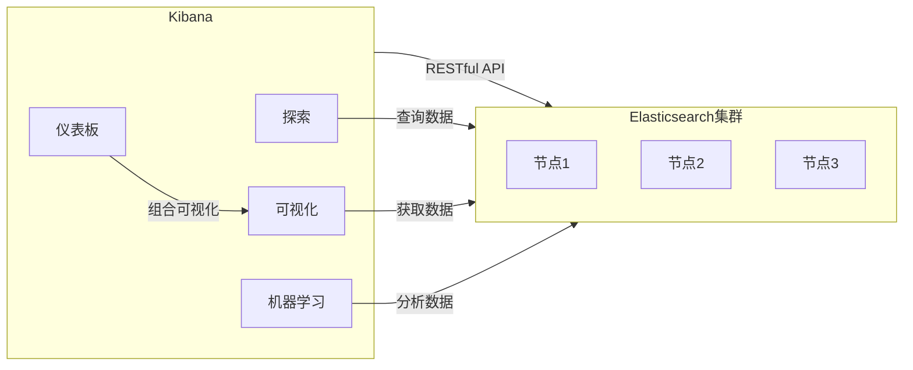
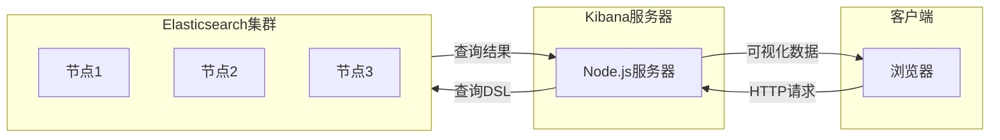

# Kibana原理与代码实例讲解

## 1.背景介绍

在当今大数据时代,随着海量数据的快速积累,有效地管理和分析这些数据已经成为企业和组织面临的一大挑战。Elasticsearch作为一个分布式、RESTful 风格的搜索和数据分析引擎,凭借其强大的全文检索、近实时搜索和分析能力,成为了大数据处理领域的佼佼者。而 Kibana 则是 Elasticsearch 的官方数据可视化管理平台,它提供了一个友好的 Web 界面,让用户可以轻松地检索、查看和可视化存储在 Elasticsearch 中的数据。

在本文中,我们将深入探讨 Kibana 的原理和实现,并通过代码示例来帮助读者更好地理解和运用这一强大的数据可视化工具。无论您是数据分析师、开发人员还是运维工程师,掌握 Kibana 都将为您提供高效管理和分析大数据的能力。

## 2.核心概念与联系

在深入 Kibana 的细节之前,我们先来了解一些核心概念和它们之间的关系。

### 2.1 Elasticsearch

Elasticsearch 是一个基于 Lucene 构建的开源、分布式、RESTful 搜索和分析引擎。它能够存储和索引海量数据,并提供近实时的搜索和分析功能。Elasticsearch 的主要概念包括:

- 索引(Index):用于存储相关数据的逻辑空间。
- 类型(Type):索引中的数据逻辑分类,在 Elasticsearch 7.x 版本中已被弃用。
- 文档(Document):存储在索引中的基本数据单元,使用 JSON 格式表示。
- 集群(Cluster):一个或多个节点(Node)组成的 Elasticsearch 实例。

Elasticsearch 通过 RESTful API 与其他应用程序进行交互,支持多种查询语言,如查询 DSL、SQL 等。

### 2.2 Kibana

Kibana 是一个开源的数据可视化和探索平台,它与 Elasticsearch 紧密集成,为用户提供了一个友好的 Web 界面,用于查询、可视化和管理存储在 Elasticsearch 中的数据。Kibana 的主要功能包括:

- 探索(Discover):查询和探索 Elasticsearch 中的数据。
- 可视化(Visualize):基于数据创建各种图表和可视化效果。
- 仪表板(Dashboard):组合多个可视化效果,构建自定义仪表板。
- 机器学习(Machine Learning):对数据进行异常检测和预测分析。
- ...

Kibana 通过与 Elasticsearch 的无缝集成,为用户提供了一个强大的数据分析和可视化平台。



## 3.核心算法原理具体操作步骤

### 3.1 Kibana 架构

Kibana 采用了客户端-服务器架构,其核心组件包括:

1. **Kibana 服务器**:一个基于 Node.js 的 Web 服务器,负责处理客户端请求、与 Elasticsearch 进行通信,并将结果返回给客户端。

2. **客户端**:基于 Web 技术(HTML、CSS、JavaScript)构建的前端界面,用于与用户进行交互,发送请求并呈现数据可视化结果。

3. **Elasticsearch**:作为后端数据存储和搜索引擎,为 Kibana 提供数据支持。

Kibana 服务器作为中间层,负责处理客户端请求和与 Elasticsearch 的交互。它接收客户端的查询请求,将其转换为 Elasticsearch 可理解的查询 DSL,然后将查询结果转换为可视化数据,最终返回给客户端进行渲染和展示。



### 3.2 数据可视化流程

Kibana 的数据可视化流程可以概括为以下几个步骤:

1. **数据索引**:首先,需要将数据导入到 Elasticsearch 中进行索引。这可以通过多种方式实现,如 Logstash、Beats 或直接使用 Elasticsearch API。

2. **创建索引模式**:在 Kibana 中,需要定义索引模式(Index Pattern),告诉 Kibana 从哪个索引中获取数据,以及如何映射字段。

3. **数据探索**:使用 Kibana 的 Discover 功能,可以对索引中的数据进行查询和探索。这包括构建查询、过滤数据、排序和分页等操作。

4. **可视化创建**:基于探索到的数据,可以使用 Kibana 的 Visualize 功能创建各种图表和可视化效果,如柱状图、饼图、地图等。

5. **仪表板构建**:将多个可视化效果组合在一起,构建自定义的仪表板,以便于数据监控和分析。

6. **共享和协作**:Kibana 支持将可视化效果和仪表板导出为静态文件或 URL,方便与他人共享和协作。

通过这一流程,Kibana 为用户提供了一种直观和高效的方式来探索、分析和可视化存储在 Elasticsearch 中的大数据。

## 4.数学模型和公式详细讲解举例说明

在数据可视化和分析过程中,Kibana 内置了一些常用的数学模型和公式,用于对数据进行转换、聚合和计算。下面我们将介绍其中几个重要的模型和公式。

### 4.1 移动平均模型

移动平均模型(Moving Average Model)是一种常用的时序数据平滑技术,它通过计算一段时间内的平均值来减小数据波动,从而更清晰地显示数据趋势。Kibana 中的移动平均模型可以应用于各种可视化效果,如折线图、面积图等。

移动平均的计算公式如下:

$$
MA_t = \frac{1}{n}\sum_{i=0}^{n-1}x_{t-i}
$$

其中:

- $MA_t$ 表示时间 $t$ 的移动平均值
- $n$ 表示移动平均的窗口大小(周期)
- $x_{t-i}$ 表示时间 $t-i$ 的原始数据值

例如,如果我们要计算一个周期为5的简单移动平均,那么第6个数据点的移动平均值将是前5个数据点的算术平均值。

在 Kibana 中,可以通过"派生字段"功能添加移动平均模型,或者在可视化效果的高级设置中启用移动平均选项。

### 4.2 累积模型

累积模型(Cumulative Model)用于计算一个值在时间维度上的累计总和。它常用于分析增长趋势、总量统计等场景。

累积模型的计算公式如下:

$$
C_t = \sum_{i=0}^{t}x_i
$$

其中:

- $C_t$ 表示时间 $t$ 的累积值
- $x_i$ 表示时间 $i$ 的原始数据值

在 Kibana 中,可以通过"派生字段"功能添加累积模型,或者在可视化效果的高级设置中启用累积选项。

### 4.3 百分比模型

百分比模型(Percentage Model)用于将数据转换为相对于总和或基线的百分比形式,便于比较和分析不同数据之间的占比关系。

百分比模型的计算公式如下:

$$
P_i = \frac{x_i}{\sum_{j=1}^{n}x_j} \times 100\%
$$

其中:

- $P_i$ 表示第 $i$ 个数据的百分比值
- $x_i$ 表示第 $i$ 个数据的原始值
- $\sum_{j=1}^{n}x_j$ 表示所有数据的总和

在 Kibana 中,可以通过"派生字段"功能添加百分比模型,或者在可视化效果的高级设置中启用百分比选项。

这些数学模型和公式为 Kibana 提供了强大的数据转换和分析能力,使用户能够更好地理解和呈现数据insights。

## 5.项目实践:代码实例和详细解释说明

在本节中,我们将通过一个实际项目案例,展示如何使用 Kibana 进行数据可视化和分析。我们将使用一个开源的 Web 服务器日志数据集,并演示如何导入数据、创建可视化效果、构建仪表板等流程。

### 5.1 准备工作

首先,我们需要安装和配置 Elasticsearch 和 Kibana。您可以从官方网站下载相应的软件包,或者使用 Docker 快速部署一个集群。

```bash
# 使用 Docker 启动 Elasticsearch 和 Kibana
docker run -d --name elasticsearch -p 9200:9200 -p 9300:9300 -e "discovery.type=single-node" elasticsearch:7.17.3
docker run -d --name kibana --link elasticsearch:elasticsearch -p 5601:5601 kibana:7.17.3
```

### 5.2 导入数据

我们将使用 Nginx 的访问日志作为示例数据集。您可以从 GitHub 上下载一个开源的日志文件:

```
https://github.com/elastic/examples/blob/master/Common%20Data%20Formats/nginx_logs/nginx_logs
```

将日志文件保存到本地,然后使用 Logstash 或 Elasticsearch API 将数据导入到 Elasticsearch 中。以下是使用 Logstash 导入数据的示例配置文件:

```conf
# logstash.conf
input {
  file {
    path => "/path/to/nginx_logs"
    start_position => "beginning"
  }
}

filter {
  grok {
    match => { "message" => "%{COMBINEDAPACHELOG}"}
  }
  date {
    match => [ "timestamp" , "dd/MMM/yyyy:HH:mm:ss Z" ]
  }
}

output {
  elasticsearch {
    hosts => ["http://localhost:9200"]
    index => "nginx-logs-%{+YYYY.MM.dd}"
  }
}
```

运行 Logstash,将日志数据导入到 Elasticsearch 中:

```bash
bin/logstash -f logstash.conf
```

### 5.3 创建索引模式

打开 Kibana 界面,进入 "Management" -> "Stack Management" -> "Index Patterns",创建一个新的索引模式。在 "Index pattern" 字段中输入 `nginx-logs-*`,然后选择 "@timestamp" 作为时间字段。

### 5.4 数据探索

进入 Kibana 的 "Discover" 视图,您将看到导入的 Nginx 日志数据。您可以使用查询语言(如 Lucene 或 KQL)对数据进行搜索和过滤。例如,查找所有状态码为 404 的请求:

```
status:404
```

### 5.5 创建可视化效果

接下来,我们将创建一些可视化效果来分析日志数据。进入 "Visualize" 视图,选择合适的可视化类型,如柱状图、饼图或折线图。

例如,我们可以创建一个柱状图来显示每小时的请求数量:

1. 选择 "Vertical Bar" 可视化类型
2. 在 "Metrics" 中,选择 "Count" 聚合
3. 在 "Buckets" 中,选择 "X-Axis",并选择 "Date Histogram" 作为字段,间隔设置为每小时
4. 应用更改并查看可视化效果

### 5.6 构建仪表板

最后,我们将创建一个仪表板来组合多个可视化效果,提供一个全面的数据概览。进入 "Dashboard" 视图,创建一个新的仪表板,并将之前创建的可视化效果添加到仪表板中。

您还可以自定义仪表板的布局、添加文本注释等,以满足您的需求。完成后,可以将仪表板保存并与他人共享。

通过这个实践案例,我们展示了如何使用 Kibana 进行数据可视化和分析的