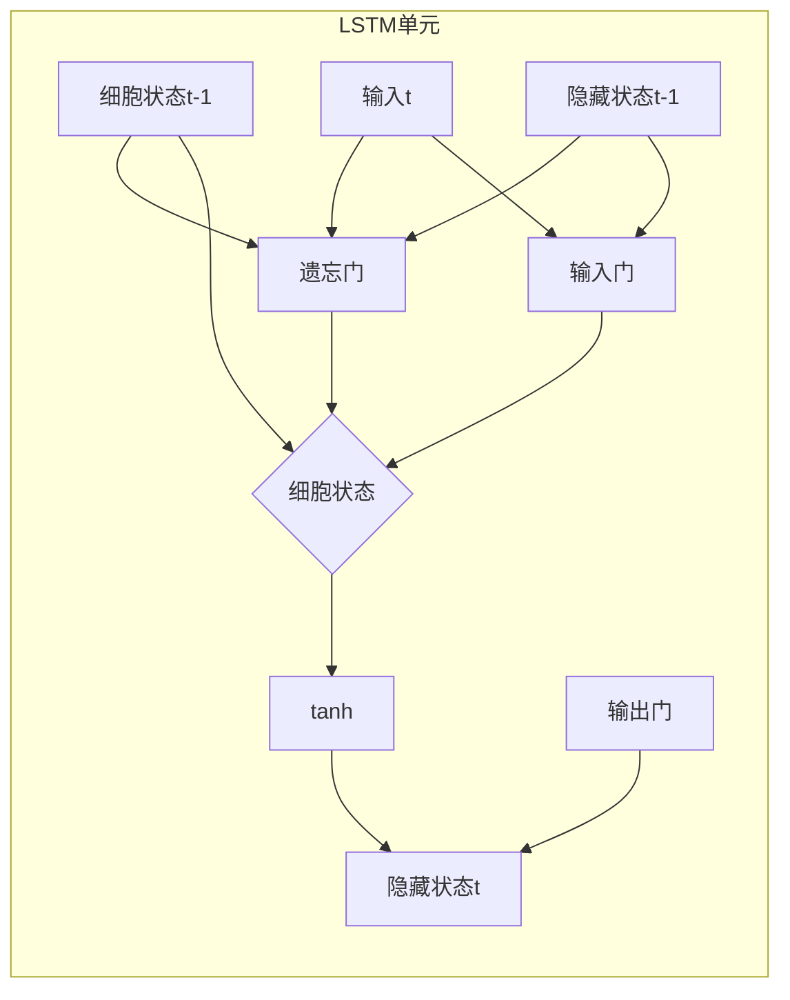

# Long Short-Term Memory (LSTM)原理与代码实例讲解

## 1.背景介绍

### 1.1 序列数据处理的挑战

在自然语言处理、语音识别、时间序列预测等领域中,我们经常会遇到序列数据。序列数据是指一系列按时间顺序排列的数据,例如一句话中的单词序列、一段语音中的音频帧序列、一段时间内的传感器读数序列等。这些序列数据具有以下几个特点:

1. **长度不固定**: 序列长度可以是任意长度,无法事先确定。
2. **时序相关性**: 序列中的每个元素都与其前后元素存在潜在的时序相关性。
3. **远期依赖**: 序列中的某些元素可能与很远的上下文相关。

传统的机器学习模型如前馈神经网络等,在处理序列数据时存在一些局限性。它们无法很好地捕捉序列数据的长期依赖关系,也无法有效地处理可变长度的序列输入。

### 1.2 循环神经网络(RNN)

为了解决序列数据处理的挑战,循环神经网络(Recurrent Neural Network, RNN)应运而生。与前馈神经网络不同,RNN引入了循环连接,使得网络在处理序列数据时能够捕捉时序信息。具体来说,RNN在每个时间步都会接收当前输入和上一时间步的隐藏状态,并计算出当前时间步的隐藏状态和输出。

然而,标准的RNN在实践中存在梯度消失或爆炸的问题,导致无法有效地捕捉长期依赖关系。为了解决这一问题,许多改进的RNN变体被提出,其中最著名的就是长短期记忆网络(Long Short-Term Memory, LSTM)。

## 2.核心概念与联系

### 2.1 LSTM的核心概念

LSTM是一种特殊的RNN,它通过精心设计的门控机制和记忆细胞状态,有效地解决了标准RNN的梯度消失和爆炸问题,从而能够更好地捕捉长期依赖关系。

LSTM的核心概念包括:

1. **记忆细胞状态(Cell State)**: 用于存储序列的长期信息。
2. **遗忘门(Forget Gate)**: 控制从上一时间步的细胞状态中丢弃什么信息。
3. **输入门(Input Gate)**: 控制从当前输入和上一隐藏状态中获取什么新信息。
4. **输出门(Output Gate)**: 控制从当前细胞状态中输出什么信息作为隐藏状态。

通过这些精心设计的门控机制,LSTM能够有选择地保留、更新和输出信息,从而更好地捕捉长期依赖关系。

### 2.2 LSTM与其他序列模型的联系

除了LSTM之外,还有其他一些常用的序列模型,如门控循环单元(Gated Recurrent Unit, GRU)、注意力机制(Attention Mechanism)等。

- **GRU**: 与LSTM类似,GRU也是一种门控循环单元,但相比LSTM结构更加简单。它合并了遗忘门和输入门,只有两个门控机制:重置门和更新门。
- **注意力机制**: 注意力机制允许序列模型在处理序列时,动态地关注序列中的不同部分,从而更好地捕捉长期依赖关系。注意力机制常与RNN、LSTM等模型结合使用。

这些序列模型各有优缺点,在不同的应用场景下表现也不尽相同。LSTM由于其强大的长期依赖关系捕捉能力,在自然语言处理、语音识别等领域得到了广泛应用。

## 3.核心算法原理具体操作步骤

在了解了LSTM的核心概念之后,我们来详细介绍LSTM的工作原理和具体操作步骤。

### 3.1 LSTM的前向传播过程

LSTM的前向传播过程可以分为以下几个步骤:

1. **遗忘门计算**:

$$
f_t = \sigma(W_f \cdot [h_{t-1}, x_t] + b_f)
$$

其中,$f_t$表示遗忘门的激活值向量,$\sigma$是sigmoid激活函数,$W_f$和$b_f$分别是遗忘门的权重矩阵和偏置向量,$h_{t-1}$是上一时间步的隐藏状态向量,$x_t$是当前时间步的输入向量。

2. **输入门计算**:

$$
i_t = \sigma(W_i \cdot [h_{t-1}, x_t] + b_i)
$$
$$
\tilde{C}_t = \tanh(W_C \cdot [h_{t-1}, x_t] + b_C)
$$

其中,$i_t$表示输入门的激活值向量,$\tilde{C}_t$是当前时间步的候选细胞状态向量,$W_i$、$W_C$、$b_i$和$b_C$分别是输入门和候选细胞状态的权重矩阵和偏置向量。

3. **细胞状态更新**:

$$
C_t = f_t \odot C_{t-1} + i_t \odot \tilde{C}_t
$$

其中,$C_t$是当前时间步的细胞状态向量,$\odot$表示元素wise乘积操作。细胞状态是通过遗忘门控制保留上一时间步的细胞状态,并通过输入门控制加入当前时间步的候选细胞状态,从而实现状态的选择性更新。

4. **输出门计算**:

$$
o_t = \sigma(W_o \cdot [h_{t-1}, x_t] + b_o)
$$
$$
h_t = o_t \odot \tanh(C_t)
$$

其中,$o_t$表示输出门的激活值向量,$W_o$和$b_o$分别是输出门的权重矩阵和偏置向量,$h_t$是当前时间步的隐藏状态向量。隐藏状态是通过输出门控制选择性地输出细胞状态的部分信息。

通过上述步骤,LSTM在每个时间步都会根据当前输入和上一时间步的隐藏状态,计算出当前时间步的细胞状态和隐藏状态。这些状态信息将作为下一时间步的输入,参与后续的计算。

### 3.2 LSTM的反向传播过程

LSTM的反向传播过程是通过计算各个门控和状态的梯度,并利用链式法则进行反向传播,从而更新网络的权重参数。具体步骤如下:

1. **计算输出层的梯度**:根据输出层的损失函数,计算输出层相对于隐藏状态的梯度。

2. **反向传播到输出门**:利用链式法则,计算输出门相对于各个参数的梯度。

3. **反向传播到细胞状态**:计算细胞状态相对于各个参数的梯度,包括遗忘门、输入门和候选细胞状态。

4. **反向传播到其他门控和状态**:依次计算遗忘门、输入门、候选细胞状态和上一时间步的隐藏状态相对于各个参数的梯度。

5. **更新权重参数**:根据计算得到的梯度,使用优化算法(如随机梯度下降)更新网络的权重参数。

通过上述反向传播过程,LSTM可以有效地捕捉序列数据中的长期依赖关系,并根据梯度信息不断调整网络参数,从而提高模型的性能。

## 4.数学模型和公式详细讲解举例说明

在上一节中,我们介绍了LSTM的前向传播和反向传播过程,涉及到了一些数学公式和符号。现在,我们将对这些公式和符号进行详细的讲解和举例说明。

### 4.1 遗忘门

遗忘门的作用是控制从上一时间步的细胞状态中丢弃什么信息。它的计算公式如下:

$$
f_t = \sigma(W_f \cdot [h_{t-1}, x_t] + b_f)
$$

其中,$f_t$是一个向量,每个元素的值介于0和1之间。值接近0表示丢弃上一时间步的细胞状态信息,值接近1表示保留上一时间步的细胞状态信息。

例如,假设我们有一个3维的LSTM,细胞状态向量为$C_{t-1} = [0.7, 0.2, -0.1]$,遗忘门的激活值向量为$f_t = [0.1, 0.9, 0.6]$。那么,通过元素wise乘积操作,我们得到:

$$
f_t \odot C_{t-1} = [0.1 \times 0.7, 0.9 \times 0.2, 0.6 \times (-0.1)] = [0.07, 0.18, -0.06]
$$

可以看到,第一个元素的值接近于0,表示丢弃了上一时间步的第一个元素信息;第二个元素的值接近于原始值,表示保留了上一时间步的第二个元素信息;第三个元素的值介于0和原始值之间,表示部分保留了上一时间步的第三个元素信息。

### 4.2 输入门和候选细胞状态

输入门的作用是控制从当前输入和上一隐藏状态中获取什么新信息,其计算公式为:

$$
i_t = \sigma(W_i \cdot [h_{t-1}, x_t] + b_i)
$$

候选细胞状态$\tilde{C}_t$是当前时间步的新增信息,它的计算公式为:

$$
\tilde{C}_t = \tanh(W_C \cdot [h_{t-1}, x_t] + b_C)
$$

例如,假设我们有一个3维的LSTM,输入门的激活值向量为$i_t = [0.8, 0.2, 0.7]$,候选细胞状态向量为$\tilde{C}_t = [-0.3, 0.6, 0.2]$。那么,通过元素wise乘积操作,我们得到:

$$
i_t \odot \tilde{C}_t = [0.8 \times (-0.3), 0.2 \times 0.6, 0.7 \times 0.2] = [-0.24, 0.12, 0.14]
$$

可以看到,第一个元素的值较大,表示从候选细胞状态中获取了较多的第一个元素信息;第二个元素的值较小,表示从候选细胞状态中获取了较少的第二个元素信息;第三个元素的值介于两者之间。

### 4.3 细胞状态更新

细胞状态的更新公式为:

$$
C_t = f_t \odot C_{t-1} + i_t \odot \tilde{C}_t
$$

它将上一时间步的细胞状态$C_{t-1}$与遗忘门$f_t$相结合,丢弃不需要的信息;同时将候选细胞状态$\tilde{C}_t$与输入门$i_t$相结合,获取新的信息。

例如,假设我们有一个3维的LSTM,上一时间步的细胞状态为$C_{t-1} = [0.7, 0.2, -0.1]$,遗忘门的激活值向量为$f_t = [0.1, 0.9, 0.6]$,输入门的激活值向量为$i_t = [0.8, 0.2, 0.7]$,候选细胞状态向量为$\tilde{C}_t = [-0.3, 0.6, 0.2]$。那么,根据上述公式,我们可以计算出当前时间步的细胞状态:

$$
\begin{aligned}
C_t &= f_t \odot C_{t-1} + i_t \odot \tilde{C}_t \\
    &= [0.1 \times 0.7, 0.9 \times 0.2, 0.6 \times (-0.1)] + [0.8 \times (-0.3), 0.2 \times 0.6, 0.7 \times 0.2] \\
    &= [0.07, 0.18, -0.06] + [-0.24, 0.12, 0.14] \\
    &= [-0.17, 0.30, 0.08]
\end{aligned}
$$

可以看到,细胞状态$C_t$综