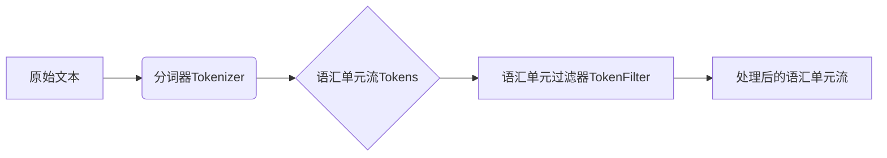

# Lucene分词原理与代码实例讲解

## 1.背景介绍

### 1.1 什么是Lucene

Lucene是Apache软件基金会的一个顶级开源项目，是一个高性能、全文检索的开源搜索引擎工具包。它提供了完整的查询引擎和索引引擎，部分文本分析引擎。Lucene的目的是为软件开发人员提供一个简单易用的工具包，以方便的在目标系统中实现全文检索的功能，或者是以此为基础建立起完整的全文检索引擎。

### 1.2 全文检索与分词的关系

全文检索是指计算机索引程序通过扫描文章中的每一个词，对每一个词建立一个索引，指明该词在文章中出现的次数和位置。当用户查询时，检索程序就根据事先建立的索引进行查找，并将查找的结果反馈给用户的检索方式。这个过程类似于通过字典中的检索字表查字的过程。

要实现全文检索，需要先对文本进行分词处理，将整本书或整篇文章分成一个个单独的词，这些词代表了文章的主题内容。分词是全文检索的基础，也是最关键的一步。

### 1.3 Lucene分词器简介

Lucene中负责将原始内容分割成一个个单独语汇单元(单词)的组件就叫做分词器(Tokenizer)。Lucene自带了多种分词器，可以对不同语言进行分词。标准分词器(StandardAnalyzer)可以对英文进行分词，中文分词需要使用第三方扩展，如IKAnalyzer、Ansj、Jcseg、mmseg4j等。

## 2.核心概念与联系

### 2.1 分词器(Tokenizer)

分词器(Tokenizer)是Lucene中负责将原始内容分割成一个个单独语汇单元(单词)的组件。分词器是一个抽象类，其子类实现了不同的分词算法。

### 2.2 语汇单元(Token)

语汇单元(Token)是分词的最小单位，通常是词或词组。Token由一个词(term)、词在原文中的起始位置(start offset)、结束位置(end offset)组成。

### 2.3 语汇单元过滤器(TokenFilter)

语汇单元过滤器(TokenFilter)可以对语汇单元(Token)进行增加、删除、修改等操作，以完成停用词过滤、同义词处理、词干提取、大小写转换等功能。

### 2.4 分词器与语汇单元过滤器的关系

分词器(Tokenizer)和语汇单元过滤器(TokenFilter)通常结合在一起使用，先用分词器将原始内容分割成语汇单元(Token)流，然后用一系列的TokenFilter对Token流进行处理，最终输出处理后的Token流。



## 3.核心算法原理具体操作步骤

Lucene的分词算法主要有以下几种：

### 3.1 基于字符串匹配的分词方法

该方法按照预定义的一些规则，将待分析的文本与一个分词词典进行比较，若在词典中找到，则切分出该词。常见的基于字符串匹配的分词方法有：

1. 正向最大匹配法(MaxMatch)：从左到右扫描，找出最长的词。
2. 逆向最大匹配法(ReverseMaxMatch)：从右到左扫描，找出最长的词。
3. 双向最大匹配法(Bidirectional Max Match)：分别执行正向最大匹配法和逆向最大匹配法，然后选择词数较少的作为结果。

### 3.2 基于统计的分词方法

基于统计的分词方法通过统计文本中字、词的频率信息，通过计算字、词间的互信息、信息熵等统计指标，构建统计语言模型，从而实现分词。常见的基于统计的分词方法有：

1. 基于N-gram语言模型的分词
2. 基于HMM(隐马尔可夫模型)的分词
3. 基于CRF(条件随机场)的分词

### 3.3 基于规则的分词方法

基于规则的分词方法通过人工总结出一些分词规则，然后将这些规则编写成程序，对文本进行分词。常见的规则有：

1. 利用标点、空格等分隔符进行分词
2. 根据构词规则进行分词，如英文中的字母+数字等
3. 根据词性进行分词，如动词、名词等

## 4.数学模型和公式详细讲解举例说明

### 4.1 基于统计的分词方法之互信息

互信息(Mutual Information)可以用来衡量两个随机变量X和Y的相互依赖性。在分词中，可以用字与字之间的互信息来表示它们结合成词的可能性。互信息公式如下：

$MI(x,y) = log_2 \frac{p(x,y)}{p(x)p(y)}$

其中，$p(x,y)$表示字x和字y同时出现的概率，$p(x)$和$p(y)$分别表示字x和字y出现的概率。

举例说明，假设在语料库中，"中华"同时出现1000次，"中华人民"同时出现800次，"中华"出现10000次，"人民"出现20000次，语料库总字数为1000000，则"中华"和"人民"的互信息为：

$MI("中华","人民") = log_2 \frac{\frac{800}{1000000}}{\frac{10000}{1000000} \times \frac{20000}{1000000}} = 10.32$

可见"中华"和"人民"同时出现的概率远大于它们分别出现概率的乘积，它们结合成词的可能性很大。

### 4.2 基于统计的分词方法之HMM

HMM(Hidden Markov Model)是一种统计学模型，常用于时序数据建模。在分词中，可以将汉语看作由字组成的序列，每个字有4种词位：

- B：词的开头
- M：词的中间
- E：词的结尾 
- S：单独成词

HMM模型由初始概率矩阵$\pi$、状态转移概率矩阵$A$、发射概率矩阵$B$组成。

- $\pi = (\pi_1, \pi_2, \pi_3, \pi_4)$：表示每个词位的初始概率。
- $A = (a_{ij})_{4 \times 4}, a_{ij}=P(t_j|t_i)$：表示由词位$i$转移到词位$j$的概率。
- $B = (b_{ij})_{4 \times n}, b_{ij}=P(o_j|t_i)$：表示由词位$i$生成字$j$的概率。

分词时，对于给定的字序列$O=(o_1,o_2,...,o_T)$，求其最可能的词位序列$I^*=(i_1^*,i_2^*,...,i_T^*)$，即：

$$I^* = \arg\max_{I} P(O|I)P(I)$$

可以用维特比算法求解。

## 5.项目实践：代码实例和详细解释说明

下面以Lucene自带的StandardAnalyzer为例，演示如何使用Lucene进行分词：

```java
//创建一个StandardAnalyzer分词器对象
Analyzer analyzer = new StandardAnalyzer();

//获取TokenStream对象
TokenStream tokenStream = analyzer.tokenStream("content", "Lucene is a Java full-text search engine.");

//添加一个同义词过滤器
tokenStream = new SynonymFilter(tokenStream, synonymMap);

//获取每个语汇单元
CharTermAttribute charTermAttribute = tokenStream.addAttribute(CharTermAttribute.class);

//重置TokenStream
tokenStream.reset();

//迭代获取分词结果
while (tokenStream.incrementToken()) {
    System.out.println(charTermAttribute);
}

//关闭TokenStream
tokenStream.close();
```

代码说明：

1. 创建一个StandardAnalyzer分词器对象。StandardAnalyzer是Lucene自带的标准分词器，对英文文本分词效果好。
2. 调用分词器的tokenStream方法获取TokenStream对象，指定要分词的内容。
3. 添加一个同义词过滤器SynonymFilter，可以对同义词进行归并。
4. 从TokenStream中获取每个语汇单元(Term)的信息，如内容、位置等，这里只获取Term内容。
5. 重置TokenStream的指针到流的开始位置。
6. 迭代获取分词结果，直到tokensStream.incrementToken()返回false，表示分词结束。
7. 关闭TokenStream。

## 6.实际应用场景

Lucene分词在以下场景中应用广泛：

### 6.1 搜索引擎

Lucene是众多搜索引擎的基础，如Solr、Elasticsearch等。这些搜索引擎在索引文档和查询分析时都需要用到分词技术，以提升搜索精度和召回率。

### 6.2 文本挖掘

对文本进行分词是文本挖掘的基础步骤，如情感分析、文本分类、关键词提取等任务都需要先对文本分词。

### 6.3 自然语言处理

分词是自然语言处理的基础，如机器翻译、命名实体识别、句法分析等都需要用到分词技术。

### 6.4 推荐系统

推荐系统需要对用户行为数据、物品属性等进行分词，提取关键特征，以构建用户画像和物品画像。

## 7.工具和资源推荐

### 7.1 中文分词工具

- IKAnalyzer：基于字典的中文分词器，支持自定义词库，Lucene插件。
- Ansj：基于CRF模型的中文分词器，分词效果好，Lucene插件。
- Jcseg：基于mmseg算法的中文分词器，Lucene插件。
- mmseg4j：基于mmseg算法的中文分词器，Lucene插件。
- FudanNLP：复旦大学研究生开发的中文分词器，分词效果好。

### 7.2 Lucene资源

- Lucene官网：https://lucene.apache.org/
- Lucene Github：https://github.com/apache/lucene
- Lucene使用指南：https://lucene.apache.org/core/
- Lucene分词器：https://lucene.apache.org/core/7_7_2/analyzers-common/index.html

## 8.总结：未来发展趋势与挑战

Lucene分词技术经过多年发展已经相当成熟，但仍然面临以下挑战：

### 8.1 分词歧义问题

汉语分词面临较多歧义现象，如交集型歧义、组合型歧义等，很难得到一个完全正确的分词结果。未来还需要在分词歧义消解方面下功夫。

### 8.2 新词发现

随着语言的发展，新词不断出现，如何从文本中发现新词，并动态更新分词词典，是分词技术面临的另一个挑战。

### 8.3 领域适应问题

不同领域的文本在用词、句式等方面存在较大差异，通用分词器很难适应所有领域。如何开发适应特定领域的分词器，是今后的一个重要研究方向。

### 8.4 分词速度问题

对于大规模文本数据，分词速度也是一个需要考虑的问题。如何在保证分词质量的同时提高分词速度，也是今后研究的一个重点。

## 9.附录：常见问题与解答

### 9.1 Lucene和Solr、Elasticsearch的关系是什么？

Lucene是一个全文检索引擎的工具包，提供了完整的查询引擎和索引引擎。Solr和Elasticsearch是基于Lucene开发的搜索引擎服务，提供了比Lucene更丰富的企业级功能，如管理界面、分布式部署等。

### 9.2 Lucene支持哪些语言的分词？

Lucene自带的分词器主要针对英文、德文、法文等西方语言。对于中文、日文、泰文等亚洲语言，需要使用第三方分词器插件，如IKAnalyzer、Ansj、Jcseg、mmseg4j等。

### 9.3 Lucene分词的性能如何？

Lucene采用了倒排索引等优化方法，分词性能较好。但是对于大规模数据，分词仍然是一个耗时的过程。可以采用多线程、MapReduce等方式提高分词速度。

### 9.4 Lucene如何实现停用词过滤？

可以通过自定义一个Analyzer，重载getStopWords()方法，返回停用词列表。也可以在TokenFilter中进行停用词过滤，如St