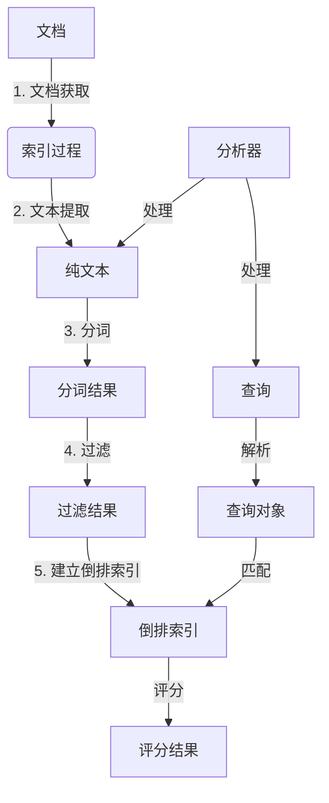

# Lucene原理与代码实例讲解

## 1.背景介绍

在当今信息时代,海量数据的存储和高效检索成为了一个巨大的挑战。作为一种流行的全文检索引擎库,Lucene凭借其优秀的性能、可扩展性和开源特性,成为了广受欢迎的解决方案之一。Lucene最初由Doug Cutting在1997年开发,后于2001年捐赠给Apache软件基金会,成为了顶级Apache项目。

全文检索(Full-Text Search)是一种在大量文本数据中查找符合查询条件的文档的技术。与传统的数据库查询不同,全文检索不仅可以根据结构化数据进行查询,还可以根据文本内容进行模糊查询。这使得全文检索在网页搜索、电子邮件归档、知识库搜索等场景中发挥着重要作用。

Lucene以Java编写,提供了索引、搜索、排名和分析等丰富功能。它可以嵌入到各种应用程序中,为开发人员提供了强大而灵活的全文检索能力。无论是构建企业级搜索引擎、电子商务网站还是知识管理系统,Lucene都是一个不可或缺的重要组件。

## 2.核心概念与联系

### 2.1 索引(Index)

索引是Lucene的核心概念之一。它是一种数据结构,用于存储和组织文档的内容,以便快速检索。Lucene将文档分词并建立倒排索引,这是一种将单词与文档相关联的数据结构。

索引过程包括以下几个步骤:

1. **文档获取**: 从各种数据源(如文件系统、数据库等)获取原始文档。
2. **文本提取**: 从原始文档中提取出纯文本内容。
3. **分词(Tokenization)**: 将文本内容按照一定的规则(如空格、标点符号等)分割成多个单词(Token)。
4. **过滤(Filtering)**: 对分词结果进行处理,如去除停用词、转换大小写等。
5. **建立倒排索引**: 将处理后的单词与对应的文档相关联,构建倒排索引。

倒排索引是一种高效的数据结构,它将单词作为索引项,记录了该单词出现的文档列表。这种结构使得根据单词快速查找相关文档成为可能。

### 2.2 查询(Query)

查询是用户输入的搜索条件,Lucene会根据查询解析出相关的单词,并在倒排索引中查找与之匹配的文档。

Lucene支持多种查询类型,包括:

- **词条查询(Term Query)**: 根据单个单词进行精确匹配。
- **短语查询(Phrase Query)**: 根据短语(多个相邻单词)进行精确匹配。
- **布尔查询(Boolean Query)**: 使用布尔逻辑(AND、OR、NOT)组合多个查询条件。
- **通配符查询(Wildcard Query)**: 使用通配符(如`*`和`?`)进行模糊匹配。
- **模糊查询(Fuzzy Query)**: 根据编辑距离进行相似匹配。
- **前缀查询(Prefix Query)**: 根据单词的前缀进行匹配。

用户可以使用Lucene提供的查询解析器(Query Parser)将查询语句转换为查询对象,也可以直接构建查询对象。

### 2.3 评分(Scoring)

对于一个查询,通常会有多个文档与之匹配。Lucene使用评分机制来对匹配的文档进行排序,使得最相关的文档排在前面。

评分是基于多个因素计算得出的,包括:

- **词频(Term Frequency, TF)**: 单词在文档中出现的频率。
- **逆向文档频率(Inverse Document Frequency, IDF)**: 衡量单词在整个索引中的稀有程度。
- **字段长度范数(Field Length Norm)**: 考虑字段长度对评分的影响。
- **查询规范化(Query Normalization)**: 对查询进行规范化处理。

Lucene使用`TF-IDF`算法作为默认的评分算法,但也支持自定义评分算法。

### 2.4 分析器(Analyzer)

分析器是Lucene中一个重要的概念,它负责将原始文本转换为索引项和查询项。分析器由一系列组件组成,包括字符过滤器(Character Filter)、分词器(Tokenizer)和词元过滤器(Token Filter)。

Lucene提供了多种内置分析器,如标准分析器(Standard Analyzer)、简单分析器(Simple Analyzer)、白空格分析器(Whitespace Analyzer)等。同时,Lucene也支持自定义分析器,以满足特定的需求。

选择合适的分析器对于索引和搜索的质量至关重要。例如,对于英文文本,标准分析器通常是一个不错的选择;而对于中文文本,可能需要使用专门的中文分析器。

### 2.5 Mermaid流程图

以下是Lucene的核心概念及其关系的Mermaid流程图:



该流程图展示了Lucene索引和搜索的整个过程。首先,从各种数据源获取原始文档,然后经过文本提取、分词、过滤等步骤,最终建立倒排索引。用户输入的查询也需要经过分析器处理,转换为查询对象。查询对象与倒排索引进行匹配,并根据评分算法对匹配的文档进行排序。

## 3.核心算法原理具体操作步骤

### 3.1 索引构建过程

Lucene的索引构建过程可以分为以下几个步骤:

1. **获取文档**

   首先,需要从各种数据源(如文件系统、数据库等)获取原始文档。Lucene提供了多种文档读取器(Document Reader),用于读取不同格式的文档,如纯文本、PDF、Word等。

2. **文本提取**

   对于非纯文本格式的文档,需要进行文本提取操作,将文档内容转换为纯文本。Lucene使用Apache Tika库来支持多种文档格式的文本提取。

3. **分词**

   分词是将文本内容按照一定的规则(如空格、标点符号等)分割成多个单词(Token)的过程。Lucene使用分词器(Tokenizer)来完成这一步骤。

4. **过滤**

   过滤是对分词结果进行进一步处理的步骤,如去除停用词、转换大小写等。Lucene使用词元过滤器(Token Filter)来实现这一功能。

5. **建立倒排索引**

   最后,Lucene将处理后的单词与对应的文档相关联,构建倒排索引。倒排索引是一种高效的数据结构,它将单词作为索引项,记录了该单词出现的文档列表。

### 3.2 查询过程

查询过程是根据用户输入的查询条件,在倒排索引中查找与之匹配的文档。查询过程可以分为以下几个步骤:

1. **查询解析**

   用户输入的查询语句需要经过查询解析器(Query Parser)进行解析,转换为查询对象(Query Object)。查询对象封装了查询条件和查询类型等信息。

2. **词条查找**

   查询对象中的单词将在倒排索引中进行查找,获取与之匹配的文档列表。

3. **评分与排序**

   对于匹配的文档,Lucene使用评分算法(如TF-IDF)计算每个文档的相关性评分。然后,根据评分对文档进行排序,使得最相关的文档排在前面。

4. **结果返回**

   最后,Lucene将排序后的文档列表作为搜索结果返回给用户。

### 3.3 评分算法

Lucene使用`TF-IDF`算法作为默认的评分算法,用于计算文档与查询的相关性评分。`TF-IDF`算法综合考虑了以下几个因素:

1. **词频(Term Frequency, TF)**

   词频是指单词在文档中出现的频率。一个单词在文档中出现的次数越多,则该文档与该单词的相关性越高。

2. **逆向文档频率(Inverse Document Frequency, IDF)**

   逆向文档频率衡量单词在整个索引中的稀有程度。一个单词在索引中出现的文档越少,则该单词的区分能力越强,权重越高。

3. **字段长度范数(Field Length Norm)**

   字段长度范数考虑了字段长度对评分的影响。在相同的词频和文档频率下,较短的字段应该获得更高的评分。

4. **查询规范化(Query Normalization)**

   查询规范化是对查询进行处理,以确保不同查询之间的评分可比较。

`TF-IDF`算法的具体公式如下:

$$
\text{score}(q,d) = \sum_{t \in q} \frac{tf(t,d)}{len(d)} \cdot idf(t) \cdot boost(t.field) \cdot queryNorm(q)
$$

其中:

- $q$ 表示查询
- $d$ 表示文档
- $t$ 表示查询中的单词
- $tf(t,d)$ 表示单词 $t$ 在文档 $d$ 中的词频
- $len(d)$ 表示文档 $d$ 的长度
- $idf(t)$ 表示单词 $t$ 的逆向文档频率
- $boost(t.field)$ 表示字段的增强权重
- $queryNorm(q)$ 表示查询规范化因子

通过调整各个因素的权重,可以根据具体需求优化评分算法的效果。

## 4.数学模型和公式详细讲解举例说明

### 4.1 词频(Term Frequency, TF)

词频(Term Frequency, TF)是指单词在文档中出现的频率。一个单词在文档中出现的次数越多,则该文档与该单词的相关性越高。

词频的计算公式如下:

$$
tf(t,d) = \sqrt{freq(t,d)}
$$

其中:

- $t$ 表示单词
- $d$ 表示文档
- $freq(t,d)$ 表示单词 $t$ 在文档 $d$ 中出现的次数

例如,假设一个文档中包含以下内容:

```
The quick brown fox jumps over the lazy dog.
```

对于单词 "the",它在文档中出现了 2 次,因此 $freq("the", d) = 2$,则 $tf("the", d) = \sqrt{2} \approx 1.414$。

对于单词 "fox",它在文档中只出现了 1 次,因此 $freq("fox", d) = 1$,则 $tf("fox", d) = \sqrt{1} = 1$。

可以看出,词频越高,单词对文档的重要性越大。

### 4.2 逆向文档频率(Inverse Document Frequency, IDF)

逆向文档频率(Inverse Document Frequency, IDF)衡量单词在整个索引中的稀有程度。一个单词在索引中出现的文档越少,则该单词的区分能力越强,权重越高。

IDF的计算公式如下:

$$
idf(t) = \log \left( \frac{N + 1}{df(t) + 1} \right) + 1
$$

其中:

- $t$ 表示单词
- $N$ 表示索引中的总文档数
- $df(t)$ 表示包含单词 $t$ 的文档数

例如,假设索引中总共有 1,000,000 个文档,单词 "the" 出现在 500,000 个文档中,单词 "lucene" 出现在 10,000 个文档中。则:

- $idf("the") = \log \left( \frac{1,000,000 + 1}{500,000 + 1} \right) + 1 \approx 1.301$
- $idf("lucene") = \log \left( \frac{1,000,000 + 1}{10,000 + 1} \right) + 1 \approx 3.301$

可以看出,单词 "lucene" 的 IDF 值比 "the" 的 IDF 值高,这是因为 "lucene" 在索引中出现的文档更少,具有更强的区分能力。

### 4.3 字段长度范数(Field Length Norm)

字段长度范数