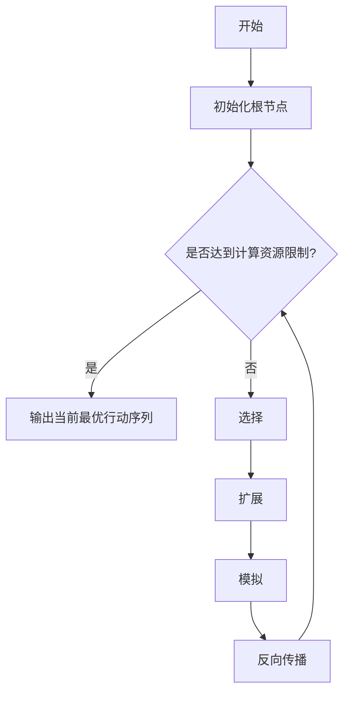

# MCTS与其他随机算法的性能比较

## 1.背景介绍

随机算法是一种基于概率理论的算法设计范式,通过引入随机性来解决一些确定性算法无法高效解决的问题。随机算法在人工智能、计算机科学、运筹学等领域有着广泛的应用。其中,蒙特卡罗树搜索(Monte Carlo Tree Search, MCTS)是一种重要的随机算法,被广泛应用于游戏AI、规划、机器人控制等领域。

### 1.1 蒙特卡罗树搜索简介

蒙特卡罗树搜索(MCTS)是一种基于随机采样的最优决策树搜索算法。它通过在决策树上进行多次随机模拟,逐步评估每个节点的价值,从而找到最优的行动序列。MCTS算法具有以下特点:

- 无需事先建模,可应用于复杂的决策空间
- 通过自我迭代不断改进决策质量
- 可并行化,适合利用现代硬件资源

MCTS已在许多领域取得了卓越的成绩,如计算机围棋程序AlphaGo、国际象棋引擎Stockfish等。

### 1.2 其他常见随机算法

除了MCTS之外,其他一些常见的随机算法包括:

- 遗传算法(Genetic Algorithm)
- 模拟退火(Simulated Annealing) 
- 蚁群算法(Ant Colony Optimization)
- 粒子群优化(Particle Swarm Optimization)

这些算法均源于对自然界进化过程的模拟,通过引入随机性来探索解空间,从而寻找近似最优解。

## 2.核心概念与联系

### 2.1 MCTS核心思想

MCTS算法的核心思想是通过在决策树上进行多次随机模拟,逐步评估每个节点的价值,从而找到最优的行动序列。其基本流程包括四个步骤:

1. **选择(Selection)**: 从根节点出发,根据某种策略选择子节点,直到遇到未探索的节点。
2. **扩展(Expansion)**: 从未探索的节点出发,在其子节点中随机采样一个节点。
3. **模拟(Simulation)**: 从采样的节点出发,进行随机模拟直至终止。
4. **反向传播(Backpropagation)**: 将模拟的结果反向传播到所经过的节点,更新它们的统计数据。

通过不断重复这四个步骤,MCTS算法可以逐渐收敛到最优解。

### 2.2 UCB公式

在MCTS算法的选择步骤中,通常采用UCB(Upper Confidence Bound)公式来平衡exploitation和exploration:

$$
\mathrm{UCB}(n) = \overline{X}_n + c\sqrt{\frac{\ln N}{n}}
$$

其中:
- $\overline{X}_n$是节点n的平均回报
- N是父节点的模拟次数
- n是节点n的模拟次数
- c是一个调节exploitation和exploration的常数

UCB公式能够在exploitation(利用已知的好节点)和exploration(探索未知的潜力节点)之间达成平衡,从而提高算法的性能。

### 2.3 与其他随机算法的联系

MCTS算法与其他随机算法有一些相似之处:

- 都引入了随机性来探索解空间
- 都需要权衡exploitation和exploration
- 都可以通过并行化来提高效率

但是,MCTS算法也有自身的特点:

- 基于树形结构,更适合于具有序列决策的问题
- 通过自我迭代不断改进决策质量
- 无需事先建模,可应用于复杂的决策空间

因此,MCTS算法在一些序列决策问题上表现出了优异的性能。

## 3.核心算法原理具体操作步骤

MCTS算法的具体操作步骤如下:



1. **初始化根节点**

   创建一个代表初始状态的根节点,并初始化其统计数据(如模拟次数、平均回报等)。

2. **选择(Selection)**

   从根节点出发,根据UCB公式或其他策略选择子节点,直到遇到未探索的节点(叶节点)。具体步骤如下:

   ```mermaid
   graph TD
       A[当前节点] --> B{是否为叶节点?}
       B -->|是| C[返回当前节点]
       B -->|否| D[根据UCB公式选择子节点]
       D --> E[将选择的子节点作为当前节点]
       E --> A
   ```

3. **扩展(Expansion)**

   从未探索的叶节点出发,在其子节点中随机采样一个节点作为新的叶节点。

4. **模拟(Simulation)**

   从新的叶节点出发,进行随机模拟直至终止(如达到最大模拟步数或游戏结束),并获得模拟的结果(如胜利或失败)。

5. **反向传播(Backpropagation)**

   将模拟的结果反向传播到所经过的节点,更新它们的统计数据(如模拟次数、平均回报等)。具体步骤如下:

   ```mermaid
   graph TD
       A[当前节点] --> B{是否为根节点?}
       B -->|是| C[结束]
       B -->|否| D[更新当前节点统计数据]
       D --> E[将父节点作为当前节点]
       E --> A
   ```

6. **重复步骤2-5**

   重复执行选择、扩展、模拟和反向传播步骤,直到达到计算资源限制(如最大迭代次数或时间限制)。

7. **输出最优行动序列**

   根据根节点的子节点统计数据,选择模拟次数最多或平均回报最高的子节点对应的行动作为第一步行动,然后继续在该子节点上重复执行MCTS算法,直到获得完整的最优行动序列。

通过上述步骤,MCTS算法可以逐步收敛到最优解。值得注意的是,MCTS算法的性能很大程度上取决于模拟策略的设计,一个好的模拟策略可以大大提高算法的收敛速度。

## 4.数学模型和公式详细讲解举例说明

### 4.1 UCB公式

UCB(Upper Confidence Bound)公式是MCTS算法中用于选择步骤的一种常用策略,它可以在exploitation和exploration之间达成平衡。UCB公式的数学表达式如下:

$$
\mathrm{UCB}(n) = \overline{X}_n + c\sqrt{\frac{\ln N}{n}}
$$

其中:

- $\overline{X}_n$是节点n的平均回报,表示exploitation部分
- $\sqrt{\frac{\ln N}{n}}$是探索项,表示exploration部分
- c是一个调节exploitation和exploration的常数,通常取值在0到2之间

UCB公式的直观解释是:选择具有较高平均回报的节点(exploitation),同时也选择那些被探索次数较少的节点(exploration),从而在exploitation和exploration之间达成平衡。

#### 4.1.1 UCB公式举例

假设我们有一个二叉树,其中每个节点代表一个行动选择,模拟的结果为0(失败)或1(胜利)。现在我们要根据UCB公式选择下一步要探索的节点。

设置c=1,节点A的统计数据为:
- 模拟次数N=10
- 平均回报$\overline{X}_A=0.6$
- 子节点B的模拟次数n_B=6,平均回报$\overline{X}_B=0.5$
- 子节点C的模拟次数n_C=4,平均回报$\overline{X}_C=0.75$

我们计算节点B和C的UCB值:

$$
\begin{aligned}
\mathrm{UCB}(B) &= 0.5 + 1\sqrt{\frac{\ln 10}{6}} \\
               &= 0.5 + 1\times 0.535 \\
               &= 1.035
\end{aligned}
$$

$$
\begin{aligned}
\mathrm{UCB}(C) &= 0.75 + 1\sqrt{\frac{\ln 10}{4}} \\
               &= 0.75 + 1\times 0.753 \\
               &= 1.503
\end{aligned}
$$

由于节点C的UCB值更大,因此我们将选择节点C作为下一步要探索的节点。

通过这个例子,我们可以看到UCB公式如何在exploitation(选择平均回报较高的节点C)和exploration(选择被探索次数较少的节点C)之间达成平衡。

### 4.2 其他常用公式

除了UCB公式之外,MCTS算法中还有一些其他常用的公式,如:

#### 4.2.1 PUCT公式

PUCT(Polynomial Upper Confidence Trees)公式是UCB公式的一种变体,它将exploration项的指数从$\sqrt{x}$改为$x^\alpha$,其中$\alpha$是一个介于0和1之间的常数。PUCT公式的表达式如下:

$$
\mathrm{PUCT}(n) = \overline{X}_n + c_\mathrm{puct}\cdot P(s,a)\cdot \left(\frac{N}{n}\right)^\alpha
$$

其中:
- $P(s,a)$是一个先验概率,表示从状态s执行行动a的概率
- $c_\mathrm{puct}$是一个调节exploitation和exploration的常数
- $\alpha$是exploration项的指数,通常取值在0.5到0.8之间

PUCT公式在AlphaGo Zero等强大的MCTS程序中得到了应用。

#### 4.2.2 快速UCB公式

快速UCB(Rapid Action Value Estimation, RAVE)公式是另一种改进的UCB公式,它引入了一种新的统计量——所有子树中某个行动的平均回报。快速UCB公式的表达式如下:

$$
\mathrm{RAVE}(n) = (1-\beta)\cdot \overline{X}_n + \beta\cdot \left(\overline{X}_\mathrm{RAVE} + c\sqrt{\frac{\ln N_\mathrm{RAVE}}{n_\mathrm{RAVE}}}\right)
$$

其中:
- $\overline{X}_n$是节点n的平均回报
- $\overline{X}_\mathrm{RAVE}$是所有子树中某个行动的平均回报
- $N_\mathrm{RAVE}$是所有子树中某个行动的模拟次数之和
- $n_\mathrm{RAVE}$是节点n中某个行动的模拟次数
- $\beta$是一个调节两个统计量权重的参数

快速UCB公式可以加快MCTS算法的收敛速度,在一些领域取得了不错的效果。

通过上述公式,我们可以看到MCTS算法中有许多可以调节的参数,不同的参数设置会对算法的性能产生影响。选择合适的公式和参数是MCTS算法设计中一个重要的环节。

## 5.项目实践:代码实例和详细解释说明

为了更好地理解MCTS算法的实现细节,我们将以一个简单的游戏"连接四子棋"为例,用Python编写一个MCTS算法的实现。

### 5.1 游戏规则

连接四子棋是一种两人对战游戏,在一个6行7列的棋盘上,两个玩家轮流在任意一列放置自己颜色的棋子。当任意一个玩家先在棋盘上连成一条长度为4的直线(横线、竖线或斜线)时,即获胜。如果棋盘满了仍无人获胜,则为平局。

### 5.2 代码实现

#### 5.2.1 游戏状态表示

我们使用一个列表来表示游戏棋盘的状态,其中0表示空位置,-1表示玩家1的棋子,1表示玩家2的棋子。例如,下面的棋盘状态:

```
- - - - - - -
- - - - - - -
- - - - - - -
- - - - - - -
- - - - - - -
- - - - - - -
```

可以用列表`[0, 0, 0, 0, 0, 0, 0, 0, 0, 0, 0, 0, 0, 0, 0, 0, 0, 0, 0, 0, 0, 0, 0, 0, 0, 0, 0, 0, 0, 0, 0, 0, 0, 0, 0, 0, 0, 0, 0, 0, 0, 0]`表示。

#### 5.2