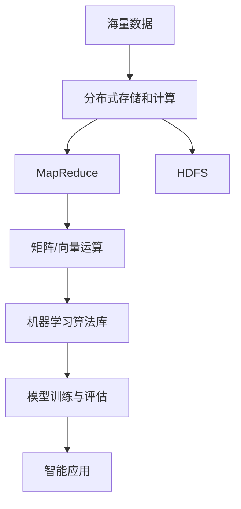

# Mahout原理与代码实例讲解

## 1. 背景介绍
### 1.1 大数据时代的机器学习需求
在当今大数据时代,海量数据的产生和积累为机器学习的发展提供了前所未有的机遇。然而,传统的机器学习算法和框架在处理大规模数据时往往力不从心,无法满足实时性、高可用性等要求。因此,迫切需要一种能够高效处理海量数据的机器学习平台。
### 1.2 Mahout的诞生
Apache Mahout应运而生,它是一个基于Hadoop的开源机器学习库。Mahout旨在帮助开发人员更加方便快捷地创建智能应用程序。通过Mahout,我们可以实现对海量数据进行分布式处理,从而大大提高机器学习的效率。
### 1.3 Mahout的应用领域
Mahout广泛应用于各个领域,包括推荐系统、聚类、分类、回归、降维、特征工程、模式挖掘等。许多知名互联网公司如亚马逊、雅虎、Twitter、LinkedIn等都在产品中使用了Mahout。

## 2. 核心概念与联系 
### 2.1 Mahout的架构设计
#### 2.1.1 基于MapReduce的分布式计算模型
Mahout采用了基于MapReduce的分布式计算模型。MapReduce是一种分布式编程模型,用于大规模数据集的并行运算。它将大数据集分割成小数据块,然后在多个节点上并行处理,最后汇总结果。这种"分而治之"的思想使得Mahout能够高效处理PB级别的海量数据。
#### 2.1.2 矩阵和向量运算
在Mahout中,绝大多数算法都是建立在矩阵和向量的基础之上的。Mahout提供了一套灵活的矩阵和向量运算库,可以表示稀疏或稠密的数据。同时,Mahout针对矩阵和向量运算进行了优化,支持并行计算,极大提升了运算效率。
### 2.2 Mahout的主要组件
#### 2.2.1 核心库
Mahout的核心库包含了常用的数学运算、向量、矩阵等基础类。它们为上层的机器学习算法提供了坚实的数学基础。
#### 2.2.2 算法库  
Mahout实现了多种主流的机器学习算法,包括但不限于:
- 推荐算法:协同过滤、基于内容的推荐等
- 聚类算法:K-Means、Canopy、Fuzzy K-Means等
- 分类算法:朴素贝叶斯、随机森林、逻辑回归等
- 回归算法:线性回归、随机梯度下降等
- 降维算法:奇异值分解、主成分分析等
- 频繁项挖掘算法:FP-Growth、Parallel FP-Growth等
#### 2.2.3 评估器
为了评估模型的优劣,Mahout提供了一系列的评估器,如平均绝对误差、均方根误差、精确率、召回率、F1值、AUC等。通过这些评估指标,我们可以客观评价模型的性能,为参数调优和模型选择提供依据。
#### 2.2.4 数据集管理
Mahout能够读取多种格式的数据集,包括CSV、TSV、JSON等。同时,Mahout还支持对数据集进行切分,分成训练集和测试集,用于模型的训练和评估。
### 2.3 Mahout的核心概念联系
下图展示了Mahout的核心概念之间的联系:



从上图可以看出,Mahout针对海量数据,采用分布式存储(如HDFS)和分布式计算(如MapReduce)进行处理。在此基础上,Mahout提供了一整套机器学习组件,包括核心的矩阵/向量运算库、丰富的机器学习算法库、模型训练与评估组件等。通过Mahout,我们可以构建大规模的智能应用,实现复杂的数据挖掘和分析。

## 3. 核心算法原理具体操作步骤
本节将以推荐算法中的User-based CF为例,详细讲解其原理和具体操作步骤。
### 3.1 User-based CF原理
User-based CF(User-based Collaborative Filtering)是协同过滤推荐的一种经典算法。其基本思想是:找到与目标用户兴趣相似的其他用户,然后将这些相似用户喜欢的物品推荐给目标用户。
### 3.2 具体操作步骤
#### 3.2.1 建立用户-物品评分矩阵
首先,我们需要收集用户对物品的偏好数据,用一个矩阵来表示。矩阵的行表示用户,列表示物品,矩阵元素表示用户对物品的评分。
#### 3.2.2 计算用户相似度
接下来,我们要计算用户之间的相似度。常用的相似度度量方法有:
- 欧几里得距离
- 皮尔逊相关系数
- 余弦相似度

以余弦相似度为例,假设用户向量为 $\mathbf{u}$ 和 $\mathbf{v}$,则它们的相似度为:

$$\cos(\mathbf{u},\mathbf{v}) = \frac{\mathbf{u} \cdot \mathbf{v}}{\|\mathbf{u}\| \|\mathbf{v}\|}$$

其中, $\mathbf{u} \cdot \mathbf{v}$ 表示向量点积, $\|\mathbf{u}\|$ 和 $\|\mathbf{v}\|$ 分别表示向量的模。
#### 3.2.3 选取TopN相似用户
计算出所有用户之间的相似度后,对每个用户,选取与其最相似的TopN个用户,作为其"最近邻"。
#### 3.2.4 生成推荐列表
对于每个用户,找到其最近邻中评分较高的物品,过滤掉用户已经评分过的物品,生成推荐列表。推荐物品的评分可以用最近邻用户的评分加权平均来估计:

$$r_{ui} = \frac{\sum_{v \in N(u)} \text{sim}(u,v) \cdot r_{vi}}{\sum_{v \in N(u)} \text{sim}(u,v)}$$

其中, $r_{ui}$ 表示用户 $u$ 对物品 $i$ 的预测评分, $N(u)$ 表示用户 $u$ 的最近邻用户集合, $\text{sim}(u,v)$ 表示用户 $u$ 和用户 $v$ 的相似度, $r_{vi}$ 表示用户 $v$ 对物品 $i$ 的实际评分。

## 4. 数学模型和公式详细讲解举例说明
本节将详细讲解推荐算法中的矩阵分解模型。矩阵分解是一类重要的推荐算法,通过将高维的用户-物品评分矩阵分解为低维的用户隐因子矩阵和物品隐因子矩阵,来实现评分预测和推荐。
### 4.1 矩阵分解模型
矩阵分解模型的基本思想是,用户的偏好和物品的属性可以用一些隐含的因子来表示。假设有 $m$ 个用户, $n$ 个物品,评分矩阵 $\mathbf{R} \in \mathbb{R}^{m \times n}$。我们希望将其分解为用户隐因子矩阵 $\mathbf{U} \in \mathbb{R}^{m \times k}$ 和物品隐因子矩阵 $\mathbf{V} \in \mathbb{R}^{n \times k}$:

$$\mathbf{R} \approx \mathbf{U} \mathbf{V}^T$$

其中, $k$ 表示隐因子的个数,一般远小于 $m$ 和 $n$。$\mathbf{U}$ 的第 $i$ 行向量 $\mathbf{u}_i$ 表示用户 $i$ 的隐因子向量, $\mathbf{V}$ 的第 $j$ 行向量 $\mathbf{v}_j$ 表示物品 $j$ 的隐因子向量。
### 4.2 目标函数
为了学习出合适的 $\mathbf{U}$ 和 $\mathbf{V}$,我们需要最小化重构误差,即原始评分矩阵与重构评分矩阵之间的差异。常用的误差度量是均方误差(MSE):

$$\min_{\mathbf{U},\mathbf{V}} \sum_{(i,j) \in \mathcal{K}} (r_{ij} - \mathbf{u}_i^T \mathbf{v}_j)^2 + \lambda (\|\mathbf{U}\|_F^2 + \|\mathbf{V}\|_F^2)$$

其中, $\mathcal{K}$ 表示已知评分的索引集合, $\lambda$ 是正则化系数,用于控制过拟合。$\|\cdot\|_F$ 表示矩阵的Frobenius范数,定义为:

$$\|\mathbf{A}\|_F = \sqrt{\sum_{i=1}^m \sum_{j=1}^n a_{ij}^2}$$

### 4.3 优化求解
上述目标函数可以用梯度下降法进行优化求解。以 $\mathbf{U}$ 为例,其梯度为:

$$\frac{\partial J}{\partial \mathbf{u}_i} = -2 \sum_{j:(i,j) \in \mathcal{K}} (r_{ij} - \mathbf{u}_i^T \mathbf{v}_j) \mathbf{v}_j + 2 \lambda \mathbf{u}_i$$

每次迭代,按照下式更新 $\mathbf{u}_i$:

$$\mathbf{u}_i \leftarrow \mathbf{u}_i - \alpha \frac{\partial J}{\partial \mathbf{u}_i}$$

其中, $\alpha$ 是学习率。同理可得 $\mathbf{V}$ 的更新公式。
### 4.4 算法流程
矩阵分解的算法流程如下:
1. 随机初始化 $\mathbf{U}$ 和 $\mathbf{V}$
2. 重复直到收敛:
   - 固定 $\mathbf{V}$,更新 $\mathbf{U}$ 
   - 固定 $\mathbf{U}$,更新 $\mathbf{V}$
3. 返回学习到的 $\mathbf{U}$ 和 $\mathbf{V}$

收敛条件可以是达到最大迭代次数,或者目标函数值的变化小于某个阈值。
### 4.5 推荐生成
学习到 $\mathbf{U}$ 和 $\mathbf{V}$ 后,我们可以用它们来预测用户对物品的评分:

$$\hat{r}_{ij} = \mathbf{u}_i^T \mathbf{v}_j$$

对于每个用户,根据预测评分从高到低排序,选取TopN个物品作为推荐结果。

## 5. 项目实践：代码实例和详细解释说明
下面我们通过一个简单的代码实例,演示如何用Mahout实现基于User-based CF的推荐。
### 5.1 数据准备
首先,我们需要准备用户评分数据。这里使用Mahout自带的 MovieLens 数据集。将数据集文件 `ratings.dat` 上传到HDFS:

```bash
hadoop fs -mkdir /mahout
hadoop fs -put ratings.dat /mahout/
```

### 5.2 数据转换
Mahout要求输入数据为序列文件(SequenceFile)格式。我们需要将原始的 `.dat` 文件转换为序列文件:

```bash
mahout seqdirectory \
    -i /mahout/ratings.dat \
    -o /mahout/ratings-seq \
    -ow
```

其中, `-i` 指定输入文件路径, `-o` 指定输出路径, `-ow` 表示覆盖已有输出。
### 5.3 计算用户相似度
接下来,我们用Mahout计算用户相似度矩阵:

```bash
mahout recommendfactorized \
    --input /mahout/ratings-seq \
    --output /mahout/similarity-matrix \
    --similarityClassname SIMILARITY_COOCCURRENCE \
    --tempDir /mahout/tmp \
    -ow
```

这里使用了 `recommendfactorized` 命令,主要参数含义如下:
- `--input` : 输入的评分数据路径
- `--output` : 输出的相似度矩阵路径
- `--similarityClassname` : 相似度度量方