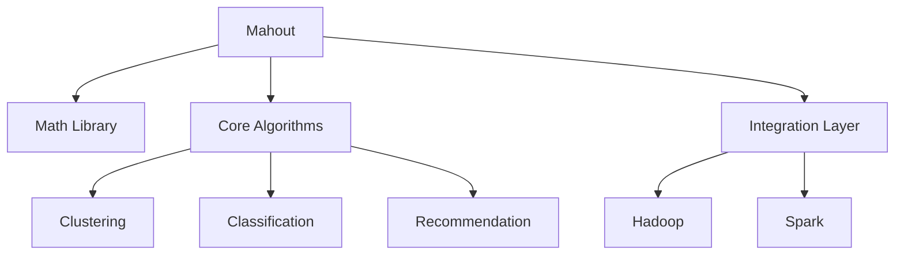

# Mahout聚类算法原理与代码实例讲解

## 1.背景介绍

在当今大数据时代，海量数据的处理和分析已经成为各行业的迫切需求。聚类分析作为一种重要的无监督学习技术,在数据挖掘、模式识别、图像处理、生物信息学等领域有着广泛的应用。Apache Mahout是一个可扩展的机器学习和数据挖掘库,它基于Apache Hadoop构建,可以高效地处理大规模数据集。Mahout提供了多种聚类算法的实现,包括K-Means、Fuzzy K-Means、Canopy等,可以帮助用户快速开发出高性能的聚类应用程序。

## 2.核心概念与联系

### 2.1 聚类分析概念

聚类分析是一种无监督学习技术,旨在将数据集中的对象划分为多个组(簇),使得同一个簇中的对象相似度较高,而不同簇之间的对象相似度较低。聚类分析广泛应用于客户细分、异常检测、图像分割等领域。

### 2.2 Mahout中的聚类算法

Mahout提供了以下几种常用的聚类算法:

- **K-Means算法**: 一种基于原型的迭代聚类算法,通过最小化数据点到质心的距离平方和来划分簇。
- **Fuzzy K-Means算法**: 基于K-Means算法的改进版本,允许数据点以不同的隶属度属于多个簇。
- **Canopy聚类算法**: 一种两阶段聚类算法,先使用粗粒度的簇划分,再在每个簇内进行传统聚类。
- **Dirichlet过程聚类算法**: 一种基于贝叶斯非参数方法的聚类算法,可以自动确定聚类数量。

### 2.3 Mahout架构

Mahout的架构主要由以下几个部分组成:



- **Math Library**: 提供向量、矩阵等数学计算工具。
- **Core Algorithms**: 实现了常见的机器学习算法,包括聚类、分类、推荐等。
- **Integration Layer**: 集成了Hadoop和Spark,实现了算法的分布式计算。

## 3.核心算法原理具体操作步骤

### 3.1 K-Means算法

K-Means算法是一种经典的聚类算法,其核心思想是通过迭代优化的方式将数据划分为K个簇,使得簇内数据点到质心的距离平方和最小。算法步骤如下:

1. **初始化**: 随机选择K个数据点作为初始质心。
2. **分配簇**: 对于每个数据点,计算它与各个质心的距离,将其分配到距离最近的簇中。
3. **更新质心**: 对于每个簇,重新计算簇中所有数据点的质心。
4. **迭代**: 重复步骤2和3,直到质心不再发生变化或达到最大迭代次数。

K-Means算法的优点是简单高效,但也存在一些缺陷,如对初始质心选择敏感、难以处理非凸形状的簇等。

### 3.2 Fuzzy K-Means算法

Fuzzy K-Means算法是K-Means算法的改进版本,它允许每个数据点以不同的隶属度属于多个簇。算法步骤如下:

1. **初始化**: 随机初始化隶属度矩阵和簇质心。
2. **计算隶属度**: 对于每个数据点,根据其与各个质心的距离计算其隶属于每个簇的隶属度。
3. **更新质心**: 根据新的隶属度矩阵,重新计算每个簇的质心。
4. **迭代**: 重复步骤2和3,直到目标函数收敛或达到最大迭代次数。

Fuzzy K-Means算法可以更好地处理重叠和模糊的簇,但计算复杂度也更高。

### 3.3 Canopy聚类算法

Canopy聚类算法是一种两阶段聚类算法,旨在提高传统聚类算法的可扩展性。算法步骤如下:

1. **构建Canopy**: 使用距离阈值将数据点划分为多个Canopy,每个Canopy包含一些密集的数据点。
2. **传统聚类**: 对每个Canopy内的数据点进行传统聚类(如K-Means)。
3. **合并簇**: 将不同Canopy内的簇进行合并,得到最终的聚类结果。

Canopy聚类算法可以显著降低传统聚类算法的计算开销,但也可能引入一些近似误差。

## 4.数学模型和公式详细讲解举例说明

### 4.1 K-Means算法数学模型

K-Means算法的目标是最小化所有数据点到其所属簇质心的距离平方和,即:

$$J = \sum_{i=1}^{K}\sum_{x \in C_i} \left \| x - \mu_i \right \|^2$$

其中:
- $K$是簇的数量
- $C_i$是第$i$个簇
- $\mu_i$是第$i$个簇的质心
- $\left \| x - \mu_i \right \|$是数据点$x$到质心$\mu_i$的距离

算法通过迭代优化的方式不断更新簇划分和质心,使目标函数$J$最小化。

### 4.2 Fuzzy K-Means算法数学模型

Fuzzy K-Means算法的目标函数为:

$$J = \sum_{i=1}^{K}\sum_{j=1}^{N}u_{ij}^m \left \| x_j - c_i \right \|^2$$

其中:
- $K$是簇的数量
- $N$是数据点的个数
- $u_{ij}$是数据点$x_j$属于第$i$个簇的隶属度
- $m$是模糊化参数,控制隶属度的模糊程度
- $c_i$是第$i$个簇的质心

算法通过迭代优化的方式更新隶属度矩阵和簇质心,使目标函数$J$最小化。

### 4.3 举例说明

假设有一个包含5个二维数据点的数据集:

$$X = \begin{bmatrix}
1 & 2\\
3 & 4\\
5 & 6\\
7 & 8\\
9 & 10
\end{bmatrix}$$

我们使用K-Means算法对其进行聚类,设$K=2$。

1. **初始化**: 随机选择$(1, 2)$和$(9, 10)$作为初始质心。
2. **分配簇**:
   - 数据点$(1, 2)$距离$(1, 2)$更近,分配到簇1。
   - 数据点$(3, 4)$距离$(1, 2)$更近,分配到簇1。
   - 数据点$(5, 6)$距离$(1, 2)$和$(9, 10)$相等,随机分配到簇1。
   - 数据点$(7, 8)$距离$(9, 10)$更近,分配到簇2。
   - 数据点$(9, 10)$距离$(9, 10)$更近,分配到簇2。
3. **更新质心**:
   - 簇1的新质心为$\frac{1+3+5}{3}, \frac{2+4+6}{3} = (3, 4)$。
   - 簇2的新质心为$\frac{7+9}{2}, \frac{8+10}{2} = (8, 9)$。
4. **迭代**:
   - 重复步骤2和3,直到质心不再发生变化。

最终得到的聚类结果为:
- 簇1: $(1, 2)$, $(3, 4)$, $(5, 6)$
- 簇2: $(7, 8)$, $(9, 10)$

## 5.项目实践：代码实例和详细解释说明

以下是使用Mahout实现K-Means聚类的Java代码示例:

```java
// 加载数据
String path = "data/reuters.csv";
FileDataModel dataModel = new FileDataModel(new File(path));

// 创建向量化器
DictionaryVectorizer vectorizer = new DictionaryVectorizer();
vectorizer.setMaxNGramSize(3);
vectorizer.setMinDF(2);
vectorizer.setMaxDF(0.9);

// 向量化数据
vectorizer.fit(dataModel);
Dataset dataset = vectorizer.vectorize(dataModel);

// 创建K-Means聚类器
int numClusters = 20;
int maxIterations = 10;
KMeansClusterer clusterer = new KMeansClusterer(numClusters, maxIterations);

// 训练聚类模型
List<Cluster> clusters = clusterer.cluster(dataset);

// 输出聚类结果
for (Cluster cluster : clusters) {
    System.out.println("Cluster " + cluster.getId() + ": " + cluster.getMembers().size() + " data points");
}
```

代码解释:

1. 首先加载数据集,这里使用了Reuters新闻数据集。
2. 创建`DictionaryVectorizer`对象,用于将文本数据向量化。设置了最大N-gram大小、最小文档频率和最大文档频率等参数。
3. 调用`vectorizer.fit(dataModel)`对数据进行向量化,得到`Dataset`对象。
4. 创建`KMeansClusterer`对象,设置聚类数量和最大迭代次数。
5. 调用`clusterer.cluster(dataset)`执行K-Means聚类,得到一个`List<Cluster>`对象。
6. 遍历输出每个簇的ID和包含的数据点数量。

在实际应用中,您可以根据需求调整聚类参数、选择合适的向量化方法等,以获得更好的聚类效果。

## 6.实际应用场景

聚类分析在各个领域都有广泛的应用,以下是一些典型的应用场景:

1. **客户细分**: 根据客户的购买行为、兴趣爱好等特征对客户进行聚类,为不同群体提供个性化的产品和服务。
2. **图像分割**: 将图像中的像素点根据颜色、纹理等特征进行聚类,实现图像的分割和目标识别。
3. **异常检测**: 将正常数据聚类为一个或多个簇,将离群点视为异常值进行检测和处理。
4. **基因表达分析**: 根据基因表达数据对基因进行聚类,发现具有相似表达模式的基因组。
5. **社交网络分析**: 根据用户的社交关系和行为特征对用户进行聚类,发现具有相似兴趣的社区。
6. **推荐系统**: 将用户或商品进行聚类,为相似的用户推荐相似的商品。

## 7.工具和资源推荐

1. **Apache Mahout**: 本文介绍的聚类算法实现就来自于Apache Mahout项目,它提供了丰富的机器学习和数据挖掘算法库。官方网站: https://mahout.apache.org/
2. **scikit-learn**: 一个流行的Python机器学习库,也包含了多种聚类算法的实现。官方网站: https://scikit-learn.org/
3. **ELKI**: 一个专注于数据挖掘的Java库,提供了多种聚类算法和评估指标。官方网站: https://elki-project.github.io/
4. **Clustering Datasets**: 一些常用的聚类算法测试数据集,可用于算法评估和比较。链接: https://cs.joensuu.fi/sipu/datasets/
5. **Pattern Classification**: 一本经典的模式识别和机器学习教材,对聚类算法的原理和应用有深入的介绍。作者: Richard O. Duda, Peter E. Hart, David G. Stork。

## 8.总结:未来发展趋势与挑战

聚类分析作为一种重要的无监督学习技术,在大数据时代有着广阔的应用前景。但同时也面临一些挑战和发展方向:

1. **可扩展性**: 随着数据规模的不断增长,传统的聚类算法将难以满足计算需求。需要设计更高效、更可扩展的分布式聚类算法。
2. **高维数据处理**: 在高维数据场景下,由于"维数灾难"的存在,传统的聚类算法往往效果不佳。需要研究更适合高维数据的聚类方法。
3. **异构数据聚类**: 现实世界中的数据往往是异构的,包含不同类型的属性。需要发展能够处理异构数据的聚类算法。
4. **流数据聚类**: 对于动态变化的数据流,需要设计能够实时更新聚类结果的增