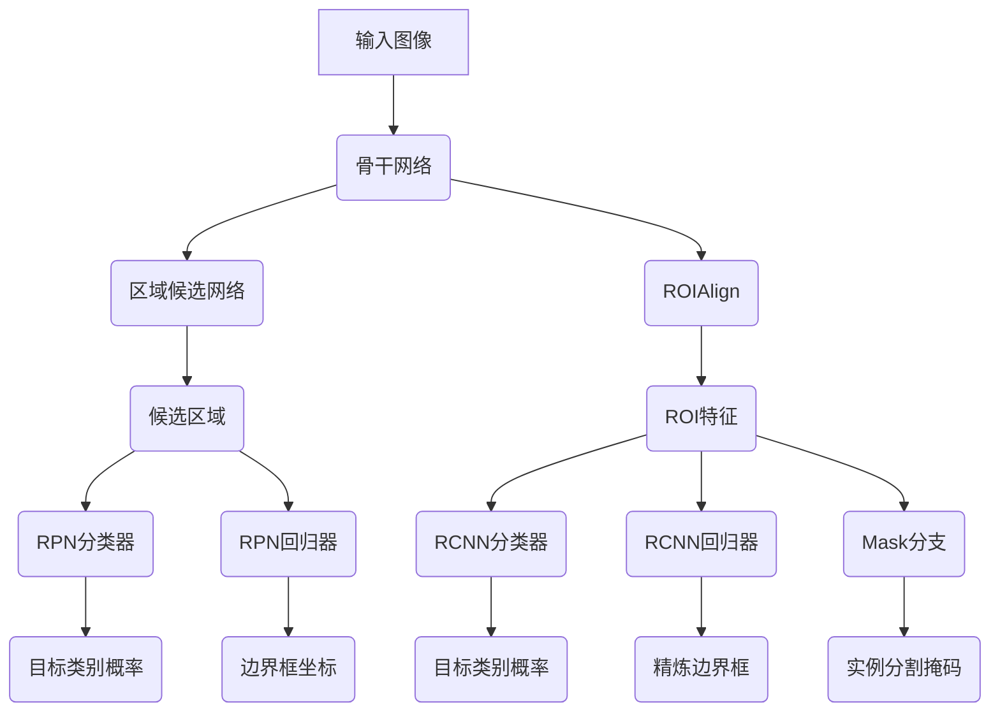

# MaskR-CNN原理与代码实例讲解

## 1.背景介绍

计算机视觉是人工智能领域的一个重要分支,旨在使机器能够像人类一样理解和分析数字图像或视频。目标检测和实例分割是计算机视觉中两个基本且重要的任务。目标检测是指在图像或视频中定位感兴趣对象的位置,而实例分割则是进一步要求像素级别的精确分割。

传统的目标检测方法,如基于区域的卷积神经网络(R-CNN)系列算法,虽然在检测精度上有所提高,但在实例分割任务上表现并不理想。为了同时实现高精度的目标检测和实例分割,Facebook AI研究院(FAIR)于2017年提出了Mask R-CNN模型,该模型在Faster R-CNN的基础上增加了一个分支用于实例分割,取得了令人瞩目的成绩。

Mask R-CNN被广泛应用于许多领域,如自动驾驶、增强现实、医学影像分析等,成为当前目标检测和实例分割领域的主流方法之一。本文将深入探讨Mask R-CNN的原理、架构和实现细节,并通过代码示例帮助读者更好地理解和掌握这一重要算法。

## 2.核心概念与联系

在深入讨论Mask R-CNN之前,我们先介绍一些核心概念和相关算法,以建立必要的背景知识。

### 2.1 卷积神经网络

卷积神经网络(Convolutional Neural Network,CNN)是一种前馈神经网络,其人工神经元可以响应一部分覆盖范围内的周围神经元,对于大型图像处理有出色的性能表现。CNN由多个卷积层和池化层构成,可以自动从图像中提取特征,是目标检测和实例分割等计算机视觉任务的基础模型。

### 2.2 区域卷积神经网络

区域卷积神经网络(Region-based Convolutional Neural Network,R-CNN)是一种用于目标检测的算法,由Ross Girshick等人于2014年提出。R-CNN首先使用选择性搜索算法生成候选区域,然后对每个候选区域进行特征提取和分类,最终输出目标检测结果。尽管R-CNN取得了不错的性能,但由于需要对每个候选区域单独进行特征提取,计算效率较低。

### 2.3 Fast R-CNN

为了提高R-CNN的计算效率,Ross Girshick于2015年提出了Fast R-CNN算法。Fast R-CNN在整个图像上只进行一次特征提取,然后将提取到的特征映射到每个候选区域,大大减少了计算量。Fast R-CNN在保持较高精度的同时,运行速度比R-CNN快9倍。

### 2.4 Faster R-CNN

Faster R-CNN是Ross Girshick和Shaoqing Ren于2015年提出的改进算法。与Fast R-CNN不同,Faster R-CNN引入了区域候选网络(Region Proposal Network,RPN),用于生成候选边界框,从而进一步提高了算法的效率和精度。Faster R-CNN在许多基准测试中表现出色,成为目标检测领域的主流方法之一。

## 3.核心算法原理具体操作步骤

Mask R-CNN是在Faster R-CNN的基础上发展而来,它在Faster R-CNN的架构中增加了一个用于实例分割的分支。Mask R-CNN的整体架构如下图所示:



Mask R-CNN的工作流程如下:

1. **骨干网络(Backbone Network)**: 输入图像首先经过一个预训练的骨干网络(如ResNet、VGGNet等),用于提取图像的特征映射。

2. **区域候选网络(Region Proposal Network,RPN)**: 特征映射被输入到RPN中,RPN会生成一系列候选边界框(Region Proposals),每个边界框都有一个对应的目标分数。

3. **ROIAlign**: 对于每个候选边界框,使用ROIAlign层从特征映射中提取对应的特征,并对齐到同一尺寸。这一步骤比Faster R-CNN中使用的ROIPooling更加精确。

4. **RCNN分类器和回归器**: 提取的ROI特征被输入到两个并行的全连接层,一个用于目标分类(RCNN分类器),另一个用于精炼边界框坐标(RCNN回归器)。

5. **Mask分支**: 与RCNN分类器和回归器并行,ROI特征还会输入到一个卷积网络中,该网络会为每个类别生成一个实例分割掩码。

6. **输出**: 最终的输出包括目标类别概率、精炼的边界框坐标以及实例分割掩码。

Mask R-CNN的核心创新在于引入了用于实例分割的Mask分支,使得模型能够同时完成目标检测和实例分割任务。Mask分支的设计灵感来自于DeepMask和SharpMask等早期实例分割算法。

## 4.数学模型和公式详细讲解举例说明

Mask R-CNN在训练和推理过程中涉及到多个损失函数,用于优化不同的任务分支。我们将详细介绍这些损失函数的数学模型和公式。

### 4.1 RPN损失函数

RPN损失函数由两部分组成:分类损失和回归损失。

**分类损失**: 对于每个anchor,RPN需要判断它是否包含目标对象。这是一个二分类问题,使用交叉熵损失函数:

$$
L_{rpn\_cls}(p,u)=-\sum_{i}[u_i\log(p_i)+(1-u_i)\log(1-p_i)]
$$

其中$p_i$是anchor $i$包含目标对象的预测概率,$u_i$是其真实标签(1表示包含目标,0表示不包含目标)。

**回归损失**: 对于包含目标对象的anchor,RPN还需要预测其边界框坐标的偏移量。这里使用平滑L1损失函数:

$$
L_{rpn\_reg}(t_u,v)=\sum_{i}\sum_{m\in\{cx,cy,w,h\}}smoothL_1(t^m_u-v^m_i)
$$

其中$t_u$是真实边界框的参数化坐标,$v$是预测的参数化坐标,$m$表示坐标的不同维度(中心坐标$cx,cy$和宽高$w,h$),$smoothL_1$是平滑L1损失函数,定义如下:

$$
smoothL_1(x)=\begin{cases}
0.5x^2, & \text{if }|x|<1\\
|x|-0.5, & \text{otherwise}
\end{cases}
$$

RPN的总损失函数是分类损失和回归损失的加权和:

$$
L_{rpn}(p,u,t_u,v)=\lambda_1L_{rpn\_cls}(p,u)+\lambda_2L_{rpn\_reg}(t_u,v)
$$

其中$\lambda_1$和$\lambda_2$是平衡两个损失项的权重系数。

### 4.2 RCNN损失函数

RCNN损失函数也包括分类损失和回归损失,与RPN类似。

**分类损失**: 对于每个ROI,RCNN需要预测它属于哪个类别。这是一个多分类问题,使用交叉熵损失函数:

$$
L_{rcnn\_cls}(q,y)=-\sum_{i}\log(q_{y_i})
$$

其中$q$是预测的类别概率分布,$y_i$是ROI $i$的真实类别标签。

**回归损失**: 对于每个ROI,RCNN还需要预测其精确的边界框坐标。与RPN类似,使用平滑L1损失函数:

$$
L_{rcnn\_reg}(t,v)=\sum_{i}\sum_{m\in\{cx,cy,w,h\}}smoothL_1(t^m_i-v^m)
$$

其中$t$是真实边界框的参数化坐标,$v$是预测的参数化坐标。

RCNN的总损失函数是分类损失和回归损失的加权和:

$$
L_{rcnn}(q,y,t,v)=\lambda_3L_{rcnn\_cls}(q,y)+\lambda_4L_{rcnn\_reg}(t,v)
$$

其中$\lambda_3$和$\lambda_4$是平衡两个损失项的权重系数。

### 4.3 Mask分支损失函数

Mask分支的损失函数是平均二值交叉熵损失,用于优化实例分割掩码的预测。对于每个ROI和每个类别,我们计算预测掩码与真实掩码之间的平均二值交叉熵损失:

$$
L_{mask}(M,Y)=-\frac{1}{m^2}\sum_{i=1}^{m^2}[Y_{ij}\log(M_{ij})+(1-Y_{ij})\log(1-M_{ij})]
$$

其中$M$是预测的掩码,$Y$是真实掩码,$m\times m$是掩码的分辨率。

### 4.4 总损失函数

Mask R-CNN的总损失函数是RPN损失、RCNN损失和Mask分支损失的加权和:

$$
L=\lambda_5L_{rpn}+\lambda_6L_{rcnn}+\lambda_7L_{mask}
$$

其中$\lambda_5$、$\lambda_6$和$\lambda_7$是平衡三个损失项的权重系数。在训练过程中,我们优化这个总损失函数,使得模型能够同时完成目标检测和实例分割任务。

以上是Mask R-CNN中涉及到的主要数学模型和公式。通过这些公式,我们可以更好地理解模型的优化目标和训练过程。

## 5.项目实践:代码实例和详细解释说明

在本节中,我们将提供一个使用PyTorch实现的Mask R-CNN代码示例,并详细解释每个部分的功能和作用。

### 5.1 导入必要的库

```python
import torch
import torch.nn as nn
import torchvision
from torchvision.models.detection import MaskRCNN
from torchvision.models.detection.rpn import AnchorGenerator
```

我们首先导入PyTorch及其相关库,包括`torch.nn`用于构建神经网络模型,`torchvision`用于加载和预处理数据,以及`MaskRCNN`和`AnchorGenerator`用于实现Mask R-CNN模型和生成anchor。

### 5.2 定义模型

```python
# 加载预训练的ResNet50作为骨干网络
backbone = torchvision.models.resnet50(pretrained=True)

# 生成anchor
anchor_generator = AnchorGenerator(sizes=((32, 64, 128, 256, 512),),
                                   aspect_ratios=((0.5, 1.0, 2.0),))

# 定义Mask R-CNN模型
model = MaskRCNN(backbone,
                 num_classes=91,
                 rpn_anchor_generator=anchor_generator,
                 box_roi_pool=torchvision.ops.MultiScaleRoIAlign(featmap_names=['0'],
                                                                 output_size=7,
                                                                 sampling_ratio=2))
```

在这段代码中,我们首先加载预训练的ResNet50作为骨干网络。然后,我们使用`AnchorGenerator`生成不同大小和宽高比的anchor。最后,我们定义Mask R-CNN模型,指定骨干网络、类别数量、RPN的anchor生成器以及ROIAlign的参数。

### 5.3 模型前向传播

```python
def forward(self, images, targets=None):
    """
    Args:
        images (list[Tensor]): 输入图像
        targets (list[Dict[Tensor]]): 包含边界框、类别和掩码的ground truth

    Returns:
        result (list[Dict[Tensor]]): 包含检测结果的字典
    """
    # 特征提取
    features = self.backbone(images.tensors)

    # RPN
    proposals, proposal_losses = self.rpn(images, features, targets)

    # ROIAlign
    boxes, scores, labels, mask_scores, mask_features, roi_losses = self.roi_heads(features, proposals, targets)

    # 后处理
    detections, masks = self.transform(boxes, scores, labels, mask_scores, mask_features, images.image_sizes)

    losses = []
    losses.extend(roi_losses)
    losses.extend(proposal_losses)

    result = self.format_result(detections, masks)

    return result, losses
```

这是Mask R-CNN模型的前向传播函数。它接受输入图像和groun