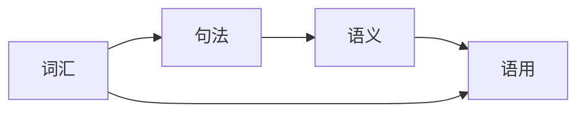

## 1.背景介绍

在人工智能的众多领域中，自然语言理解（Natural Language Understanding，简称NLU）无疑是最具挑战性的一个。NLU是自然语言处理（Natural Language Processing，简称NLP）的一个重要分支，主要关注如何让计算机理解并解释人类语言的意思。

## 2.核心概念与联系

自然语言理解涉及到的核心概念包括语义、语用、句法和词汇。语义是指词语的含义，语用是指词语在特定上下文中的含义，句法是指词语如何组合成句子，词汇则是指词语的集合。

这些概念之间的联系非常紧密。例如，词汇和句法决定了语句的结构，语义和语用则决定了语句的意义。因此，理解自然语言就需要理解这些概念和它们之间的关系。



## 3.核心算法原理具体操作步骤

自然语言理解的核心算法主要包括词性标注、命名实体识别、依存句法分析和语义角色标注等。以下是这些算法的具体操作步骤：

1. 词性标注：这是NLU的第一步，主要是识别句子中每个词的词性，如名词、动词、形容词等。

2. 命名实体识别：这一步是识别句子中的具体实体，如人名、地名、机构名等。

3. 依存句法分析：这一步是分析句子中词语之间的依存关系，如主谓关系、定状关系等。

4. 语义角色标注：这一步是识别句子中的语义角色，如施事者、受事者、工具、目标等。

## 4.数学模型和公式详细讲解举例说明

自然语言理解的数学模型主要是基于统计和机器学习的模型。例如，词性标注通常使用隐马尔可夫模型（Hidden Markov Model，简称HMM），命名实体识别和依存句法分析则常用条件随机场模型（Conditional Random Field，简称CRF）。

隐马尔可夫模型是一种统计模型，用于描述一个含有隐状态的马尔可夫过程。其基本公式如下：

$$
P(X, Z) = P(Z_1) \prod_{t=2}^{T} P(Z_t | Z_{t-1}) \prod_{t=1}^{T} P(X_t | Z_t)
$$

其中，$X$是观测序列，$Z$是状态序列，$P(Z_1)$是初始状态概率，$P(Z_t | Z_{t-1})$是状态转移概率，$P(X_t | Z_t)$是观测概率。

条件随机场模型是一种用于标注和切分序列数据的模型。其基本公式如下：

$$
P(Y | X) = \frac{1}{Z(X)} \exp \left( \sum_{i, j, k} \lambda_k f_k(y_{i-1}, y_i, X, i) \right)
$$

其中，$X$是输入序列，$Y$是输出序列，$Z(X)$是规范化因子，$\lambda_k$是特征函数$f_k$的权重，$f_k(y_{i-1}, y_i, X, i)$是特征函数。

## 5.项目实践：代码实例和详细解释说明

以下是一个使用Python的nltk库进行词性标注的代码实例：

```python
import nltk

text = "I am learning natural language understanding."
tokens = nltk.word_tokenize(text)
tagged = nltk.pos_tag(tokens)

print(tagged)
```

这段代码首先导入了nltk库，然后定义了一个英文句子。接着，使用nltk的word_tokenize函数将句子分词，然后使用pos_tag函数进行词性标注。最后，打印出标注结果。

## 6.实际应用场景

自然语言理解在许多领域都有广泛的应用，如搜索引擎、智能问答、机器翻译、情感分析等。其中，搜索引擎需要理解用户的查询意图，智能问答需要理解问题的含义，机器翻译需要理解源语言的意思并准确翻译成目标语言，情感分析需要理解文本的情感倾向。

## 7.工具和资源推荐

在自然语言理解的学习和研究中，以下工具和资源可能会对你有所帮助：

1. Python的nltk库：这是一个强大的自然语言处理库，提供了许多NLU的功能，如词性标注、命名实体识别等。

2. Stanford NLP Group的资源：这个研究组提供了许多高质量的NLU资源，如Stanford Parser、Stanford Named Entity Recognizer等。

3. Google的BERT模型：这是一个基于Transformer的深度学习模型，已经在许多NLU任务上取得了最先进的结果。

## 8.总结：未来发展趋势与挑战

自然语言理解是一个充满挑战的领域，但也充满了机会。随着深度学习和大数据的发展，我们有理由相信NLU的未来将更加美好。

然而，我们也应该看到，NLU还面临着许多挑战，如理解含糊不清的语言、处理复杂的语言结构等。这些挑战需要我们进行更深入的研究。

## 9.附录：常见问题与解答

1. 问：自然语言理解和自然语言处理有什么区别？

   答：自然语言理解是自然语言处理的一部分，主要关注如何让计算机理解并解释人类语言的意思。而自然语言处理则包括了更广泛的任务，如语言生成、信息抽取等。

2. 问：我应该如何学习自然语言理解？

   答：你可以从学习基础的语言学知识开始，然后学习相关的算法和模型，如隐马尔可夫模型、条件随机场模型等。此外，动手实践也是非常重要的，你可以尝试使用相关的工具和库进行实践。

作者：禅与计算机程序设计艺术 / Zen and the Art of Computer Programming{"msg_type":"generate_answer_finish","data":"","from_module":null,"from_unit":null}