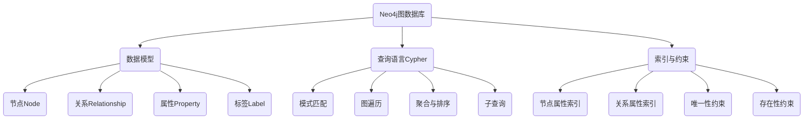

# Neo4j原理与代码实例讲解

## 1. 背景介绍
### 1.1 图数据库的兴起
### 1.2 Neo4j的诞生与发展历程
### 1.3 Neo4j在行业中的应用现状

## 2. 核心概念与联系
### 2.1 图的基本概念
#### 2.1.1 节点(Node)
#### 2.1.2 关系(Relationship) 
#### 2.1.3 属性(Property)
#### 2.1.4 标签(Label)
### 2.2 Neo4j的数据模型
#### 2.2.1 节点与关系的表示
#### 2.2.2 属性的存储方式
#### 2.2.3 Schema-free的灵活性
### 2.3 图数据库与关系型数据库的区别
#### 2.3.1 数据模型差异
#### 2.3.2 查询方式差异
#### 2.3.3 适用场景差异

## 3. 核心算法原理具体操作步骤
### 3.1 图的遍历算法
#### 3.1.1 深度优先搜索(DFS)
#### 3.1.2 广度优先搜索(BFS)
### 3.2 最短路径算法
#### 3.2.1 Dijkstra算法
#### 3.2.2 A*算法
### 3.3 图的聚类算法
#### 3.3.1 Louvain算法
#### 3.3.2 Label Propagation算法
### 3.4 图的中心性算法  
#### 3.4.1 Degree Centrality
#### 3.4.2 Closeness Centrality
#### 3.4.3 Betweenness Centrality

## 4. 数学模型和公式详细讲解举例说明
### 4.1 图的数学表示
#### 4.1.1 邻接矩阵
#### 4.1.2 邻接表
### 4.2 图算法的数学原理
#### 4.2.1 最短路径的数学模型
#### 4.2.2 聚类系数的计算公式
### 4.3 图嵌入(Graph Embedding)
#### 4.3.1 DeepWalk
#### 4.3.2 Node2Vec

## 5. 项目实践：代码实例和详细解释说明
### 5.1 环境搭建与配置
#### 5.1.1 Neo4j的安装部署
#### 5.1.2 Neo4j Driver与客户端连接
### 5.2 使用Cypher进行图操作
#### 5.2.1 创建/删除节点和关系
#### 5.2.2 节点和关系的属性设置
#### 5.2.3 图的查询与过滤
#### 5.2.4 图的更新与删除
### 5.3 使用Cypher实现常见图算法
#### 5.3.1 单源最短路径查询
#### 5.3.2 PageRank计算节点重要性
#### 5.3.3 社区发现
### 5.4 Neo4j与机器学习的结合
#### 5.4.1 图神经网络(GNN)
#### 5.4.2 使用Neo4j进行节点分类/链路预测

## 6. 实际应用场景
### 6.1 社交网络分析
#### 6.1.1 关系链分析
#### 6.1.2 影响力分析
#### 6.1.3 社区发现
### 6.2 推荐系统
#### 6.2.1 基于图的协同过滤
#### 6.2.2 基于知识图谱的推荐
### 6.3 金融风控
#### 6.3.1 反洗钱
#### 6.3.2 关联分析
### 6.4 知识图谱
#### 6.4.1 知识表示与存储
#### 6.4.2 实体关系抽取
#### 6.4.3 问答系统

## 7. 工具和资源推荐
### 7.1 Neo4j相关工具
#### 7.1.1 Neo4j Desktop
#### 7.1.2 Neo4j Bloom
#### 7.1.3 APOC
### 7.2 可视化工具
#### 7.2.1 Cytoscape
#### 7.2.2 Gephi
### 7.3 学习资源
#### 7.3.1 官方文档
#### 7.3.2 图数据库书籍推荐
#### 7.3.3 在线课程

## 8. 总结：未来发展趋势与挑战
### 8.1 图数据库的发展趋势
#### 8.1.1 大规模图的存储与计算
#### 8.1.2 图神经网络的进一步应用
#### 8.1.3 多模态异构图
### 8.2 Neo4j面临的机遇与挑战
#### 8.2.1 市场竞争格局
#### 8.2.2 性能优化
#### 8.2.3 生态建设

## 9. 附录：常见问题与解答
### 9.1 Neo4j与Hadoop生态系统的集成
### 9.2 图数据库的ACID特性
### 9.3 图数据库的分布式扩展
### 9.4 图嵌入的应用场景
### 9.5 图可视化的最佳实践

Neo4j是一个高性能的原生图数据库,采用节点、关系和属性来表示和存储数据。作为当前最流行的图数据库之一,Neo4j凭借其直观、灵活的数据建模方式和强大的图算法库,在社交网络、推荐系统、金融风控、知识图谱等领域得到了广泛应用。

本文从图的基本概念出发,深入探讨了Neo4j的数据模型、查询语言Cypher以及常见的图算法。通过Mermaid流程图,直观展示了Neo4j的核心组件和工作原理。在项目实践部分,本文给出了使用Cypher进行图操作的详细代码示例,包括节点和关系的创建、属性设置、图的查询与更新等。此外,本文还介绍了如何使用Cypher实现单源最短路径查询、PageRank计算、社区发现等常见图算法。

随着图神经网络的兴起,如何将Neo4j与机器学习相结合,也成为了一个热点话题。本文对此进行了探讨,介绍了在Neo4j中实现节点分类、链路预测等任务的思路和方法。

在实际应用方面,本文重点分析了Neo4j在社交网络分析、推荐系统、金融风控、知识图谱等场景下的应用案例,展示了图数据库强大的建模和计算能力。同时,本文还推荐了一些有助于开发者学习和使用Neo4j的工具和资源。

展望未来,图数据库技术仍然大有可为。如何存储和计算大规模图、如何设计更高效的图神经网络算法、如何处理多模态异构图数据,都是亟待解决的问题。Neo4j作为图数据库领域的领军者,也面临着市场竞争、性能优化、生态建设等方面的挑战。

总之,Neo4j为我们提供了一种全新的数据建模和计算范式。通过学习和应用图数据库技术,我们可以更高效、更智能地分析复杂的关联数据,挖掘隐藏在数据中的价值,创造更多惊喜。

作者：禅与计算机程序设计艺术 / Zen and the Art of Computer Programming