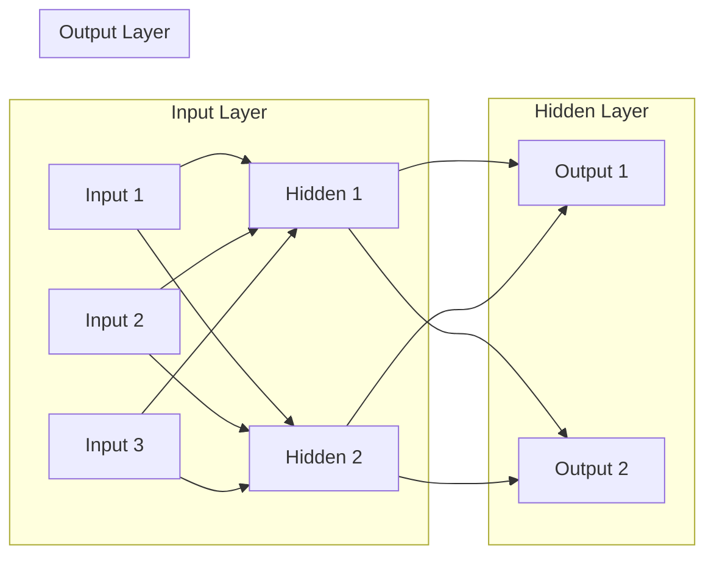
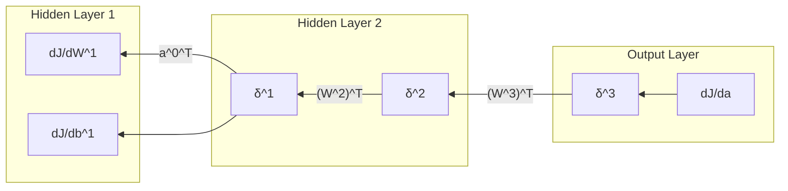

# Neural Networks 原理与代码实战案例讲解

## 1. 背景介绍

### 1.1 人工智能与机器学习发展历程

人工智能(Artificial Intelligence, AI)是计算机科学的一个重要分支,其目标是研究如何让计算机模拟甚至超越人类的智能。自1956年达特茅斯会议首次提出"人工智能"的概念以来,AI经历了从早期的符号主义、专家系统,到90年代以后的统计学习,再到近年来的深度学习,几次重大的发展浪潮。

机器学习(Machine Learning, ML)是实现人工智能的一种重要手段。传统的编程范式是显式编码,即程序员根据问题的逻辑直接编写代码。而机器学习则是让计算机通过学习大量数据来自动生成模型,从而对新数据做出预测判断。常见的机器学习任务包括分类、回归、聚类、降维等。

### 1.2 神经网络的起源与发展

神经网络(Neural Networks, NN)是一类重要的机器学习模型,其灵感来源于生物神经系统。1943年,McCulloch和Pitts提出了MP神经元模型,开创了神经网络的先河。之后Rosenblatt提出了感知机(Perceptron)模型,Widrow和Hoff提出了Adaline模型,标志着单层神经网络的诞生。

但是,Minsky在1969年证明了单层感知机无法解决异或等非线性问题,导致神经网络的第一次寒冬期。直到80年代中期,Rumelhart等人提出了反向传播(Backpropagation)算法,使得训练多层神经网络成为可能,神经网络迎来了第一次复兴。

进入21世纪,得益于大数据、高性能计算以及深度学习算法的发展,神经网络掀起了新一轮热潮。一系列深度神经网络如CNN、RNN、GAN等被提出并在计算机视觉、自然语言处理等领域取得了突破性进展,神经网络已经成为当前人工智能的核心技术之一。

## 2. 核心概念与联系

### 2.1 神经元模型

神经元(Neuron)是构成神经网络的基本单元。一个典型的神经元模型包含以下几个要素:

- 输入:来自其他神经元或外界的信号,通常表示为一个实数向量。
- 权重和偏置:每个输入信号都有一个对应的权重,表征该输入对神经元的重要程度。此外还有一个偏置项,相当于阈值。
- 求和:对输入信号及其权重进行加权求和,再加上偏置项。
- 激活函数:对求和结果做非线性变换,常见的有Sigmoid、tanh、ReLU等。
- 输出:激活函数的输出值,传递给下一层神经元。

数学表示为:

$$
\begin{aligned}
z &= \sum_{i=1}^{n} w_i x_i + b \\
a &= f(z)
\end{aligned}
$$

其中$x_i$为第$i$个输入,$w_i$为对应权重,$b$为偏置项,$f$为激活函数,$a$为神经元输出。

### 2.2 网络结构

将多个神经元按一定的拓扑结构连接起来,就形成了神经网络。按层数可分为:

- 单层网络:只含输入层和输出层。如感知机、Adaline等。
- 多层网络:在输入层和输出层之间还有一到多个隐藏层。如MLP、CNN、RNN等。

按连接方式可分为:

- 前馈网络:各层神经元之间只有从前往后的连接,不存在环路。如MLP、CNN等。
- 递归网络:神经元之间存在环路连接,当前时刻的输出依赖于之前时刻的输出。如RNN、LSTM等。

一个典型的三层前馈神经网络结构如下:

### 2.3 学习与优化

神经网络通过学习来调整内部参数,以拟合训练数据,这个过程称为训练或优化。其核心是通过最小化损失函数来找到最优参数。

损失函数衡量了模型预测值与真实值之间的差异,常见的有均方误差、交叉熵等。以均方误差为例:

$$
J(w,b) = \frac{1}{2m} \sum_{i=1}^{m} (a^{(i)} - y^{(i)})^2
$$

其中$m$为样本数,$a^{(i)}$为第$i$个样本的预测值,$y^{(i)}$为对应的真实值。

为最小化损失函数,通常使用梯度下降法及其变种。梯度下降通过求损失函数对参数的偏导数来不断调整参数,直至收敛。公式为:

$$
\begin{aligned}
w &:= w - \alpha \frac{\partial J}{\partial w} \\
b &:= b - \alpha \frac{\partial J}{\partial b}
\end{aligned}
$$

其中$\alpha$为学习率,控制每次参数调整的步长。求偏导的过程正是反向传播算法的核心。

## 3. 核心算法原理具体操作步骤

### 3.1 前向传播

前向传播是指将输入数据从输入层经过隐藏层传递到输出层的过程,目的是计算出网络的预测输出。具体步骤如下:

1. 输入层接收外界输入数据$x$,传递给第一个隐藏层。
2. 对于每个隐藏层$l$:
   1) 计算加权输入: $z^{[l]} = W^{[l]} a^{[l-1]} + b^{[l]}$
   2) 计算激活值: $a^{[l]} = f(z^{[l]})$
   3) 将激活值传递给下一层
3. 输出层接收最后一个隐藏层的激活值,计算网络的预测输出$\hat{y} = a^{[L]}$

其中$W^{[l]}$和$b^{[l]}$分别为第$l$层的权重矩阵和偏置向量,$L$为网络的总层数。

### 3.2 反向传播

反向传播是一种高效计算损失函数偏导数的算法,包含以下步骤:

1. 计算输出层误差: $\delta^{[L]} = \nabla_a J \odot f'(z^{[L]})$
2. 反向传播误差:
   for $l = L-1, L-2, ..., 1$:
     $\delta^{[l]} = (W^{[l+1]})^T \delta^{[l+1]} \odot f'(z^{[l]})$
3. 计算梯度:
   $\frac{\partial J}{\partial W^{[l]}} = \delta^{[l]} (a^{[l-1]})^T$
   $\frac{\partial J}{\partial b^{[l]}} = \delta^{[l]}$
4. 更新参数:
   $W^{[l]} := W^{[l]} - \alpha \frac{\partial J}{\partial W^{[l]}}$
   $b^{[l]} := b^{[l]} - \alpha \frac{\partial J}{\partial b^{[l]}}$

其中$\odot$表示Hadamard乘积(对应元素相乘),$f'$为激活函数的导数。

整个反向传播过程可用下图表示:

### 3.3 完整的训练过程

结合前向传播和反向传播,神经网络的完整训练过程如下:

1. 随机初始化网络参数。
2. 迭代执行以下步骤,直到满足停止条件(如达到最大迭代次数或损失函数值小于阈值):
   1) 选取一批训练样本(batch)
   2) 前向传播计算预测输出
   3) 计算损失函数值
   4) 反向传播计算梯度
   5) 用梯度下降法更新参数
3. 在测试集上评估训练好的模型性能。

## 4. 数学模型和公式详细讲解举例说明

本节我们以一个简单的两层神经网络为例,详细推导前向传播和反向传播中的数学公式。考虑一个结构为"3-4-2"的网络,即输入层3个节点,隐藏层4个节点,输出层2个节点。

### 4.1 前向传播

首先看前向传播。输入为$x = (x_1, x_2, x_3)$,隐藏层计算过程为:

$$
\begin{aligned}
z_1^{[1]} &= w_{11}^{[1]} x_1 + w_{12}^{[1]} x_2 + w_{13}^{[1]} x_3 + b_1^{[1]} \\
z_2^{[1]} &= w_{21}^{[1]} x_1 + w_{22}^{[1]} x_2 + w_{23}^{[1]} x_3 + b_2^{[1]} \\
z_3^{[1]} &= w_{31}^{[1]} x_1 + w_{32}^{[1]} x_2 + w_{33}^{[1]} x_3 + b_3^{[1]} \\
z_4^{[1]} &= w_{41}^{[1]} x_1 + w_{42}^{[1]} x_2 + w_{43}^{[1]} x_3 + b_4^{[1]} \\
a_i^{[1]} &= f(z_i^{[1]}), \quad i = 1,2,3,4
\end{aligned}
$$

用矩阵形式表示为:

$$
\begin{aligned}
z^{[1]} &= W^{[1]} x + b^{[1]} \\
a^{[1]} &= f(z^{[1]})
\end{aligned}
$$

其中

$$
W^{[1]} = 
\begin{bmatrix} 
w_{11}^{[1]} & w_{12}^{[1]} & w_{13}^{[1]} \\
w_{21}^{[1]} & w_{22}^{[1]} & w_{23}^{[1]} \\
w_{31}^{[1]} & w_{32}^{[1]} & w_{33}^{[1]} \\
w_{41}^{[1]} & w_{42}^{[1]} & w_{43}^{[1]}
\end{bmatrix}, \quad
b^{[1]} = 
\begin{bmatrix}
b_1^{[1]} \\ b_2^{[1]} \\ b_3^{[1]} \\ b_4^{[1]}  
\end{bmatrix}
$$

类似地,输出层的计算为:

$$
\begin{aligned}
z^{[2]} &= W^{[2]} a^{[1]} + b^{[2]} \\
a^{[2]} &= f(z^{[2]})
\end{aligned}
$$

其中

$$
W^{[2]} = 
\begin{bmatrix}
w_{11}^{[2]} & w_{12}^{[2]} & w_{13}^{[2]} & w_{14}^{[2]} \\
w_{21}^{[2]} & w_{22}^{[2]} & w_{23}^{[2]} & w_{24}^{[2]}
\end{bmatrix}, \quad 
b^{[2]} =
\begin{bmatrix}
b_1^{[2]} \\ b_2^{[2]}  
\end{bmatrix}
$$

输出层的激活值$a^{[2]}$即为网络的预测输出$\hat{y}$。

### 4.2 反向传播

现在来看反向传播。首先计算输出层误差:

$$
\delta^{[2]} = \nabla_a J \odot f'(z^{[2]})
$$

假设损失函数为均方误差,则:

$$
\begin{aligned}
\nabla_a J &= \frac{\partial J}{\partial a^{[2]}} = (a^{[2]} - y) \\
\delta^{[2]} &= (a^{[2]} - y) \odot f'(z^{[2]})
\end{aligned}
$$

接下来反向传播到隐藏层:

$$
\delta^{[1]} = (W^{[2]})^T \delta^{[2]} \odot f'(z^{[1]})
$$

展开写为:

$$
\begin{bmatrix}
\delta_1^