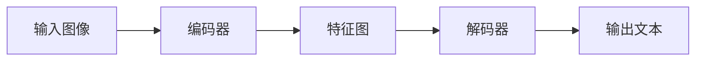

## 1.背景介绍

在当今的数字化时代，图像识别技术已经渗透到了我们生活的方方面面。其中，OCR（Optical Character Recognition，光学字符识别）技术是图像识别的重要分支，应用广泛，如自动数据录入、图书数字化、车牌识别等。OCRNet是一种有效的OCR模型，它通过深度学习技术，能够从图像中提取和识别出文本信息。本文将详细介绍OCRNet的原理，并通过代码实例进行讲解。

## 2.核心概念与联系

OCRNet的核心在于其网络结构，包括编码器和解码器两部分。编码器负责从输入图像中提取特征，解码器则用于根据这些特征生成文本结果。OCRNet的一个重要特性是其采用全卷积网络（FCN），使得模型能够接受任意大小的输入图像，并且能够在全局上保持空间信息，这对于文本识别来说非常重要。



## 3.核心算法原理具体操作步骤

OCRNet的工作过程可以分为以下步骤：

1. **输入图像预处理**：首先，输入的图像会被转化为灰度图，并进行归一化处理。

2. **特征提取**：经过预处理的图像会被送入编码器进行特征提取，得到特征图。

3. **文本识别**：解码器接收特征图，通过全连接层和softmax操作，得到每个字符的概率分布，进而得到最终的文本结果。

## 4.数学模型和公式详细讲解举例说明

在OCRNet中，我们使用卷积神经网络（CNN）作为编码器进行特征提取。对于输入图像$I$，经过卷积操作，我们可以得到特征图$F$：

$$
F = CNN(I)
$$

解码器则是一个全连接网络（FCN），它接收特征图$F$，通过全连接层和softmax操作，得到每个字符的概率分布$P$：

$$
P = Softmax(FCN(F))
$$

在训练阶段，我们使用交叉熵损失函数来优化模型，使得预测的字符概率分布尽可能接近真实的标签。

## 5.项目实践：代码实例和详细解释说明

下面我们通过一个简单的例子来说明如何使用OCRNet进行文本识别。我们首先定义了OCRNet的网络结构，然后读取一张图像，将其送入网络进行识别。

```python
# 定义OCRNet
class OCRNet(nn.Module):
    def __init__(self, num_classes):
        super(OCRNet, self).__init__()
        self.encoder = nn.Sequential(
            nn.Conv2d(1, 64, kernel_size=3, stride=1, padding=1),
            nn.ReLU(),
            nn.MaxPool2d(kernel_size=2, stride=2),
            nn.Conv2d(64, 128, kernel_size=3, stride=1, padding=1),
            nn.ReLU(),
            nn.MaxPool2d(kernel_size=2, stride=2)
        )
        self.decoder = nn.Linear(128*7*7, num_classes)

    def forward(self, x):
        x = self.encoder(x)
        x = x.view(x.size(0), -1)
        x = self.decoder(x)
        return F.log_softmax(x, dim=1)

# 读取图像并进行预处理
img = Image.open('test.jpg').convert('L')
img = img.resize((28, 28))
img = np.array(img, dtype=np.float32) / 255
img = torch.from_numpy(img).unsqueeze(0).unsqueeze(0)

# 实例化模型并进行预测
model = OCRNet(num_classes=10)
output = model(img)
pred = output.argmax(dim=1)
print('Predicted text:', pred)
```

## 6.实际应用场景

OCRNet在实际应用中有广泛的应用，例如：

- **自动数据录入**：OCRNet可以用于自动识别发票、单据等文档中的文本信息，从而实现自动数据录入。

- **车牌识别**：OCRNet可以用于车牌识别系统，自动识别车牌中的字符。

- **图书数字化**：OCRNet可以用于图书数字化，自动识别扫描的图书页面中的文本信息。

## 7.工具和资源推荐

以下是一些有关OCRNet的推荐资源：

- **PyTorch**：PyTorch是一个开源的深度学习框架，提供了丰富的模块和函数，非常适合进行深度学习的研究和开发。

- **OCRNet GitHub**：OCRNet的官方GitHub仓库，提供了详细的文档和示例代码。

## 8.总结：未来发展趋势与挑战

随着深度学习技术的发展，OCR技术也在不断进步，OCRNet作为其中的一种有效模型，已经在许多应用中展现出了强大的性能。然而，目前的OCRNet还存在一些挑战，例如对于复杂背景的图像、小字体的文本、歪斜的文本等，OCRNet的识别效果还有待提高。未来，我们期待看到更多的研究和技术，来解决这些挑战，进一步提升OCRNet的性能。

## 9.附录：常见问题与解答

**Q: OCRNet适用于哪些类型的图像？**

A: OCRNet适用于包含清晰文本的图像，例如发票、单据、车牌等。对于背景复杂、文本小、文本歪斜的图像，OCRNet的识别效果可能会下降。

**Q: OCRNet能处理多语言的文本吗？**

A: OCRNet本身不依赖于特定的语言，只要提供相应的训练数据，就可以训练出能处理特定语言的模型。

作者：禅与计算机程序设计艺术 / Zen and the Art of Computer Programming