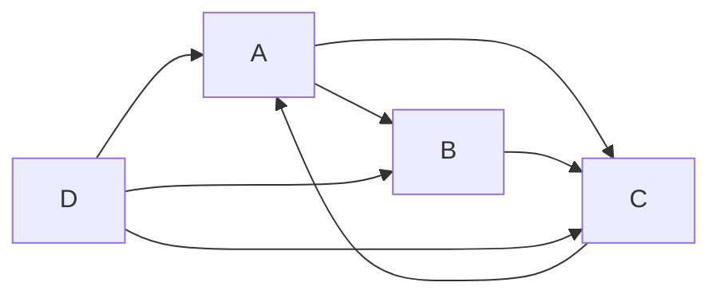

# PageRank 原理与代码实例讲解

## 1. 背景介绍
### 1.1 PageRank的诞生
PageRank是由Google公司创始人Larry Page和Sergey Brin在斯坦福大学攻读博士学位时提出的一种算法,用于衡量特定网页相对于搜索引擎索引中的其他网页而言的重要程度。它是Google用于排名网页的核心算法之一。

### 1.2 PageRank的重要性
PageRank的提出对搜索引擎的发展产生了深远影响。在PageRank之前,早期的搜索引擎主要是通过网页内容中的关键词出现频率来评估网页的相关性。但是仅仅依靠关键词无法准确反映一个网页的重要程度。PageRank算法的核心思想是通过网页之间的链接关系来评估一个网页的重要性,即一个网页被越多的其他网页链接,那么它的重要性就越高,其PageRank值也就越高。这种通过链接关系计算网页重要性的思想,也为后来的很多链接分析算法奠定了基础。

### 1.3 PageRank的现状
如今,PageRank已经成为搜索引擎排序的基础算法之一。尽管Google官方宣称目前已经使用了上百个排序因子,PageRank仍然是其中最重要的因子之一。同时,PageRank的思想也被应用到了社交网络、推荐系统等领域,成为了图数据挖掘中的经典算法。

## 2. 核心概念与联系
### 2.1 有向图模型
PageRank算法是建立在有向图模型的基础之上的。将整个万维网看作一张有向图,每个网页是图中的一个节点,如果网页A存在到网页B的链接,那么就在节点A和节点B之间连一条有向边,方向是从A指向B。

### 2.2 随机游走
PageRank的基本思想可以用随机游走(Random Walk)来解释。假设一个随机浏览者,他从一个网页开始,沿着网页上的链接随机访问,在每个网页上逗留一段时间后,又随机选择一个链接访问下一个网页。那么,他访问每个网页的频率,就可以反映这个网页的重要程度。访问频率高的网页,其重要性就高。

### 2.3 马尔科夫过程
PageRank计算的数学基础是马尔科夫过程。整个网页空间可以看作一个马尔科夫链,每个网页是状态空间中的一个状态。网页之间的链接关系决定了状态转移的概率。PageRank值实际上是马尔科夫链的平稳分布。

### 2.4 幂法
由于实际的网页数量非常庞大,PageRank值的计算通常使用幂法(Power Method)来进行。幂法是一种迭代算法,通过不断迭代逼近真实的PageRank值。

## 3. 核心算法原理具体操作步骤
### 3.1 构建有向图
根据网页之间的链接关系,构建一个有向图模型。每个网页是图中的一个节点,如果网页A链接到网页B,那么在节点A和B之间连一条有向边,方向从A指向B。

### 3.2 计算转移矩阵
根据有向图,计算转移矩阵P。矩阵P的每一行对应网页空间中的一个网页,每一列也对应一个网页。如果网页i链接到网页j,那么矩阵P中的元素P(i,j)等于1/L(i),其中L(i)是网页i的出链数量。如果网页i没有链接到网页j,那么P(i,j)=0。

### 3.3 迭代计算PageRank值
设定初始的PageRank值向量R0,通常可以将所有网页的初始PageRank值设为1/N,其中N是网页总数。然后使用下面的公式迭代计算PageRank值:

$$
R_{k+1} = dPR_k + (1-d)E/N
$$

其中,d是阻尼因子,通常取值在0.8到0.9之间。E是一个全为1的向量。

### 3.4 收敛判断
重复步骤3.3,直到PageRank值向量收敛,即前后两次迭代的PageRank值之差小于某个预设的阈值。

## 4. 数学模型和公式详细讲解举例说明
### 4.1 有向图模型
假设有4个网页A、B、C、D,它们之间的链接关系如下:
- A链接到B和C
- B链接到C
- C链接到A
- D链接到A、B、C

那么可以构建如下的有向图模型:



### 4.2 转移矩阵
根据上述有向图,可以得到转移矩阵P:

$$
P = \begin{bmatrix} 
0 & 1/2 & 1/2 & 0\\
0 & 0 & 1 & 0\\
1 & 0 & 0 & 0\\
1/3 & 1/3 & 1/3 & 0
\end{bmatrix}
$$

### 4.3 迭代计算
假设阻尼因子d=0.85,初始PageRank值向量为:

$$
R_0 = \begin{bmatrix}
0.25\\
0.25\\
0.25\\
0.25
\end{bmatrix}
$$

那么第一次迭代得到的PageRank值向量为:

$$
R_1 = 0.85 P R_0 + 0.15 E/4 \\
= 0.85 \begin{bmatrix}
0 & 1/2 & 1/2 & 0\\
0 & 0 & 1 & 0\\
1 & 0 & 0 & 0\\
1/3 & 1/3 & 1/3 & 0
\end{bmatrix} \begin{bmatrix}
0.25\\
0.25\\
0.25\\
0.25
\end{bmatrix} + 0.15 \begin{bmatrix}
0.25\\
0.25\\
0.25\\
0.25
\end{bmatrix}\\
= \begin{bmatrix}
0.334375\\
0.190625\\
0.309375\\
0.190625
\end{bmatrix}
$$

重复迭代直至收敛,最终可以得到每个网页的PageRank值。

## 5. 项目实践:代码实例和详细解释说明
下面是用Python实现PageRank算法的代码:

```python
import numpy as np

def pagerank(M, num_iterations: int = 100, d: float = 0.85):
    N = M.shape[1]
    v = np.random.rand(N, 1)
    v = v / np.linalg.norm(v, 1)
    M_hat = (d * M + (1 - d) / N)
    for i in range(num_iterations):
        v = M_hat @ v
    return v

# 示例
M = np.array([[0, 0, 0, 0, 1],
              [0.5, 0, 0, 0, 0],  
              [0.5, 0, 0, 0, 0],
              [0, 1, 0.5, 0, 0],
              [0, 0, 0.5, 1, 0]])

v = pagerank(M, 100, 0.85)
print(v)
```

代码解释:
- 函数pagerank接受三个参数:转移矩阵M,迭代次数num_iterations(默认100次),阻尼因子d(默认0.85)
- 首先获取网页数量N
- 随机初始化一个PageRank值向量v,并对其进行归一化处理
- 根据公式计算Google矩阵M_hat
- 进行num_iterations次迭代计算,每次迭代都用M_hat乘以上一次的PageRank值向量
- 返回最终的PageRank值向量

在示例中,我们构造了一个5x5的转移矩阵M,然后调用pagerank函数计算PageRank值。最终输出的v向量就是每个网页的PageRank值。

## 6. 实际应用场景
### 6.1 搜索引擎排序
PageRank最直接的应用就是在搜索引擎排序中。Google利用PageRank来评估网页的重要性,并将其作为搜索结果排序的重要因子之一。PageRank值高的网页,通常会在搜索结果中排在前面。

### 6.2 社交网络影响力分析
PageRank算法也可以用于社交网络影响力分析。将社交网络中的用户看作网页,用户之间的关注关系看作链接,就可以用PageRank来评估每个用户的影响力。影响力高的用户,其PageRank值就会较高。

### 6.3 文献引用分析
在学术领域,PageRank可以用于文献引用分析。将每篇论文看作一个网页,论文之间的引用关系看作链接,就可以用PageRank来评估每篇论文的重要性。被引用次数多的重要论文,其PageRank值就会较高。

### 6.4 网络节点重要性评估
PageRank可以用于评估任何网络中节点的重要性。例如在交通网络中,可以用PageRank来评估每个交通枢纽的重要性;在电力网络中,可以用PageRank来评估每个电力节点的重要性;在生物网络中,可以用PageRank来评估每个基因或蛋白质的重要性。

## 7. 工具和资源推荐
### 7.1 NetworkX
NetworkX是一个用于研究复杂网络的Python包。它提供了一些常用的图算法和绘图工具,包括PageRank算法。使用NetworkX可以方便地实现和分析PageRank。

官网:https://networkx.org/

### 7.2 Graph-tool
Graph-tool是一个高效的Python包,用于统计分析大型图。它使用C++实现,提供了多种图算法,包括PageRank。Graph-tool特别适合处理大规模的网络数据。

官网:https://graph-tool.skewed.de/

### 7.3 SNAP
SNAP (Stanford Network Analysis Platform)是斯坦福大学开发的一个网络分析和图挖掘的通用框架。它提供C++和Python两种接口,实现了多种经典的图算法,包括PageRank。

官网:http://snap.stanford.edu/

### 7.4 Gephi
Gephi是一个开源的网络可视化和分析软件。它提供了交互式的界面,可以方便地探索和分析网络数据。Gephi也内置了PageRank算法,可以用于计算和可视化网页的重要性。

官网:https://gephi.org/

## 8. 总结:未来发展趋势与挑战
### 8.1 个性化PageRank
传统的PageRank算法是一种全局的重要性评估,对所有用户都给出相同的重要性评分。但是在实际应用中,不同用户对网页重要性的评判标准可能不同。个性化PageRank的思路是为每个用户计算一个个性化的PageRank值,以反映不同用户的偏好。这可以通过调整转移矩阵或随机游走的起始分布来实现。

### 8.2 实时更新
传统的PageRank算法需要对整个网页图进行计算,当网页数量非常庞大时,计算成本非常高。而实际的网页图是动态变化的,存在新增和删除的网页。如何在网页图动态更新的情况下,快速更新PageRank值,是一个具有挑战性的问题。一些研究尝试通过增量更新的方法来解决这一问题。

### 8.3 多维PageRank
传统的PageRank算法只考虑了网页之间的链接关系这一个维度。但是在实际应用中,评估网页重要性可能需要考虑多个维度,如内容相关性、用户行为等。多维PageRank的思路是将多个维度的信息整合到PageRank的计算中,得到一个更加全面的重要性评估。

### 8.4 大规模计算
随着网络数据规模的不断增长,如何高效地计算PageRank值成为一个挑战。传统的单机计算已经无法满足需求,分布式计算成为必然趋势。如何设计高效的分布式PageRank算法,如何处理数据分割和通信开销,都是需要解决的问题。

## 9. 附录:常见问题与解答
### 9.1 PageRank值的范围是多少?
PageRank值通常被归一化处理,使得所有网页的PageRank值之和等于1。因此,单个网页的PageRank值通常是一个0到1之间的小数。但是实际计算中,为了避免数值下溢,通常会将PageRank值乘以一个大常数(如1亿)再进行存储和显示。

### 9.2 阻尼因子的作用是什么?
阻尼因子d用于控制随机游走的行为。d的值越大