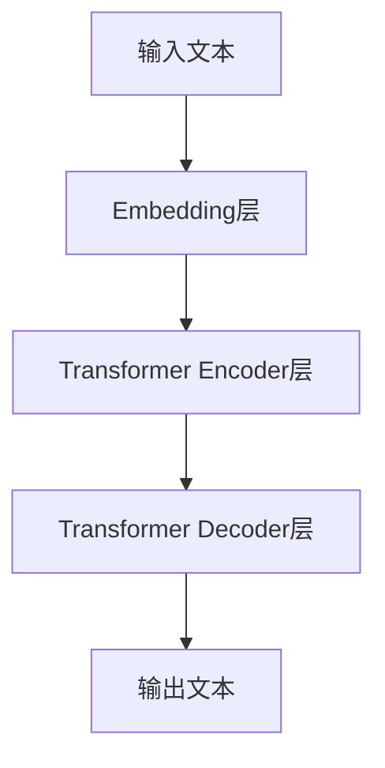

# Parti原理与代码实例讲解

## 1. 背景介绍

### 1.1 Parti的起源与发展
#### 1.1.1 Parti的诞生背景
#### 1.1.2 Parti的发展历程
#### 1.1.3 Parti的研究现状

### 1.2 Parti的应用领域
#### 1.2.1 自然语言处理
#### 1.2.2 计算机视觉  
#### 1.2.3 语音识别

## 2. 核心概念与联系

### 2.1 Parti的核心概念
#### 2.1.1 Transformer结构
#### 2.1.2 注意力机制
#### 2.1.3 自回归语言模型

### 2.2 Parti与其他模型的联系
#### 2.2.1 Parti与BERT的异同
#### 2.2.2 Parti与GPT系列的比较
#### 2.2.3 Parti与传统机器学习模型的区别

### 2.3 Parti的架构原理


## 3. 核心算法原理具体操作步骤

### 3.1 Transformer Encoder
#### 3.1.1 输入编码
#### 3.1.2 位置编码
#### 3.1.3 多头注意力机制
#### 3.1.4 前馈神经网络
#### 3.1.5 残差连接与Layer Normalization

### 3.2 Transformer Decoder  
#### 3.2.1 Masked Multi-Head Attention
#### 3.2.2 Multi-Head Attention
#### 3.2.3 前馈神经网络
#### 3.2.4 残差连接与Layer Normalization

### 3.3 训练过程
#### 3.3.1 数据准备
#### 3.3.2 模型初始化
#### 3.3.3 前向传播与损失计算
#### 3.3.4 反向传播与参数更新

## 4. 数学模型和公式详细讲解举例说明

### 4.1 注意力机制
#### 4.1.1 Scaled Dot-Product Attention
$Attention(Q,K,V) = softmax(\frac{QK^T}{\sqrt{d_k}})V$

其中，$Q$表示查询向量，$K$表示键向量，$V$表示值向量，$d_k$表示向量维度。

#### 4.1.2 Multi-Head Attention
$$MultiHead(Q,K,V) = Concat(head_1,...,head_h)W^O$$
$$head_i = Attention(QW_i^Q, KW_i^K, VW_i^V)$$

其中，$W_i^Q, W_i^K, W_i^V$和$W^O$都是可学习的参数矩阵。

### 4.2 前馈神经网络
$$FFN(x) = max(0, xW_1 + b_1)W_2 + b_2$$

其中，$W_1, b_1, W_2, b_2$都是可学习的参数。

### 4.3 残差连接与Layer Normalization
$$LayerNorm(x + Sublayer(x))$$

其中，$Sublayer(x)$可以是注意力子层或前馈神经网络子层。

## 5. 项目实践：代码实例和详细解释说明

### 5.1 数据准备
```python
import torch
from torch.utils.data import Dataset, DataLoader

class TextDataset(Dataset):
    def __init__(self, data):
        self.data = data
    
    def __len__(self):
        return len(self.data)
    
    def __getitem__(self, idx):
        return self.data[idx]

train_data = ["hello world", "how are you", ...]  
train_dataset = TextDataset(train_data)
train_dataloader = DataLoader(train_dataset, batch_size=32, shuffle=True)
```

### 5.2 模型定义
```python
import torch
import torch.nn as nn

class Parti(nn.Module):
    def __init__(self, vocab_size, d_model, nhead, num_layers):
        super().__init__()
        
        self.embedding = nn.Embedding(vocab_size, d_model)
        self.pos_encoder = PositionalEncoding(d_model)
        
        encoder_layer = nn.TransformerEncoderLayer(d_model, nhead)
        self.encoder = nn.TransformerEncoder(encoder_layer, num_layers) 
        
        decoder_layer = nn.TransformerDecoderLayer(d_model, nhead)
        self.decoder = nn.TransformerDecoder(decoder_layer, num_layers)
        
        self.fc = nn.Linear(d_model, vocab_size)
        
    def forward(self, src, tgt, src_mask=None, tgt_mask=None):
        src = self.embedding(src) * math.sqrt(self.d_model)
        src = self.pos_encoder(src)
        
        tgt = self.embedding(tgt) * math.sqrt(self.d_model)
        tgt = self.pos_encoder(tgt)
        
        memory = self.encoder(src, src_mask)
        output = self.decoder(tgt, memory, tgt_mask, None)
        
        output = self.fc(output)
        return output
```

### 5.3 模型训练
```python
model = Parti(vocab_size=1000, d_model=512, nhead=8, num_layers=6)
criterion = nn.CrossEntropyLoss()
optimizer = torch.optim.Adam(model.parameters(), lr=0.0001)

for epoch in range(10):
    for batch in train_dataloader:
        src, tgt = batch
        
        src_mask, tgt_mask = create_masks(src, tgt)
        
        outputs = model(src, tgt, src_mask, tgt_mask)
        loss = criterion(outputs.view(-1, vocab_size), tgt.view(-1))
        
        optimizer.zero_grad()
        loss.backward()
        optimizer.step()
```

## 6. 实际应用场景

### 6.1 机器翻译
Parti可以用于构建高质量的机器翻译系统，实现不同语言之间的自动翻译。

### 6.2 文本摘要
利用Parti对长文本进行理解和压缩，自动生成简洁的文本摘要。

### 6.3 对话系统
基于Parti构建智能对话系统，实现人机自然交互。

### 6.4 知识问答
Parti可以用于从大规模文本语料中抽取知识，构建知识问答系统。

## 7. 工具和资源推荐

### 7.1 Pytorch
Pytorch是一个流行的深度学习框架，提供了灵活的动态计算图和自动求导功能，方便实现各种神经网络模型。

### 7.2 Huggingface Transformers
Huggingface Transformers是一个功能强大的自然语言处理库，集成了多种预训练语言模型，可以方便地应用到下游任务中。

### 7.3 FairSeq
FairSeq是一个序列到序列建模的工具包，提供了多种经典的序列到序列模型实现，包括Transformer、CNN等。

## 8. 总结：未来发展趋势与挑战

### 8.1 模型效率提升
如何在保证模型性能的同时提高训练和推理效率，是Parti等大型语言模型面临的重要挑战。

### 8.2 低资源场景应用
如何利用Parti在低资源场景下实现良好的迁移学习效果，是一个值得研究的方向。

### 8.3 多模态建模
如何将Parti扩展到多模态场景，实现文本、图像、语音等不同模态信息的联合建模，是未来的一个重要发展方向。

### 8.4 模型解释性
虽然Parti在多个任务上取得了良好的效果，但其内部工作机制仍不够透明，如何增强Parti的可解释性是一个亟待解决的问题。

## 9. 附录：常见问题与解答

### 9.1 Parti与BERT的区别是什么？
Parti使用Transformer的Encoder-Decoder结构，而BERT只使用了Transformer的Encoder部分。Parti主要用于生成任务，如机器翻译、文本摘要等，而BERT主要用于自然语言理解任务，如文本分类、命名实体识别等。

### 9.2 Parti的训练需要多少数据和计算资源？
训练一个高质量的Parti模型通常需要大规模的文本数据，数据量级在千万甚至亿级别。同时，训练过程需要大量的计算资源，一般需要多个高性能GPU并行训练几天甚至几周时间。

### 9.3 Parti生成的文本质量如何评估？
评估Parti生成文本的质量主要有两种方式：
1. 人工评估，即由人工阅读生成的文本，给出质量评分。
2. 自动评估，使用BLEU、ROUGE等指标，将生成的文本与参考答案进行比较，计算相似度得分。

作者：禅与计算机程序设计艺术 / Zen and the Art of Computer Programming