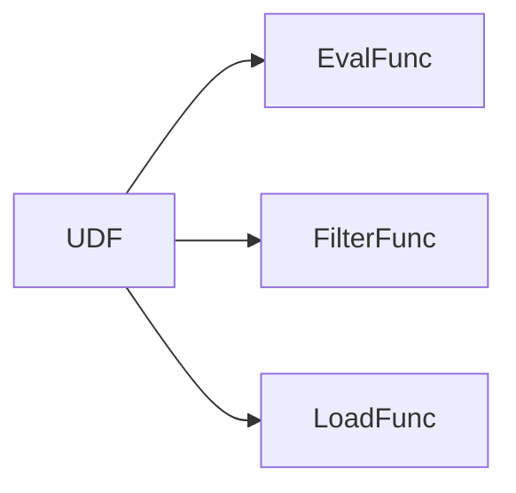
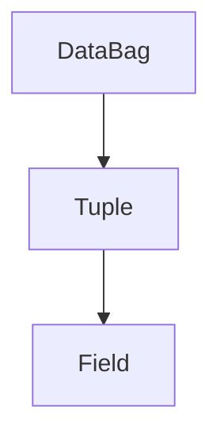

# Pig UDF原理与代码实例讲解

## 1. 背景介绍

### 1.1 大数据处理的挑战
在当今大数据时代,我们面临着海量数据处理的挑战。传统的数据处理方式已经无法满足快速增长的数据量和复杂的数据处理需求。因此,大数据处理框架应运而生,其中Apache Pig就是一个非常优秀的大数据处理平台。

### 1.2 Apache Pig简介
Apache Pig是由Yahoo!开发的一个基于Hadoop的大规模数据分析平台,它提供了一种类似SQL的高级数据流语言Pig Latin,用于描述数据分析程序。Pig Latin编译器会将其转换为一系列MapReduce任务在Hadoop集群上执行,从而实现海量数据的复杂处理。

### 1.3 Pig UDF的重要性
Pig内置了丰富的数据处理函数,但有时候我们需要自定义一些更复杂的处理逻辑。这时,Pig UDF(User Defined Function)就派上了用场。通过编写UDF,我们可以将自定义的处理逻辑灵活地嵌入到Pig数据流中,极大地扩展了Pig的功能。

## 2. 核心概念与联系

### 2.1 Pig Latin
Pig Latin是Pig提供的数据流定义语言,用于描述数据如何加载、处理和存储。它支持关系代数操作如filter、join、group、order等,同时也支持嵌套数据结构和自定义函数。

### 2.2 UDF、EvalFunc、FilterFunc、LoadFunc
- UDF是一个宏观概念,代表所有用户自定义函数。具体分为EvalFunc、FilterFunc、LoadFunc等几类。
- EvalFunc用于实现"列->列"的映射,如将一列数据转换为另一列。大多数UDF都属于这一类。
- FilterFunc用于实现"行->布尔"的映射,根据某些条件过滤掉一些行。
- LoadFunc用于自定义数据加载逻辑,如从特定格式文件中读取数据。

它们的关系可以用下面的Mermaid图来表示:



### 2.3 DataBag、Tuple、Field
这是Pig的三个核心数据结构:
- DataBag: 包含Tuple的集合,对应RDBMS中的表。
- Tuple: 包含Field的有序列表,对应RDBMS中的行。
- Field: Tuple中的一个字段,可以是基本类型或复杂类型。

它们的关系如下:



## 3. 核心算法原理具体操作步骤

编写Pig UDF的一般步骤如下:

1. 定义UDF类,根据类型继承EvalFunc、FilterFunc或LoadFunc。
2. 实现`exec`方法(EvalFunc/FilterFunc)或`getNext`方法(LoadFunc),编写自定义处理逻辑。
3. 在`output`方法中定义输出格式。
4. 在Pig Latin中注册UDF,在数据流中调用它。

以EvalFunc为例,`exec`方法是核心,它以Tuple为输入,输出一个对象。在其中我们可以对输入数据进行任意处理,如过滤、转换、计算等。

## 4. 数学模型和公式详细讲解举例说明

虽然Pig主要用于数据处理,但有时也会涉及一些数学计算。例如,我们要编写一个UDF来计算两个向量的欧氏距离:

$$
d(x,y) = \sqrt{\sum_{i=1}^n (x_i - y_i)^2}
$$

其中$x=(x_1,x_2,...,x_n)$和$y=(y_1,y_2,...,y_n)$是两个n维向量。在UDF中,我们可以将向量存储在Tuple中,然后按照公式计算距离:

```java
public class EuclideanDistanceUDF extends EvalFunc<Double> {
    public Double exec(Tuple input) throws IOException {
        if (input == null || input.size() != 2) {
            return null;
        }
        DataBag bag1 = (DataBag) input.get(0);
        DataBag bag2 = (DataBag) input.get(1);
        Iterator<Tuple> it1 = bag1.iterator();
        Iterator<Tuple> it2 = bag2.iterator();
        
        double sum = 0.0;
        while (it1.hasNext() && it2.hasNext()) {
            double v1 = (double) it1.next().get(0);
            double v2 = (double) it2.next().get(0);
            sum += Math.pow(v1 - v2, 2);
        }
        
        return Math.sqrt(sum);
    }
}
```

## 5. 项目实践：代码实例和详细解释说明

下面我们通过一个完整的例子来演示如何编写和使用Pig UDF。假设我们要实现一个UDF,用于将字符串转为大写。

首先定义`UppercaseUDF`类:

```java
import java.io.IOException;
import org.apache.pig.EvalFunc;
import org.apache.pig.data.Tuple;

public class UppercaseUDF extends EvalFunc<String> {
    public String exec(Tuple input) throws IOException {
        if (input == null || input.size() == 0) {
            return null;
        }
        try {
            String str = (String) input.get(0);
            return str.toUpperCase();
        } catch (Exception e) {
            throw new IOException("Caught exception processing input row ", e);
        }
    }
}
```

这里我们继承了`EvalFunc`,在`exec`方法中,从输入Tuple获取第一个字段,调用`toUpperCase`方法将其转为大写并返回。

接下来在Pig Latin中注册和使用这个UDF:

```sql
REGISTER myudfs.jar;
DEFINE Uppercase com.mycompany.pig.UppercaseUDF();

lines = LOAD 'input.txt' AS (line:chararray);
upper_lines = FOREACH lines GENERATE Uppercase(line);
DUMP upper_lines;
```

这里假设我们已经将`UppercaseUDF`编译打包为`myudfs.jar`。我们先用`REGISTER`语句注册这个jar包,然后用`DEFINE`语句为`UppercaseUDF`类起一个别名`Uppercase`。之后就可以在`FOREACH`语句中像内置函数一样使用这个UDF了。

## 6. 实际应用场景

Pig UDF在实际项目中有广泛的应用,下面列举几个常见的场景:

1. 数据清洗: 编写UDF对原始数据进行清洗,如去除空值、转换格式、过滤噪声等。

2. 数据转换: 编写UDF将数据从一种格式转换为另一种格式,如JSON到CSV,日期格式转换等。

3. 数据分析: 编写UDF实现特定的分析算法,如文本情感分析、相似度计算等。

4. 数据验证: 编写UDF对数据进行验证,如检查数据格式、数值范围等。

5. 数据加载: 编写LoadFunc从特定的数据源加载数据,如HBase、Cassandra等。

总之,任何需要自定义数据处理逻辑的地方,都可以考虑使用Pig UDF。它为Pig提供了强大的扩展能力。

## 7. 工具和资源推荐

1. Apache Pig官网: https://pig.apache.org/  
可以在这里找到Pig的所有文档、教程和示例。

2. Pig UDF模板生成工具: https://github.com/Netflix/pygenie  
Netflix开源的一个工具,可以根据模板快速生成Pig UDF的代码框架。

3. Pig UDF单元测试: https://github.com/kevinweil/elephant-bird  
Twitter开源的一个库,提供了方便的Pig UDF单元测试工具。

4. Pig UDF示例项目: https://github.com/apache/pig/tree/trunk/contrib-udf  
Pig官方提供的一些UDF示例,包括日期处理、Bloom Filter等。

5. 《Programming Pig》: O'Reilly出版的一本Pig编程指南,系统全面地介绍了Pig Latin和UDF开发。

## 8. 总结：未来发展趋势与挑战

Pig UDF极大地扩展了Pig的功能,使其可以支持各种个性化的数据处理需求。未来,随着大数据处理需求的不断增长,Pig UDF将会得到更广泛的应用。

同时,Pig UDF的开发也面临一些挑战:

1. 性能优化: UDF的执行效率直接影响整个Pig任务的性能,需要编写高效的UDF代码。

2. 测试与调试: UDF的测试和调试比较困难,需要完善的测试用例和调试工具。

3. 兼容性: 要确保UDF在不同版本的Pig和Hadoop环境中都能正常工作。

4. 代码维护: 随着业务逻辑的变化,UDF也需要不断更新和维护。

总的来说,Pig UDF是一个很有前景但也有挑战的技术,掌握它可以让我们在大数据处理领域如虎添翼。

## 9. 附录：常见问题与解答

1. 问: Pig UDF与Hive UDF有何区别?  
答: 它们的作用类似,但Pig UDF基于Java开发,Hive UDF基于Java或类SQL语言开发。此外,Pig UDF在数据流中使用,Hive UDF在查询语句中使用。

2. 问: Pig UDF的输入输出可以是哪些类型?  
答: 输入可以是Tuple、DataBag或基本类型,输出可以是任意类型。但为了在Pig Latin中使用,建议输出也是Tuple、DataBag或基本类型。

3. 问: 如何在Pig UDF中连接数据库?  
答: 可以在UDF中使用JDBC连接数据库。但建议将连接池初始化放在`exec`方法外,避免每次调用UDF都创建连接。

4. 问: Pig UDF是否支持多个输出?  
答: 支持。可以让`exec`方法返回Tuple,在其中包含多个输出字段。

5. 问: 如何处理Pig UDF中的错误?  
答: 可以抛出`IOException`,在错误消息中包含必要的上下文信息。Pig会捕获这些异常,将错误记录到日志中,并尝试继续执行其他的数据。

作者：禅与计算机程序设计艺术 / Zen and the Art of Computer Programming