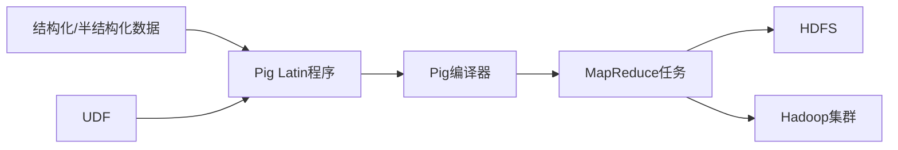

# Pig原理与代码实例讲解

## 1. 背景介绍

### 1.1 大数据处理的挑战
随着数据量的爆炸式增长,传统的数据处理方式已经无法满足大数据时代的需求。MapReduce作为一种分布式计算框架,在处理海量数据方面展现出了巨大的优势。然而,直接编写MapReduce程序对于许多开发者来说门槛较高,需要较深的编程功底。

### 1.2 Pig的诞生
为了降低大数据处理的难度,Yahoo!的研究人员开发了Pig这一基于Hadoop的大规模数据分析平台。Pig提供了一种名为Pig Latin的高级数据流语言,使得开发者能够以类似SQL的方式进行大数据分析,大大简化了编程的复杂度。

### 1.3 Pig的应用现状
自2008年开源以来,Pig已经成为了大数据领域不可或缺的工具之一。众多知名企业如Twitter、LinkedIn、Netflix等都在生产环境中大规模使用Pig进行数据分析。Pig结合了MapReduce的高性能和SQL的易用性,为大数据处理开辟了一条全新的道路。

## 2. 核心概念与联系

### 2.1 Pig Latin语言
Pig Latin是Pig提供的数据流语言,它是一种面向数据分析的高级语言。Pig Latin支持结构化和半结构化数据,提供了丰富的数据类型和强大的操作符。通过Pig Latin,用户可以使用类似SQL的语法对大规模数据集进行Extract-Transform-Load(ETL)操作。

### 2.2 数据模型
Pig中的数据以关系的形式进行建模,一个关系就是一个二维表格,类似于关系型数据库中的表。关系中的每一行称为一个元组(tuple),由若干个字段组成。Pig支持包括int、long、float、double、chararray、bytearray、map、tuple、bag等丰富的数据类型。

### 2.3 数据操作
Pig Latin提供了一系列操作来对关系进行处理,主要包括:
- LOAD:从HDFS或本地文件系统加载数据到关系中
- FILTER:根据指定条件过滤关系中的数据
- FOREACH...GENERATE:对关系中的每个元组进行转换,生成新的字段
- GROUP:根据某些字段对关系进行分组
- JOIN:将两个关系按照指定条件连接
- UNION:将两个关系合并
- DISTINCT:去除关系中的重复元组
- ORDER BY:按照指定字段对关系排序
- LIMIT:限制关系中元组的数量

通过组合使用这些操作,可以完成非常复杂的数据分析任务。

### 2.4 执行模型
Pig Latin程序会被Pig编译器转换为一系列MapReduce任务,在Hadoop集群上执行。Pig会对数据流进行优化,尽可能减少MapReduce任务的数量,提高执行效率。Pig还提供了UDF(用户自定义函数)机制,允许用户使用Java、Python等语言编写自定义函数,扩展Pig的功能。

下图展示了Pig的核心概念之间的关系:



## 3. 核心算法原理与具体操作步骤

### 3.1 数据加载
Pig使用LOAD操作从外部数据源加载数据,支持的数据源包括:
- 本地文件系统
- HDFS
- HBase
- Hive
- 关系型数据库

LOAD操作的基本语法如下:
```
alias = LOAD 'data' [USING function] [AS schema];
```
其中,data表示数据源的路径,function表示加载数据的函数(如PigStorage),schema表示数据的模式。

例如,从HDFS上的文本文件加载数据:
```
raw_data = LOAD '/user/pig/input/data.txt' USING PigStorage(',') 
           AS (name:chararray, age:int, gpa:float);
```

### 3.2 数据过滤
FILTER操作用于根据指定条件对关系进行过滤,语法如下:
```
alias = FILTER alias BY expression;
```
expression是一个布尔表达式,对于每个元组计算该表达式,为true的元组会被保留。

例如,过滤GPA大于3.0的学生:
```
filtered_data = FILTER raw_data BY gpa > 3.0;
```

### 3.3 数据转换
FOREACH...GENERATE操作对关系中的每个元组进行转换,生成新的字段,语法如下:
```
alias = FOREACH alias GENERATE expression;
```
expression可以是字段引用、函数调用、算术运算等。

例如,为每个学生计算加权GPA:
```
weighted_gpa = FOREACH raw_data GENERATE name, age, gpa * 1.1 AS weighted_gpa;  
```

### 3.4 分组聚合
GROUP操作根据指定字段对关系进行分组,语法如下:
```
grouped_alias = GROUP alias BY field;
```
分组后,可以使用聚合函数如COUNT、SUM、AVG等对每个分组进行聚合计算。

例如,计算每个年龄的学生人数:
```
age_groups = GROUP raw_data BY age;
age_counts = FOREACH age_groups GENERATE group AS age, COUNT(raw_data) AS count;
```

### 3.5 连接
JOIN操作用于将两个关系按照指定字段进行连接,Pig支持内连接、外连接、半连接等多种连接类型。

例如,将学生表和成绩表进行连接:
```
students = LOAD 'students.txt' AS (id:int, name:chararray, age:int);
grades = LOAD 'grades.txt' AS (id:int, course:chararray, grade:float);

joined = JOIN students BY id, grades BY id;
```

## 4. 数学模型和公式详细讲解举例说明

Pig本身是一个数据处理工具,主要用于数据的ETL和分析,没有涉及非常复杂的数学模型。但在实际使用中,我们可能会用到一些基本的统计学概念和公式。

### 4.1 平均值
平均值是最常见的统计指标之一,表示数据的中心位置。样本平均值的计算公式为:

$$\bar{x} = \frac{1}{n}\sum_{i=1}^n x_i$$

其中,$x_i$表示第$i$个数据,$n$表示数据总数。

在Pig中,可以使用AVG函数计算平均值:
```
grouped_data = GROUP data BY field;
avg_data = FOREACH grouped_data GENERATE group, AVG(data.value);  
```

### 4.2 方差和标准差
方差和标准差用于度量数据的离散程度。样本方差的计算公式为:

$$s^2 = \frac{1}{n-1}\sum_{i=1}^n (x_i - \bar{x})^2$$

标准差是方差的平方根:

$$s = \sqrt{s^2}$$

在Pig中,可以使用嵌套的FOREACH语句计算方差和标准差:
```
grouped_data = GROUP data BY field;

var_data = FOREACH grouped_data {
    data_values = data.value;
    data_avg = AVG(data_values);  
    GENERATE group,
             (1.0/(COUNT(data_values)-1)) * SUM((data_values - data_avg)^2) AS variance;
}

std_data = FOREACH var_data GENERATE group, SQRT(variance) AS std;
```

### 4.3 相关系数
相关系数用于度量两个变量之间的线性相关性,取值范围是[-1,1]。Pearson相关系数的计算公式为:

$$r = \frac{\sum_{i=1}^n (x_i - \bar{x})(y_i - \bar{y})}{\sqrt{\sum_{i=1}^n (x_i - \bar{x})^2} \sqrt{\sum_{i=1}^n (y_i - \bar{y})^2}}$$

其中,$x_i$和$y_i$分别表示两个变量的第$i$个数据。

在Pig中,可以使用自定义的UDF函数计算相关系数:
```
data = LOAD 'data.txt' AS (x:double, y:double);

corr_data = FOREACH (GROUP data ALL) {
    data_x = data.x;
    data_y = data.y;
    data_x_avg = AVG(data_x);
    data_y_avg = AVG(data_y);
    
    GENERATE CORR(data_x, data_y, data_x_avg, data_y_avg) AS corr;
}
```
其中,CORR是自定义的UDF函数,实现了相关系数的计算。

## 5. 项目实践:代码实例和详细解释说明

下面通过一个实际的项目案例,演示如何使用Pig进行数据分析。该项目的目标是分析Web服务器的访问日志,统计每个IP的访问次数。

### 5.1 数据准备
访问日志的格式如下:
```
2022-01-01 12:34:56 GET /index.html 192.168.1.100
2022-01-01 12:35:12 POST /login.php 192.168.1.101
2022-01-01 12:36:20 GET /detail.html 192.168.1.102
...
```
将访问日志上传到HDFS的/user/pig/input/access_log.txt。

### 5.2 Pig Latin程序
```
-- 加载数据
raw_data = LOAD '/user/pig/input/access_log.txt' USING PigStorage(' ') 
           AS (time:chararray, method:chararray, url:chararray, ip:chararray);
           
-- 提取IP字段 
ip_data = FOREACH raw_data GENERATE ip;

-- 按IP分组并统计访问次数
ip_groups = GROUP ip_data BY ip;
ip_counts = FOREACH ip_groups GENERATE group AS ip, COUNT(ip_data) AS count;

-- 按访问次数降序排列
sorted_data = ORDER ip_counts BY count DESC;

-- 存储结果到HDFS
STORE sorted_data INTO '/user/pig/output/ip_counts' USING PigStorage(',');
```

### 5.3 代码解释
1. 使用LOAD操作加载HDFS上的访问日志文件,并指定每行的字段名和类型。
2. 使用FOREACH...GENERATE提取需要的ip字段。
3. 使用GROUP BY对数据按照ip进行分组。
4. 使用FOREACH...GENERATE统计每个IP的访问次数。
5. 使用ORDER BY按照访问次数进行降序排列。
6. 使用STORE将结果写入HDFS。

### 5.4 运行程序
将上述代码保存为ip_count.pig,使用以下命令运行:
```
pig ip_count.pig
```
运行结束后,在HDFS的/user/pig/output/ip_counts目录下可以看到结果文件。

通过这个简单的案例,我们演示了如何使用Pig进行数据加载、转换、分组、排序等操作,快速实现了一个访问日志分析的任务。Pig简洁的语法和强大的功能,使得复杂的数据分析变得简单和高效。

## 6. 实际应用场景

Pig在实际的业务中有非常广泛的应用,下面列举几个典型的场景。

### 6.1 日志分析
互联网公司每天会产生海量的日志数据,如Web访问日志、应用程序日志、搜索引擎日志等。使用Pig可以很方便地对这些日志进行分析,挖掘出有价值的信息,如统计PV/UV、分析用户行为、发现热门搜索词等。

### 6.2 用户行为分析
电商网站、社交网络、游戏平台等都非常关注用户行为数据。使用Pig可以对用户的浏览、点击、购买等行为进行深入分析,构建用户画像,进行个性化推荐、精准营销等。

### 6.3 数据ETL
在数据仓库和数据分析平台中,经常需要对原始数据进行清洗、转换和集成。Pig提供了一系列强大的数据处理操作符,可以很方便地完成数据的过滤、转换、聚合等ETL任务,为后续的数据分析提供干净、一致的数据。

### 6.4 机器学习
Pig也可以用于机器学习的数据预处理环节。例如,可以使用Pig对训练数据进行清洗、特征提取、数据标准化等操作,生成适合机器学习算法的输入数据。

### 6.5 网页索引构建
搜索引擎需要对海量的网页进行抓取和索引,这是一个非常耗时的过程。使用Pig可以对网页数据进行解析、提取、转换,快速构建起网页索引,提高搜索效率。

总之,Pig是一个非常实用的大数据处理工具,在数据分析、数据挖掘、机器学习等领域都有广泛的应用。掌握Pig的使用,可以大大提高我们处理海量数据的效率。

## 7. 工具和资源推荐

### 7.1 