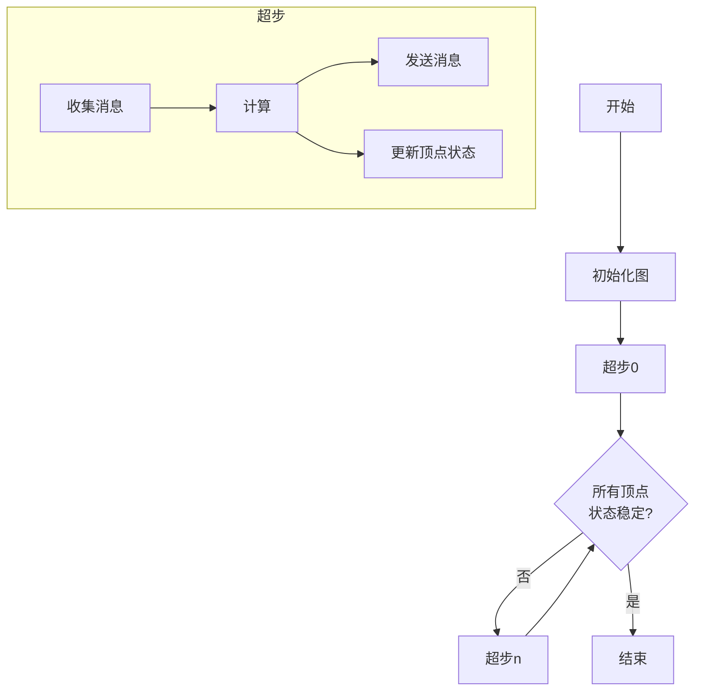

# Pregel原理与代码实例讲解

## 1. 背景介绍

在当今大数据时代，海量的数据被广泛应用于各个领域,例如社交网络、网络安全、生物信息学等。这些数据通常以图的形式表示,称为大规模图数据。由于图数据具有复杂的拓扑结构和海量顶点和边的特点,使得传统的数据处理系统难以高效地处理和分析。为了解决这一问题,Google于2010年提出了Pregel,这是一种基于大规模图数据的并行计算模型。

Pregel的核心思想是将计算过程分解为一系列迭代的超步(Superstep),每个超步由三个阶段组成:收集消息、计算和发送消息。在每个超步中,每个顶点并行执行用户定义的函数,根据收到的消息更新自身状态,并向其邻居发送新的消息。整个计算过程在所有顶点的状态达到稳定时终止。Pregel的设计使其能够高效地处理大规模图数据,并具有良好的容错性和可扩展性。

## 2. 核心概念与联系

### 2.1 超步(Superstep)

超步是Pregel计算模型的核心概念,它将整个计算过程划分为一系列的迭代步骤。每个超步由以下三个阶段组成:

1. **收集消息(Message Gathering)**: 每个顶点从其邻居收集消息。
2. **计算(Compute)**: 每个顶点并行执行用户定义的计算函数,根据收到的消息更新自身状态。
3. **发送消息(Message Sending)**: 每个顶点向其邻居发送新的消息。

### 2.2 顶点(Vertex)

顶点是图中的基本单元,它包含以下几个部分:

1. **顶点值(Vertex Value)**: 顶点的数据值,可以是任意类型。
2. **顶点状态(Vertex State)**: 顶点的计算状态,如活跃(Active)或非活跃(Inactive)。
3. **消息(Message)**: 顶点发送和接收的消息。

### 2.3 边(Edge)

边表示顶点之间的关系,它包含以下部分:

1. **源顶点(Source Vertex)**: 边的起始顶点。
2. **目标顶点(Target Vertex)**: 边的终止顶点。
3. **边值(Edge Value)**: 边的数据值,可以是任意类型。

### 2.4 聚合器(Aggregator)

聚合器用于在超步之间共享和传递全局信息。它可以从每个顶点收集局部值,并计算出全局值,然后将该全局值分发给所有顶点。

### 2.5 组合器(Combiner)

组合器用于在发送消息之前对消息进行本地合并,减少网络传输开销。它可以将多个消息合并为一个消息,从而减少消息的数量。

### 2.6 Mermaid 流程图

下面是Pregel计算模型的Mermaid流程图:



在上面的流程图中,Pregel计算过程从初始化图开始,然后进入一系列的超步迭代。每个超步包括收集消息、计算和发送消息三个阶段。在计算阶段,每个顶点并行执行用户定义的函数,根据收到的消息更新自身状态。如果所有顶点的状态都达到稳定,则计算过程终止,否则进入下一个超步继续迭代。

## 3. 核心算法原理具体操作步骤

Pregel算法的核心原理可以总结为以下几个步骤:

1. **初始化图**

   在计算开始之前,需要将输入数据加载到分布式系统中,并将图数据划分为多个分片(Partition)。每个分片包含一部分顶点和边,分布在不同的计算节点上。

2. **超步迭代**

   Pregel算法通过一系列的超步迭代来完成计算。每个超步包括以下三个阶段:

   a. **收集消息**

      每个顶点从其邻居收集消息。这些消息可能是上一个超步中发送的,也可能是初始化时设置的。

   b. **计算**

      每个顶点并行执行用户定义的计算函数(`compute()`),根据收到的消息更新自身状态。计算函数的输入包括当前顶点值、收到的消息和聚合器的全局值。计算函数的输出包括新的顶点值、发送给邻居的消息和是否继续活跃(Active)的状态。

   c. **发送消息**

      每个顶点向其邻居发送新的消息。这些消息将在下一个超步中被收集。

3. **终止条件**

   当所有顶点的状态都达到稳定(非活跃)时,Pregel算法终止。否则,将进入下一个超步继续迭代。

4. **输出结果**

   最终计算结果存储在每个顶点的值中。可以将这些值收集并输出为最终结果。

在整个计算过程中,Pregel算法通过并行执行每个顶点的计算函数,实现了对大规模图数据的高效处理。同时,它还具有良好的容错性和可扩展性,能够在出现节点故障时自动恢复计算,并根据需要动态添加或删除计算节点。

## 4. 数学模型和公式详细讲解举例说明

在Pregel算法中,有一些重要的数学模型和公式,它们描述了算法的核心概念和计算过程。下面将详细讲解这些模型和公式,并给出具体的例子说明。

### 4.1 图表示

在Pregel中,图$G$被表示为一个三元组$(V, E, \Phi)$,其中:

- $V$是顶点集合,表示图中的所有顶点。
- $E$是边集合,表示图中的所有边。
- $\Phi$是一个函数,将每个顶点$v \in V$映射到其值$\Phi(v)$。

例如,对于一个简单的无向图,可以用以下方式表示:

$$
G = (V, E, \Phi)\\
V = \{v_1, v_2, v_3, v_4\}\\
E = \{(v_1, v_2), (v_2, v_3), (v_3, v_4), (v_4, v_1)\}\\
\Phi(v_1) = 1, \Phi(v_2) = 2, \Phi(v_3) = 3, \Phi(v_4) = 4
$$

在这个例子中,图$G$包含4个顶点和4条边,每个顶点都有一个整数值。

### 4.2 超步迭代公式

Pregel算法通过一系列的超步迭代来完成计算。在每个超步$t$中,每个顶点$v$都会执行一个用户定义的计算函数$\mathcal{F}$,该函数的输入包括当前顶点值$\Phi_t(v)$、收到的消息集合$M_t(v)$和聚合器的全局值$A_t$。计算函数的输出包括新的顶点值$\Phi_{t+1}(v)$、发送给邻居的消息集合$M_{t+1}(v)$和是否继续活跃的状态$\alpha_{t+1}(v)$。

这个过程可以用以下公式表示:

$$
\begin{align*}
(\Phi_{t+1}(v), M_{t+1}(v), \alpha_{t+1}(v)) &= \mathcal{F}(\Phi_t(v), M_t(v), A_t)\\
M_t(v) &= \bigcup_{(u, v) \in E} M_t(u, v)\\
A_t &= \mathcal{A}(\{a_t(v) | v \in V\})
\end{align*}
$$

其中:

- $\mathcal{F}$是用户定义的计算函数。
- $M_t(v)$是顶点$v$在超步$t$收到的消息集合,由所有邻居发送的消息组成。
- $A_t$是聚合器在超步$t$计算出的全局值,由所有顶点的局部值$a_t(v)$计算得到。
- $\mathcal{A}$是聚合器的计算函数。

例如,在计算图中所有顶点的出度之和的问题中,可以定义以下计算函数和聚合器:

$$
\begin{align*}
\mathcal{F}(\Phi_t(v), M_t(v), A_t) &= (\Phi_t(v), \emptyset, \text{false})\\
a_t(v) &= \text{outdegree}(v)\\
\mathcal{A}(\{a_t(v) | v \in V\}) &= \sum_{v \in V} a_t(v)
\end{align*}
$$

在这个例子中,每个顶点只需要计算自己的出度,并将其作为局部值传递给聚合器。聚合器将所有顶点的出度相加,得到图中所有顶点的出度之和。

### 4.3 组合器公式

在Pregel中,组合器用于在发送消息之前对消息进行本地合并,减少网络传输开销。假设有一个组合器函数$\mathcal{C}$,它将一组消息$\{m_1, m_2, \ldots, m_k\}$合并为一个消息$m'$,则组合器的作用可以用以下公式表示:

$$
M_{t+1}(v) = \bigcup_{u \in N(v)} \mathcal{C}(\{M_{t+1}(u, v)\})
$$

其中:

- $N(v)$是顶点$v$的邻居集合。
- $M_{t+1}(u, v)$是顶点$u$在超步$t+1$发送给顶点$v$的消息。
- $\mathcal{C}$是组合器的合并函数。

例如,在计算图中所有顶点的入度之和的问题中,可以定义以下计算函数和组合器:

$$
\begin{align*}
\mathcal{F}(\Phi_t(v), M_t(v), A_t) &= (\Phi_t(v) + \sum_{m \in M_t(v)} m, \{1\}, \text{false})\\
\mathcal{C}(\{m_1, m_2, \ldots, m_k\}) &= \sum_{i=1}^k m_i
\end{align*}
$$

在这个例子中,每个顶点向其邻居发送一个值为1的消息。组合器将这些消息相加,得到每个顶点的入度。最终,所有顶点的入度之和就是图中所有顶点的入度之和。

通过上述数学模型和公式,可以清楚地描述Pregel算法的核心概念和计算过程,为实现和优化Pregel算法提供了理论基础。

## 5. 项目实践:代码实例和详细解释说明

在本节中,我们将通过一个具体的项目实践,展示如何使用Pregel算法来解决实际问题。我们将使用Apache Giraph作为Pregel的实现,并以计算图中所有顶点的PageRank值为例,详细解释代码实现和运行过程。

### 5.1 Apache Giraph简介

Apache Giraph是一个开源的大规模图处理系统,它实现了Pregel计算模型,并提供了丰富的API和工具,支持在Hadoop和Apache YARN上运行。Giraph使用Java语言编写,并支持多种编程语言,如Java、Python和C++。

### 5.2 PageRank算法介绍

PageRank是一种著名的链接分析算法,它被广泛应用于网页排名和社交网络分析等领域。PageRank算法基于这样一个假设:一个网页的重要性取决于指向它的其他网页的重要性和数量。具体来说,PageRank算法通过迭代计算,使每个网页的PageRank值收敛到一个稳定值,该值反映了该网页在整个网络中的重要性。

### 5.3 使用Giraph实现PageRank

下面是使用Giraph实现PageRank算法的代码示例,包括顶点计算函数、主程序和配置文件。

#### 5.3.1 顶点计算函数

```java
public class PageRankVertexCompute extends BasicComputation<LongWritable, DoubleWritable, DoubleWritable, MessageWriter<LongWritable, DoubleWritable>> {

    private static final double DAMPING_FACTOR = 0.85;
    private static final double MASS = (1.0 - DAMPING_FACTOR);

    @Override
    public void compute(Vertex{"msg_type":"generate_answer_finish","data":"","from_module":null,"from_unit":null}