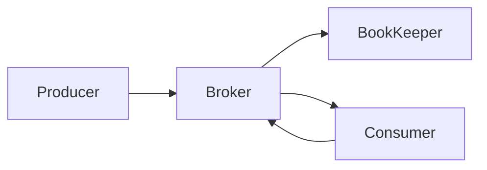

# Pulsar Producer原理与代码实例讲解

## 1. 背景介绍

Apache Pulsar是一个云原生、分布式的消息流平台,旨在提供无限制的流数据存储功能。作为一个发布-订阅消息传递系统,Pulsar支持多种消费模型,包括独占、共享和失效订阅等。Pulsar Producer是发布消息的生产者客户端,负责将消息发送到指定的Topic中。

Pulsar Producer的核心设计目标是提供高吞吐量、低延迟和高可用性。它采用了多种优化技术,如批量发送、压缩、负载均衡等,以确保消息的高效传输。此外,Pulsar Producer还提供了丰富的配置选项,允许用户根据实际需求进行定制化设置。

## 2. 核心概念与联系

### 2.1 Topic

Topic是Pulsar中的逻辑数据通道,用于存储发布的消息。每个Topic由一个持久化的日志组成,消息以追加的方式写入日志。Topic可以具有多个订阅者,每个订阅者都会收到完整的消息流。

### 2.2 Producer

Producer是发布消息的客户端,负责将消息发送到指定的Topic。Producer在发送消息时,会先将消息存储在内存缓冲区中,然后批量发送到Broker。这种批量发送机制可以提高吞吐量并减少网络开销。

### 2.3 Broker

Broker是Pulsar集群中的服务器节点,负责存储和分发消息。Producer将消息发送到Broker,Broker再将消息持久化到BookKeeper中。Broker还负责处理消费者的订阅请求,并将消息分发给相应的消费者。

### 2.4 BookKeeper

BookKeeper是一个开源的分布式写入日志存储系统,用于持久化存储Pulsar中的消息数据。BookKeeper采用了复制和分片的方式,提供了高可用性和高吞吐量的存储能力。

### 2.5 Mermaid流程图



## 3. 核心算法原理具体操作步骤

Pulsar Producer在发送消息时,主要经历以下几个步骤:

1. **初始化Producer**

   首先,需要创建一个`PulsarClient`实例,并使用该实例创建一个`Producer`对象。在创建`Producer`时,需要指定Topic名称和相关配置选项。

2. **消息序列化**

   消息在发送之前需要进行序列化,将其转换为字节数组。Pulsar支持多种序列化方式,包括内置的和自定义的序列化器。

3. **消息压缩(可选)**

   为了减小消息的网络传输开销,Pulsar支持对消息进行压缩。可以在Producer级别或Topic级别配置压缩算法。

4. **批量发送**

   Producer会将待发送的消息缓存在内存中的批处理队列中。当达到一定的批量大小或超时时间时,Producer会将这些消息批量发送到Broker。批量发送可以提高吞吐量并减少网络开销。

5. **分区路由**

   如果Topic被配置为分区Topic,Producer需要根据消息的路由键(Key)将消息发送到正确的分区。Pulsar提供了多种分区路由策略,如键值哈希、单分区等。

6. **负载均衡**

   Producer会根据Topic的分区情况,将消息均衡地发送到不同的Broker节点上。这种负载均衡机制可以提高系统的整体吞吐量和可用性。

7. **持久化存储**

   Broker收到消息后,会将消息持久化存储到BookKeeper中。BookKeeper采用了复制和分片的方式,确保了消息的持久性和高可用性。

8. **发送确认**

   Producer可以选择等待Broker的发送确认,以确保消息已经成功发送。根据不同的发送模式(同步或异步),Producer会等待或不等待确认。

## 4. 数学模型和公式详细讲解举例说明

在Pulsar Producer中,批量发送是一种重要的优化技术。通过将多条消息合并为一个批次进行发送,可以减少网络开销并提高吞吐量。批量发送的效率取决于两个主要因素:批量大小和批量延迟。

### 4.1 批量大小

批量大小指的是一个批次中包含的消息数量。假设每条消息的大小为$m$字节,批量大小为$n$,则一个批次的总大小为:

$$
S = n \times m
$$

批量大小越大,单个批次的网络开销就越小,但同时也会增加内存占用和延迟。因此,需要在吞吐量、延迟和内存使用之间进行权衡。

### 4.2 批量延迟

批量延迟指的是Producer等待批次填满的最大时间。在达到最大批量大小之前,如果等待时间超过了批量延迟,Producer就会将当前批次发送出去。

假设Producer的发送速率为$r$条/秒,批量延迟为$t$秒,则在时间$t$内,Producer最多可以积累$r \times t$条消息。因此,实际的批量大小$n'$为:

$$
n' = \min(n, r \times t)
$$

通过适当设置批量大小和批量延迟,可以在吞吐量和延迟之间达到平衡。一般来说,对于高吞吐量的场景,可以适当增加批量大小;而对于低延迟的场景,则需要减小批量延迟。

## 5. 项目实践:代码实例和详细解释说明

下面是一个使用Java客户端创建Pulsar Producer的示例代码:

```java
import org.apache.pulsar.client.api.Producer;
import org.apache.pulsar.client.api.PulsarClient;
import org.apache.pulsar.client.api.PulsarClientException;
import org.apache.pulsar.client.api.Schema;

public class ProducerExample {
    public static void main(String[] args) throws PulsarClientException {
        // 创建Pulsar客户端实例
        PulsarClient client = PulsarClient.builder()
                .serviceUrl("pulsar://localhost:6650")
                .build();

        // 创建Producer
        Producer<String> producer = client.newProducer(Schema.STRING)
                .topic("my-topic")
                .create();

        // 发送消息
        producer.send("Hello, Pulsar!");

        // 关闭Producer和客户端
        producer.close();
        client.close();
    }
}
```

这段代码演示了如何创建一个Pulsar Producer并发送消息。下面是对关键步骤的解释:

1. 使用`PulsarClient.builder()`创建一个`PulsarClient`构建器,并设置Pulsar集群的服务URL。

2. 调用`build()`方法创建`PulsarClient`实例。

3. 使用`PulsarClient`实例的`newProducer()`方法创建一个`Producer`构建器,并指定消息的Schema类型(在本例中为字符串)。

4. 在`Producer`构建器上调用`topic()`方法指定要发送消息的Topic名称。

5. 调用`create()`方法创建`Producer`实例。

6. 使用`Producer`实例的`send()`方法发送消息。

7. 发送完成后,调用`close()`方法关闭`Producer`和`PulsarClient`实例,释放资源。

上述代码展示了最基本的Producer用法,但在实际应用中,通常还需要配置其他选项,如批量发送、压缩、负载均衡策略等,以优化Producer的性能和行为。下面是一个配置了批量发送和压缩的Producer示例:

```java
import org.apache.pulsar.client.api.BatcherBuilder;
import org.apache.pulsar.client.api.CompressionType;
import org.apache.pulsar.client.api.Producer;
import org.apache.pulsar.client.api.PulsarClient;
import org.apache.pulsar.client.api.PulsarClientException;
import org.apache.pulsar.client.api.Schema;

public class ConfiguredProducerExample {
    public static void main(String[] args) throws PulsarClientException {
        PulsarClient client = PulsarClient.builder()
                .serviceUrl("pulsar://localhost:6650")
                .build();

        Producer<String> producer = client.newProducer(Schema.STRING)
                .topic("my-topic")
                .batchingMaxMessages(1000)
                .batchingMaxPublishDelay(10, TimeUnit.MILLISECONDS)
                .compressionType(CompressionType.LZ4)
                .create();

        // 发送消息
        producer.send("Hello, Pulsar!");

        producer.close();
        client.close();
    }
}
```

在这个示例中,我们配置了以下选项:

- `batchingMaxMessages(1000)`: 设置最大批量大小为1000条消息。
- `batchingMaxPublishDelay(10, TimeUnit.MILLISECONDS)`: 设置最大批量延迟为10毫秒。
- `compressionType(CompressionType.LZ4)`: 启用LZ4压缩算法压缩消息。

通过合理配置这些选项,可以优化Producer的性能,提高吞吐量并减少网络开销。

## 6. 实际应用场景

Pulsar Producer在许多场景下都可以发挥作用,例如:

1. **物联网(IoT)数据收集**

   在IoT系统中,大量的传感器和设备会持续产生海量的数据流。Pulsar Producer可以高效地将这些数据发送到Pulsar集群中,供下游应用进行处理和分析。

2. **日志收集和处理**

   许多应用程序和系统会生成大量的日志数据。使用Pulsar Producer,可以将这些日志数据实时发送到Pulsar集群,然后由专门的日志处理系统进行收集、分析和存储。

3. **实时数据管道**

   Pulsar可以作为实时数据管道的关键组件,将来自各种来源的数据流无缝集成。Pulsar Producer可以将数据从不同的源系统发送到Pulsar集群,供下游消费者进行处理和转换。

4. **消息驱动的微服务**

   在基于微服务架构的系统中,不同的微服务之间通常通过异步消息进行通信。Pulsar Producer可以用于发布各种事件和消息,供其他微服务订阅和处理。

5. **实时监控和警报**

   在监控和警报系统中,Pulsar Producer可以将实时的监控数据和警报事件发送到Pulsar集群,供专门的监控系统进行处理和响应。

总的来说,Pulsar Producer适用于任何需要高吞吐量、低延迟和高可用性的实时数据流场景。

## 7. 工具和资源推荐

在使用Pulsar Producer时,有一些工具和资源可以提供帮助:

1. **Pulsar官方文档**

   Pulsar官方文档(https://pulsar.apache.org/docs/en/next/client-libraries-java/)提供了详细的API参考和使用指南,是学习和使用Pulsar Producer的重要资源。

2. **Pulsar客户端库**

   Pulsar提供了多种语言的客户端库,包括Java、C++、Python和Go等。这些客户端库封装了Pulsar Producer的核心功能,使得在不同的编程语言中使用Pulsar变得更加方便。

3. **Pulsar社区**

   Pulsar拥有一个活跃的开源社区,用户可以在社区论坛(https://lists.apache.org/list.html?dev@pulsar.apache.org)上提出问题、分享经验和获取支持。

4. **Pulsar监控工具**

   为了监控和调试Pulsar Producer的性能,可以使用一些开源监控工具,如Prometheus、Grafana等。这些工具可以收集和可视化Pulsar Producer的指标数据,帮助诊断和优化性能问题。

5. **Pulsar示例项目**

   Pulsar官方提供了一些示例项目(https://github.com/apache/pulsar/tree/master/examples),展示了如何使用Pulsar Producer进行各种操作,如发送消息、配置Producer选项等。这些示例项目可以作为学习和参考的良好资源。

6. **第三方博客和教程**

   互联网上有许多第三方博客和教程,分享了使用Pulsar Producer的经验和最佳实践。这些资源可以为您提供更多实用的技巧和见解。

利用这些工具和资源,您可以更好地掌握Pulsar Producer的使用,提高开发效率并优化系统性能。

## 8. 总结:未来发展趋势与挑战

作为一个云原生的分布式消息流平台,Pulsar在未来将继续发展和完善,以满足日益增长的实时数据处理需求。以下是Pulsar Producer在未来可能面临的一些发展趋势和挑战:

1. **更高的吞吐量和更低的延迟**

   随着实时数据处理场景的不断增加,对于更高的吞吐量和更低的延迟将是一个持续的需求。Pulsar Producer需要继续优化批