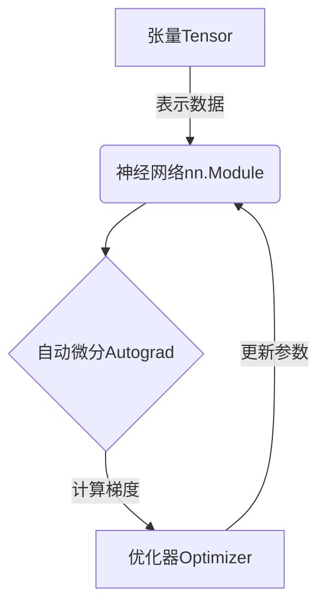

# PyTorch:简洁易用的深度学习框架实践指南

## 1.背景介绍

在过去几年中,深度学习已经在各个领域取得了令人瞩目的成就,从计算机视觉、自然语言处理到推荐系统等,深度学习模型展现出了强大的能力。作为一种端到端的机器学习方法,深度学习可以自动从原始数据中学习特征表示,而无需人工设计特征。这种自动化特征学习的能力使得深度学习在许多任务上超越了传统的机器学习算法。

PyTorch是一个基于Python的开源深度学习框架,由Facebook人工智能研究院(FAIR)开发和维护。它具有简洁易用的设计理念,强大的GPU加速能力,以及动态计算图的灵活性。PyTorch的出现为深度学习研究和应用提供了一个高效且易于上手的工具。

## 2.核心概念与联系

PyTorch的核心概念包括张量(Tensor)、自动微分(Autograd)、神经网络模块(nn.Module)和优化器(Optimizer)。这些概念相互关联,共同构建了PyTorch的深度学习框架。

### 2.1 张量(Tensor)

张量是PyTorch中重要的数据结构,它可以看作是一个多维数组或矩阵。张量支持GPU加速计算,可以大大提高深度学习模型的训练和推理速度。

### 2.2 自动微分(Autograd)

自动微分是PyTorch的一个核心特性,它可以自动计算张量的梯度,从而支持反向传播算法。这使得PyTorch可以轻松构建和训练深度神经网络。

### 2.3 神经网络模块(nn.Module)

PyTorch提供了一个模块化的神经网络实现方式,即nn.Module。开发者可以继承该基类并定义自己的网络层和前向传播逻辑。这种模块化设计使得构建和修改神经网络变得更加简单和灵活。

### 2.4 优化器(Optimizer)

优化器用于更新神经网络中的可训练参数,以最小化损失函数。PyTorch提供了多种优化算法的实现,如SGD、Adam等,方便开发者选择合适的优化策略。



## 3.核心算法原理具体操作步骤

PyTorch的核心算法原理包括前向传播、反向传播和参数更新三个步骤。

### 3.1 前向传播

前向传播是将输入数据通过神经网络进行计算,得到输出的过程。在PyTorch中,我们可以使用nn.Module定义网络结构,并实现forward()方法来描述前向传播逻辑。

```python
import torch.nn as nn

class MyModel(nn.Module):
    def __init__(self):
        super(MyModel, self).__init__()
        # 定义网络层
        ...

    def forward(self, x):
        # 前向传播逻辑
        ...
        return output
```

### 3.2 反向传播

反向传播是根据输出和目标值计算损失,并通过自动微分计算梯度的过程。PyTorch的autograd模块可以自动跟踪计算图,并在反向传播时计算梯度。

```python
import torch.nn.functional as F

# 前向传播
output = model(input)

# 计算损失
loss = F.cross_entropy(output, target)

# 反向传播
loss.backward()
```

### 3.3 参数更新

在计算出梯度后,我们可以使用优化器更新神经网络中的可训练参数。PyTorch提供了多种优化算法的实现,如SGD、Adam等。

```python
import torch.optim as optim

# 定义优化器
optimizer = optim.SGD(model.parameters(), lr=0.01)

# 更新参数
optimizer.step()

# 清空梯度
optimizer.zero_grad()
```

通过不断重复上述三个步骤,神经网络可以逐步优化参数,提高模型在训练数据上的性能。

## 4.数学模型和公式详细讲解举例说明

在深度学习中,常用的数学模型和公式包括:

### 4.1 线性模型

线性模型是深度学习中最基础的模型之一,它将输入特征进行线性组合,得到输出。线性模型的数学表达式如下:

$$
y = Wx + b
$$

其中,$ y $是输出,$ x $是输入特征向量,$ W $是权重矩阵,$ b $是偏置向量。

在PyTorch中,我们可以使用nn.Linear模块实现线性模型:

```python
import torch.nn as nn

# 定义线性模型
linear = nn.Linear(in_features=10, out_features=1)

# 前向传播
output = linear(input)
```

### 4.2 损失函数

损失函数用于衡量模型输出与目标值之间的差距。常用的损失函数包括均方误差(MSE)、交叉熵损失(Cross-Entropy Loss)等。

均方误差损失函数的数学表达式为:

$$
\text{MSE} = \frac{1}{n}\sum_{i=1}^{n}(y_i - \hat{y}_i)^2
$$

其中,$ y_i $是真实标签,$ \hat{y}_i $是模型预测值,$ n $是样本数量。

在PyTorch中,我们可以使用nn.functional.mse_loss计算均方误差损失:

```python
import torch.nn.functional as F

# 计算均方误差损失
loss = F.mse_loss(output, target)
```

### 4.3 优化算法

优化算法用于更新神经网络中的可训练参数,以最小化损失函数。常用的优化算法包括随机梯度下降(SGD)、Adam等。

SGD算法的更新规则为:

$$
w_{t+1} = w_t - \eta \frac{\partial L}{\partial w_t}
$$

其中,$ w_t $是当前时刻的参数,$ \eta $是学习率,$ \frac{\partial L}{\partial w_t} $是损失函数关于参数的梯度。

在PyTorch中,我们可以使用optim.SGD实现SGD优化器:

```python
import torch.optim as optim

# 定义优化器
optimizer = optim.SGD(model.parameters(), lr=0.01)

# 更新参数
optimizer.step()
```

通过对数学模型和公式的理解,我们可以更好地掌握深度学习的核心原理,并在PyTorch中进行实践和应用。

## 5.项目实践:代码实例和详细解释说明

为了更好地理解PyTorch的使用,我们将通过一个手写数字识别的实例项目进行实践。该项目使用MNIST数据集,并构建一个简单的卷积神经网络(CNN)进行训练和测试。

### 5.1 导入相关库

```python
import torch
import torch.nn as nn
import torch.optim as optim
import torchvision
import torchvision.transforms as transforms
```

### 5.2 加载数据集

```python
# 定义数据转换
transform = transforms.Compose([
    transforms.ToTensor(),
    transforms.Normalize((0.1307,), (0.3081,))
])

# 加载MNIST数据集
train_dataset = torchvision.datasets.MNIST(root='./data', train=True, download=True, transform=transform)
test_dataset = torchvision.datasets.MNIST(root='./data', train=False, download=True, transform=transform)

# 构建数据加载器
train_loader = torch.utils.data.DataLoader(train_dataset, batch_size=64, shuffle=True)
test_loader = torch.utils.data.DataLoader(test_dataset, batch_size=64, shuffle=False)
```

### 5.3 定义CNN模型

```python
class CNN(nn.Module):
    def __init__(self):
        super(CNN, self).__init__()
        self.conv1 = nn.Conv2d(1, 32, kernel_size=3, padding=1)
        self.pool = nn.MaxPool2d(2, 2)
        self.conv2 = nn.Conv2d(32, 64, kernel_size=3, padding=1)
        self.fc1 = nn.Linear(64 * 7 * 7, 128)
        self.fc2 = nn.Linear(128, 10)

    def forward(self, x):
        x = self.pool(nn.functional.relu(self.conv1(x)))
        x = self.pool(nn.functional.relu(self.conv2(x)))
        x = x.view(-1, 64 * 7 * 7)
        x = nn.functional.relu(self.fc1(x))
        x = self.fc2(x)
        return x

model = CNN()
```

### 5.4 定义损失函数和优化器

```python
criterion = nn.CrossEntropyLoss()
optimizer = optim.SGD(model.parameters(), lr=0.001, momentum=0.9)
```

### 5.5 训练模型

```python
num_epochs = 10

for epoch in range(num_epochs):
    running_loss = 0.0
    for i, data in enumerate(train_loader, 0):
        inputs, labels = data
        optimizer.zero_grad()

        outputs = model(inputs)
        loss = criterion(outputs, labels)
        loss.backward()
        optimizer.step()

        running_loss += loss.item()
        if i % 100 == 99:
            print('[%d, %5d] loss: %.3f' % (epoch + 1, i + 1, running_loss / 100))
            running_loss = 0.0

print('Finished Training')
```

### 5.6 测试模型

```python
correct = 0
total = 0
with torch.no_grad():
    for data in test_loader:
        images, labels = data
        outputs = model(images)
        _, predicted = torch.max(outputs.data, 1)
        total += labels.size(0)
        correct += (predicted == labels).sum().item()

print('Accuracy of the network on the 10000 test images: %d %%' % (100 * correct / total))
```

通过上述代码实例,我们可以更好地理解PyTorch在实际项目中的应用。代码中包含了数据加载、模型定义、训练和测试等关键步骤,并对每一步骤进行了详细的解释说明。

## 6.实际应用场景

PyTorch作为一个灵活且高效的深度学习框架,在各个领域都有广泛的应用。以下是一些典型的应用场景:

### 6.1 计算机视觉

计算机视觉是深度学习应用最为广泛的领域之一。PyTorch在图像分类、目标检测、语义分割等任务中发挥着重要作用。例如,在目标检测任务中,PyTorch可以方便地构建和训练YOLO、Faster R-CNN等经典模型。

### 6.2 自然语言处理

自然语言处理是另一个深度学习大显身手的领域。PyTorch可以用于构建各种NLP模型,如序列到序列模型(Seq2Seq)、transformer模型等。这些模型在机器翻译、文本生成、情感分析等任务中表现出色。

### 6.3 推荐系统

推荐系统是深度学习在工业界的重要应用之一。PyTorch可以用于构建协同过滤模型、深度因子分解机等推荐算法,为用户提供个性化的推荐服务。

### 6.4 生成对抗网络(GAN)

GAN是一种用于生成式建模的深度学习架构,它可以生成逼真的图像、音频和视频等数据。PyTorch提供了灵活的工具来构建和训练GAN模型,在图像生成、风格迁移等领域有着广泛的应用。

### 6.5 强化学习

强化学习是一种基于奖励信号的机器学习范式,它可以用于训练智能体与环境进行交互。PyTorch提供了强大的支持,可以方便地构建和训练强化学习算法,如深度Q网络(DQN)、策略梯度等。

总的来说,PyTorch的灵活性和高效性使其在各个领域都有着广泛的应用前景。无论是在学术研究还是工业实践中,PyTorch都是一个不可或缺的深度学习工具。

## 7.工具和资源推荐

为了更好地学习和使用PyTorch,以下是一些推荐的工具和资源:

### 7.1 PyTorch官方资源

- PyTorch官网(https://pytorch.org/): 提供了PyTorch的安装指南、教程、API文档等资源。
- PyTorch GitHub仓库(https://github.com/pytorch/pytorch): 可以查看PyTorch的源代码,提交issue和贡献代码。
- PyTorch论坛(https://discuss.pytorch.org/): 一个活跃的社区,可以提问、分享经验和获取帮助。

### 7.2 第三方教程和书籍

- PyTorch官方教程(https://pytorch.org/tutorials/): 涵盖了PyTorch的各个方面,从入门到进阶。
- "Deep Learning with PyTorch"(https://pytorch.org/assets/deep-learning/Deep-Learning-with-PyTorch.pdf): 一本免费的PyTorch入门书籍。
- "PyTorch Lightning"(https