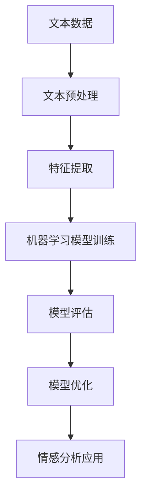

# Python机器学习实战：基于文本数据进行情感分析

## 1.背景介绍

在当今的数字时代，文本数据无处不在。从社交媒体上的评论和帖子,到客户评论和产品评论,再到新闻报道和文章,文本数据已经成为了一种重要的信息载体。然而,纯文本数据对于机器来说是难以理解和处理的。情感分析(Sentiment Analysis)作为一种自然语言处理(NLP)技术,旨在从文本数据中提取主观信息,如观点、情绪、态度等,为各种应用场景提供有价值的见解。

Python作为一种流行的编程语言,结合了强大的机器学习库和自然语言处理工具,为基于文本数据进行情感分析提供了一个完整的解决方案。本文将深入探讨如何利用Python进行情感分析,包括数据预处理、特征提取、模型构建和评估等关键步骤,并介绍一些实际应用场景。

## 2.核心概念与联系

在开始之前,我们需要了解一些核心概念和它们之间的联系。

### 2.1 自然语言处理(NLP)

自然语言处理(NLP)是一门研究计算机处理人类语言的学科,旨在使计算机能够理解和生成人类可以理解的语言。NLP包括多个子领域,如语音识别、机器翻译、文本挖掘、问答系统等。情感分析是NLP的一个重要分支,专注于从文本数据中提取主观信息。

### 2.2 文本预处理

文本预处理是情感分析的第一步,包括数据清洗、标记化(tokenization)、去除停用词(stop words removal)、词干提取(stemming)和词形还原(lemmatization)等步骤。这些步骤有助于将原始文本数据转换为可供机器学习模型处理的格式。

### 2.3 特征提取

特征提取是将文本数据转换为机器可理解的数值向量表示的过程。常用的特征提取方法包括词袋模型(Bag-of-Words)、TF-IDF(Term Frequency-Inverse Document Frequency)和Word Embedding(词嵌入)等。

### 2.4 机器学习模型

情感分析通常被视为一个监督学习问题,需要使用标记数据(如正面、负面或中性评论)来训练机器学习模型。常用的模型包括朴素贝叶斯、支持向量机(SVM)、逻辑回归、决策树和深度学习模型等。

### 2.5 模型评估

为了评估模型的性能,我们需要使用一些评估指标,如准确率(Accuracy)、精确率(Precision)、召回率(Recall)和F1分数等。这些指标可以帮助我们了解模型的优缺点,并进行相应的调整和优化。

## 3.核心算法原理具体操作步骤

情感分析的核心算法原理包括以下几个步骤:

### 3.1 文本预处理

文本预处理是情感分析的第一步,包括以下步骤:

1. **数据清洗**: 去除文本中的HTML标签、URL链接、特殊字符等无用信息。
2. **标记化(Tokenization)**: 将文本分割成单词、短语或符号序列,这是后续处理的基础。
3. **去除停用词(Stop Words Removal)**: 移除一些高频但无实际意义的词,如"the"、"a"、"is"等。
4. **词干提取(Stemming)**: 将单词还原为词根形式,如"playing"变为"play"。
5. **词形还原(Lemmatization)**: 将单词还原为词典中的基本形式,如"better"变为"good"。

这些步骤可以使用Python中的NLTK、spaCy等库来实现。

### 3.2 特征提取

特征提取是将文本数据转换为机器可理解的数值向量表示的过程。常用的特征提取方法包括:

1. **词袋模型(Bag-of-Words)**: 将文本表示为一个向量,每个维度对应一个单词,值为该单词在文本中出现的次数。
2. **TF-IDF(Term Frequency-Inverse Document Frequency)**: 在词袋模型的基础上,对单词进行加权,降低常见词的权重,提高稀有词的权重。
3. **Word Embedding(词嵌入)**: 将单词映射到一个低维的连续向量空间,保留单词之间的语义关系。常用的词嵌入方法有Word2Vec、GloVe等。

这些特征提取方法可以使用Python中的scikit-learn、gensim等库来实现。

### 3.3 机器学习模型训练

在获得特征向量表示后,我们可以使用各种机器学习算法来训练情感分析模型。常用的模型包括:

1. **朴素贝叶斯(Naive Bayes)**: 基于贝叶斯定理,计算每个特征对类别的影响,简单高效。
2. **支持向量机(SVM)**: 寻找最优超平面将不同类别的样本分开,具有良好的泛化能力。
3. **逻辑回归(Logistic Regression)**: 通过对数几率回归,预测样本属于某个类别的概率。
4. **决策树(Decision Tree)**: 根据特征值构建决策树,进行分类或回归。
5. **深度学习模型**: 如循环神经网络(RNN)、长短期记忆网络(LSTM)、卷积神经网络(CNN)等,能够自动学习文本的高阶特征表示。

这些模型可以使用Python中的scikit-learn、Keras、PyTorch等库来实现。

### 3.4 模型评估

为了评估模型的性能,我们需要使用一些评估指标,如:

1. **准确率(Accuracy)**: 正确预测的样本数占总样本数的比例。
2. **精确率(Precision)**: 被预测为正例的样本中真正为正例的比例。
3. **召回率(Recall)**: 真正为正例的样本中被正确预测为正例的比例。
4. **F1分数**: 精确率和召回率的调和平均值。

根据评估结果,我们可以对模型进行优化,如调整超参数、增加训练数据、特征工程等。

### 3.5 模型优化

模型优化是一个迭代的过程,包括以下步骤:

1. **超参数调优**: 通过网格搜索、随机搜索等方法,找到最优的模型超参数组合。
2. **特征工程**: 探索新的特征提取方法,或组合现有特征,以提高模型性能。
3. **集成学习**: 将多个模型组合起来,如投票集成、堆叠集成等,以获得更好的性能。
4. **迁移学习**: 利用在大型语料库上预训练的模型,如BERT、GPT等,进行微调和迁移。
5. **数据增强**: 通过数据扩增、噪声注入等方法,增加训练数据的多样性。

## 4.数学模型和公式详细讲解举例说明

在情感分析中,常用的数学模型和公式包括:

### 4.1 词袋模型(Bag-of-Words)

词袋模型是一种简单但有效的文本表示方法。给定一个文档$d$和词汇表$V$,词袋模型将文档$d$表示为一个向量$\vec{x} = (x_1, x_2, \ldots, x_{|V|})$,其中$x_i$表示词汇$w_i$在文档$d$中出现的次数。

$$\vec{x} = (x_1, x_2, \ldots, x_{|V|})$$

其中,
- $x_i$ 表示词汇 $w_i$ 在文档 $d$ 中出现的次数
- $|V|$ 表示词汇表的大小

例如,对于一个文档"I love this movie",假设词汇表为$V = \{$"I", "love", "this", "movie"$\}$,则其词袋模型向量表示为$(1, 1, 1, 1)$。

### 4.2 TF-IDF(Term Frequency-Inverse Document Frequency)

TF-IDF是一种常用的特征加权方法,它通过降低常见词的权重,提高稀有词的权重,来提高特征的区分能力。

对于一个词汇$w$和文档$d$,TF-IDF权重计算公式如下:

$$\text{tfidf}(w, d) = \text{tf}(w, d) \times \text{idf}(w)$$

其中,
- $\text{tf}(w, d)$ 表示词频(Term Frequency),即词汇 $w$ 在文档 $d$ 中出现的次数
- $\text{idf}(w)$ 表示逆向文档频率(Inverse Document Frequency),计算公式为:

$$\text{idf}(w) = \log \frac{N}{\text{df}(w)}$$

其中,
- $N$ 表示语料库中文档的总数
- $\text{df}(w)$ 表示包含词汇 $w$ 的文档数量

TF-IDF的直观解释是:如果一个词在当前文档中出现频率很高(高TF),但在整个语料库中很少出现(高IDF),那么这个词对于当前文档来说就很有区分能力,应该赋予更高的权重。

### 4.3 朴素贝叶斯分类器

朴素贝叶斯分类器是一种基于贝叶斯定理的简单但有效的分类算法。它假设每个特征之间是相互独立的,即:

$$P(x_1, x_2, \ldots, x_n | y) = P(x_1 | y) \times P(x_2 | y) \times \ldots \times P(x_n | y)$$

其中,
- $x_1, x_2, \ldots, x_n$ 表示特征向量
- $y$ 表示类别标签

根据贝叶斯定理,我们可以计算出后验概率:

$$P(y | x_1, x_2, \ldots, x_n) = \frac{P(x_1, x_2, \ldots, x_n | y) P(y)}{P(x_1, x_2, \ldots, x_n)}$$

由于分母对于所有类别是相同的,因此我们只需要最大化分子部分:

$$\hat{y} = \arg\max_y P(x_1, x_2, \ldots, x_n | y) P(y)$$

在训练阶段,我们需要从训练数据中估计各个条件概率$P(x_i | y)$和先验概率$P(y)$。在预测阶段,我们将输入特征向量代入上式,选择最大化后验概率的类别作为预测结果。

朴素贝叶斯分类器的优点是简单、高效,但它的独立性假设在实际应用中可能不总是成立。

### 4.4 逻辑回归

逻辑回归是一种广泛应用于分类问题的机器学习算法。它通过对数几率回归,预测样本属于某个类别的概率。

对于二分类问题,逻辑回归模型可以表示为:

$$P(y=1 | \vec{x}) = \sigma(\vec{w}^T \vec{x} + b)$$

其中,
- $\vec{x}$ 表示特征向量
- $\vec{w}$ 表示权重向量
- $b$ 表示偏置项
- $\sigma(z)$ 表示sigmoid函数,定义为:

$$\sigma(z) = \frac{1}{1 + e^{-z}}$$

sigmoid函数的作用是将线性函数的输出值映射到(0, 1)区间,可以解释为样本属于正例的概率。

在训练阶段,我们需要通过最大似然估计或最大后验概率估计来求解参数$\vec{w}$和$b$,常用的优化算法包括梯度下降、L-BFGS等。在预测阶段,我们将输入特征向量代入模型,输出大于0.5的被预测为正例,否则为负例。

逻辑回归的优点是简单、可解释性强,缺点是对于线性不可分的数据,性能可能不佳。

### 4.5 支持向量机(SVM)

支持向量机(SVM)是一种有监督的机器学习算法,常用于分类和回归问题。它的基本思想是找到一个最优超平面,将不同类别的样本分开,并使得距离超平面最近的样本点与超平面之间的距离最大化。

对于线性可分的二分类问题,SVM的目标函数可以表示为:

$$\begin{aligned}
&\min_{\vec{w}, b} \frac{1{"msg_type":"generate_answer_finish","data":"","from_module":null,"from_unit":null}