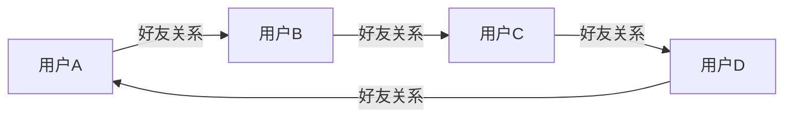

# Python机器学习实战：实战图神经网络(GNN)在社交网络分析中的应用

## 1.背景介绍

### 1.1 社交网络分析的重要性

在当今时代,社交网络已经成为人们日常生活的重要组成部分。无论是Facebook、Twitter还是微信、微博,人们都通过这些平台与亲朋好友保持联系、分享生活点滴。随着社交网络用户数量的不断增长,社交网络中蕴含着大量有价值的数据,对这些数据进行分析和挖掘可以为企业、政府等机构提供宝贵的见解。

社交网络分析可以帮助企业更好地了解客户需求,优化营销策略。政府机构可以通过社交网络分析监测舆情,制定更有针对性的政策。此外,社交网络分析在反恐防范、犯罪侦查等领域也有着广泛的应用。因此,社交网络分析已成为当前研究的热点领域之一。

### 1.2 传统机器学习方法的局限性

传统的机器学习方法,如逻辑回归、决策树等,主要针对结构化数据进行建模和预测。然而,社交网络数据具有复杂的网络结构特征,单纯依赖节点属性无法很好地捕捉网络拓扑结构信息。因此,传统机器学习方法在处理社交网络数据时存在一定局限性。

为了更好地利用社交网络数据中蕴含的丰富信息,需要一种新的机器学习范式来同时考虑节点属性和网络拓扑结构。图神经网络(Graph Neural Network, GNN)作为一种新兴的深度学习模型,可以很好地解决这一问题。

## 2.核心概念与联系

### 2.1 图数据结构

在介绍图神经网络之前,我们首先需要了解图(Graph)这一数据结构。图是由节点(Node)和边(Edge)组成的非线性数据结构,可以用于描述复杂的关系网络。

在社交网络中,每个用户可以看作是一个节点,用户之间的关系(如好友关系)则对应着连接两个节点的边。除了用户关系网络,图数据结构还可以用于表示其他类型的关系网络,如知识图谱、分子结构、交通网络等。

### 2.2 图神经网络概述

图神经网络(GNN)是一种专门为处理图结构数据而设计的深度学习模型。与传统的卷积神经网络(CNN)和递归神经网络(RNN)不同,GNN可以直接在图数据上进行端到端的训练,同时利用节点属性和网络拓扑结构信息。

GNN的核心思想是通过迭代更新的方式,将每个节点的表示向量与其邻居节点的表示向量进行聚合,从而捕捉节点及其邻域的结构信息。经过多次迭代后,每个节点的表示向量就会包含全局的网络拓扑结构信息。

GNN已经在节点分类、链接预测、图生成等任务中取得了优异的表现,在社交网络分析领域也有着广泛的应用前景。

## 3.核心算法原理具体操作步骤

### 3.1 图神经网络基本原理

图神经网络的基本思想是通过迭代的方式更新每个节点的表示向量,使其不仅包含节点自身的属性信息,还包含网络拓扑结构信息。具体来说,每一次迭代包括以下两个步骤:

1. **邻居聚合(Neighbor Aggregation)**: 对于每个节点,将其邻居节点的表示向量进行聚合,得到一个邻居信息向量。

2. **节点更新(Node Update)**: 将节点自身的表示向量与邻居信息向量进行组合,通过一个神经网络层进行非线性变换,得到该节点的新表示向量。

经过多次迭代后,每个节点的表示向量就会包含全局的网络拓扑结构信息。

### 3.2 图卷积神经网络(GCN)

图卷积神经网络(Graph Convolutional Network, GCN)是一种较为经典的图神经网络模型,其核心思想是通过"卷积"操作来实现邻居聚合和节点更新。

具体来说,在第 $k$ 层,节点 $v$ 的表示向量 $\mathbf{h}_v^{(k)}$ 由以下公式计算:

$$\mathbf{h}_v^{(k)} = \sigma\left(\sum_{u \in \mathcal{N}(v)} \frac{1}{c_{v,u}} \mathbf{W}^{(k)} \mathbf{h}_u^{(k-1)}\right)$$

其中:

- $\mathcal{N}(v)$ 表示节点 $v$ 的邻居节点集合
- $c_{v,u}$ 是一个归一化常数,用于防止梯度爆炸或消失
- $\mathbf{W}^{(k)}$ 是第 $k$ 层的可训练权重矩阵
- $\sigma$ 是一个非线性激活函数,如 ReLU

经过 $K$ 层卷积操作后,每个节点的表示向量 $\mathbf{h}_v^{(K)}$ 就包含了来自 $K$ 阶邻域的网络结构信息。

### 3.3 图注意力网络(GAT)

图注意力网络(Graph Attention Network, GAT)是另一种流行的图神经网络模型,它引入了注意力机制来学习不同邻居节点的重要性权重。

在 GAT 中,节点 $v$ 的表示向量 $\mathbf{h}_v^{(k)}$ 由以下公式计算:

$$\mathbf{h}_v^{(k)} = \sigma\left(\sum_{u \in \mathcal{N}(v)} \alpha_{v,u}^{(k)} \mathbf{W}^{(k)} \mathbf{h}_u^{(k-1)}\right)$$

其中,注意力系数 $\alpha_{v,u}^{(k)}$ 用于衡量邻居节点 $u$ 对于节点 $v$ 的重要性,由以下公式计算:

$$\alpha_{v,u}^{(k)} = \frac{\exp\left(\mathrm{LeakyReLU}\left(\mathbf{a}^{(k)\top}[\mathbf{W}^{(k)}\mathbf{h}_v^{(k-1)} \| \mathbf{W}^{(k)}\mathbf{h}_u^{(k-1)}]\right)\right)}{\sum_{k \in \mathcal{N}(v)} \exp\left(\mathrm{LeakyReLU}\left(\mathbf{a}^{(k)\top}[\mathbf{W}^{(k)}\mathbf{h}_v^{(k-1)} \| \mathbf{W}^{(k)}\mathbf{h}_k^{(k-1)}]\right)\right)}$$

通过引入注意力机制,GAT 可以自适应地学习不同邻居节点对目标节点的贡献程度,从而提高模型的表现。

## 4.数学模型和公式详细讲解举例说明

在上一节中,我们介绍了图卷积神经网络(GCN)和图注意力网络(GAT)的核心公式。现在,让我们通过一个具体的例子来进一步理解这些公式的含义。

假设我们有一个简单的社交网络,包含4个节点和4条边,如下图所示:

现在,我们希望使用GCN或GAT来学习每个节点的表示向量,以便进行下游任务(如节点分类、链接预测等)。

### 4.1 GCN公式解释

对于GCN模型,我们需要初始化每个节点的表示向量 $\mathbf{h}_v^{(0)}$,通常使用节点的原始属性特征(如用户资料信息)。然后,在第一层卷积操作中,节点A的表示向量 $\mathbf{h}_A^{(1)}$ 由以下公式计算:

$$\mathbf{h}_A^{(1)} = \sigma\left(\frac{1}{2} \mathbf{W}^{(1)} \mathbf{h}_A^{(0)} + \frac{1}{2} \mathbf{W}^{(1)} \mathbf{h}_D^{(0)}\right)$$

其中,我们将节点A的邻居节点集合 $\mathcal{N}(A) = \{B, D\}$ 中的节点表示向量 $\mathbf{h}_B^{(0)}$ 和 $\mathbf{h}_D^{(0)}$ 进行了平均聚合,并与节点A自身的表示向量 $\mathbf{h}_A^{(0)}$ 组合,通过一个可训练的权重矩阵 $\mathbf{W}^{(1)}$ 和非线性激活函数 $\sigma$ 进行变换,得到了节点A的新表示向量 $\mathbf{h}_A^{(1)}$。

对于其他节点,计算方式类似。经过多层卷积操作后,每个节点的表示向量就包含了来自更大邻域范围的网络结构信息。

### 4.2 GAT公式解释

对于GAT模型,我们同样需要初始化每个节点的表示向量 $\mathbf{h}_v^{(0)}$。在第一层注意力操作中,节点A的表示向量 $\mathbf{h}_A^{(1)}$ 由以下公式计算:

$$\mathbf{h}_A^{(1)} = \sigma\left(\alpha_{A,B}^{(1)} \mathbf{W}^{(1)} \mathbf{h}_B^{(0)} + \alpha_{A,D}^{(1)} \mathbf{W}^{(1)} \mathbf{h}_D^{(0)}\right)$$

其中,注意力系数 $\alpha_{A,B}^{(1)}$ 和 $\alpha_{A,D}^{(1)}$ 分别表示邻居节点B和D对于节点A的重要性权重,由以下公式计算:

$$\alpha_{A,B}^{(1)} = \frac{\exp\left(\mathrm{LeakyReLU}\left(\mathbf{a}^{(1)\top}[\mathbf{W}^{(1)}\mathbf{h}_A^{(0)} \| \mathbf{W}^{(1)}\mathbf{h}_B^{(0)}]\right)\right)}{\exp\left(\mathrm{LeakyReLU}\left(\mathbf{a}^{(1)\top}[\mathbf{W}^{(1)}\mathbf{h}_A^{(0)} \| \mathbf{W}^{(1)}\mathbf{h}_B^{(0)}]\right)\right) + \exp\left(\mathrm{LeakyReLU}\left(\mathbf{a}^{(1)\top}[\mathbf{W}^{(1)}\mathbf{h}_A^{(0)} \| \mathbf{W}^{(1)}\mathbf{h}_D^{(0)}]\right)\right)}$$

$$\alpha_{A,D}^{(1)} = \frac{\exp\left(\mathrm{LeakyReLU}\left(\mathbf{a}^{(1)\top}[\mathbf{W}^{(1)}\mathbf{h}_A^{(0)} \| \mathbf{W}^{(1)}\mathbf{h}_D^{(0)}]\right)\right)}{\exp\left(\mathrm{LeakyReLU}\left(\mathbf{a}^{(1)\top}[\mathbf{W}^{(1)}\mathbf{h}_A^{(0)} \| \mathbf{W}^{(1)}\mathbf{h}_B^{(0)}]\right)\right) + \exp\left(\mathrm{LeakyReLU}\left(\mathbf{a}^{(1)\top}[\mathbf{W}^{(1)}\mathbf{h}_A^{(0)} \| \mathbf{W}^{(1)}\mathbf{h}_D^{(0)}]\right)\right)}$$

在这里,我们使用了一个可训练的注意力向量 $\mathbf{a}^{(1)}$ 来计算注意力分数,并通过 Softmax 函数将其归一化为注意力系数。

通过引入注意力机制,GAT 可以自适应地学习不同邻居节点对目标节点的贡献程度,从而提高模型的表现。

## 5.项目实践：代码实例和详细解释说明

在理解了图神经网络的基本原理之后,让我们通过一个实际的代码示例来进一步加深理解。在这个示例中,我们将使用 PyTorch Geometric 库来构建和训练一