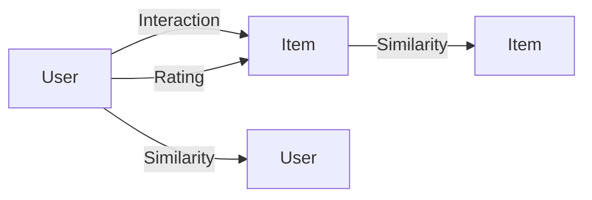

# Python机器学习实战：推荐系统的原理与实现方法

## 1. 背景介绍

### 1.1 推荐系统概述
推荐系统是一种信息过滤系统，旨在预测用户对某个物品或信息的"评分"或"偏好"。它可以帮助用户从海量的信息中发现感兴趣的内容，提高用户的满意度和忠诚度。推荐系统已经广泛应用于电子商务、社交网络、视频网站、新闻门户等领域。

### 1.2 推荐系统的发展历程
推荐系统的研究始于20世纪90年代中期。1997年，Resnick和Varian在《Communications of the ACM》上发表了一篇题为"Recommender Systems"的论文，标志着推荐系统研究的正式开始。此后，推荐系统迅速成为学术界和工业界的研究热点，涌现出了大量的研究成果和实际应用。

### 1.3 推荐系统面临的挑战
尽管推荐系统取得了长足的进步，但仍然面临着诸多挑战，如数据稀疏性、冷启动问题、扩展性问题、实时性问题等。此外，推荐系统还需要考虑用户隐私保护、推荐的多样性和新颖性等问题。

## 2. 核心概念与联系

### 2.1 用户(User)
在推荐系统中，用户是指使用推荐系统的个人或实体。每个用户都有自己的偏好、需求和行为特征。推荐系统需要通过分析用户的历史行为数据，来推断用户的兴趣和偏好。

### 2.2 物品(Item) 
物品是指推荐系统中的推荐对象，可以是商品、电影、音乐、新闻等。每个物品都有自己的属性和特征，如类别、关键词、评分等。推荐系统需要分析物品的属性和用户的行为，来预测用户对物品的喜好程度。

### 2.3 用户-物品交互(User-Item Interaction)
用户-物品交互是指用户对物品的行为，如购买、点击、评分、收藏等。这些交互数据反映了用户对物品的兴趣和偏好。推荐系统通过分析用户-物品交互数据，来构建用户和物品的特征表示，并预测用户对未知物品的兴趣。

### 2.4 相似度(Similarity)
相似度是指两个对象之间的相似程度。在推荐系统中，相似度可以用于度量用户之间或物品之间的相似性。常见的相似度度量方法有余弦相似度、皮尔逊相关系数等。通过计算用户或物品之间的相似度，推荐系统可以找到相似的用户或物品，从而生成推荐。

### 2.5 评分(Rating)
评分是指用户对物品的喜好程度的数值表示，通常是一个离散的数值，如1-5星。显式评分由用户直接给出，隐式评分则从用户的行为中推断得出，如购买、点击等。推荐系统通过分析用户的评分数据，来预测用户对未知物品的评分。

### 2.6 核心概念之间的联系
下图展示了推荐系统中核心概念之间的联系：



用户通过与物品的交互，表达了对物品的兴趣。用户之间和物品之间可以计算相似度。用户对物品的评分，反映了用户的偏好。推荐系统通过分析这些数据，来预测用户对未知物品的兴趣，并生成个性化推荐。

## 3. 核心算法原理具体操作步骤

### 3.1 协同过滤算法(Collaborative Filtering)

#### 3.1.1 基于用户的协同过滤(User-based CF)
1. 计算用户之间的相似度矩阵
2. 根据相似度矩阵，找到与目标用户最相似的K个用户 
3. 根据相似用户对物品的评分，预测目标用户对物品的评分
4. 根据预测评分，生成推荐列表

#### 3.1.2 基于物品的协同过滤(Item-based CF) 
1. 计算物品之间的相似度矩阵
2. 根据用户的历史评分，找到用户喜欢的物品
3. 根据物品相似度矩阵，找到与用户喜欢物品最相似的K个物品
4. 根据相似物品的评分，预测用户对候选物品的评分
5. 根据预测评分，生成推荐列表

### 3.2 矩阵分解算法(Matrix Factorization)

#### 3.2.1 奇异值分解(SVD)
1. 构建用户-物品评分矩阵R
2. 对矩阵R进行奇异值分解，得到 U, S, V 矩阵
3. 选择合适的维度k，得到降维后的 U_k, S_k, V_k 矩阵
4. 根据 U_k, S_k, V_k 矩阵，预测用户对物品的评分
5. 根据预测评分，生成推荐列表

#### 3.2.2 非负矩阵分解(NMF)
1. 构建用户-物品评分矩阵R
2. 随机初始化非负矩阵 W 和 H
3. 通过最小化损失函数，迭代更新 W 和 H 矩阵
4. 根据 W 和 H 矩阵，预测用户对物品的评分
5. 根据预测评分，生成推荐列表

### 3.3 基于内容的推荐算法(Content-based Recommendation)
1. 提取物品的内容特征，如关键词、类别等
2. 根据用户的历史行为，构建用户的偏好特征
3. 计算候选物品的特征与用户偏好特征的相似度
4. 根据相似度，生成推荐列表

### 3.4 组合推荐算法(Hybrid Recommendation)
1. 分别使用不同的推荐算法，如协同过滤、矩阵分解、基于内容的推荐等，生成初步的推荐列表
2. 根据不同算法的推荐结果，设计合适的组合策略，如加权平均、排序组合等
3. 将不同算法的推荐结果组合，生成最终的推荐列表

## 4. 数学模型和公式详细讲解举例说明

### 4.1 协同过滤算法

#### 4.1.1 基于用户的协同过滤
用户之间的相似度可以用余弦相似度来计算：

$$
sim(u,v) = \frac{\sum_{i \in I_{uv}} r_{ui} r_{vi}}{\sqrt{\sum_{i \in I_u} r_{ui}^2} \sqrt{\sum_{i \in I_v} r_{vi}^2}}
$$

其中，$I_{uv}$ 表示用户 u 和用户 v 都评分过的物品集合，$r_{ui}$ 表示用户 u 对物品 i 的评分。

预测用户 u 对物品 i 的评分可以用下式计算：

$$
\hat{r}_{ui} = \bar{r}_u + \frac{\sum_{v \in N_u} sim(u,v) (r_{vi} - \bar{r}_v)}{\sum_{v \in N_u} |sim(u,v)|}
$$

其中，$N_u$ 表示与用户 u 最相似的K个用户，$\bar{r}_u$ 表示用户 u 的平均评分。

#### 4.1.2 基于物品的协同过滤
物品之间的相似度可以用余弦相似度来计算：

$$
sim(i,j) = \frac{\sum_{u \in U_{ij}} r_{ui} r_{uj}}{\sqrt{\sum_{u \in U_i} r_{ui}^2} \sqrt{\sum_{u \in U_j} r_{uj}^2}}
$$

其中，$U_{ij}$ 表示对物品 i 和物品 j 都评分过的用户集合，$r_{ui}$ 表示用户 u 对物品 i 的评分。

预测用户 u 对物品 i 的评分可以用下式计算：

$$
\hat{r}_{ui} = \frac{\sum_{j \in N_i} sim(i,j) r_{uj}}{\sum_{j \in N_i} |sim(i,j)|}
$$

其中，$N_i$ 表示与物品 i 最相似的K个物品。

### 4.2 矩阵分解算法

#### 4.2.1 奇异值分解
对用户-物品评分矩阵 R 进行奇异值分解：

$$
R = U S V^T
$$

其中，U 和 V 是正交矩阵，S 是对角矩阵。选择合适的维度 k，得到降维后的矩阵：

$$
R_k = U_k S_k V_k^T
$$

预测用户 u 对物品 i 的评分可以用下式计算：

$$
\hat{r}_{ui} = U_k(u) S_k V_k(i)^T
$$

其中，$U_k(u)$ 表示矩阵 $U_k$ 的第 u 行，$V_k(i)$ 表示矩阵 $V_k$ 的第 i 列。

#### 4.2.2 非负矩阵分解
对用户-物品评分矩阵 R 进行非负矩阵分解：

$$
R \approx WH
$$

其中，W 和 H 都是非负矩阵。通过最小化损失函数，迭代更新 W 和 H 矩阵：

$$
\min_{W,H} \|R - WH\|_F^2 \quad s.t. \quad W \geq 0, H \geq 0
$$

预测用户 u 对物品 i 的评分可以用下式计算：

$$
\hat{r}_{ui} = W(u) H(i)^T
$$

其中，$W(u)$ 表示矩阵 W 的第 u 行，$H(i)$ 表示矩阵 H 的第 i 列。

## 5. 项目实践：代码实例和详细解释说明

下面以基于用户的协同过滤算法为例，给出Python代码实现：

```python
import numpy as np

# 计算用户之间的相似度矩阵
def user_similarity(rating_matrix):
    user_num = rating_matrix.shape[0]
    similarity_matrix = np.zeros((user_num, user_num))
    for i in range(user_num):
        for j in range(i+1, user_num):
            rated_items = np.nonzero(rating_matrix[i] * rating_matrix[j])[0]
            if len(rated_items) == 0:
                similarity_matrix[i][j] = 0
            else:
                similarity_matrix[i][j] = np.dot(rating_matrix[i, rated_items], rating_matrix[j, rated_items]) / (np.linalg.norm(rating_matrix[i, rated_items]) * np.linalg.norm(rating_matrix[j, rated_items]))
            similarity_matrix[j][i] = similarity_matrix[i][j]
    return similarity_matrix

# 预测用户对物品的评分
def user_based_cf(rating_matrix, similarity_matrix, user_id, item_id, k):
    user_mean = np.mean(rating_matrix[user_id, np.nonzero(rating_matrix[user_id])])
    similar_users = np.argsort(similarity_matrix[user_id])[-k-1:-1]
    weighted_sum = np.sum(similarity_matrix[user_id][similar_users] * (rating_matrix[similar_users, item_id] - np.mean(rating_matrix[similar_users], axis=1)))
    similarity_sum = np.sum(np.abs(similarity_matrix[user_id][similar_users]))
    if similarity_sum == 0:
        return user_mean
    else:
        return user_mean + weighted_sum / similarity_sum

# 生成推荐列表
def recommend(rating_matrix, similarity_matrix, user_id, k, n):
    unrated_items = np.where(rating_matrix[user_id] == 0)[0]
    predicted_ratings = []
    for item_id in unrated_items:
        predicted_ratings.append((item_id, user_based_cf(rating_matrix, similarity_matrix, user_id, item_id, k)))
    return sorted(predicted_ratings, key=lambda x: x[1], reverse=True)[:n]
```

代码解释：

1. `user_similarity` 函数用于计算用户之间的相似度矩阵。它遍历所有用户对，计算两个用户共同评分过的物品，并用余弦相似度计算相似度。

2. `user_based_cf` 函数用于预测用户对物品的评分。它首先计算用户的平均评分，然后找到与目标用户最相似的 k 个用户，根据相似用户对物品的评分和相似度，计算加权平均值，并加上用户的平均评分作为预测评分。

3. `recommend` 函数用于生成推荐列表。它找到用户未评分过的物品，对每个物品预测用户的评分，然后按预