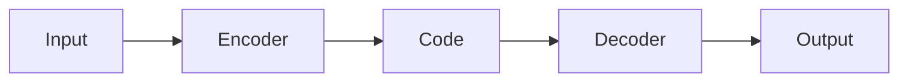

以下是对《Python机器学习实战：自编码器(Autoencoders)在数据压缩中的实践》这一主题的详细解读和分析。

# Python机器学习实战：自编码器(Autoencoders)在数据压缩中的实践

## 1.背景介绍

### 1.1 数据压缩的重要性

在当今大数据时代,海量数据的存储和传输是一个巨大的挑战。有效的数据压缩技术可以极大地减小数据体积,从而节省存储空间、提高传输效率。数据压缩在多媒体文件、数据库、网络通信等诸多领域都有广泛应用。

### 1.2 传统数据压缩算法的局限性 

传统的数据压缩算法如哈夫曼编码、算术编码等,虽然在特定场景下表现良好,但缺乏通用性和自适应能力。这些算法往往基于人工设计的规则,难以充分挖掘数据内在的统计规律,压缩效果并不理想。

### 1.3 自编码器在数据压缩中的潜力

自编码器(Autoencoder)是一种无监督学习的人工神经网络,能够从数据中自动学习出高效的数据编码表示。通过训练自编码器网络对数据进行高效编码和解码,可实现出色的数据压缩效果,展现了在数据压缩领域的巨大潜力。

## 2.核心概念与联系

### 2.1 自编码器的基本原理

自编码器由两部分组成:编码器(Encoder)和解码器(Decoder)。编码器将输入数据压缩为低维的编码表示,解码器则尝试从这个编码中重建原始输入数据。通过最小化输入数据与重建数据之间的差异作为训练目标,自编码器可以学习到高效的数据编码表示。



### 2.2 自编码器与传统压缩算法的区别

传统压缩算法基于人工设计的规则,而自编码器则通过机器学习自动发现数据的内在规律。自编码器具有更强的自适应能力,能够针对不同类型的数据学习出高效的编码表示。此外,自编码器的编码解码过程可并行化,更适合现代硬件加速。

### 2.3 自编码器的主要变种

根据编码器和解码器的网络结构不同,自编码器有多种变种,包括:

- 稀疏自编码器(Sparse Autoencoder):引入稀疏性约束,学习稀疏编码表示。
- 去噪自编码器(Denoising Autoencoder):能够从含噪数据中学习出鲁棒的编码表示。
- 变分自编码器(Variational Autoencoder):将编码过程建模为概率分布,支持从隐空间采样生成新数据。

## 3.核心算法原理具体操作步骤

### 3.1 自编码器的网络结构

自编码器通常由全连接的前馈神经网络构成。编码器将输入数据 $\boldsymbol{x}$ 映射为低维编码 $\boldsymbol{z}$,解码器则将编码 $\boldsymbol{z}$ 映射回重建数据 $\boldsymbol{\hat{x}}$:

$$\boldsymbol{z} = f_\theta(\boldsymbol{x}) = \sigma(W_e\boldsymbol{x} + \boldsymbol{b}_e)$$
$$\boldsymbol{\hat{x}} = g_\phi(\boldsymbol{z}) = \sigma(W_d\boldsymbol{z} + \boldsymbol{b}_d)$$

其中 $f_\theta$ 和 $g_\phi$ 分别表示编码器和解码器的网络函数,带有可学习参数 $\theta$ 和 $\phi$。$\sigma$ 为非线性激活函数,如 ReLU 或 Sigmoid。

### 3.2 训练目标与优化

自编码器的训练目标是最小化输入数据 $\boldsymbol{x}$ 与重建数据 $\boldsymbol{\hat{x}}$ 之间的重构误差,通常使用均方误差(MSE)作为损失函数:

$$\mathcal{L}(\boldsymbol{x}, \boldsymbol{\hat{x}}) = \|\boldsymbol{x} - \boldsymbol{\hat{x}}\|_2^2$$

通过梯度下降等优化算法,自编码器可以学习到最小化重构误差的编码器和解码器参数 $\theta$ 和 $\phi$。

### 3.3 编码与解码过程

训练完成后,我们可以使用编码器 $f_\theta$ 对新的输入数据 $\boldsymbol{x}$ 进行编码,得到低维编码 $\boldsymbol{z}$。解码器 $g_\phi$ 则可以从编码 $\boldsymbol{z}$ 重建出原始数据的近似值 $\boldsymbol{\hat{x}}$:


编码 $\boldsymbol{z}$ 的维度远小于原始输入数据 $\boldsymbol{x}$,因此可以作为高效的数据压缩表示进行存储和传输。

## 4.数学模型和公式详细讲解举例说明

### 4.1 稀疏自编码器

稀疏自编码器通过在损失函数中引入稀疏性正则项,约束编码 $\boldsymbol{z}$ 的稀疏性,从而学习到更加紧凑的数据表示。其损失函数为:

$$\mathcal{L}(\boldsymbol{x}, \boldsymbol{\hat{x}}) = \|\boldsymbol{x} - \boldsymbol{\hat{x}}\|_2^2 + \lambda\sum_j\text{KL}(\rho\|\hat{\rho}_j)$$

其中第二项为 KL 散度,用于约束编码 $\boldsymbol{z}$ 中每个元素的平均活跃度(即非零比例)接近于期望的稀疏度 $\rho$。$\lambda$ 为权重系数,控制稀疏性的程度。

例如,对于 MNIST 手写数字数据集,使用稀疏自编码器可以学习到更加紧凑的数字图像编码表示,从而提高压缩效率。

### 4.2 去噪自编码器

去噪自编码器(Denoising Autoencoder)的思想是:在训练时,对输入数据 $\boldsymbol{x}$ 加入一定噪声 $\boldsymbol{\tilde{x}}$,但要求自编码器从噪声数据 $\boldsymbol{\tilde{x}}$ 中重建出干净的原始数据 $\boldsymbol{x}$:

$$\boldsymbol{z} = f_\theta(\boldsymbol{\tilde{x}})$$
$$\boldsymbol{\hat{x}} = g_\phi(\boldsymbol{z})$$
$$\mathcal{L}(\boldsymbol{x}, \boldsymbol{\hat{x}}) = \|\boldsymbol{x} - \boldsymbol{\hat{x}}\|_2^2$$

通过这种方式,自编码器被迫学习到对噪声具有鲁棒性的数据表示,从而提高了编码的质量和压缩效果。

去噪自编码器在图像、语音等领域具有广泛应用,可用于数据去噪、特征提取等任务。

## 5.项目实践:代码实例和详细解释说明

以下是一个使用 PyTorch 实现的简单自编码器示例,用于对 MNIST 手写数字图像进行编码和解码。

### 5.1 导入相关库

```python
import torch
import torch.nn as nn
import torchvision.datasets as dsets
import torchvision.transforms as transforms
```

### 5.2 定义自编码器网络结构

```python
class Autoencoder(nn.Module):
    def __init__(self):
        super(Autoencoder, self).__init__()
        
        # 编码器
        self.encoder = nn.Sequential(
            nn.Linear(28 * 28, 512),
            nn.ReLU(),
            nn.Linear(512, 256),
            nn.ReLU(),
            nn.Linear(256, 64)  # 编码维度为 64
        )
        
        # 解码器
        self.decoder = nn.Sequential(
            nn.Linear(64, 256),
            nn.ReLU(),
            nn.Linear(256, 512),
            nn.ReLU(),
            nn.Linear(512, 28 * 28),
            nn.Sigmoid()  # 输出像素值需在 [0, 1] 范围内
        )

    def forward(self, x):
        encoded = self.encoder(x)
        decoded = self.decoder(encoded)
        return encoded, decoded
```

这是一个较为简单的全连接自编码器网络,将 $28\times28$ 的 MNIST 图像编码为 64 维的向量表示。

### 5.3 加载 MNIST 数据集并预处理

```python
# 加载 MNIST 数据集
mnist_train = dsets.MNIST(root='data/', train=True, transform=transforms.ToTensor(), download=True)
mnist_test = dsets.MNIST(root='data/', train=False, transform=transforms.ToTensor(), download=True)

# 数据加载器
train_loader = torch.utils.data.DataLoader(mnist_train, batch_size=64, shuffle=True)
test_loader = torch.utils.data.DataLoader(mnist_test, batch_size=64, shuffle=False)
```

### 5.4 训练自编码器

```python
# 实例化自编码器模型
model = Autoencoder()

# 损失函数和优化器
criterion = nn.MSELoss()
optimizer = torch.optim.Adam(model.parameters(), lr=0.001)

# 训练
num_epochs = 20
for epoch in range(num_epochs):
    for data in train_loader:
        img, _ = data
        img = img.view(img.size(0), -1)  # 将图像展平
        
        # 前向传播
        encoded, decoded = model(img)
        loss = criterion(decoded, img)
        
        # 反向传播和优化
        optimizer.zero_grad()
        loss.backward()
        optimizer.step()
        
    print(f'Epoch {epoch+1}/{num_epochs}, Loss: {loss.item():.4f}')
```

训练过程中,我们将图像数据展平为一维向量输入自编码器网络。通过最小化重构误差,自编码器可以学习到高效的图像编码表示。

### 5.5 编码和解码示例

```python
# 对测试集进行编码和解码
with torch.no_grad():
    img, _ = next(iter(test_loader))
    img = img.view(img.size(0), -1)
    encoded, decoded = model(img)
    
    # 可视化原始图像和重建图像
    import matplotlib.pyplot as plt
    f, ax = plt.subplots(2, 5)
    for i in range(5):
        ax[0][i].imshow(img[i].view(28, 28).numpy(), cmap='gist_gray')
        ax[1][i].imshow(decoded[i].view(28, 28).data.numpy(), cmap='gist_gray')
    plt.show()
```

在测试集上,我们可以将图像编码为 64 维的向量表示,并利用解码器从编码中重建出原始图像的近似值。最后,我们使用 Matplotlib 可视化原始图像和重建图像,以评估自编码器的性能。

通过这个简单示例,我们可以直观地了解自编码器的工作原理,并在此基础上进一步探索更加复杂和高效的自编码器变种,以实现更出色的数据压缩效果。

## 6.实际应用场景

自编码器在数据压缩领域有着广泛的应用前景,包括但不限于以下几个方面:

### 6.1 图像和视频压缩

图像和视频数据占据了大量的存储空间和网络带宽。自编码器可以学习到高效的图像/视频编码表示,实现有损或无损压缩,广泛应用于多媒体文件存储、视频流传输等场景。

### 6.2 语音数据压缩

自编码器也可以用于压缩语音数据,例如在物联网设备、智能音箱等场景下,减小语音数据的传输开销。通过对语音信号进行高效编码,可以节省带宽和存储空间。

### 6.3 数据库压缩

在大规模数据库系统中,有效的数据压缩技术可以极大节省存储空间,提高查询效率。自编码器能够针对不同类型的数据(如文本、数值等)学习出高效的压缩编码,为数据库压缩提供了新的解决方案。

### 6.4 网络通信压缩

在网络通信中,数据压缩可以减小传输开销,提高网络吞吐量。自编码器可以对网络数据包进行实时压缩和解压,特别适用于带宽受限的无线通信场景。

### 6.5 边缘设备压缩

在物联网、移动计算等场景下,边缘设备