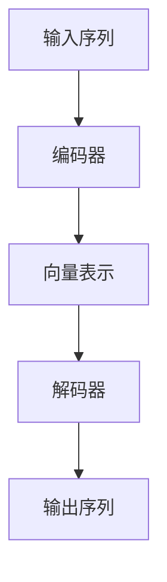

# Python深度学习实践：基于自注意力机制的序列模型

## 1.背景介绍

随着深度学习技术的不断发展,自注意力机制(Self-Attention)逐渐成为序列建模任务中的关键技术。传统的序列模型如递归神经网络(RNN)和长短期记忆网络(LSTM)在处理长序列时存在梯度消失/爆炸的问题,而自注意力机制则能够直接对序列中任意两个位置的元素进行关联,从而更好地捕捉长距离依赖关系。本文将探讨基于自注意力机制的序列模型在Python中的实践应用。

## 2.核心概念与联系

### 2.1 自注意力机制

自注意力机制的核心思想是计算输入序列中每个元素与其他元素的关联程度,并据此对该元素进行编码表示。具体来说,对于序列 $X = (x_1, x_2, ..., x_n)$,自注意力机制首先计算每对元素 $(x_i, x_j)$ 的注意力权重 $\alpha_{ij}$,表示 $x_i$ 对 $x_j$ 的关注程度。然后将所有元素的加权和作为 $x_i$ 的编码表示:

$$\text{Attention}(X_i) = \sum_{j=1}^{n} \alpha_{ij}(X_j)$$

注意力权重 $\alpha_{ij}$ 通常由查询(Query)向量 $q_i$、键(Key)向量 $k_j$ 和值(Value)向量 $v_j$ 计算得到:

$$\alpha_{ij} = \frac{\exp(q_i^T k_j)}{\sum_{l=1}^{n}\exp(q_i^T k_l)}$$

其中 $q_i$、$k_j$ 和 $v_j$ 分别由输入元素 $x_i$ 和 $x_j$ 经过线性变换得到。

### 2.2 多头注意力机制

为了捕捉不同子空间的关注关系,Transformer 引入了多头注意力(Multi-Head Attention)机制。具体来说,将查询/键/值向量线性投影到不同的子空间,分别计算注意力权重和加权和,最后将所有子空间的结果拼接起来作为最终的注意力表示。

### 2.3 位置编码

由于自注意力机制没有显式地编码序列的位置信息,因此需要对序列元素添加位置编码(Positional Encoding),使模型能够捕捉元素在序列中的相对位置关系。

## 3.核心算法原理具体操作步骤 

基于自注意力机制的序列模型通常由编码器(Encoder)和解码器(Decoder)两部分组成。编码器将输入序列编码为一系列向量表示,解码器则根据编码器的输出及目标序列生成最终的输出序列。以机器翻译任务为例,编码器将源语言句子编码为向量表示,解码器则根据该向量表示生成目标语言的翻译结果。



编码器和解码器内部均采用多层Self-Attention和前馈神经网络(Feed-Forward Neural Network)堆叠而成。以编码器为例,其具体操作步骤如下:

1. 对输入序列的词嵌入(Word Embedding)进行位置编码,得到位置编码向量。
2. 通过第一层Self-Attention子层,计算位置编码向量的注意力表示。
3. 对注意力表示进行残差连接和层归一化,得到该层的输出。
4. 输出向量通过前馈神经网络子层进行非线性变换。
5. 对变换后的向量进行残差连接和层归一化,得到该层的最终输出。
6. 重复步骤2-5,对输出向量进行多层编码。

解码器的操作步骤与编码器类似,不同之处在于:

1. 解码器的Self-Attention还需要对未生成的目标序列位置进行掩码(Mask),以避免获取未来信息。
2. 解码器还包含一个对编码器输出的注意力子层,用于融合源序列和目标序列的信息。

## 4.数学模型和公式详细讲解举例说明

### 4.1 缩放点积注意力

在Transformer中,注意力权重的计算采用了缩放点积注意力(Scaled Dot-Product Attention)机制,其数学表达式为:

$$\text{Attention}(Q, K, V) = \text{softmax}(\frac{QK^T}{\sqrt{d_k}})V$$

其中 $Q$、$K$、$V$ 分别表示查询(Query)、键(Key)和值(Value)矩阵,由输入序列的词嵌入经过不同的线性变换得到。$d_k$ 为缩放因子,用于防止点积的值过大导致softmax函数的梯度较小。

以机器翻译任务为例,假设源语言句子 $X = (x_1, x_2, ..., x_m)$,目标语言句子 $Y = (y_1, y_2, ..., y_n)$,其中 $x_i$、$y_j$ 分别表示对应语言的词嵌入向量。令 $Q = X$、$K = Y$、$V = Y$,则解码器的自注意力计算公式为:

$$\text{Attention}_\text{self}(Y) = \text{softmax}(\frac{YY^T}{\sqrt{d_y}})Y$$

其中,对于未生成的目标序列位置,需要进行掩码操作,使其注意力权重为0。

解码器的编码器-解码器注意力计算公式为:

$$\text{Attention}_\text{enc-dec}(X, Y) = \text{softmax}(\frac{YX^T}{\sqrt{d_x}})X$$

可以看出,自注意力机制能够直接对序列中任意两个位置的元素进行关联,从而更好地捕捉长距离依赖关系。

### 4.2 多头注意力

为了捕捉不同子空间的关注关系,Transformer 引入了多头注意力(Multi-Head Attention)机制。具体来说,将查询/键/值矩阵分别线性投影到 $h$ 个不同的子空间,分别计算注意力权重和加权和,最后将所有子空间的结果拼接起来作为最终的注意力表示:

$$\begin{aligned}
\text{MultiHead}(Q, K, V) &= \text{Concat}(\text{head}_1, ..., \text{head}_h)W^O\\
\text{where } \text{head}_i &= \text{Attention}(QW_i^Q, KW_i^K, VW_i^V)
\end{aligned}$$

其中 $W_i^Q \in \mathbb{R}^{d_\text{model} \times d_q}$、$W_i^K \in \mathbb{R}^{d_\text{model} \times d_k}$、$W_i^V \in \mathbb{R}^{d_\text{model} \times d_v}$ 和 $W^O \in \mathbb{R}^{hd_v \times d_\text{model}}$ 为可训练的线性变换矩阵,用于将查询/键/值矩阵投影到不同的子空间。$d_q$、$d_k$、$d_v$ 分别为查询、键、值向量的维度,满足 $d_q = d_k = d_v = d_\text{model}/h$。

多头注意力机制不仅能够捕捉不同子空间的关注关系,还有助于提高模型的并行计算能力和表达能力。

## 5.项目实践:代码实例和详细解释说明

以下是使用PyTorch实现基于自注意力机制的编码器-解码器模型的示例代码:

```python
import torch
import torch.nn as nn
import math

# 缩放点积注意力
class ScaledDotProductAttention(nn.Module):
    def __init__(self, d_k):
        super().__init__()
        self.d_k = d_k

    def forward(self, Q, K, V, attn_mask=None):
        scores = torch.matmul(Q, K.transpose(-1, -2)) / math.sqrt(self.d_k)
        if attn_mask is not None:
            scores = scores.masked_fill(attn_mask == 0, -1e9)
        attn = nn.Softmax(dim=-1)(scores)
        context = torch.matmul(attn, V)
        return context, attn

# 多头注意力
class MultiHeadAttention(nn.Module):
    def __init__(self, d_model, n_heads):
        super().__init__()
        self.n_heads = n_heads
        self.d_k = self.d_v = d_model // n_heads
        self.W_q = nn.Linear(d_model, d_model, bias=False)
        self.W_k = nn.Linear(d_model, d_model, bias=False)
        self.W_v = nn.Linear(d_model, d_model, bias=False)
        self.W_o = nn.Linear(d_model, d_model, bias=False)
        self.attention = ScaledDotProductAttention(self.d_k)

    def forward(self, Q, K, V, attn_mask=None):
        batch_size = Q.size(0)
        q = self.W_q(Q).view(batch_size, -1, self.n_heads, self.d_k).transpose(1, 2)
        k = self.W_k(K).view(batch_size, -1, self.n_heads, self.d_k).transpose(1, 2)
        v = self.W_v(V).view(batch_size, -1, self.n_heads, self.d_v).transpose(1, 2)
        context, attn = self.attention(q, k, v, attn_mask)
        context = context.transpose(1, 2).contiguous().view(batch_size, -1, self.n_heads * self.d_v)
        output = self.W_o(context)
        return output, attn

# 编码器层
class EncoderLayer(nn.Module):
    def __init__(self, d_model, n_heads):
        super().__init__()
        self.multi_head_attn = MultiHeadAttention(d_model, n_heads)
        self.ffn = nn.Sequential(
            nn.Linear(d_model, d_model * 4),
            nn.ReLU(),
            nn.Linear(d_model * 4, d_model)
        )
        self.norm1 = nn.LayerNorm(d_model)
        self.norm2 = nn.LayerNorm(d_model)

    def forward(self, x, src_mask=None):
        residual = x
        context, attn = self.multi_head_attn(x, x, x, src_mask)
        x = self.norm1(residual + context)
        residual = x
        x = self.norm2(residual + self.ffn(x))
        return x, attn

# 解码器层
class DecoderLayer(nn.Module):
    def __init__(self, d_model, n_heads):
        super().__init__()
        self.self_attn = MultiHeadAttention(d_model, n_heads)
        self.src_attn = MultiHeadAttention(d_model, n_heads)
        self.ffn = nn.Sequential(
            nn.Linear(d_model, d_model * 4),
            nn.ReLU(),
            nn.Linear(d_model * 4, d_model)
        )
        self.norm1 = nn.LayerNorm(d_model)
        self.norm2 = nn.LayerNorm(d_model)
        self.norm3 = nn.LayerNorm(d_model)

    def forward(self, x, mem, src_mask=None, tgt_mask=None):
        residual = x
        context, attn = self.self_attn(x, x, x, tgt_mask)
        x = self.norm1(residual + context)
        residual = x
        context, attn = self.src_attn(x, mem, mem, src_mask)
        x = self.norm2(residual + context)
        residual = x
        x = self.norm3(residual + self.ffn(x))
        return x, attn

# 编码器
class Encoder(nn.Module):
    def __init__(self, d_model, n_layers, n_heads):
        super().__init__()
        self.layers = nn.ModuleList([EncoderLayer(d_model, n_heads) for _ in range(n_layers)])

    def forward(self, x, src_mask=None):
        for layer in self.layers:
            x, _ = layer(x, src_mask)
        return x

# 解码器
class Decoder(nn.Module):
    def __init__(self, d_model, n_layers, n_heads):
        super().__init__()
        self.layers = nn.ModuleList([DecoderLayer(d_model, n_heads) for _ in range(n_layers)])

    def forward(self, x, mem, src_mask=None, tgt_mask=None):
        for layer in self.layers:
            x, _ = layer(x, mem, src_mask, tgt_mask)
        return x

# 编码器-解码器模型
class EncoderDecoder(nn.Module):
    def __init__(self, src_vocab_size, tgt_vocab_size, d_model, n_layers, n_heads, max_len=100):
        super().__init__()
        self.encoder = Encoder(d_model, n_layers, n_heads)
        self.decoder = Decoder(d_model, n_layers, n_heads)
        self.src_emb = nn.Embedding(src_vocab_size, d_model)
        self.