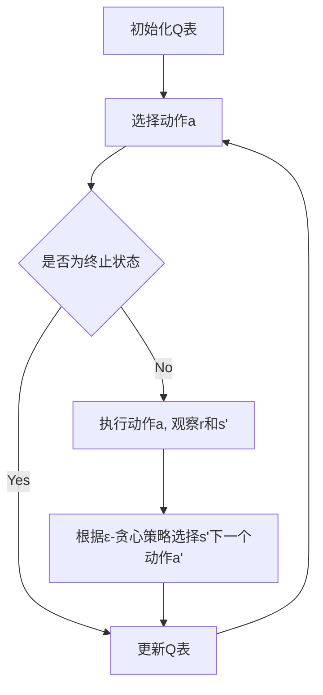

# Q-Learning常见问题解答：解决学习过程中的困惑

## 1. 背景介绍
### 1.1 强化学习概述
### 1.2 Q-Learning在强化学习中的地位
### 1.3 Q-Learning学习过程中的常见困惑

## 2. 核心概念与联系
### 2.1 马尔可夫决策过程(MDP)
#### 2.1.1 状态空间、动作空间、转移概率和回报函数
#### 2.1.2 最优策略与值函数
### 2.2 时间差分学习(Temporal Difference Learning)
#### 2.2.1 TD(0)与Sarsa算法
#### 2.2.2 Q-Learning与异策略学习
### 2.3 探索与利用(Exploration vs. Exploitation)
#### 2.3.1 ε-贪心策略
#### 2.3.2 softmax探索
### 2.4 函数近似(Function Approximation)
#### 2.4.1 值函数近似
#### 2.4.2 深度Q网络(DQN)

## 3. 核心算法原理具体操作步骤
### 3.1 Q-Learning算法流程
### 3.2 Q表的初始化与更新
### 3.3 行动选择策略
### 3.4 终止状态处理
### 3.5 超参数设置与调优

## 4. 数学模型和公式详细讲解举例说明 
### 4.1 Q-Learning的数学形式
$$Q(s_t,a_t) \leftarrow Q(s_t,a_t)+\alpha[r_{t+1}+\gamma \max_a Q(s_{t+1},a)-Q(s_t,a_t)]$$
其中:
- $s_t$: t时刻的状态
- $a_t$: t时刻采取的动作 
- $r_{t+1}$: t+1时刻获得的即时回报
- $\alpha$: 学习率
- $\gamma$: 折扣因子
### 4.2 Q-Learning收敛性证明
### 4.3 Q-Learning与动态规划的关系

## 5. 项目实践：代码实例和详细解释说明
### 5.1 网格世界环境搭建
### 5.2 Q-Learning代码实现
#### 5.2.1 初始化Q表
#### 5.2.2 与环境交互并更新Q表
#### 5.2.3 ε-贪心策略选择动作
### 5.3 训练过程可视化
### 5.4 测试训练好的智能体

## 6. 实际应用场景
### 6.1 智能体自主导航
### 6.2 游戏AI设计 
### 6.3 推荐系统中的在线学习
### 6.4 自适应流量控制

## 7. 工具和资源推荐
### 7.1 OpenAI Gym环境库
### 7.2 TensorFlow与PyTorch深度学习框架
### 7.3 经典强化学习论文列表
### 7.4 在线课程与教程推荐

## 8. 总结：未来发展趋势与挑战
### 8.1 基于模型的强化学习
### 8.2 分层强化学习
### 8.3 元强化学习
### 8.4 迁移强化学习
### 8.5 多智能体强化学习

## 9. 附录：常见问题与解答
### 9.1 Q-Learning能否处理连续状态和动作空间？
### 9.2 ε应该如何随训练进行衰减？
### 9.3 Q-Learning能否用于部分可观测马尔可夫决策过程(POMDP)？ 
### 9.4 如何平衡探索和利用？
### 9.5 Q-Learning容易出现的问题以及解决方案？

Q-Learning是强化学习领域最经典也是最常用的算法之一。作为一种异策略时间差分学习方法，Q-Learning不需要显式地构建环境模型，而是通过不断与环境交互来学习最优策略。然而在学习和应用Q-Learning的过程中，初学者往往会遇到一些共性的问题，导致算法难以收敛或性能不佳。本文将围绕Q-Learning的原理和实践，对几个高频问题进行深入剖析和解答，帮助读者全面掌握这一强大算法，解决学习过程中的种种困惑。

强化学习是一种让智能体通过与环境互动来学习最优行为策略的机器学习范式。与监督学习和非监督学习不同，强化学习并没有预先准备好的训练数据，而是让智能体在一个回合(episode)内连续地采取动作(action)，获得环境的反馈奖励(reward)，并据此调整行为策略以期获得长期累积奖励最大化。马尔可夫决策过程(MDP)为理解强化学习问题提供了一个理想的数学框架。一个MDP由状态空间S、动作空间A、状态转移概率P和回报函数R构成。在t时刻，智能体处于状态$s_t \in S$，选择动作$a_t \in A$，环境根据$P(s_{t+1}|s_t,a_t)$转移到下一状态$s_{t+1}$并提供即时奖励$r_{t+1}$。智能体的目标是找到一个最优策略$\pi^*$，使得从任一状态出发，采取该策略能获得的期望累积奖励达到最大。

Q-Learning是一种异策略时间差分(TD)控制方法，旨在直接学习最优动作值函数$Q^*(s,a)$。所谓动作值函数，就是衡量在状态s下选择动作a的长期价值，即未来累积奖励的期望。Q-Learning的核心思想是利用TD误差来更新动作值估计：
$$Q(s_t,a_t) \leftarrow Q(s_t,a_t)+\alpha[r_{t+1}+\gamma \max_a Q(s_{t+1},a)-Q(s_t,a_t)]$$
其中$\alpha \in (0,1]$为学习率，$\gamma \in [0,1]$为折扣因子。这个更新规则的直观含义是，新的Q值估计由旧估计值和TD目标$r_{t+1}+\gamma \max_a Q(s_{t+1},a)$加权平均而成，权重由学习率$\alpha$控制。可以证明，在适当的条件下，Q-Learning能够收敛到最优动作值函数$Q^*$。

在具体实现Q-Learning时，我们通常会维护一张Q表，用于存储每个状态-动作对的Q值估计。初始时Q表可以随机初始化或都初始化为0。此后，智能体与环境不断交互，在每个时间步更新Q表，直到Q值估计收敛或训练轮数达到预设值。为了在探索和利用之间权衡，我们常使用ε-贪心策略来选择动作：以$1-\epsilon$的概率选择Q值最大的动作，以$\epsilon$的概率随机选择动作。其中$\epsilon$通常会随训练进程逐渐衰减。

对于状态和动作空间较小的任务，我们可以直接使用Q表来存储每个状态-动作对的Q值。但对于大规模甚至连续的状态空间，这种做法就不再可行。此时，我们需要引入值函数近似，即用一个参数化的函数（如神经网络）来近似Q函数。这就是著名的深度Q网络(DQN)方法的基本思路。DQN在传统Q-Learning的基础上引入了两个重要的改进：经验回放和目标网络，极大地提升了算法在高维状态空间上的稳定性和样本效率。

为了帮助读者深入理解Q-Learning的内在机制并解决学习过程中的困惑，本文还将通过一个简单的网格世界导航任务，展示Q-Learning的代码实现细节。我们会讨论如何搭建强化学习环境、如何构建和更新Q表、如何平衡探索和利用等关键问题。此外，我们还将介绍一些Q-Learning在实际场景中的应用案例，如智能体自主导航、游戏AI设计、推荐系统等，让读者感受到Q-Learning的强大威力。

展望未来，Q-Learning及其变体仍将是强化学习领域的重要研究方向。一些新的研究课题如何将Q-Learning推广到多智能体系统、如何利用Q-Learning实现元学习和迁移学习等，都值得学界和业界持续关注。此外，Q-Learning与深度学习、迁移学习等前沿技术的结合，有望进一步拓展其应用边界，让智能体学会更加复杂和高效的决策行为，推动人工智能在各领域的发展。

作者：禅与计算机程序设计艺术 / Zen and the Art of Computer Programming