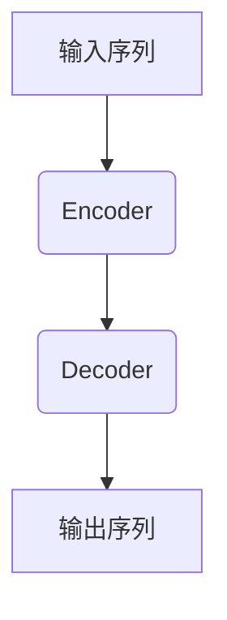
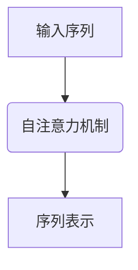
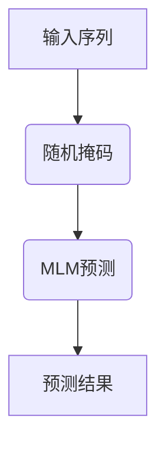

# RoBERTa原理与代码实例讲解

## 1.背景介绍

### 1.1 自然语言处理的重要性

在当今的数字时代,自然语言处理(NLP)已成为人工智能领域中最重要和最具挑战性的研究方向之一。人类与机器之间的自然语言交互是实现真正智能系统的关键。NLP技术广泛应用于机器翻译、智能问答、情感分析、文本摘要等各种场景,对提高人机交互效率、优化信息处理流程具有重要意义。

### 1.2 预训练语言模型的兴起

传统的NLP模型通常需要大量的人工标注数据,并且针对特定任务进行训练,泛化能力较差。为了解决这一问题,预训练语言模型(Pre-trained Language Model,PLM)应运而生。PLM在大规模未标注语料库上进行自监督学习,获取通用的语言表示能力,然后将学习到的知识迁移到下游任务中,显著提高了NLP系统的性能。

### 1.3 BERT模型的突破

2018年,谷歌推出了BERT(Bidirectional Encoder Representations from Transformers)模型,该模型基于Transformer的自注意力机制,能够有效捕捉输入序列中的长程依赖关系,在多项NLP任务上取得了突破性进展。BERT的出现,使得预训练语言模型在NLP领域掀起了一股热潮。

### 1.4 RoBERTa的优化

虽然BERT模型取得了卓越的成绩,但仍存在一些不足之处。例如,BERT在预训练阶段使用了次优的掩码语言模型(Masked Language Model,MLM)目标函数,以及静态掩码策略等。为了进一步提升模型性能,Facebook AI研究院在2019年提出了RoBERTa(Robustly Optimized BERT Approach),通过一系列训练技巧对BERT模型进行了优化和改进。

## 2.核心概念与联系

### 2.1 Transformer架构

RoBERTa的核心架构基于Transformer,这是一种全新的基于自注意力机制的序列到序列模型。Transformer由编码器(Encoder)和解码器(Decoder)两个模块组成,能够并行处理输入序列,捕捉长程依赖关系。编码器用于处理输入序列,解码器则生成目标序列。



### 2.2 自注意力机制

Transformer中的自注意力机制是一种关联计算方法,能够捕捉输入序列中任意两个位置之间的依赖关系。每个位置的表示是其他所有位置的加权和,权重由位置之间的相似度决定。自注意力机制避免了循环神经网络中的梯度消失问题,并且具有更好的并行计算能力。



### 2.3 掩码语言模型

掩码语言模型(MLM)是一种自监督学习目标函数,通过随机掩码输入序列中的部分单词,并让模型预测被掩码的单词。MLM可以同时利用上下文的双向信息,有助于模型学习更加丰富的语义和句法知识。



### 2.4 下一句预测

除了MLM外,BERT还使用了下一句预测(Next Sentence Prediction,NSP)作为辅助目标函数。NSP旨在让模型捕捉句子之间的关系和连贯性。然而,RoBERTa发现NSP对下游任务的改进效果有限,因此移除了这一目标函数。

## 3.核心算法原理具体操作步骤

RoBERTa在BERT的基础上进行了多项改进,主要包括以下几个方面:

### 3.1 训练数据

- 使用更大的训练语料库:RoBERTa在BERT的训练数据基础上,额外添加了大量的网页数据、书籍数据等,总计达到160GB的规模。
- 删除不自然的训练样本:去除了BERT中一些不自然的训练样本,如来自维基百科的引文。
- 动态掩码:与BERT中的静态掩码不同,RoBERTa在每个训练步骤中都会重新采样掩码位置,增加了数据的多样性。

### 3.2 训练策略

- 更大的批量大小:RoBERTa采用了更大的批量大小(如8192),有助于提高训练稳定性。
- 更长的序列长度:RoBERTa使用了更长的序列长度(如512个token),有助于捕捉更长程的依赖关系。
- 更多的训练步数:RoBERTa进行了更多的训练步数(如100万步),使模型收敛到更优的局部最小值。

### 3.3 模型结构

- 移除NSP目标:RoBERTa去掉了BERT中的下一句预测(NSP)目标,只保留了掩码语言模型(MLM)作为训练目标。
- 更大的模型规模:RoBERTa探索了更大的模型规模,如BASE(12层,768维)和LARGE(24层,1024维)等。

### 3.4 其他改进

- 字节级Byte-Pair编码:RoBERTa使用了更高效的字节级Byte-Pair编码方式,而非BERT中的字符级编码。
- 更大的批归一化系数:提高了批归一化层中的系数,以加速收敛。

通过上述改进,RoBERTa在多项NLP基准测试中超越了BERT,成为新的SOTA模型。

## 4.数学模型和公式详细讲解举例说明

### 4.1 自注意力机制

自注意力机制是Transformer的核心部件,它能够捕捉输入序列中任意两个位置之间的依赖关系。给定一个长度为n的输入序列$X = (x_1, x_2, ..., x_n)$,自注意力机制首先将其映射到一系列的查询(Query)、键(Key)和值(Value)向量:

$$
\begin{aligned}
Q &= XW^Q\\
K &= XW^K\\
V &= XW^V
\end{aligned}
$$

其中$W^Q, W^K, W^V$分别是可学习的查询、键和值的投影矩阵。

接下来,计算查询$Q$与所有键$K$的点积,得到注意力分数矩阵$S$:

$$
S = \frac{QK^T}{\sqrt{d_k}}
$$

其中$d_k$是键向量的维度,缩放操作可以避免点积过大导致的梯度饱和问题。

然后,对注意力分数矩阵$S$进行行软最大化操作,得到注意力权重矩阵$A$:

$$
A = \text{softmax}(S)
$$

最后,将注意力权重$A$与值向量$V$相乘,得到输出表示$O$:

$$
O = AV
$$

通过上述步骤,自注意力机制可以自适应地为每个位置分配注意力权重,捕捉输入序列中的长程依赖关系。

### 4.2 掩码语言模型

掩码语言模型(MLM)是RoBERTa的主要训练目标函数。给定一个长度为n的输入序列$X = (x_1, x_2, ..., x_n)$,MLM的目标是预测被掩码的单词。

具体来说,MLM会随机选择一些位置进行掩码,例如将$x_3$和$x_6$掩码为特殊的[MASK]标记,得到掩码后的序列$\tilde{X} = (x_1, x_2, \text{[MASK]}, x_4, x_5, \text{[MASK]}, x_7, ..., x_n)$。

然后,将$\tilde{X}$输入到RoBERTa模型中,得到每个位置的输出向量表示$H = (h_1, h_2, ..., h_n)$。对于被掩码的位置$i$,我们计算预测其原始单词$x_i$的条件概率:

$$
P(x_i|\tilde{X}) = \text{softmax}(W_eh_i)
$$

其中$W_e$是词嵌入矩阵。

MLM的损失函数为被掩码位置的负对数似然:

$$
\mathcal{L}_\text{MLM} = -\sum_{i \in \text{masked}}\log P(x_i|\tilde{X})
$$

通过最小化MLM损失函数,RoBERTa可以学习到丰富的语义和句法知识,提高对自然语言的理解能力。

## 5.项目实践:代码实例和详细解释说明

以下是使用PyTorch实现RoBERTa模型的示例代码:

```python
import torch
import torch.nn as nn
from transformers import RobertaModel, RobertaConfig

# 加载RoBERTa配置和预训练权重
config = RobertaConfig.from_pretrained('roberta-base')
roberta = RobertaModel.from_pretrained('roberta-base', config=config)

# 定义分类头
classifier = nn.Linear(config.hidden_size, num_labels)

# 前向传播
input_ids = ... # 输入token ids
attention_mask = ... # 注意力掩码
outputs = roberta(input_ids, attention_mask=attention_mask)
sequence_output = outputs[0]
logits = classifier(sequence_output)

# 计算损失和预测
loss_fct = nn.CrossEntropyLoss()
loss = loss_fct(logits.view(-1, num_labels), labels.view(-1))
preds = torch.argmax(logits, dim=-1)
```

上述代码首先加载RoBERTa的配置和预训练权重,然后定义一个分类头用于下游任务。在前向传播过程中,将输入序列的token ids和注意力掩码输入到RoBERTa模型,得到序列的输出表示`sequence_output`。接下来,通过分类头将`sequence_output`映射到目标空间,计算损失函数和预测结果。

需要注意的是,上述代码仅展示了如何在PyTorch中加载和使用RoBERTa模型,实际应用中还需要进行数据预处理、模型微调等步骤。下面是一个使用Hugging Face Transformers库进行文本分类任务的完整示例:

```python
from transformers import RobertaTokenizer, RobertaForSequenceClassification
import torch

# 加载tokenizer和模型
tokenizer = RobertaTokenizer.from_pretrained('roberta-base')
model = RobertaForSequenceClassification.from_pretrained('roberta-base', num_labels=2)

# 数据预处理
text = "This is a great movie!"
inputs = tokenizer(text, return_tensors="pt")

# 前向传播和预测
outputs = model(**inputs)
logits = outputs.logits
preds = torch.argmax(logits, dim=-1)
print(f"Prediction: {['Negative', 'Positive'][preds.item()]}")
```

在上述示例中,我们首先加载RoBERTa的tokenizer和预训练模型。然后,对输入文本进行tokenization,并将其转换为PyTorch张量。接下来,将输入张量传递给模型进行前向传播,得到logits输出。最后,通过argmax操作获取预测的类别标签。

通过这些代码示例,您可以更好地理解如何在实际项目中使用RoBERTa模型进行自然语言处理任务。

## 6.实际应用场景

RoBERTa作为一种通用的预训练语言模型,可以广泛应用于各种自然语言处理任务,包括但不限于:

### 6.1 文本分类

文本分类是NLP的一个核心任务,旨在根据文本内容将其归类到预定义的类别中。RoBERTa可以用于情感分析、新闻分类、垃圾邮件检测等多种文本分类场景。

### 6.2 序列标注

序列标注任务需要对输入序列中的每个元素进行标注,如命名实体识别、词性标注等。RoBERTa可以作为序列标注模型的编码器,为每个元素提供丰富的上下文表示。

### 6.3 机器阅读理解

机器阅读理解旨在让机器从给定的文本中理解和回答相关问题。RoBERTa可以用于提取答案跨度、多选问答等多种机器阅读理解任务。

### 6.4 文本生成

虽然RoBERTa是一个编码器模型,但也可以通过序列到序列的方式进行文本生成任务,如机器翻译、文本摘要、对话系统等。

### 6.5 其他应用

除了上述典型任务外,RoBERTa还可以应用于语义相似度计算、关系抽取、事件抽取