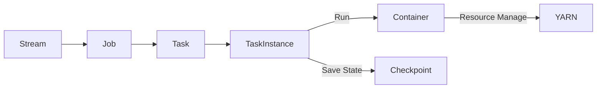

# Samza原理与代码实例讲解

## 1. 背景介绍
### 1.1 大数据流处理的挑战
在当今大数据时代,企业每天都要处理海量的实时数据,传统的批处理模式已经无法满足实时性和低延迟的需求。因此,流式数据处理应运而生,它能够对源源不断到达的数据进行实时计算。然而,构建一个高吞吐、低延迟、高可用的流处理系统非常具有挑战性。

### 1.2 Samza的诞生
Samza是由LinkedIn公司开源的一个分布式流处理框架,旨在解决实时流计算中的难题。它构建在Apache Kafka和Apache YARN之上,继承了Kafka高吞吐、低延迟的特性,并借助YARN实现了水平扩展、高可用和资源隔离。Samza采用了类似MapReduce的流处理模型,开发者只需关注业务逻辑,而无需了解底层复杂的分布式系统细节。

### 1.3 Samza的应用场景
Samza广泛应用于日志处理、用户行为分析、欺诈检测、ETL等实时流处理场景。LinkedIn内部大量使用Samza进行实时数据分析,如实时更新用户画像、职位推荐等。除此之外,Samza还被Uber、Netflix、Slack等公司用于处理海量的事件流。

## 2. 核心概念与联系
### 2.1 Samza的核心概念
- Stream(流):表示一组持续到达的数据,在Samza中通常由Kafka Topic承载。
- Job(作业):一个完整的流处理任务,包含了从输入流到输出流的所有处理逻辑。
- Task(任务):Job的最小执行单元,每个Task负责处理一个Partition的数据。
- TaskInstance(任务实例):Task的一次具体执行,当Task失败时会自动重启一个新的TaskInstance。
- Container(容器):运行Task的进程,负责管理Task的生命周期。
- YARN:Samza使用YARN进行资源管理和任务调度。
- Checkpoint(检查点):用于记录每个Task消费的Offset,实现容错恢复。

### 2.2 核心概念之间的关系
下面是Samza核心概念之间的Mermaid流程图:

从图中可以看出,一个Job订阅输入Stream并产生输出Stream。Job会被划分为多个Task,每个Task负责一个Partition。Task的每次运行对应一个TaskInstance,在Container中执行。Container通过YARN管理资源,失败时可以恢复。Task定期保存状态到Checkpoint,实现exactly-once语义。

## 3. 核心算法原理与操作步骤
### 3.1 Samza的并行模型
Samza采用了与Kafka一致的并行模型,即将每个输入流划分为多个Partition,每个Partition由一个Task独立处理。这种模型有几个优点:
1. 充分利用Kafka的分区机制,实现负载均衡。
2. 每个Task可以独立checkpoint,简化了状态管理。 
3. Partition之间无需同步,提高了吞吐量。
4. 方便水平扩展,可以随时增加Task数目。

### 3.2 Samza的任务调度
Samza基于YARN调度Task,大致流程如下:
1. 应用程序向YARN提交Job,描述需要的资源。
2. YARN为Job分配Container,每个Container对应一个YARN Node。
3. 在Container中启动SamzaContainer进程,并向Samza的JobCoordinator注册。
4. JobCoordinator根据输入流的Partition数划分Task,并将Task分配给SamzaContainer。
5. SamzaContainer启动TaskInstance,开始消费Partition并执行用户定义的处理逻辑。
6. 如果Task失败,SamzaContainer会向JobCoordinator申请新Task。
7. 如果SamzaContainer失败,YARN会在另一个Node上启动新的Container并恢复之前的Task。

### 3.3 Samza的状态管理
Samza支持有状态计算,即Task可以访问和修改本地状态。为了保证exactly-once语义,Samza将每个输入消息的offset和状态变更在一个原子事务中提交。这个过程称为Checkpoint。

Checkpoint的步骤如下:
1. Task在内存中缓存State的变更。
2. 当输入消息达到一定数量或超时,Task启动一次Checkpoint。
3. Task将State的变更写入远端的StateStore(如RocksDB)。
4. Task向Kafka提交消费的offset。
5. 如果上述步骤全部成功,则Checkpoint完成,否则回滚到上一个Checkpoint。

当Task失败恢复时,Samza保证从上一个成功的Checkpoint开始重新处理,不会丢失或重复。

## 4. 数学模型与公式
### 4.1 Samza的流处理模型
Samza的数据流可以抽象为一个无穷的数据序列$\\{x_1,x_2,...,x_n,...\\}$,每个元素$x_i$称为一个消息。Samza的任务是对每个消息应用一个函数$f$,产生一个新的数据流$\\{f(x_1),f(x_2),...,f(x_n),...\\}$。函数$f$可以是无状态的,如Map/Filter等;也可以是有状态的,即依赖之前的计算结果。

假设$f$的计算只依赖最近的$m$个消息,即:

$$f(x_i) = g(x_{i-m+1},...,x_i)$$

其中$g$为一个具体的算子,如窗口聚合。这种计算可以用一个大小为$m$的滑动窗口来实现,每个消息触发一次窗口计算。当$m$较大时,可以将窗口划分为多个子窗口,再合并结果,这就是Samza的Tumbling Window机制。

### 4.2 Samza的Checkpoint模型 
Samza的Checkpoint机制保证了每个消息处理且仅处理一次。我们可以将Task的状态抽象为一个KV对$(offset,state)$,表示在处理完offset的消息后的最新状态。

假设在时刻$t_1$和$t_2$进行了两次Checkpoint,则有:

$$
Checkpoint(t_1)=(offset_1,state_1)
$$
$$
Checkpoint(t_2)=(offset_2,state_2)
$$

如果在$t_2$之后发生失败,Samza会从$Checkpoint(t_2)$恢复,重放区间$(offset_1,offset_2]$的消息,继续之前的状态$state_2$进行计算。可见,只要Checkpoint的频率足够高,Samza就能做到exactly-once。

## 5. 项目实践:代码实例与讲解
下面我们用Samza实现一个简单的WordCount程序,统计每个单词出现的次数。

### 5.1 开发环境准备
1. 安装JDK 8+和Maven 3+。
2. 下载Samza的Hello Samza示例程序。
3. 修改pom.xml,添加必要的依赖。
4. 在config.properties中配置Kafka和ZooKeeper的地址。

### 5.2 编写WordCount程序
```java
public class WordCount implements StreamTask, InitableTask, WindowableTask {

  private static final Logger LOG = LoggerFactory.getLogger(WordCount.class);

  private KeyValueStore<String, Integer> store;
  private WindowPane<String, Integer> windowPane;
  
  @Override
  public void init(Config config, TaskContext context) {
    store = (KeyValueStore<String, Integer>) context.getStore("word-count");
    windowPane = new WindowPane<>(context, new StringSerde(), new IntegerSerde(), Duration.ofSeconds(5), () -> 0);
  }

  @Override
  public void process(IncomingMessageEnvelope envelope, MessageCollector collector, TaskCoordinator coordinator) {
    String word = (String) envelope.getMessage();
    int count = store.get(word);
    count++;
    store.put(word, count);
    windowPane.update(word, count);
  }

  @Override
  public void window(MessageCollector collector, TaskCoordinator coordinator) {
    for (Entry<String, Integer> entry : windowPane.getState().entrySet()) {
      collector.send(new OutgoingMessageEnvelope(new SystemStream("kafka", "word-count-output"), entry.getKey(), entry.getValue()));
    }
  }
}
```

这个Task订阅了一个输入流,每条消息是一个单词。在process()方法中,我们从KeyValueStore中取出该单词的计数,加1后写回。同时将单词和计数输出到一个WindowPane中,WindowPane会定期(本例为5秒)触发window()方法,输出聚合结果到Kafka。

### 5.3 提交和运行Job
1. 使用mvn package打包程序。
2. 使用samza run命令提交Job。
3. 往输入流发送一些单词。
4. 观察输出流,可以看到单词计数的结果。

这个简单的例子展示了Samza处理流数据的基本流程。实际项目中,我们还需要考虑更多因素,如容错、性能调优、状态存储等。

## 6. 实际应用场景
Samza在实际生产中有非常广泛的应用,下面列举几个典型场景:

### 6.1 日志处理
Web服务器、移动App每天都会产生海量的用户访问日志,Samza可以实时接收这些日志并进行分析,如统计PV/UV、计算访问时长分布等,为运营决策提供依据。

### 6.2 用户行为分析
电商网站、社交平台会实时收集用户的各种行为事件,如浏览、点击、收藏、购买等。Samza可以对这些事件流进行实时分析,如推荐算法、异常行为检测等,提升用户体验。

### 6.3 金融风控
银行、证券每天有大量的交易数据,Samza可以对交易流进行实时监控,运行各种风险模型,及时预警异常行为,防范金融欺诈。

### 6.4 物联网数据处理
工业设备、车联网会持续产生海量的传感器数据,Samza可以接入这些数据并进行清洗、异常检测、统计分析,为设备健康诊断、预测性维护提供支持。

## 7. 工具和资源推荐
### 7.1 官方资源
- [Samza官网](http://samza.apache.org/):最权威的资源,包含文档、教程、博客等。
- [Samza Github仓库](https://github.com/apache/samza):可以找到Samza的源码和示例程序。

### 7.2 第三方工具
- [Kafka Manager](https://github.com/yahoo/kafka-manager):管理和监控Kafka集群的工具。
- [Samza REST](https://github.com/savantdegrees/samza-rest):一个Samza的REST API框架,方便与外部系统集成。
- [Samza Prometheus Exporter](https://github.com/sysco-middleware/samza-prometheus-exporter):将Samza的度量指标导出到Prometheus,便于监控和告警。

### 7.3 学习资料
- [Hello Samza](https://github.com/apache/samza-hello-samza):官方的入门教程,适合新手学习。
- [Samza by Example](https://github.com/amient/samza-example):一个系列的Samza示例程序,覆盖了各种常见的处理模式。
- [Stream Processing with Apache Samza](https://www.oreilly.com/library/view/stream-processing-with/9781491984307/):O'Reilly出品的Samza专著,深入讲解了Samza的原理和实践。

## 8. 总结:未来发展与挑战
### 8.1 Samza的优势
- 简单易用:Samza提供了类似MapReduce的编程模型,学习门槛低。
- 高吞吐低延迟:得益于Kafka天然的高性能,Samza可以实现毫秒级的端到端延迟。
- 强大的容错能力:Samza基于Checkpoint机制,可以透明地从失败中恢复,保证数据一致性。
- 灵活的部署方式:Samza可以运行在YARN、Mesos、Kubernetes等资源调度系统之上。

### 8.2 Samza的局限
- 不支持自定义窗口:Samza内置了基于时间和数量的窗口,但不能自定义复杂的触发策略。
- 状态存储选择有限:Samza支持RocksDB、Kafka、HDFS等状态后端,但与Flink相比还不够丰富。
- 社区活跃度一般:与Spark、Flink相比,Samza的社区不够活跃,生态也不够完善。

### 8.3 未来的机遇与挑战
未来大数据流处理的需求只会越来越多,Samza面临的机遇和挑战并存:
- 云原生化:如何更好地适配Kubernetes,实现弹性伸缩、混合部署等。