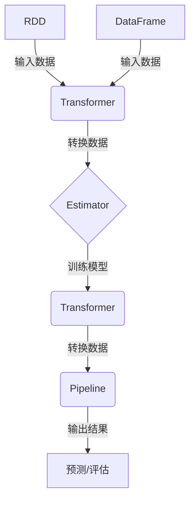

# Spark MLlib原理与代码实例讲解

## 1.背景介绍

在当今数据爆炸时代,机器学习(Machine Learning)已成为企业和组织从海量数据中提取有价值信息的关键工具。Apache Spark作为一种快速、通用的大数据处理引擎,其机器学习库MLlib为数据科学家和机器学习工程师提供了强大的可扩展算法,能够高效地构建和部署机器学习管道。

MLlib是Spark生态系统中的机器学习框架,支持多种常见的机器学习算法,包括分类、回归、聚类、协同过滤等。它紧密集成到Spark体系架构中,可以高效利用Spark的内存计算优势,实现分布式并行计算,从而提高机器学习任务的性能和可扩展性。

### 1.1 Spark MLlib优势

相较于其他机器学习框架,Spark MLlib具有以下优势:

- **高性能**: MLlib利用Spark的内存计算,避免了传统磁盘读写的开销,大幅提升了计算速度。
- **可扩展性**: MLlib天然支持分布式并行计算,能够轻松扩展到大规模数据集。
- **易用性**: MLlib提供了统一的数据抽象和机器学习管道API,简化了机器学习工作流程。
- **容错性**: MLlib继承了Spark的容错特性,能够在节点故障时自动恢复计算。
- **生态丰富**: MLlib与Spark生态系统紧密集成,可与Spark SQL、Spark Streaming等模块无缝协作。

### 1.2 应用场景

Spark MLlib广泛应用于诸多领域,例如:

- 推荐系统: 基于协同过滤算法为用户推荐个性化内容。
- 金融风控: 使用分类和回归模型预测信用违约风险。
- 广告投放: 基于用户行为数据构建点击率预测模型。
- 自然语言处理: 利用文本分类、主题模型等算法进行语义分析。
- 计算机视觉: 结合深度学习算法进行图像识别和目标检测。

## 2.核心概念与联系

在深入探讨MLlib的原理和实践之前,我们需要先了解一些核心概念及其相互关系。

### 2.1 RDD与DataFrame

RDD(Resilient Distributed Dataset)是Spark的基础数据结构,代表一个不可变、可分区、里面的元素可并行计算的数据集合。RDD为Spark提供了容错能力和并行计算能力。

DataFrame是Spark 1.6版本引入的新数据结构,提供了类似关系型数据库的结构化视图,支持SQL查询。DataFrame在内部使用RDD作为数据存储层。

MLlib支持使用RDD和DataFrame作为输入数据源。对于结构化数据,使用DataFrame通常更加高效;而对于非结构化数据,则可以使用RDD。

### 2.2 机器学习管道

Spark MLlib提供了机器学习管道(Pipeline)的概念,将数据处理和模型构建过程抽象为一系列PipelineStage。每个PipelineStage都可以并行执行,最终形成端到端的机器学习工作流。

机器学习管道包括以下几个主要组件:

- **Transformer**: 对数据集进行转换,如特征提取、标准化等。
- **Estimator**: 在训练数据集上训练算法模型,产生一个Transformer。
- **Pipeline**: 将多个Transformer和Estimator组合成一个工作流程。
- **Parameter**: 配置算法的超参数。
- **CrossValidator**: 通过交叉验证选择最优模型。

使用机器学习管道可以极大地简化机器学习工作流程,提高代码的可维护性和复用性。

### 2.3 Mermaid架构流程图



上图展示了Spark MLlib中数据流和机器学习管道的核心架构。RDD或DataFrame作为输入数据源,经过一系列Transformer的转换,送入Estimator训练模型。训练好的模型本身也是一个Transformer,可以整合到Pipeline中进行预测或评估。

## 3.核心算法原理具体操作步骤

MLlib提供了多种常用的机器学习算法,包括监督学习和非监督学习两大类。我们将分别介绍几种核心算法的原理和使用方法。

### 3.1 逻辑回归

逻辑回归(Logistic Regression)是一种广泛使用的分类算法,常用于二分类问题。它通过对数几率(log odds)模型将自变量映射到0到1之间的值,从而预测实例属于某个类别的概率。

逻辑回归的原理可以用以下公式表示:

$$P(Y=1|X) = \frac{1}{1 + e^{-(\beta_0 + \beta_1X_1 + \beta_2X_2 + ... + \beta_nX_n)}}$$

其中:
- $Y$是二元标签(0或1)
- $X$是特征向量$(X_1, X_2, ..., X_n)$
- $\beta$是模型参数,需要通过训练数据拟合得到

在Spark MLlib中,我们可以使用LogisticRegression Estimator来训练逻辑回归模型:

```scala
import org.apache.spark.ml.classification.LogisticRegression

val lr = new LogisticRegression()
  .setMaxIter(10)
  .setRegParam(0.3)
  .setElasticNetParam(0.8)

val lrModel = lr.fit(trainingData)
```

其中,setMaxIter设置最大迭代次数,setRegParam设置正则化参数,setElasticNetParam设置弹性网络参数。

训练完成后,我们可以使用lrModel进行预测:

```scala
val predictions = lrModel.transform(testData)
```

### 3.2 决策树

决策树(Decision Tree)是一种常用的监督学习算法,可以用于分类和回归任务。它通过递归地构建决策树模型,将特征空间划分为互不相交的区域,每个区域对应一个预测值。

决策树算法的核心思想是选择最优特征,并基于该特征对数据集进行分割,使得分割后的子集尽可能"纯"。常用的特征选择标准包括信息增益(Information Gain)和基尼指数(Gini Impurity)。

在Spark MLlib中,我们可以使用DecisionTreeClassifier和DecisionTreeRegressor分别构建分类树和回归树:

```scala
import org.apache.spark.ml.classification.DecisionTreeClassifier
import org.apache.spark.ml.regression.DecisionTreeRegressor

val dtc = new DecisionTreeClassifier()
  .setMaxDepth(5)
  .setImpurity("gini")

val dtcModel = dtc.fit(trainingData)

val dtr = new DecisionTreeRegressor()
  .setMaxDepth(5)

val dtrModel = dtr.fit(trainingData)
```

其中,setMaxDepth设置决策树的最大深度,setImpurity设置不纯度度量标准。

训练完成后,我们可以使用dtcModel和dtrModel进行预测:

```scala
val predictions = dtcModel.transform(testData)
val predictions = dtrModel.transform(testData)
```

### 3.3 K-Means聚类

K-Means是一种常用的无监督学习算法,用于对数据集进行聚类。它的目标是将数据划分为K个簇,使得每个数据点都属于离它最近的簇的质心。

K-Means算法的具体步骤如下:

1. 随机选择K个初始质心
2. 对每个数据点,计算它与每个质心的距离,将它分配给最近的质心所对应的簇
3. 重新计算每个簇的质心
4. 重复步骤2和3,直到质心不再发生变化

在Spark MLlib中,我们可以使用KMeans算法进行聚类:

```scala
import org.apache.spark.ml.clustering.KMeans

val kmeans = new KMeans()
  .setK(3)
  .setSeed(1L)

val kmeansModel = kmeans.fit(dataset)
```

其中,setK设置聚类的簇数,setSeed设置随机种子以获得确定性的结果。

训练完成后,我们可以使用kmeansModel进行聚类预测:

```scala
val predictions = kmeansModel.transform(dataset)
```

### 3.4 协同过滤

协同过滤(Collaborative Filtering)是一种常用的推荐系统算法,通过分析用户对物品的评分数据,发现用户之间或物品之间的相似性,从而为用户推荐可能感兴趣的物品。

MLlib支持两种协同过滤算法:基于模型的算法(model-based)和基于备选方案的算法(alternating least squares,ALS)。

ALS算法的核心思想是通过最小化用户-物品评分矩阵的均方误差,迭代地学习最佳的潜在因子(latent factors),从而预测缺失的评分值。

在Spark MLlib中,我们可以使用ALS算法进行协同过滤:

```scala
import org.apache.spark.ml.recommendation.ALS

val als = new ALS()
  .setMaxIter(5)
  .setRegParam(0.01)
  .setUserCol("userId")
  .setItemCol("movieId")
  .setRatingCol("rating")

val alsModel = als.fit(ratingsDataset)
```

其中,setMaxIter设置最大迭代次数,setRegParam设置正则化参数,setUserCol、setItemCol和setRatingCol分别设置用户ID、物品ID和评分列。

训练完成后,我们可以使用alsModel进行评分预测:

```scala
val predictions = alsModel.transform(ratingsDataset)
```

## 4.数学模型和公式详细讲解举例说明

在上一节中,我们介绍了几种核心算法的原理和使用方法。现在,我们将更深入地探讨它们背后的数学模型和公式。

### 4.1 逻辑回归

回顾一下逻辑回归的公式:

$$P(Y=1|X) = \frac{1}{1 + e^{-(\beta_0 + \beta_1X_1 + \beta_2X_2 + ... + \beta_nX_n)}}$$

这个公式描述了给定特征向量$X$时,实例属于正类(Y=1)的概率。

为了求解参数$\beta$,我们通常使用最大似然估计(Maximum Likelihood Estimation)的方法,即最大化训练数据的对数似然函数:

$$\ell(\beta) = \sum_{i=1}^N [y_i \log P(Y_i=1|X_i) + (1-y_i)\log(1-P(Y_i=1|X_i))]$$

其中,N是训练样本的数量。

由于对数似然函数是一个非凸函数,我们通常使用梯度下降法或者牛顿法等优化算法来求解最优参数$\beta$。

为了防止过拟合,我们还可以在目标函数中加入正则化项,形成以下优化问题:

$$\min_\beta \left\{ -\ell(\beta) + \lambda \left[ (1-\alpha)\frac{1}{2}\|\beta\|_2^2 + \alpha\|\beta\|_1 \right] \right\}$$

其中,$\lambda$是正则化参数,$\alpha$控制了L1正则项和L2正则项的权重。这种正则化方法被称为弹性网络正则化(Elastic Net Regularization)。

通过上述优化,我们可以得到逻辑回归模型的最优参数,从而进行分类预测。

### 4.2 决策树

决策树算法的核心是选择最优特征进行数据分割,使得分割后的子集尽可能"纯"。常用的不纯度度量包括信息增益和基尼指数。

**信息增益(Information Gain)**

假设有一个二分类问题,我们定义熵(Entropy)来衡量数据集的不纯度:

$$\text{Entropy}(D) = -\sum_{i=1}^c p_i \log_2 p_i$$

其中,c是类别数,$p_i$是第i类样本占比。

对于一个特征A,我们可以计算将数据集D按照特征A分割后的信息增益:

$$\text{Gain}(D, A) = \text{Entropy}(D) - \sum_{v \in \text{values}(A)} \frac{|D_v|}{|D|} \text{Entropy}(D_v)$$

其中,$D_v$是特征A取值为v的子集,$|D_v|/|D|$是该子集的权重。

我们选择信息增益最大的特征作为分割特征,从而最大程度地减小不确定性。

**基尼指数(Gini Impurity)**

基尼指数是另一种常用的不纯度度量,定义如下:

$$\text{Gini}(D) = 1 