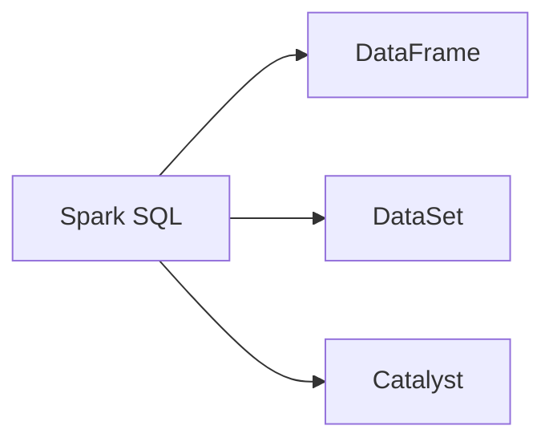
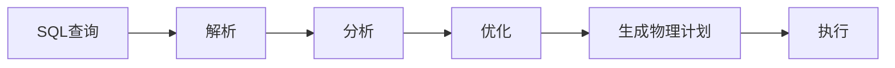

## 1.背景介绍

Apache Spark是一种快速、通用、可扩展的大数据处理引擎。Spark SQL是Spark的一个模块，用于处理结构化和半结构化数据。Spark SQL提供了一个编程接口，允许用户以编程方式处理结构化和半结构化数据，并且可以与其他Spark模块无缝集成，例如MLlib和GraphX。Spark SQL不仅支持各种关系数据库和NoSQL数据库，还可以处理各种数据格式，如JSON、Parquet、ORC等。

## 2.核心概念与联系

Spark SQL的核心是DataFrame和DataSet，它们都是分布式的数据集合。DataFrame是一个包含各种类型数据的分布式数据集，每一列都有一个名称和类型。DataSet是一个强类型的数据集，每一行都是一个对象。Spark SQL还包括一个强大的查询优化器Catalyst，它可以对SQL查询进行优化，以提高查询性能。



## 3.核心算法原理具体操作步骤

Spark SQL的工作流程可以分为以下几个步骤：

1. 解析：首先，Spark SQL将SQL查询解析为未解析的逻辑计划，这是一个树形结构，表示查询的各个部分。
2. 分析：然后，Spark SQL将未解析的逻辑计划转换为解析的逻辑计划，这涉及到验证表和列的存在，确定数据类型等。
3. 优化：接下来，Catalyst优化器对解析的逻辑计划进行优化，生成优化的逻辑计划。这包括常见的查询优化技术，如谓词下推、列剪裁等。
4. 生成物理计划：最后，Spark SQL将优化的逻辑计划转换为物理计划，这是一个可以在Spark集群上执行的计划。



## 4.数学模型和公式详细讲解举例说明

在Spark SQL中，查询优化是一个重要的环节。查询优化的目标是找到执行查询的最佳方式。这涉及到一些数学模型和公式。

例如，谓词下推是一种常见的查询优化技术。谓词下推的目标是尽早过滤掉不需要的数据，以减少数据处理的总体工作量。谓词下推可以用以下公式表示：

$$
\text{谓词下推} = \text{数据总量} - \text{过滤后的数据量}
$$

另一个例子是列剪裁。列剪裁的目标是只处理查询中需要的列，以减少数据处理的总体工作量。列剪裁可以用以下公式表示：

$$
\text{列剪裁} = \text{总列数} - \text{处理的列数}
$$

## 5.项目实践：代码实例和详细解释说明

接下来，我们通过一个简单的例子来演示如何使用Spark SQL。首先，我们需要创建一个SparkSession对象，这是Spark SQL的入口点。

```scala
val spark = SparkSession.builder().appName("Spark SQL example").getOrCreate()
```

然后，我们可以使用SparkSession对象的read方法读取数据，创建一个DataFrame。

```scala
val df = spark.read.json("examples/src/main/resources/people.json")
```

接下来，我们可以使用DataFrame的API进行数据处理。例如，我们可以使用filter方法过滤数据，使用select方法选择列。

```scala
df.filter("age > 30").select("name").show()
```

最后，我们可以使用SparkSession对象的sql方法执行SQL查询。

```scala
spark.sql("SELECT * FROM table WHERE age > 30").show()
```

## 6.实际应用场景

Spark SQL在各种场景中都有应用，例如：

1. ETL：Spark SQL可以用于从各种数据源读取数据，进行数据转换，然后写入到各种数据源。这是ETL（Extract, Transform, Load）的典型应用。
2. 数据分析：Spark SQL提供了丰富的数据处理和分析功能，可以用于大数据分析。
3. 机器学习：Spark SQL可以与MLlib无缝集成，可以用于机器学习的数据预处理。

## 7.工具和资源推荐

以下是一些有用的Spark SQL相关的工具和资源：

1. Spark官方文档：Spark的官方文档是学习Spark SQL的最佳资源。它提供了详细的API文档和教程。
2. Databricks：Databricks是Spark的商业版本。它提供了一些额外的功能，如可视化工具、集成的Notebook等。
3. Spark Summit：Spark Summit是一个关于Spark的年度会议。它提供了许多关于Spark SQL的演讲和教程。

## 8.总结：未来发展趋势与挑战

Spark SQL是一个强大的大数据处理工具，但它也面临一些挑战。例如，对于非常大的数据集，Spark SQL可能会遇到内存问题。此外，Spark SQL的错误消息有时可能难以理解。

尽管如此，我们认为Spark SQL有很大的发展潜力。随着Spark的不断发展，我们期待Spark SQL能够提供更多的功能，如更强大的查询优化、更好的错误处理等。

## 9.附录：常见问题与解答

1. 问题：Spark SQL支持哪些数据源？
   答：Spark SQL支持各种数据源，如关系数据库、NoSQL数据库、文件系统等。它也支持各种数据格式，如JSON、Parquet、ORC等。

2. 问题：Spark SQL如何优化查询？
   答：Spark SQL使用Catalyst优化器优化查询。Catalyst优化器使用一系列的规则，如谓词下推、列剪裁等，来优化查询。

3. 问题：Spark SQL和Hive有什么区别？
   答：Spark SQL和Hive都是用于处理大数据的工具，但它们有一些重要的区别。例如，Spark SQL支持更多的数据源和数据格式，提供更强大的查询优化，和其他Spark模块有更好的集成。

作者：禅与计算机程序设计艺术 / Zen and the Art of Computer Programming