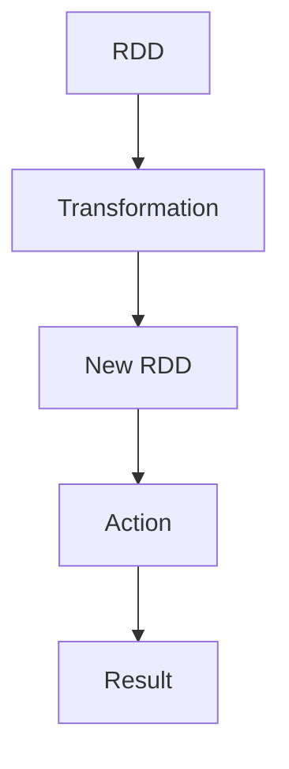
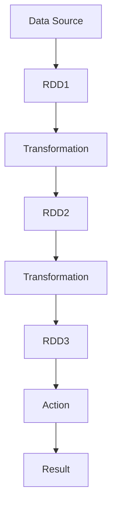
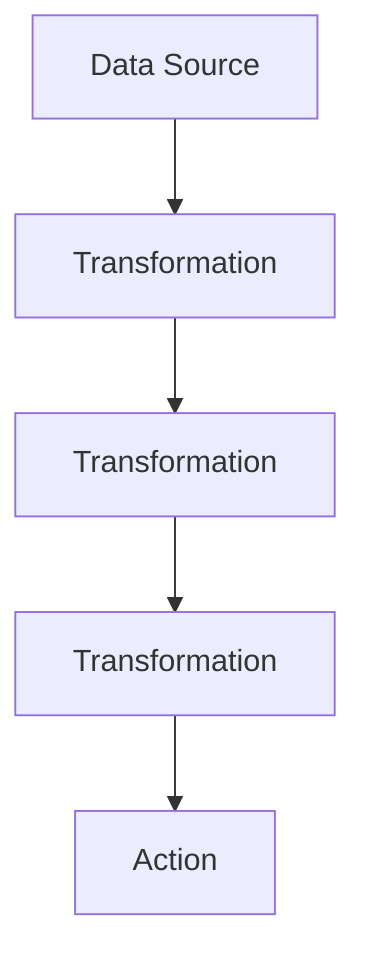

# Spark原理与代码实例讲解

## 1. 背景介绍

Apache Spark是一种快速、通用、可扩展的大数据处理引擎。它最初是由加州大学伯克利分校的AMPLab开发的,旨在弥补Hadoop MapReduce引擎在迭代计算、交互式查询和流式计算方面的不足。Spark可以在内存中进行计算,因此能够比Hadoop MapReduce更高效地执行大数据处理任务。

Spark的核心设计理念是基于弹性分布式数据集(Resilient Distributed Dataset, RDD)。RDD是一种分布式内存抽象,可以让程序员以统一的方式在集群上执行内存或磁盘计算。Spark还提供了高级API,如Spark SQL用于结构化数据处理,Spark Streaming用于流处理,MLlib用于机器学习,以及GraphX用于图形处理。

Spark生态系统不断发展,已经成为大数据处理领域事实上的标准。越来越多的公司和组织采用Spark进行大数据分析、机器学习、流处理等任务。

## 2. 核心概念与联系

### 2.1 RDD (Resilient Distributed Dataset)

RDD是Spark最基本的数据抽象,它是一种分布式内存抽象,表示一个不可变、分区的记录集合。RDD可以从HDFS、HBase或任何Hadoop数据源创建,也可以通过现有RDD转换而来。RDD支持两种操作:transformation(转换)和action(动作)。

转换操作会从现有RDD创建一个新的RDD,例如`map`、`filter`、`flatMap`、`union`等。动作操作会对RDD进行计算并返回结果,例如`count`、`collect`、`reduce`等。转换操作是延迟加载的,只有在执行动作操作时才会触发实际计算。

RDD具有容错性,如果其中一个分区数据丢失,它可以使用lineage(血统)从其他分区重新计算出丢失的数据分区。



### 2.2 Spark SQL

Spark SQL是Spark用于结构化数据处理的模块。它支持使用SQL或者DataFrame API来查询数据。DataFrame是一种以RDD为基础的分布式数据集,类似于传统数据库中的表。

Spark SQL可以从不同数据源创建DataFrame,如Hive表、Parquet文件、JSON等。用户可以使用SQL语句或DataFrame API对数据进行ETL、探索性数据分析和查询。

### 2.3 Spark Streaming 

Spark Streaming是Spark用于流式数据处理的组件。它将实时数据流分成多个批次,每个批次作为一个RDD进行处理。Spark Streaming提供了高度抽象的API,可以使用类似批处理的编程模型来处理流数据。

### 2.4 MLlib

MLlib是Spark提供的机器学习算法库。它包括常见的机器学习算法,如分类、回归、聚类、协同过滤等,并且可以在大规模数据集上并行运行。MLlib利用了Spark的分布式内存计算优势,可以高效地训练和评估模型。

### 2.5 GraphX

GraphX是Spark中用于图形计算和图形并行计算的API。它提供了一个基于Pregel的图形并行计算框架,以及一些常见的图形算法,如PageRank、三角形计数等。GraphX底层依赖于Spark的RDD,因此可以高效地处理大规模图形数据。

## 3. 核心算法原理具体操作步骤

### 3.1 RDD的创建

RDD可以通过两种方式创建:

1. **从集群外部存储系统(如HDFS、HBase等)创建**

   可以使用`SparkContext`的`textFile`、`wholeTextFiles`等方法从外部存储系统读取数据并创建RDD。

   ```scala
   val rdd = sc.textFile("hdfs://...")
   ```

2. **通过驱动程序中的集合创建并行化的RDD**

   可以使用`SparkContext`的`parallelize`方法从驱动程序中的集合创建RDD。

   ```scala
   val rdd = sc.parallelize(List(1,2,3,4))
   ```

### 3.2 RDD的转换操作

转换操作会从现有RDD创建一个新的RDD,常用的转换操作包括:

- `map`: 对RDD中每个元素应用函数
- `filter`: 返回RDD中满足条件的元素
- `flatMap`: 对RDD中每个元素应用函数并将结果扁平化
- `union`: 返回两个RDD的并集
- `join`: 基于键值对的RDD执行内连接操作
- ...

```scala
val rdd1 = sc.parallelize(List(1,2,3,4))
val rdd2 = rdd1.map(x => x * 2) // rdd2: (2, 4, 6, 8)
val rdd3 = rdd2.filter(x => x > 4) // rdd3: (6, 8)
```

### 3.3 RDD的行动操作

行动操作会对RDD进行计算并返回结果,常用的行动操作包括:

- `reduce`: 使用关联操作聚合RDD中的元素
- `collect`: 将RDD中的所有元素以数组的形式返回到驱动程序
- `count`: 返回RDD中元素的个数
- `take`: 返回RDD中的前n个元素
- `foreach`: 对RDD中每个元素应用函数
- ...

```scala
val rdd = sc.parallelize(List(1,2,3,4))
val sum = rdd.reduce((x, y) => x + y) // sum: 10
val cnt = rdd.count() // cnt: 4
val arr = rdd.collect() // arr: Array(1, 2, 3, 4)
```

### 3.4 RDD的血统(Lineage)

RDD的血统记录了RDD的元数据信息,包括创建RDD的操作步骤和依赖关系。当RDD的某个分区数据丢失时,Spark可以利用血统重新计算出该分区的数据,从而实现容错。



上图展示了一个RDD的血统关系。当`RDD3`的某个分区数据丢失时,Spark可以根据血统依次重新计算`RDD2`和`RDD1`的相应分区,最终重建`RDD3`的丢失分区。

## 4. 数学模型和公式详细讲解举例说明

### 4.1 RDD的分区原理

Spark会自动将RDD划分为多个分区(Partition),每个分区包含RDD的一部分数据。分区是Spark实现并行计算的基础。

假设有一个RDD包含N个记录,Spark集群有M个Executor进程。Spark会将RDD划分为P个分区,其中$P \geq M$。每个Executor进程会负责计算若干个分区。

如果$P = M$,即分区数等于Executor数,则每个Executor只需计算一个分区。如果$P > M$,则某些Executor需要计算多个分区。Spark会尽量将分区均匀分配给Executor,以实现负载均衡。

分区的数量P由`spark.default.parallelism`配置项确定,默认值为集群中所有Executor的CPU核心总数。我们也可以在创建RDD时手动指定分区数:

```scala
val rdd = sc.parallelize(data, numSlices=10)
```

上述代码会将数据集`data`划分为10个分区,构成一个RDD。

### 4.2 RDD的shuffle操作

Shuffle是Spark中一种重分区(Repartition)操作,它会根据分区函数(Partitioner)对RDD的数据进行重新组织。常见的shuffle操作包括:

- `repartition`: 根据指定的分区数重新分区
- `coalesce`: 用于减少RDD的分区数
- `join`、`groupByKey`等基于键值对的操作

Shuffle操作会导致大量的数据混洗,是Spark作业中最昂贵的操作。在进行Shuffle时,Spark会先在每个Executor内部进行洗牌操作,然后通过网络传输将数据分发到不同的Executor上。

为了优化Shuffle性能,Spark采用了以下策略:

1. **使用高效的Shuffle写入路径**:Spark使用高效的bucket映射技术将Shuffle写入数据划分到多个bucket中,减少了不同任务之间的竞争。

2. **动态计算Shuffle映射**:Spark在Shuffle阶段动态计算出每个Reducer的映射关系,避免了静态分区导致的数据倾斜问题。

3. **有效利用磁盘存储**:当内存中的Shuffle数据超出限制时,Spark会将溢出的数据写入磁盘,并在Shuffle时高效地合并磁盘上的数据。

### 4.3 Spark的DAG执行模型

Spark会将一个作业转化为一个有向无环图(DAG),每个RDD转换操作对应DAG中的一个节点。Spark的DAGScheduler会根据DAG调度各个任务在Executor上运行。



上图展示了一个简单的DAG结构。DAGScheduler会先启动`Action`操作对应的任务,然后递归地启动其依赖的`Transformation`任务,最终达到重新计算RDD的目的。

DAGScheduler会根据每个任务的优先级、locality等因素对任务进行调度,尽量将计算任务分配到距离数据源最近的节点上,以减少数据传输开销。

## 5. 项目实践:代码实例和详细解释说明

下面是一个使用Spark进行词频统计的示例:

```scala
import org.apache.spark.sql.SparkSession

object WordCount {
  def main(args: Array[String]): Unit = {
    // 创建SparkSession
    val spark = SparkSession.builder()
      .appName("WordCount")
      .getOrCreate()

    // 读取文本文件
    val textFile = spark.read.textFile("data/book.txt")

    // 分词并统计词频
    val counts = textFile
      .flatMap(line => line.split(" "))
      .map(word => (word, 1))
      .reduceByKey(_ + _)

    // 输出结果
    counts.foreach(println)

    // 停止SparkSession
    spark.stop()
  }
}
```

1. 首先,我们创建一个`SparkSession`对象,它是Spark程序的入口点。

2. 使用`spark.read.textFile`方法从文件系统读取一个文本文件,得到一个`Dataset`对象`textFile`。

3. 对`textFile`执行一系列的转换操作:
   - `flatMap(line => line.split(" "))`: 将每一行文本按空格分割成单词,得到一个扁平化的单词集合。
   - `map(word => (word, 1))`: 将每个单词映射为一个键值对`(word, 1)`。
   - `reduceByKey(_ + _)`: 对具有相同键(单词)的值(计数)进行求和,得到每个单词的词频统计结果。

4. 使用`foreach(println)`输出每个单词及其词频。

5. 最后,调用`spark.stop()`停止SparkSession。

上述代码展示了如何使用Spark的核心API(`flatMap`、`map`、`reduceByKey`等)进行数据转换和计算。在实际项目中,我们还可以使用Spark SQL、Spark Streaming等高级API进行更复杂的数据处理任务。

## 6. 实际应用场景

Spark被广泛应用于以下场景:

1. **大数据处理**:Spark可以高效地处理TB甚至PB级别的数据,被广泛应用于日志分析、网络爬虫、推荐系统等领域。

2. **机器学习与数据挖掘**:Spark MLlib提供了多种机器学习算法,可以在大规模数据集上进行模型训练和预测。

3. **流式计算**:Spark Streaming支持实时流数据处理,可以应用于网络监控、在线广告投放、物联网数据处理等场景。

4. **图形计算**:Spark GraphX为图形计算提供了高效的并行框架,可以用于社交网络分析、网页排名等应用。

5. **交互式数据分析**:Spark支持交互式数据探索和查询,可以与Jupyter Notebook、Zeppelin等工具集成,广泛应用于数据科学和商业智能领域。

## 7. 工具和资源推荐

- **Apache Spark官网**:https://spark.apache.org/
  - 包含Spark的文档、下载、社区资源等。

- **Spark编程指南**:https://spark.apache.org/docs/latest/rdd-programming-guide.html
  - 详细介绍了Spark RDD、Spark SQL