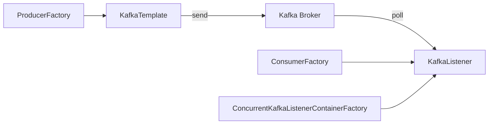

# SpringKafka：简化Kafka应用开发

## 1. 背景介绍

### 1.1 Kafka简介
Kafka是一个分布式的流处理平台,由LinkedIn开发,用Scala和Java编写。它提供了一个统一的、高吞吐量、低延迟的实时数据流平台,可以处理实时数据流。

### 1.2 SpringKafka诞生
为了简化在Spring应用中使用Kafka,SpringKafka项目应运而生。它提供了一套基于Spring的Kafka开发模板,让开发者可以快速上手Kafka应用开发。

### 1.3 SpringKafka优势
- 提供了高层抽象的模板类,屏蔽了Kafka API的复杂性
- 与Spring生态无缝整合,支持Spring Boot自动配置
- 支持注解驱动开发,提高开发效率
- 提供灵活的消息转换器,方便消息的序列化/反序列化

## 2. 核心概念与联系

### 2.1 Producer与Consumer
- Producer:消息生产者,负责发布消息到Kafka broker
- Consumer:消息消费者,负责订阅Kafka topic并消费消息

### 2.2 Topic与Partition
- Topic:Kafka消息的类别,可以理解为一个消息队列
- Partition:Topic物理上的分组,一个topic可以分为多个partition,每个partition是一个有序的队列

### 2.3 SpringKafka核心组件
- KafkaTemplate:用于发送消息的模板类
- @KafkaListener:消息监听器注解,标注在方法上监听指定的topic
- ConsumerFactory:消费者工厂,用于创建消费者实例
- ProducerFactory:生产者工厂,用于创建生产者实例
- ConcurrentKafkaListenerContainerFactory:监听器容器工厂,用于并发消费



## 3. 核心算法原理具体操作步骤

### 3.1 消息发送原理
1. 构造ProducerRecord对象,指定topic、partition、key和value
2. 通过KafkaTemplate.send方法发送消息
3. KafkaTemplate内部通过ProducerFactory创建KafkaProducer实例
4. KafkaProducer将消息序列化后发送到Kafka broker
5. Kafka broker接收到消息,将其追加到指定的partition

### 3.2 消息消费原理 
1. 通过@KafkaListener注解标注消费者方法,指定topic进行监听
2. ConcurrentKafkaListenerContainerFactory创建监听器容器
3. 监听器容器内部通过ConsumerFactory创建KafkaConsumer实例
4. KafkaConsumer订阅指定的topic,并轮询拉取消息 
5. 拉取到消息后进行反序列化,触发@KafkaListener标注的监听器方法进行消费

## 4. 数学模型和公式详细讲解举例说明

### 4.1 生产者吞吐量计算
假设生产者每秒发送 $n$ 条消息,每条消息大小为 $s$ bytes,则生产者吞吐量 $T_p$ 可按下式计算:

$$
T_p = n \times s
$$

例如,生产者每秒发送100条消息,每条消息大小为1KB,则其吞吐量为:
$$
T_p = 100 \times 1KB/s = 100 KB/s
$$

### 4.2 消费者吞吐量计算
假设消费者每秒消费 $m$ 条消息,每条消息大小为 $s$ bytes,则消费者吞吐量 $T_c$ 可按下式计算:

$$
T_c = m \times s
$$

例如,消费者每秒消费50条消息,每条消息大小为1KB,则其吞吐量为:  
$$
T_c = 50 \times 1KB/s = 50 KB/s
$$

### 4.3 消费者lag计算
消费者lag表示消费者未消费的消息数,假设生产者已发送的消息总数为 $N$,消费者已消费的消息总数为 $M$,则消费者lag $L$ 可按下式计算:

$$
L = N - M
$$

例如,生产者已发送1000条消息,消费者已消费800条消息,则消费者lag为:
$$
L = 1000 - 800 = 200
$$

## 5. 项目实践：代码实例和详细解释说明

### 5.1 消息生产者示例

```java
@Component
public class KafkaProducer {
    
    @Autowired
    private KafkaTemplate<String, String> kafkaTemplate;
    
    public void sendMessage(String topic, String message) {
        kafkaTemplate.send(topic, message);
    }
}
```

说明:
- 注入KafkaTemplate对象,泛型指定消息的key和value类型都为String
- 通过KafkaTemplate.send方法发送消息,指定topic和消息内容

### 5.2 消息消费者示例

```java
@Component
public class KafkaConsumer {
    
    @KafkaListener(topics = "test-topic")
    public void onMessage(String message) {
        System.out.println("Received message: " + message);
    }
}
```

说明:  
- 通过@KafkaListener注解标注消费者方法,指定监听的topic为"test-topic"
- 监听器方法接收一个String类型的参数,代表消息的内容
- 在方法内部可以根据业务需求对消息进行处理

### 5.3 消费者配置示例

```java
@Configuration
public class KafkaConfig {
    
    @Bean
    public ConsumerFactory<String, String> consumerFactory() {
        Map<String, Object> props = new HashMap<>();
        props.put(ConsumerConfig.BOOTSTRAP_SERVERS_CONFIG, "localhost:9092");
        props.put(ConsumerConfig.GROUP_ID_CONFIG, "test-group");
        props.put(ConsumerConfig.KEY_DESERIALIZER_CLASS_CONFIG, StringDeserializer.class);
        props.put(ConsumerConfig.VALUE_DESERIALIZER_CLASS_CONFIG, StringDeserializer.class);
        return new DefaultKafkaConsumerFactory<>(props);
    }
    
    @Bean
    public ConcurrentKafkaListenerContainerFactory<String, String> kafkaListenerContainerFactory() {
        ConcurrentKafkaListenerContainerFactory<String, String> factory = new ConcurrentKafkaListenerContainerFactory<>();
        factory.setConsumerFactory(consumerFactory());
        return factory;
    }
}
```

说明:
- 通过@Configuration注解标注配置类
- 配置ConsumerFactory,指定bootstrap server地址、消费者组id、key和value的反序列化器
- 配置ConcurrentKafkaListenerContainerFactory,设置ConsumerFactory属性

## 6. 实际应用场景

### 6.1 日志收集
利用Kafka的高吞吐特性,将分布式系统的日志收集到Kafka集群,再通过消费者将日志存储到HDFS、Elasticsearch等存储系统,实现日志的集中管理和分析。

### 6.2 消息通知
系统间的消息通知可以通过Kafka实现,例如在电商系统中,当订单状态发生变更时,可以将消息发送到Kafka,再由消费者触发邮件、短信等通知。

### 6.3 流式数据处理
Kafka可以与Spark Streaming、Flink等流式计算框架集成,实现实时数据处理。将数据实时摄入到Kafka,再由流计算框架消费Kafka数据进行计算处理。

## 7. 工具和资源推荐

### 7.1 Kafka Tool
一款Kafka集群管理工具,可以查看topic、broker状态,消息消费情况等。

### 7.2 Kafka Manager
Yahoo开源的Kafka集群管理工具,可以管理多个集群、检查集群状态、执行副本重分配等。

### 7.3 Kafka Eagle
一款Kafka集群监控和管理工具,可以查看topic、consumer、broker的状态,监控集群的流量、响应时间等。

### 7.4 Confluent
Kafka的商业化公司,提供了Kafka的企业版以及一系列围绕Kafka的工具,如KSQL、Schema Registry、REST Proxy等。

## 8. 总结：未来发展趋势与挑战

### 8.1 云原生化
随着云计算的发展,Kafka未来也将向云原生化方向发展,提供更灵活的部署方式和自动化运维能力,更好地支持云环境下的大规模数据处理场景。

### 8.2 与流计算深度融合
Kafka将与Spark、Flink等流计算引擎进一步融合,提供端到端的流式数据处理方案。通过SQL等高级语言来处理Kafka数据将成为趋势。

### 8.3 数据安全与治理
如何保证Kafka集群的数据安全和数据治理是一大挑战。未来Kafka将在数据加密、权限管控、审计等方面加强,满足企业级应用的合规需求。

### 8.4 消息格式演进
随着应用系统的不断演进,消息格式如何平滑升级也是一大挑战。Kafka社区正在探索更好的消息格式演进机制,以支持更灵活的数据结构变更。

## 9. 附录：常见问题与解答

### 9.1 Kafka如何保证消息的顺序性？
Kafka可以保证同一个partition内的消息是有序的。因此可以将具有相同key的消息路由到同一个partition,从而保证其顺序性。

### 9.2 Kafka如何实现消息的exactly once语义？
Kafka提供了acks和enable.idompotence等参数来保证生产者的exactly once语义。消费者可以使用幂等消费或事务来保证消费的exactly once语义。

### 9.3 Kafka消息会丢失吗？
正常情况下Kafka不会丢失消息。但如果producer发送消息没有收到broker的ack,或者leader副本还没来得及同步给follower副本就宕机,则有可能导致消息丢失。可以通过设置acks=-1和min.insync.replicas参数来提高可靠性。

### 9.4 SpringKafka如何配置消费者的offset提交方式？
SpringKafka支持自动提交和手动提交两种offset提交方式,分别通过AckMode.BATCH和AckMode.MANUAL_IMMEDIATE参数来设置。也可以通过配置enable.auto.commit和auto.commit.interval.ms参数来调整自动提交的频率。

---

作者：禅与计算机程序设计艺术 / Zen and the Art of Computer Programming