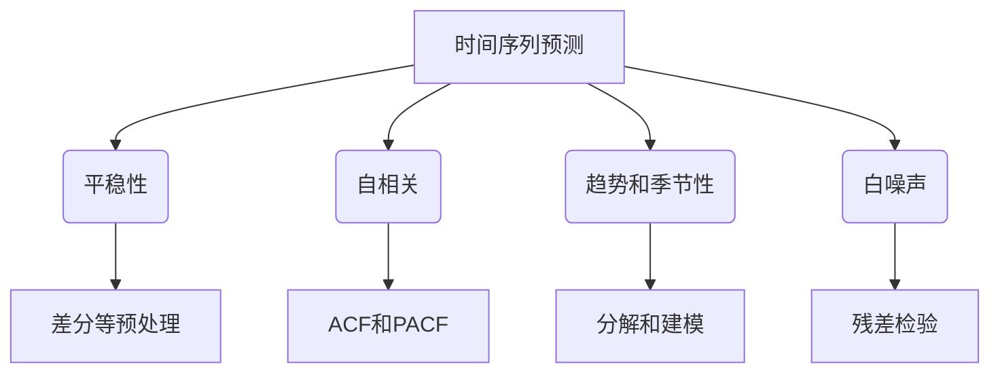
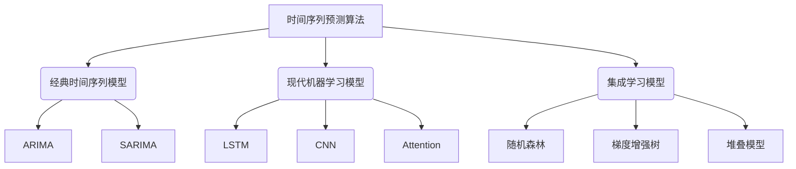

# Time Series Forecasting原理与代码实例讲解

## 1.背景介绍

时间序列预测是一种利用历史数据对未来事件进行预测的技术。它在各个领域都有广泛的应用,例如金融、天气预报、能源需求预测等。随着数据的快速积累和计算能力的提高,时间序列预测已经成为当前数据科学和机器学习领域的一个重要研究方向。

时间序列数据具有一些独特的特征,如自相关性、趋势性和周期性等,这使得传统的机器学习算法难以直接应用。因此,需要专门设计的时间序列预测模型和算法来捕捉这些特征,从而提高预测精度。

## 2.核心概念与联系

时间序列预测涉及以下几个核心概念:

### 2.1 平稳性(Stationarity)

平稳性指的是时间序列的统计属性(如均值和方差)在时间上保持不变。许多传统的时间序列预测方法,如ARIMA模型,要求数据是平稳的。如果数据不是平稳的,需要进行差分等预处理操作使其平稳化。

### 2.2 自相关(Autocorrelation)

自相关描述了时间序列在不同时间点之间的相关性。它反映了序列中观测值之间的依赖关系,是构建时间序列模型的基础。通过计算自相关函数(ACF)和偏自相关函数(PACF),可以确定适当的模型阶数。

### 2.3 趋势和季节性(Trend and Seasonality)

许多时间序列数据会呈现出趋势和季节性的模式。趋势反映了数据的总体走势,而季节性则表现为周期性的波动。在建模时需要对这些成分进行适当的处理,以提高预测精度。

### 2.4 白噪声(White Noise)

白噪声是指具有零均值、常数方差且不存在自相关性的随机过程。它是构建时间序列模型的基础假设,也是评估模型残差的重要标准。

这些核心概念相互关联,共同影响着时间序列预测模型的构建和性能。理解并正确处理这些概念对于获得高质量的预测结果至关重要。

## 3.核心算法原理具体操作步骤

时间序列预测的核心算法主要包括以下几类:

### 3.1 经典时间序列模型

#### 3.1.1 自回归移动平均模型(ARIMA)

ARIMA模型是时间序列预测中最经典和广泛使用的模型之一。它由三个部分组成:自回归(AR)部分、积分(I)部分和移动平均(MA)部分。ARIMA模型的构建步骤如下:

1. 检验数据平稳性,对非平稳数据进行差分处理
2. 通过ACF和PACF确定模型阶数p(AR阶数)和q(MA阶数)
3. 估计模型参数
4. 诊断检验模型残差
5. 使用拟合模型进行预测

ARIMA模型适用于平稳的时间序列数据,但对于存在趋势和季节性的数据,需要进行适当的分解处理。

#### 3.1.2 季节自回归综合移动平均模型(SARIMA)

SARIMA模型是ARIMA模型的扩展版本,专门用于处理具有季节性的时间序列数据。它在ARIMA模型的基础上增加了季节自回归(SAR)和季节移动平均(SMA)部分,能够有效捕获数据的季节性波动。

SARIMA模型的构建步骤与ARIMA类似,但需要额外确定季节阶数P(SAR阶数)和Q(SMA阶数)。

### 3.2 现代机器学习模型

随着深度学习技术的发展,一些基于神经网络的模型也被应用于时间序列预测任务,展现出了优异的性能。

#### 3.2.1 长短期记忆网络(LSTM)

LSTM是一种特殊设计的递归神经网络,能够有效捕捉时间序列数据中的长期依赖关系。它通过门控机制和记忆单元来控制信息的流动,从而避免了传统RNN存在的梯度消失和爆炸问题。

LSTM模型的训练过程包括:

1. 准备时间序列数据,可能需要进行归一化等预处理
2. 构建LSTM网络结构,包括LSTM层、全连接层等
3. 定义损失函数和优化器
4. 迭代训练模型,直到损失函数收敛
5. 在测试集上评估模型性能
6. 使用训练好的模型进行预测

#### 3.2.2 卷积神经网络(CNN)

CNN最初被设计用于计算机视觉任务,但也可以应用于时间序列预测。CNN能够自动学习时间序列数据中的局部模式,并对这些模式进行组合以捕获更高层次的特征。

CNN模型的训练过程与LSTM类似,但网络结构中包含卷积层和池化层等特殊层。在处理时间序列数据时,卷积核的维度需要与时间序列的维度相匹配。

#### 3.2.3 注意力机制(Attention Mechanism)

注意力机制是一种有助于神经网络模型捕捉长期依赖关系的技术。它通过自适应地分配不同时间步的权重,使模型能够更好地关注对预测任务更加重要的时间步,从而提高预测性能。

注意力机制可以与LSTM、CNN等模型相结合,形成各种注意力模型,如Attention-LSTM、Transformer等。这些模型在时间序列预测任务中表现出了优异的性能。

### 3.3 集成学习模型

除了单一的模型,集成学习技术也被广泛应用于时间序列预测,以提高预测的稳健性和准确性。常见的集成学习模型包括:

- 随机森林(Random Forest)
- 梯度增强树(Gradient Boosting Trees)
- 堆叠模型(Stacking Models)

这些模型通过组合多个基础模型的预测结果,能够有效降低过拟合风险,并提高预测的泛化能力。

无论采用何种算法,时间序列预测的关键步骤都包括数据预处理、模型构建、模型评估和模型调优等环节。在实际应用中,需要根据具体的问题场景和数据特征,选择合适的模型和算法。

## 4.数学模型和公式详细讲解举例说明

在时间序列预测中,数学模型和公式扮演着重要的角色。下面将详细介绍一些常用的数学模型和公式。

### 4.1 ARIMA模型

ARIMA(自回归综合移动平均模型)是时间序列预测中最经典的模型之一。它由三个部分组成:自回归(AR)部分、积分(I)部分和移动平均(MA)部分。

ARIMA模型的数学表达式如下:

$$
y_t = c + \phi_1 y_{t-1} + \phi_2 y_{t-2} + ... + \phi_p y_{t-p} + \theta_1 \epsilon_{t-1} + \theta_2 \epsilon_{t-2} + ... + \theta_q \epsilon_{t-q} + \epsilon_t
$$

其中:

- $y_t$ 是时间 $t$ 时的观测值
- $c$ 是常数项
- $\phi_1, \phi_2, ..., \phi_p$ 是自回归系数
- $\theta_1, \theta_2, ..., \theta_q$ 是移动平均系数
- $\epsilon_t$ 是时间 $t$ 时的白噪声项

如果时间序列数据不是平稳的,需要进行差分处理。差分后的ARIMA模型可以表示为:

$$
\nabla^d y_t = c + \phi_1 \nabla^d y_{t-1} + \phi_2 \nabla^d y_{t-2} + ... + \phi_p \nabla^d y_{t-p} + \theta_1 \epsilon_{t-1} + \theta_2 \epsilon_{t-2} + ... + \theta_q \epsilon_{t-q} + \epsilon_t
$$

其中 $\nabla^d$ 表示 $d$ 阶差分运算符。

ARIMA模型的参数估计通常采用最大似然估计或条件最小二乘估计等方法。

### 4.2 LSTM模型

LSTM(长短期记忆网络)是一种特殊设计的递归神经网络,能够有效捕捉时间序列数据中的长期依赖关系。它通过门控机制和记忆单元来控制信息的流动,从而避免了传统RNN存在的梯度消失和爆炸问题。

LSTM单元的数学表达式如下:

$$
\begin{aligned}
f_t &= \sigma(W_f \cdot [h_{t-1}, x_t] + b_f) \\
i_t &= \sigma(W_i \cdot [h_{t-1}, x_t] + b_i) \\
\tilde{C}_t &= \tanh(W_C \cdot [h_{t-1}, x_t] + b_C) \\
C_t &= f_t \odot C_{t-1} + i_t \odot \tilde{C}_t \\
o_t &= \sigma(W_o \cdot [h_{t-1}, x_t] + b_o) \\
h_t &= o_t \odot \tanh(C_t)
\end{aligned}
$$

其中:

- $f_t$ 是遗忘门,控制遗忘上一时间步的细胞状态
- $i_t$ 是输入门,控制当前输入与新细胞状态的组合
- $\tilde{C}_t$ 是候选细胞状态
- $C_t$ 是当前细胞状态
- $o_t$ 是输出门,控制细胞状态对隐藏状态的影响
- $h_t$ 是当前时间步的隐藏状态

LSTM通过这些门控机制和记忆单元,能够有效地捕捉长期依赖关系,从而提高时间序列预测的性能。

### 4.3 注意力机制

注意力机制是一种有助于神经网络模型捕捉长期依赖关系的技术。它通过自适应地分配不同时间步的权重,使模型能够更好地关注对预测任务更加重要的时间步,从而提高预测性能。

注意力机制的数学表达式如下:

$$
\begin{aligned}
e_{ij} &= \text{score}(s_i, h_j) \\
\alpha_{ij} &= \frac{\exp(e_{ij})}{\sum_{k=1}^{T} \exp(e_{ik})} \\
c_i &= \sum_{j=1}^{T} \alpha_{ij} h_j
\end{aligned}
$$

其中:

- $s_i$ 是查询向量(query vector)
- $h_j$ 是键值对(key-value pair)中的键向量(key vector)
- $\text{score}$ 是一个评分函数,用于计算查询向量与键向量之间的相关性
- $e_{ij}$ 是未归一化的注意力权重
- $\alpha_{ij}$ 是归一化后的注意力权重
- $c_i$ 是注意力加权和,代表了对所有键值对的加权求和

注意力机制能够自适应地分配不同时间步的权重,使模型能够更好地关注对预测任务更加重要的时间步,从而提高预测性能。它已被广泛应用于各种时间序列预测模型中,如Attention-LSTM、Transformer等。

通过这些数学模型和公式,我们可以更好地理解时间序列预测算法的内在原理,并为模型的构建和优化提供理论基础。

## 5.项目实践:代码实例和详细解释说明

为了更好地理解时间序列预测的实际应用,我们将使用Python中的开源库来实现一个基于ARIMA模型和LSTM模型的时间序列预测项目。

### 5.1 数据准备

我们将使用著名的航空公司乘客人数数据集进行实践。该数据集记录了1949年1