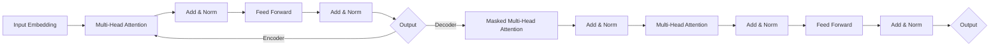

# Transformer大模型实战 BERT实战

## 1. 背景介绍
### 1.1 自然语言处理的发展历程
#### 1.1.1 早期的词袋模型
#### 1.1.2 Word2Vec与词向量
#### 1.1.3 RNN与LSTM
### 1.2 Transformer的诞生 
#### 1.2.1 Attention机制
#### 1.2.2 Transformer架构
### 1.3 BERT的崛起
#### 1.3.1 预训练语言模型
#### 1.3.2 BERT的特点
#### 1.3.3 BERT的影响力

## 2. 核心概念与联系
### 2.1 Transformer的核心概念
#### 2.1.1 Self-Attention
#### 2.1.2 Multi-Head Attention
#### 2.1.3 Positional Encoding
#### 2.1.4 Layer Normalization
#### 2.1.5 残差连接
### 2.2 BERT的核心概念  
#### 2.2.1 Masked Language Model(MLM)
#### 2.2.2 Next Sentence Prediction(NSP)
#### 2.2.3 WordPiece Embedding
### 2.3 Transformer与BERT的关系
#### 2.3.1 BERT是基于Transformer的预训练模型
#### 2.3.2 BERT在Transformer基础上的改进

## 3. 核心算法原理具体操作步骤
### 3.1 Transformer的核心算法
#### 3.1.1 Self-Attention计算过程
#### 3.1.2 Multi-Head Attention计算过程  
#### 3.1.3 前馈神经网络FFN
#### 3.1.4 Encoder和Decoder堆叠
### 3.2 BERT的预训练过程
#### 3.2.1 构建输入序列
#### 3.2.2 Masked LM的实现
#### 3.2.3 Next Sentence Prediction的实现
#### 3.2.4 预训练损失函数
### 3.3 BERT的微调过程
#### 3.3.1 下游任务的输入表示
#### 3.3.2 Fine-tuning的训练过程

## 4. 数学模型和公式详细讲解举例说明
### 4.1 Self-Attention的数学表示
#### 4.1.1 Query、Key、Value的计算
#### 4.1.2 Scaled Dot-Product Attention
#### 4.1.3 Mask操作
### 4.2 Multi-Head Attention的数学表示
#### 4.2.1 多头机制的意义
#### 4.2.2 多头Attention的拼接与线性变换
### 4.3 Transformer的数学表示
#### 4.3.1 Encoder的数学表示
#### 4.3.2 Decoder的数学表示
### 4.4 BERT的数学表示
#### 4.4.1 Masked LM的数学表示
#### 4.4.2 Next Sentence Prediction的数学表示
#### 4.4.3 微调阶段的数学表示

## 5. 项目实践：代码实例和详细解释说明
### 5.1 Transformer代码实现
#### 5.1.1 Self-Attention的代码实现
#### 5.1.2 Multi-Head Attention的代码实现
#### 5.1.3 Encoder和Decoder的代码实现
#### 5.1.4 Transformer完整代码
### 5.2 BERT预训练代码实现  
#### 5.2.1 构建输入序列的代码实现
#### 5.2.2 Masked LM的代码实现
#### 5.2.3 Next Sentence Prediction的代码实现
#### 5.2.4 预训练损失函数的代码实现
### 5.3 BERT微调代码实现
#### 5.3.1 下游任务输入的代码实现
#### 5.3.2 微调训练过程的代码实现
#### 5.3.3 微调预测过程的代码实现

## 6. 实际应用场景
### 6.1 自然语言理解
#### 6.1.1 命名实体识别
#### 6.1.2 关系抽取
#### 6.1.3 文本分类
### 6.2 问答系统
#### 6.2.1 阅读理解
#### 6.2.2 开放域问答
### 6.3 语言生成
#### 6.3.1 文本摘要
#### 6.3.2 对话生成
### 6.4 跨语言任务
#### 6.4.1 机器翻译
#### 6.4.2 跨语言文本分类

## 7. 工具和资源推荐
### 7.1 预训练模型
#### 7.1.1 BERT-Base与BERT-Large
#### 7.1.2 RoBERTa
#### 7.1.3 ALBERT
### 7.2 开源实现
#### 7.2.1 Google BERT
#### 7.2.2 Huggingface Transformers
#### 7.2.3 FastBERT
### 7.3 数据集资源
#### 7.3.1 GLUE基准测试
#### 7.3.2 SQuAD
#### 7.3.3 CoNLL-2003

## 8. 总结：未来发展趋势与挑战
### 8.1 模型效率提升
#### 8.1.1 模型蒸馏
#### 8.1.2 模型剪枝
#### 8.1.3 低精度量化
### 8.2 预训练范式创新
#### 8.2.1 对比学习
#### 8.2.2 半监督学习
#### 8.2.3 多任务学习
### 8.3 多模态融合
#### 8.3.1 图像-文本预训练
#### 8.3.2 视频-文本预训练
#### 8.3.3 语音-文本预训练
### 8.4 可解释性与鲁棒性
#### 8.4.1 注意力分析
#### 8.4.2 对抗攻击
#### 8.4.3 数据偏差

## 9. 附录：常见问题与解答
### 9.1 Transformer能处理变长序列吗？
### 9.2 BERT预训练需要多大的语料库？
### 9.3 为什么要使用WordPiece分词？
### 9.4 BERT微调需要调整哪些参数？
### 9.5 如何缓解BERT的过拟合问题？

Transformer作为一种强大的序列建模架构，其核心是Self-Attention机制。如上图所示，Transformer主要由编码器（Encoder）和解码器（Decoder）组成。编码器用于对输入序列进行特征提取，解码器根据编码器的输出和之前的输出预测下一个token。

在编码器中，首先将输入序列通过嵌入层（Embedding Layer）映射为连续向量表示，然后叠加位置编码（Positional Encoding）以引入序列的位置信息。接着通过多头自注意力机制（Multi-Head Attention）捕捉序列内部的依赖关系，并使用残差连接（Residual Connection）和层归一化（Layer Normalization）缓解梯度消失问题。最后经过前馈神经网络（Feed Forward Network）进一步提取特征。

解码器的结构与编码器类似，但在Self-Attention时会使用掩码（Mask）防止看到未来的信息。此外，解码器还会利用编码器的输出计算注意力权重，以捕捉输入序列与输出序列之间的关联。

BERT是一个基于Transformer编码器的预训练语言模型，通过引入Masked Language Model和Next Sentence Prediction两个预训练任务，在大规模无监督语料上学习通用的语言表示。在下游任务中，只需在BERT的基础上添加一个简单的输出层，并通过Fine-tuning的方式在任务特定的数据集上进行微调，即可在多个自然语言处理任务上取得优异的表现。

BERT的成功证明了预训练语言模型的巨大潜力，掀起了NLP领域的一场革命。大量的研究工作开始探索如何改进BERT，例如RoBERTa通过动态Masking和更大的批量提升性能，ALBERT通过参数共享和因式分解降低模型复杂度。

尽管Transformer系列模型已经在NLP领域取得了巨大的成功，但仍然存在一些亟待解决的问题和挑战。首先是模型效率问题，如何在保持性能的同时压缩模型体积，加速推理速度，是工业落地必须考虑的因素。其次是预训练范式的创新，现有的预训练任务仍然较为简单，如何设计更加有效的预训练目标，充分利用半监督数据和多模态信息，值得进一步探索。此外，将视觉、语音等多模态数据引入预训练，构建通用的跨模态语义理解模型，也是一个富有前景的研究方向。最后，随着模型规模和性能的不断提升，可解释性和鲁棒性问题日益凸显。如何理解大模型的决策过程，提高其在对抗环境下的稳定性，消除数据偏差的影响，这些都是亟待解决的难题。

总之，Transformer和BERT为自然语言处理领域带来了革命性的变化，大大推动了语言理解和生成技术的发展。展望未来，随着计算力的持续提升和数据规模的不断扩大，Transformer系列模型仍然大有可为。同时，面对效率、多模态、可解释性等方面的挑战，NLP研究者还需要付出持续不懈的努力。相信通过产学研各界的通力合作，Transformer和BERT必将继续引领NLP技术的发展，为人工智能的进步贡献力量。

作者：禅与计算机程序设计艺术 / Zen and the Art of Computer Programming