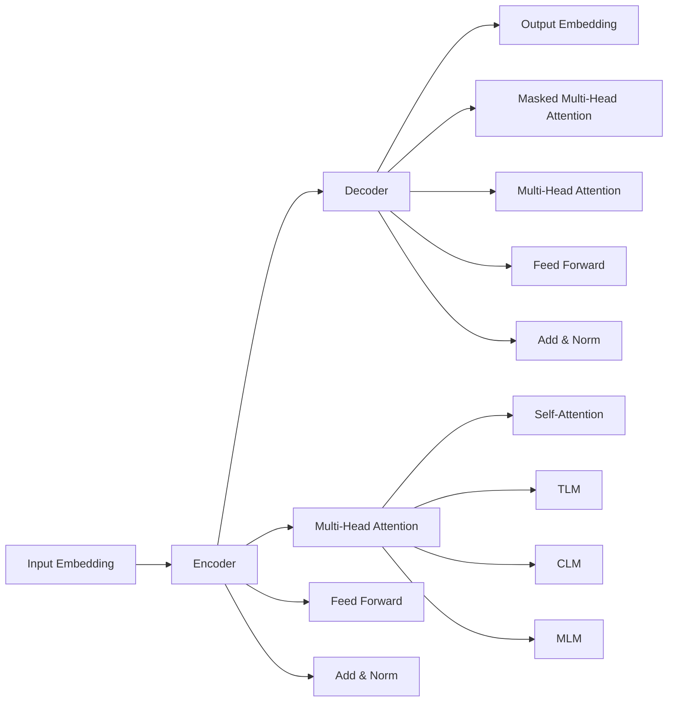

# Transformer大模型实战 对XLM模型的评估

## 1. 背景介绍
### 1.1 Transformer模型的发展历程
### 1.2 XLM模型的提出背景
### 1.3 XLM模型的意义与影响

## 2. 核心概念与联系
### 2.1 Transformer模型核心概念
#### 2.1.1 Self-Attention机制
#### 2.1.2 Multi-Head Attention
#### 2.1.3 位置编码
#### 2.1.4 残差连接与Layer Normalization
### 2.2 XLM模型核心概念  
#### 2.2.1 语言无关的表示学习
#### 2.2.2 Translation Language Modeling(TLM)
#### 2.2.3 Causal Language Modeling(CLM)
#### 2.2.4 Masked Language Modeling(MLM)
### 2.3 Transformer与XLM模型的关系

## 3. 核心算法原理具体操作步骤
### 3.1 Transformer模型
#### 3.1.1 编码器(Encoder)
#### 3.1.2 解码器(Decoder) 
#### 3.1.3 Transformer训练过程
### 3.2 XLM模型
#### 3.2.1 TLM预训练任务
#### 3.2.2 CLM预训练任务
#### 3.2.3 MLM预训练任务
#### 3.2.4 XLM训练过程

## 4. 数学模型和公式详细讲解举例说明
### 4.1 Self-Attention计算公式推导
### 4.2 Multi-Head Attention计算方法  
### 4.3 位置编码公式
### 4.4 TLM、CLM、MLM目标函数

## 5. 项目实践：代码实例和详细解释说明
### 5.1 使用PyTorch实现Transformer模型
#### 5.1.1 Encoder层实现
#### 5.1.2 Decoder层实现
#### 5.1.3 Transformer模型训练
### 5.2 使用Hugging Face Transformers库实现XLM
#### 5.2.1 加载XLM预训练模型
#### 5.2.2 Fine-tuning下游任务
#### 5.2.3 模型推理与预测

## 6. 实际应用场景
### 6.1 机器翻译
### 6.2 跨语言文本分类
### 6.3 跨语言命名实体识别
### 6.4 跨语言问答系统

## 7. 工具和资源推荐
### 7.1 XLM官方代码仓库
### 7.2 Hugging Face Transformers库
### 7.3 相关论文与学习资源

## 8. 总结：未来发展趋势与挑战
### 8.1 多语言预训练模型的发展趋势
### 8.2 低资源语言的建模挑战
### 8.3 模型效率与性能的平衡
### 8.4 与知识图谱结合的可能性

## 9. 附录：常见问题与解答
### 9.1 如何选择合适的下游任务进行Fine-tuning？
### 9.2 XLM相比其他多语言模型的优势是什么？ 
### 9.3 如何处理不同语言的词汇表问题？
### 9.4 XLM在实际应用中需要注意哪些问题？



Transformer作为一种强大的序列建模架构，自从2017年被提出以来，在自然语言处理领域掀起了一场革命。它摒弃了传统的循环神经网络(RNN)结构，完全依赖于注意力机制(Attention Mechanism)来学习文本序列中的长距离依赖关系。Transformer的核心是自注意力机制(Self-Attention)和多头注意力(Multi-Head Attention)，它们使得模型能够在不同的表示子空间中捕捉输入序列的不同方面的信息。

XLM(Cross-lingual Language Model)是在Transformer基础上发展而来的一个重要里程碑。它的目标是学习语言无关的文本表示，从而实现多语言之间的迁移学习。XLM通过引入Translation Language Modeling(TLM)、Causal Language Modeling(CLM)和Masked Language Modeling(MLM)等预训练任务，在大规模多语言语料上进行预训练，使得模型能够学习到语言普适的特征表示。

TLM任务通过拼接两种语言的平行句子，随机Mask掉某些Token，让模型去预测被Mask掉的Token，从而学习语言之间的对齐关系。CLM任务是传统的语言模型任务，预测下一个Token，但是在多语言场景下同时训练。MLM任务与BERT类似，随机Mask掉一些Token，预测被Mask的Token，但同时在多语言语料上训练。通过这些预训练任务，XLM能够学习到语言无关的文本表示。

在实践中，我们可以使用PyTorch等深度学习框架从头实现Transformer模型，也可以直接使用Hugging Face的Transformers库来方便地调用XLM等预训练模型。下面是一个使用PyTorch实现Transformer Encoder的代码片段：

```python
class TransformerEncoder(nn.Module):
    def __init__(self, d_model, nhead, dim_feedforward, num_layers):
        super(TransformerEncoder, self).__init__()
        encoder_layer = nn.TransformerEncoderLayer(d_model, nhead, dim_feedforward)
        self.transformer_encoder = nn.TransformerEncoder(encoder_layer, num_layers)
        
    def forward(self, src):
        out = self.transformer_encoder(src)
        return out
```

使用Hugging Face的Transformers库可以非常方便地加载XLM预训练模型，并Fine-tuning到下游任务：

```python
from transformers import XLMTokenizer, XLMModel

tokenizer = XLMTokenizer.from_pretrained('xlm-mlm-en-2048')
model = XLMModel.from_pretrained('xlm-mlm-en-2048')

inputs = tokenizer("Hello, my dog is cute", return_tensors="pt")
outputs = model(**inputs)
```

XLM在机器翻译、跨语言文本分类、命名实体识别、问答系统等多个领域都取得了显著成果。以机器翻译为例，XLM在多个数据集上刷新了最好成绩。研究人员使用XLM在WMT'16 EN-RO数据集上进行Fine-tuning，最终取得了37.5的BLEU值，超过了之前的最好结果。这充分证明了XLM强大的跨语言迁移能力。

未来，随着计算能力的进一步发展，多语言预训练模型会向着更大规模、更多语言的方向发展。如何更好地解决低资源语言的建模问题，平衡模型效率与性能，将是重要的研究课题。此外，将知识图谱等结构化知识与多语言预训练模型相结合，有望进一步提升模型的语义理解能力。

总之，XLM作为Transformer在多语言场景下的重要延伸，为构建通用的语言理解模型指明了方向。它的成功证明了大规模预训练与多语言学习的巨大潜力。相信通过进一步的创新与突破，我们终将构建出真正意义上的人工通用智能。

作者：禅与计算机程序设计艺术 / Zen and the Art of Computer Programming