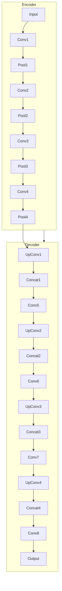

# UNet原理与代码实例讲解

## 1.背景介绍

在深度学习领域,卷积神经网络(CNN)已经取得了令人瞩目的成就,尤其是在图像分类、目标检测等计算机视觉任务中表现出色。然而,对于图像分割任务,传统的CNN结构存在一些局限性。图像分割的目标是对图像中的每个像素进行分类,将图像划分为不同的语义区域,这对于许多应用场景(如医学图像分析、自动驾驶等)至关重要。

针对图像分割任务的挑战,Olaf Ronneberger等人在2015年提出了U-Net架构,这是一种全卷积网络,专门设计用于生物医学图像分割。U-Net的创新之处在于其特殊的编码器-解码器结构,能够有效地捕获图像的上下文信息,并精确地定位目标边界。自问世以来,U-Net及其变体在多个领域的图像分割任务中取得了卓越的表现,成为深度学习图像分割的经典模型之一。

## 2.核心概念与联系

### 2.1 编码器-解码器架构

U-Net的核心思想是采用编码器-解码器架构,如下图所示:



编码器部分类似于传统CNN,由多个卷积层和池化层组成,用于提取图像的特征表示。解码器部分则负责将编码器输出的特征图还原为与输入图像相同分辨率的分割结果。

在解码器阶段,U-Net采用了一种特殊的跳跃连接机制,将编码器阶段相应层的特征图与解码器阶段的特征图进行拼接,从而融合不同层次的特征信息。这种设计使得U-Net能够同时利用上下文信息和细节信息,提高了分割的准确性。

### 2.2 全卷积网络

与传统CNN不同,U-Net完全由卷积层组成,没有全连接层。这种全卷积设计使得U-Net可以处理任意大小的输入图像,而不受输入分辨率的限制。同时,全卷积网络还能有效地减少参数量,降低计算复杂度。

## 3.核心算法原理具体操作步骤

U-Net的核心算法原理可以概括为以下几个步骤:

1. **编码器阶段**:输入图像经过多个卷积层和池化层,特征图的分辨率逐步降低,但特征表示的语义信息逐渐增强。

2. **底部阶段**:在编码器的最底部,有几个卷积层用于进一步提取特征。

3. **解码器阶段**:从编码器的底部开始,通过上采样(如反卷积)操作逐步恢复特征图的分辨率。

4. **跳跃连接**:在解码器的每一层,将相应编码器层的特征图与当前解码器层的特征图进行拼接,融合不同层次的特征信息。

5. **输出层**:最后一层是一个卷积层,输出与输入图像相同分辨率的分割结果,每个像素对应一个类别概率。

下面是U-Net的具体操作步骤:

1. 将输入图像馈送到编码器,经过多个卷积层和池化层,特征图的分辨率逐步降低,但特征表示的语义信息逐渐增强。

2. 在编码器的最底部,有几个卷积层用于进一步提取特征。

3. 从编码器的底部开始,通过上采样(如反卷积)操作逐步恢复特征图的分辨率,同时将相应编码器层的特征图与当前解码器层的特征图进行拼接,融合不同层次的特征信息。

4. 在解码器的每一层,对拼接后的特征图进行卷积操作,提取新的特征表示。

5. 最后一层是一个卷积层,输出与输入图像相同分辨率的分割结果,每个像素对应一个类别概率。

6. 在训练阶段,使用适当的损失函数(如交叉熵损失)计算预测结果与真实标签之间的差异,并通过反向传播算法优化网络参数。

7. 在测试或推理阶段,将输入图像馈送到训练好的U-Net模型,得到对应的分割结果。

## 4.数学模型和公式详细讲解举例说明

U-Net的数学模型主要包括以下几个部分:

### 4.1 卷积层

卷积层是U-Net的基本构建模块。对于输入特征图 $X$ 和卷积核 $K$,卷积操作可以表示为:

$$
Y_{i,j} = \sum_{m,n} X_{i+m,j+n} \cdot K_{m,n}
$$

其中 $Y$ 是输出特征图, $i,j$ 表示输出特征图的位置, $m,n$ 表示卷积核的大小。

### 4.2 池化层

池化层用于降低特征图的分辨率,同时保留重要的特征信息。最大池化是一种常见的池化操作,它取池化窗口内的最大值作为输出:

$$
Y_{i,j} = \max_{(m,n) \in R} X_{i+m,j+n}
$$

其中 $R$ 表示池化窗口的大小。

### 4.3 上采样层

在解码器阶段,U-Net使用上采样层(如反卷积)来恢复特征图的分辨率。反卷积操作可以表示为:

$$
Y_{i,j} = \sum_{m,n} X_{i-m,j-n} \cdot K_{m,n}
$$

其中 $K$ 是反卷积核, $X$ 是输入特征图, $Y$ 是输出特征图。

### 4.4 跳跃连接

跳跃连接是U-Net的关键创新之处。它将编码器层的特征图与解码器层的特征图进行拼接,融合不同层次的特征信息。假设编码器层的特征图为 $X_e$,解码器层的特征图为 $X_d$,则拼接操作可以表示为:

$$
X_c = \text{concat}(X_e, X_d)
$$

其中 $X_c$ 是拼接后的特征图。

### 4.5 损失函数

在训练阶段,U-Net通常使用像素级别的损失函数,如交叉熵损失或Dice损失。对于二分类问题,交叉熵损失可以表示为:

$$
L = -\frac{1}{N} \sum_{i=1}^{N} \left[ y_i \log(p_i) + (1 - y_i) \log(1 - p_i) \right]
$$

其中 $N$ 是像素数量, $y_i$ 是真实标签, $p_i$ 是预测概率。

### 4.6 示例

以下是一个简单的示例,说明如何使用卷积、池化和上采样操作。假设输入特征图为 $3 \times 3$:

$$
X = \begin{bmatrix}
1 & 2 & 3\\
4 & 5 & 6\\
7 & 8 & 9
\end{bmatrix}
$$

1. 对 $X$ 进行 $2 \times 2$ 的最大池化操作,步长为2,得到输出特征图 $Y_1$:

$$
Y_1 = \begin{bmatrix}
5 & 6\\
8 & 9
\end{bmatrix}
$$

2. 对 $Y_1$ 进行 $2 \times 2$ 的反卷积操作,步长为2,得到输出特征图 $Y_2$:

$$
Y_2 = \begin{bmatrix}
5 & 6 & 0 & 0\\
8 & 9 & 0 & 0\\
0 & 0 & 0 & 0\\
0 & 0 & 0 & 0
\end{bmatrix}
$$

3. 对 $Y_2$ 进行 $3 \times 3$ 的卷积操作,卷积核为:

$$
K = \begin{bmatrix}
1 & 1 & 1\\
1 & 1 & 1\\
1 & 1 & 1
\end{bmatrix}
$$

得到输出特征图 $Y_3$:

$$
Y_3 = \begin{bmatrix}
45 & 54 & 18\\
63 & 72 & 27\\
27 & 36 & 9
\end{bmatrix}
$$

这个简单的示例展示了U-Net中常见的操作,如卷积、池化和上采样。在实际应用中,U-Net会采用更复杂的结构和参数设置,以获得更好的分割性能。

## 5.项目实践:代码实例和详细解释说明

以下是使用PyTorch实现U-Net的代码示例,并对关键部分进行了详细解释。

```python
import torch
import torch.nn as nn

class UNet(nn.Module):
    def __init__(self, in_channels, out_channels):
        super(UNet, self).__init__()

        # 编码器部分
        self.conv1 = self.conv_block(in_channels, 64)
        self.pool1 = nn.MaxPool2d(2)
        self.conv2 = self.conv_block(64, 128)
        self.pool2 = nn.MaxPool2d(2)
        self.conv3 = self.conv_block(128, 256)
        self.pool3 = nn.MaxPool2d(2)
        self.conv4 = self.conv_block(256, 512)
        self.pool4 = nn.MaxPool2d(2)

        # 底部部分
        self.conv5 = self.conv_block(512, 1024)

        # 解码器部分
        self.upconv4 = self.upconv_block(1024, 512)
        self.conv6 = self.conv_block(1024, 512)
        self.upconv3 = self.upconv_block(512, 256)
        self.conv7 = self.conv_block(512, 256)
        self.upconv2 = self.upconv_block(256, 128)
        self.conv8 = self.conv_block(256, 128)
        self.upconv1 = self.upconv_block(128, 64)
        self.conv9 = self.conv_block(128, 64)

        # 输出层
        self.conv10 = nn.Conv2d(64, out_channels, kernel_size=1)

    def forward(self, x):
        # 编码器部分
        conv1 = self.conv1(x)
        pool1 = self.pool1(conv1)
        conv2 = self.conv2(pool1)
        pool2 = self.pool2(conv2)
        conv3 = self.conv3(pool2)
        pool3 = self.pool3(conv3)
        conv4 = self.conv4(pool3)
        pool4 = self.pool4(conv4)

        # 底部部分
        conv5 = self.conv5(pool4)

        # 解码器部分
        upconv4 = self.upconv4(conv5)
        concat4 = torch.cat((upconv4, conv4), dim=1)
        conv6 = self.conv6(concat4)
        upconv3 = self.upconv3(conv6)
        concat3 = torch.cat((upconv3, conv3), dim=1)
        conv7 = self.conv7(concat3)
        upconv2 = self.upconv2(conv7)
        concat2 = torch.cat((upconv2, conv2), dim=1)
        conv8 = self.conv8(concat2)
        upconv1 = self.upconv1(conv8)
        concat1 = torch.cat((upconv1, conv1), dim=1)
        conv9 = self.conv9(concat1)

        # 输出层
        output = self.conv10(conv9)

        return output

    def conv_block(self, in_channels, out_channels):
        block = nn.Sequential(
            nn.Conv2d(in_channels, out_channels, kernel_size=3, padding=1),
            nn.BatchNorm2d(out_channels),
            nn.ReLU(inplace=True),
            nn.Conv2d(out_channels, out_channels, kernel_size=3, padding=1),
            nn.BatchNorm2d(out_channels),
            nn.ReLU(inplace=True)
        )
        return block

    def upconv_block(self, in_channels, out_channels):
        block = nn.ConvTranspose2d(in_channels, out_channels, kernel_size=2, stride=2)
        return block
```

上述代码实现了U-Net的核心结构,包括编码器、底部、解码器和输出层。下面对关键部分进行详细解释:

1. `__init