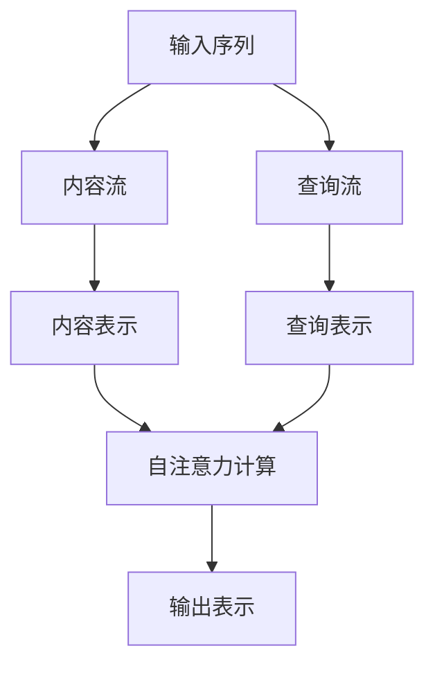

# XLNet原理与代码实例讲解

## 1. 背景介绍

### 1.1 自然语言处理的发展历程

自然语言处理(Natural Language Processing, NLP)是人工智能领域的一个重要分支,旨在使计算机能够理解和生成人类语言。近年来,随着深度学习技术的快速发展,NLP取得了令人瞩目的进展。

传统的NLP方法主要依赖于规则和特征工程,需要大量的人工努力。而深度学习模型能够自动从大规模数据中学习特征表示,极大地提高了NLP系统的性能和泛化能力。

### 1.2 预训练语言模型的兴起

预训练语言模型(Pre-trained Language Model, PLM)是NLP领域的一个重大突破。这种模型通过在大规模无标注语料库上进行预训练,学习到通用的语言表示,然后可以在下游任务上进行微调,大幅提升了性能。

代表性的预训练语言模型包括:

- **Word2Vec**(2013年)和**GloVe**(2014年):静态词向量表示模型
- **ELMo**(2018年):基于双向LSTM的上下文敏感词向量表示
- **GPT**(2018年)和**BERT**(2018年):基于Transformer的预训练模型

其中,BERT模型提出了全新的"masked language model"预训练目标,取得了突破性的进展,成为NLP领域的里程碑式模型。

### 1.3 XLNet的背景

尽管BERT模型取得了卓越的成绩,但它仍然存在一些缺陷和局限性:

1. **预训练目标不够合理**:BERT采用的"masked language model"预训练目标,会破坏输入序列的自然语义,导致预训练和微调之间存在不一致性。
2. **缺乏依赖捕捉能力**:BERT在编码器中采用了独立的位置编码,缺乏对位置依赖的建模能力。
3. **存在预测偏置**:BERT的注意力掩码机制会引入不对称的预测偏置。

为了解决BERT模型的这些缺陷,XLNet被提出,旨在构建一个更加合理和高效的预训练语言模型。

## 2. 核心概念与联系

### 2.1 自回归语言模型(Auto-Regressive Language Model)

自回归语言模型是XLNet的核心思想,它基于自回归(Auto-Regressive)的假设,即一个词的概率只依赖于它之前的词序列。形式化地,自回归语言模型的目标是最大化给定上文的下一个词的条件概率:

$$P(x) = \prod_{t=1}^{T}P(x_t|x_1, x_2, ..., x_{t-1})$$

其中,$x$是长度为$T$的词序列,$x_t$是序列中的第$t$个词。

基于这一思想,XLNet通过最大化所有可能的排列顺序的概率来进行预训练,从而捕捉双向上下文信息,避免了BERT中"masked language model"的缺陷。

### 2.2 排列语言模型(Permutation Language Modeling)

为了实现对所有可能排列顺序的建模,XLNet引入了排列语言模型(Permutation Language Modeling)的概念。具体来说,对于长度为$T$的序列,XLNet会生成其所有$T!$种可能的排列顺序,并最大化这些排列序列的联合概率:

$$\begin{aligned}
\mathcal{L}_\text{PLM}(\theta) &= \sum_{\pi \in \Pi(T)} \log P_\theta(x_{\pi(1)}, x_{\pi(2)}, ..., x_{\pi(T)}) \\
&= \sum_{\pi \in \Pi(T)} \sum_{t=1}^T \log P_\theta(x_{\pi(t)} | x_{\pi(1)}, ..., x_{\pi(t-1)})
\end{aligned}$$

其中,$\Pi(T)$表示长度为$T$的所有排列,$\pi$是其中一种排列,$\theta$是模型参数。

通过这种方式,XLNet能够在预训练阶段学习到双向上下文信息,避免了BERT中"masked language model"的局限性。

### 2.3 双流自注意力机制(Two-Stream Self-Attention)

为了有效地捕捉位置依赖关系,XLNet提出了双流自注意力机制(Two-Stream Self-Attention)。这种机制将输入分成两个数据流:

1. **内容流(Content Stream)**: 表示输入词的实际内容
2. **查询流(Query Stream)**: 表示当前位置的查询向量

在自注意力计算中,查询向量只与内容流进行注意力计算,而不与查询流计算,从而避免了BERT中存在的预测偏置问题。

通过这种双流机制,XLNet能够更好地捕捉位置依赖关系,提高了模型的表现能力。

### 2.4 相对位置编码(Relative Positional Encoding)

为了进一步增强位置信息的建模能力,XLNet采用了相对位置编码(Relative Positional Encoding)的方法。与BERT中的绝对位置编码不同,相对位置编码能够直接捕捉词与词之间的相对位置关系,从而更好地建模长距离依赖。

具体来说,XLNet在自注意力计算中引入了一个相对位置偏置项,用于编码两个词之间的相对位置信息。这种方式避免了绝对位置编码的局限性,提高了模型对长距离依赖的建模能力。

## 3. 核心算法原理具体操作步骤

### 3.1 XLNet的预训练过程

XLNet的预训练过程包括以下几个主要步骤:

1. **生成排列序列**:对于长度为$T$的输入序列,生成其所有$T!$种可能的排列顺序。
2. **构建内容流和查询流**:将每个排列序列分成内容流和查询流两个数据流。
3. **相对位置编码**:计算每个词与其他词之间的相对位置偏置。
4. **双流自注意力计算**:使用内容流和查询流进行自注意力计算,得到每个位置的表示向量。
5. **目标函数计算**:根据自回归语言模型的目标函数,计算当前位置词的条件概率,并最大化所有排列序列的联合概率。
6. **梯度更新**:使用梯度下降法更新模型参数。

### 3.2 XLNet的微调过程

在下游任务上,XLNet的微调过程与其他预训练语言模型类似,主要包括以下步骤:

1. **数据预处理**:将下游任务的数据转换为模型可接受的格式。
2. **微调设置**:设置微调的超参数,如学习率、批大小等。
3. **微调训练**:在下游任务的数据上进行微调训练,更新模型参数。
4. **模型评估**:在测试集上评估微调后模型的性能。

需要注意的是,在微调过程中,XLNet不再需要生成排列序列,而是直接使用原始输入序列进行计算。这样可以避免排列序列生成的计算开销,提高了模型的效率。

## 4. 数学模型和公式详细讲解举例说明

### 4.1 自回归语言模型

自回归语言模型的目标是最大化给定上文的下一个词的条件概率:

$$P(x) = \prod_{t=1}^{T}P(x_t|x_1, x_2, ..., x_{t-1})$$

其中,$x$是长度为$T$的词序列,$x_t$是序列中的第$t$个词。

这个公式表示,整个序列$x$的概率可以分解为每个位置$t$的条件概率的乘积,即每个词的概率只依赖于它之前的词序列。

例如,对于句子"我爱学习自然语言处理",我们可以将其概率分解为:

$$\begin{aligned}
P(\text{我爱学习自然语言处理}) &= P(\text{我}) \times P(\text{爱} | \text{我}) \times P(\text{学习} | \text{我爱}) \\
&\quad \times P(\text{自然} | \text{我爱学习}) \times P(\text{语言} | \text{我爱学习自然}) \\
&\quad \times P(\text{处理} | \text{我爱学习自然语言})
\end{aligned}$$

通过最大化这个条件概率的乘积,我们可以学习到一个能够很好地捕捉上下文信息的语言模型。

### 4.2 排列语言模型

为了实现对所有可能排列顺序的建模,XLNet引入了排列语言模型(Permutation Language Modeling)的概念。对于长度为$T$的序列,XLNet会生成其所有$T!$种可能的排列顺序,并最大化这些排列序列的联合概率:

$$\begin{aligned}
\mathcal{L}_\text{PLM}(\theta) &= \sum_{\pi \in \Pi(T)} \log P_\theta(x_{\pi(1)}, x_{\pi(2)}, ..., x_{\pi(T)}) \\
&= \sum_{\pi \in \Pi(T)} \sum_{t=1}^T \log P_\theta(x_{\pi(t)} | x_{\pi(1)}, ..., x_{\pi(t-1)})
\end{aligned}$$

其中,$\Pi(T)$表示长度为$T$的所有排列,$\pi$是其中一种排列,$\theta$是模型参数。

例如,对于句子"我爱学习自然语言处理",它的一种可能的排列是"学习我自然语言爱处理",那么我们需要最大化这个排列序列的联合概率:

$$\begin{aligned}
P_\theta(\text{学习}, \text{我}, \text{自然}, \text{语言}, \text{爱}, \text{处理}) &= P_\theta(\text{学习}) \times P_\theta(\text{我} | \text{学习}) \\
&\quad \times P_\theta(\text{自然} | \text{学习我}) \times P_\theta(\text{语言} | \text{学习我自然}) \\
&\quad \times P_\theta(\text{爱} | \text{学习我自然语言}) \times P_\theta(\text{处理} | \text{学习我自然语言爱})
\end{aligned}$$

通过对所有可能的排列序列进行建模,XLNet能够学习到双向上下文信息,避免了BERT中"masked language model"的缺陷。

### 4.3 双流自注意力机制

XLNet采用了双流自注意力机制来捕捉位置依赖关系。具体来说,输入序列被分成两个数据流:内容流$\mathbf{h}$和查询流$\mathbf{g}$。在自注意力计算中,查询向量$\mathbf{q}_t$只与内容流$\mathbf{h}$进行注意力计算,而不与查询流$\mathbf{g}$计算,从而避免了BERT中存在的预测偏势问题。

具体的计算公式如下:

$$\begin{aligned}
\mathbf{q}_t &= \mathbf{W}_q \mathbf{g}_t \\
\mathbf{k}_t &= \mathbf{W}_k \mathbf{h}_t \\
\mathbf{v}_t &= \mathbf{W}_v \mathbf{h}_t \\
\alpha_{t,j} &= \frac{\exp(\mathbf{q}_t^\top \mathbf{k}_j)}{\sum_{i=1}^T \exp(\mathbf{q}_t^\top \mathbf{k}_i)} \\
\mathbf{o}_t &= \sum_{j=1}^T \alpha_{t,j} \mathbf{v}_j
\end{aligned}$$

其中,$\mathbf{W}_q$、$\mathbf{W}_k$和$\mathbf{W}_v$分别是查询、键和值的线性投影矩阵,$\alpha_{t,j}$是注意力权重,$\mathbf{o}_t$是第$t$个位置的输出表示。

通过这种双流机制,XLNet能够更好地捕捉位置依赖关系,提高了模型的表现能力。

### 4.4 相对位置编码

为了进一步增强位置信息的建模能力,XLNet采用了相对位置编码(Relative Positional Encoding)的方法。与BERT中的绝对位置编码不同,相对位置编码能够直接捕捉词与词之间的相对位置关系,从而更好地建模长距离依赖。

具体来说,XLNet在自注意力计算中引入了一个相对位置偏置项$\mathbf{a}_{ij}$,用于编码两个词$i$和$j