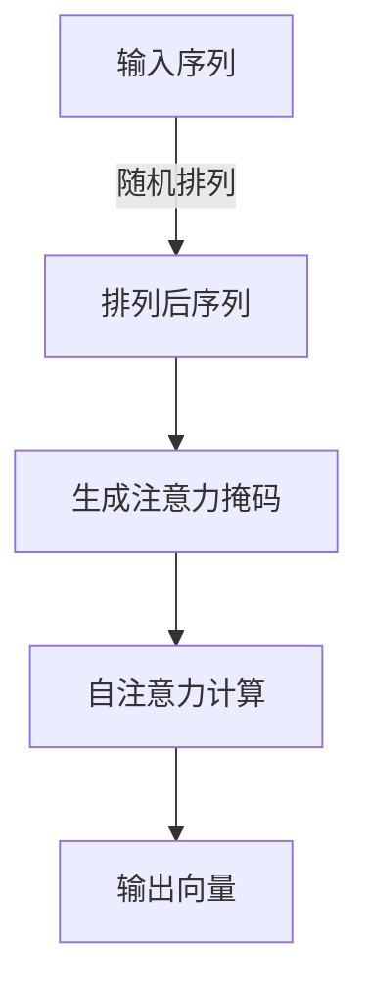
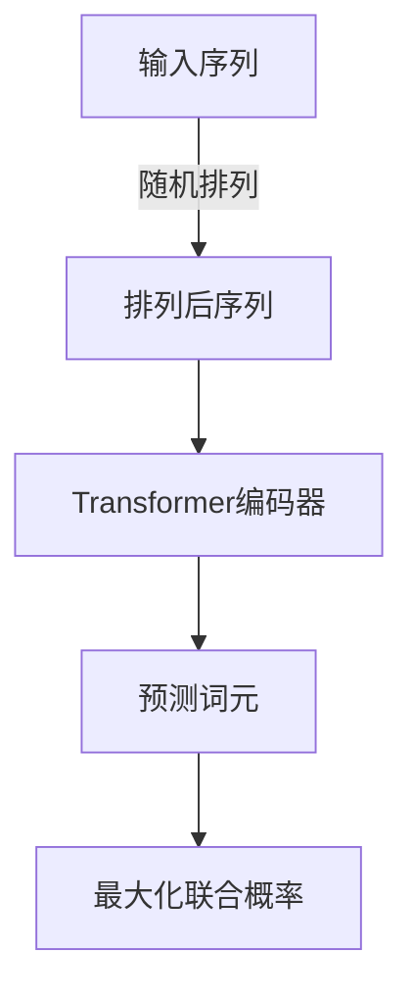

# XLNet实战技巧：提升模型性能的实用指南

## 1.背景介绍

在自然语言处理领域,Transformer模型因其出色的性能而备受关注。作为Transformer模型的一种变体,XLNet凭借其创新的自注意力掩码机制和改进的目标函数,展现出了卓越的性能表现。本文将深入探讨XLNet模型,揭示其核心原理,并提供实用技巧来优化模型性能,帮助读者更好地利用这一强大的语言模型。

## 2.核心概念与联系

### 2.1 Transformer模型回顾

Transformer是一种基于自注意力机制的序列到序列模型,广泛应用于机器翻译、文本生成等任务。它通过自注意力机制捕捉序列中元素之间的依赖关系,避免了RNN模型的长期依赖问题。

### 2.2 XLNet模型介绍

XLNet是一种改进的Transformer模型,旨在解决传统语言模型中的残差问题和上下文依赖问题。它采用了一种称为Permutation Language Modeling(PLM)的新颖目标函数,通过对输入序列进行随机排列,使模型能够同时捕捉到双向上下文信息。

### 2.3 核心创新点

XLNet的核心创新点包括:

1. **自注意力掩码机制**: 与传统语言模型只能看到左侧或右侧上下文不同,XLNet可以同时利用双向上下文信息。

2. **Permutation Language Modeling**: 通过对输入序列进行随机排列,XLNet可以更好地建模双向上下文依赖关系。

3. **改进的目标函数**: XLNet采用了一种新的目标函数,旨在最大化所有可能的排列顺序的概率。

## 3.核心算法原理具体操作步骤

### 3.1 自注意力掩码机制

XLNet的自注意力掩码机制允许模型同时利用双向上下文信息。具体操作步骤如下:

1. 对输入序列进行随机排列,获得排列后的序列。
2. 为每个位置生成一个注意力掩码,该掩码指示该位置可以看到哪些其他位置的信息。
3. 在自注意力计算过程中,将注意力分数与掩码相乘,从而只关注允许的上下文信息。



### 3.2 Permutation Language Modeling

Permutation Language Modeling(PLM)是XLNet的核心创新之一。它通过对输入序列进行随机排列,使模型能够同时捕捉双向上下文信息。具体操作步骤如下:

1. 对输入序列进行随机排列,获得排列后的序列。
2. 使用Transformer encoder对排列后的序列进行编码,获得上下文表示。
3. 对于每个位置,预测该位置的词元,同时利用其他位置的上下文信息。
4. 最大化所有可能的排列顺序的联合概率。



### 3.3 改进的目标函数

XLNet采用了一种新的目标函数,旨在最大化所有可能的排列顺序的概率。具体来说,对于一个长度为n的序列,存在n!种可能的排列顺序。XLNet的目标是最大化这些排列顺序的联合概率:

$$\max_{\theta} \sum_{\pi \in \Pi_n} \log P_\theta(x_{\pi(1)}, x_{\pi(2)}, \dots, x_{\pi(n)})$$

其中,θ表示模型参数,$\Pi_n$表示所有可能的排列顺序集合,π表示一种特定的排列顺序。

通过最大化这种目标函数,XLNet可以更好地捕捉双向上下文依赖关系,从而提高语言模型的性能。

## 4.数学模型和公式详细讲解举例说明

### 4.1 自注意力机制

自注意力机制是Transformer模型的核心,它允许模型捕捉序列中元素之间的依赖关系。对于一个长度为n的序列$X = (x_1, x_2, \dots, x_n)$,自注意力计算过程如下:

1. 将输入序列$X$线性映射到查询(Query)、键(Key)和值(Value)向量:

$$\begin{aligned}
Q &= XW^Q \\
K &= XW^K \\
V &= XW^V
\end{aligned}$$

其中,$W^Q, W^K, W^V$分别表示查询、键和值的线性变换矩阵。

2. 计算查询和键之间的点积,获得注意力分数矩阵:

$$\text{Attention}(Q, K, V) = \text{softmax}\left(\frac{QK^T}{\sqrt{d_k}}\right)V$$

其中,$d_k$表示键向量的维度,用于缩放点积值。

3. 将注意力分数与值向量相乘,获得加权和表示:

$$\text{Attention}(Q, K, V) = \sum_{i=1}^n \alpha_i v_i$$

其中,$\alpha_i$表示第i个位置的注意力分数,$v_i$表示第i个位置的值向量。

在XLNet中,自注意力计算过程还需要结合注意力掩码,以确保只关注允许的上下文信息。

### 4.2 Permutation Language Modeling

Permutation Language Modeling(PLM)是XLNet的核心创新之一。它通过对输入序列进行随机排列,使模型能够同时捕捉双向上下文信息。

对于一个长度为n的序列$X = (x_1, x_2, \dots, x_n)$,PLM的目标是最大化所有可能的排列顺序的联合概率:

$$\max_{\theta} \sum_{\pi \in \Pi_n} \log P_\theta(x_{\pi(1)}, x_{\pi(2)}, \dots, x_{\pi(n)})$$

其中,θ表示模型参数,$\Pi_n$表示所有可能的排列顺序集合,π表示一种特定的排列顺序。

在实践中,由于计算所有可能的排列顺序是不可行的,因此XLNet采用了一种近似方法。具体来说,对于每个训练样本,XLNet会随机采样一个排列顺序π,并最大化该排列顺序的条件概率:

$$\max_{\theta} \log P_\theta(x_{\pi(1)}, x_{\pi(2)}, \dots, x_{\pi(n)} | \pi)$$

通过这种方式,XLNet可以有效地捕捉双向上下文依赖关系,从而提高语言模型的性能。

## 5.项目实践:代码实例和详细解释说明

在本节中,我们将提供一个基于PyTorch实现的XLNet示例代码,并详细解释每个部分的功能。

### 5.1 导入必要的库

```python
import torch
import torch.nn as nn
from transformers import XLNetModel, XLNetLMHeadModel
```

我们首先导入PyTorch和Transformers库,后者提供了预训练的XLNet模型。

### 5.2 定义XLNet模型

```python
class XLNetForSequenceClassification(nn.Module):
    def __init__(self, num_labels=2):
        super(XLNetForSequenceClassification, self).__init__()
        self.xlnet = XLNetModel.from_pretrained('xlnet-base-cased')
        self.classifier = nn.Linear(self.xlnet.config.hidden_size, num_labels)

    def forward(self, input_ids, attention_mask=None, token_type_ids=None):
        outputs = self.xlnet(input_ids, attention_mask=attention_mask, token_type_ids=token_type_ids)
        last_hidden_state = outputs.last_hidden_state
        pooled_output = last_hidden_state[:, 0, :]  # 取第一个token的隐藏状态
        logits = self.classifier(pooled_output)
        return logits
```

在这个示例中,我们定义了一个用于序列分类任务的XLNet模型。该模型包含两个主要部分:

1. `XLNetModel`模块:这是预训练的XLNet模型,用于生成输入序列的隐藏状态表示。
2. `nn.Linear`模块:这是一个线性层,用于将隐藏状态映射到目标标签空间。

在`forward`函数中,我们首先将输入序列传递给`XLNetModel`,获得最后一层的隐藏状态表示。然后,我们取第一个token的隐藏状态作为pooled output,并将其传递给线性层,得到最终的分类logits。

### 5.3 训练和评估模型

```python
# 准备数据
train_dataset = ...  # 加载训练数据
val_dataset = ...    # 加载验证数据

# 初始化模型
model = XLNetForSequenceClassification(num_labels=2)

# 定义损失函数和优化器
criterion = nn.CrossEntropyLoss()
optimizer = torch.optim.Adam(model.parameters(), lr=2e-5)

# 训练循环
for epoch in range(num_epochs):
    for batch in train_dataset:
        # 准备输入
        input_ids, attention_mask, token_type_ids, labels = batch
        
        # 前向传播
        logits = model(input_ids, attention_mask, token_type_ids)
        loss = criterion(logits, labels)
        
        # 反向传播
        loss.backward()
        optimizer.step()
        optimizer.zero_grad()
        
    # 评估模型
    model.eval()
    with torch.no_grad():
        val_loss, val_acc = evaluate(model, val_dataset)
    model.train()
    
    print(f'Epoch {epoch+1}: Val Loss = {val_loss}, Val Acc = {val_acc}')
```

在这个示例中,我们展示了如何训练和评估XLNet模型。具体步骤如下:

1. 准备训练和验证数据集。
2. 初始化XLNet模型实例。
3. 定义损失函数(交叉熵损失)和优化器(Adam优化器)。
4. 进入训练循环,对于每个批次:
   - 准备输入数据(输入序列、注意力掩码、token类型id和标签)。
   - 进行前向传播,计算logits和损失。
   - 反向传播,更新模型参数。
5. 在每个epoch结束时,评估模型在验证集上的性能(损失和准确率)。

请注意,这只是一个简化的示例,在实际应用中,您可能需要进行更多的数据预处理、模型微调和超参数调整。

## 6.实际应用场景

XLNet作为一种强大的语言模型,在自然语言处理领域有着广泛的应用场景,包括但不限于:

1. **文本分类**: XLNet可以用于各种文本分类任务,如情感分析、新闻分类、垃圾邮件检测等。
2. **文本生成**: XLNet可以用于生成高质量的文本内容,如新闻报道、小说创作、对话系统等。
3. **机器翻译**: XLNet可以用于构建高性能的机器翻译系统,提高翻译质量。
4. **问答系统**: XLNet可以用于构建智能问答系统,从大规模文本数据中提取相关信息回答用户的问题。
5. **信息抽取**: XLNet可以用于从非结构化文本中抽取关键信息,如命名实体识别、关系抽取等。
6. **文本摘要**: XLNet可以用于自动生成文本摘要,帮助用户快速掌握文本的核心内容。

总的来说,XLNet作为一种先进的语言模型,为各种自然语言处理任务提供了强大的支持,在工业界和学术界都有广泛的应用前景。

## 7.工具和资源推荐

在使用XLNet进行实际项目开发时,以下工具和资源可能会派上用场:

1. **Transformers库**: Hugging Face的Transformers库提供了XLNet和其他多种预训练语言模型的实现,支持PyTorch和TensorFlow两种框架。
2. **XLNet预训练模型**: Transformers库中包含了多种预训练的XLNet模型,如`xlnet-base-cased`和`xlnet-large-cased`等,可以直接下载使用。
3. **XLNet论文**: XLNet模型的原始论文《XLNet: Generalized Autoregressive Pretraining for Language Understanding》详细介绍了模型的理论基础和实现细节。
4. **XLNet代码库**: XLNet的官方代码库位于Google的GitHub仓库中,提供了模型训练和评估的示例代码。
5. **自然语言处理数据集**: 根据具体的应用场景,可以使