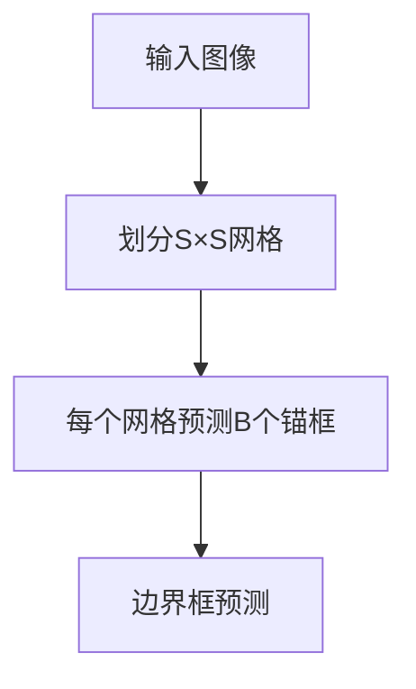
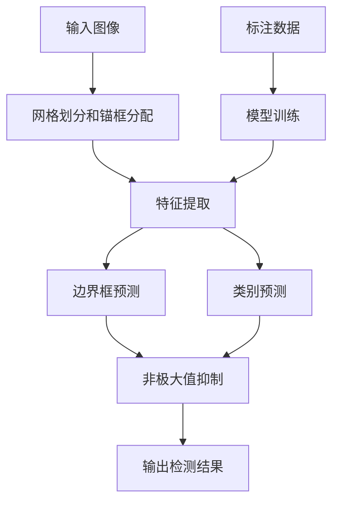

# YOLOv2在无人机巡检场景中的应用优化

## 1.背景介绍

### 1.1 无人机巡检的重要性

近年来,无人机在电力、石油管道、铁路等基础设施巡检领域得到了广泛应用。与传统人工巡检相比,无人机巡检具有成本低、效率高、安全性好等优势。然而,如何快速、准确地从大量无人机获取的图像数据中检测出缺陷区域,一直是无人机巡检面临的主要挑战。

### 1.2 目标检测技术概述  

目标检测是计算机视觉领域的核心任务之一,旨在从图像或视频中自动定位并识别感兴趣的目标。传统的目标检测算法主要基于手工设计的特征和滑动窗口机制,计算复杂度高、实时性差。近年来,基于深度学习的目标检测算法取得了长足进展,代表性算法包括R-CNN系列、YOLO系列和SSD等。

### 1.3 YOLO系列算法简介

YOLO(You Only Look Once)是一种端到端的实时目标检测系统。相比传统的基于区域提取的两阶段方法,YOLO将目标检测重新构建为单个回归问题,直接从图像像素预测边界框坐标和相应的类别概率,因此具有极高的预测速度。YOLOv2作为YOLO系列的改进版本,在保持高速的同时,显著提升了检测精度。

## 2.核心概念与联系

### 2.1 YOLO检测原理

YOLO将输入图像划分为S×S个网格,每个网格负责预测B个边界框以及每个边界框所属的类别概率。具体来说,YOLO的输出为S×S×(B×5+C)维张量,其中B×5对应每个边界框的(x,y,w,h,confidence)5个值,C则为每个边界框所属类别的概率值。

```mermaid
graph TD
    A[输入图像] --> B[卷积神经网络]
    B --> C[S×S×(B×5+C)张量输出]
    C --> D[边界框预测]
    C --> E[类别预测]
```

### 2.2 锚框机制

为了处理不同尺度的目标,YOLO采用了锚框(anchor box)机制。每个网格单元会预测与若干个预设锚框尺度相匹配的边界框,从而提高了对不同大小目标的检测能力。



### 2.3 非极大值抑制

由于存在多个边界框预测相同目标的情况,YOLO采用非极大值抑制(NMS)算法来消除这种冗余。NMS根据预测框的置信度得分和预测框之间的重叠程度,保留置信度最高的那些框,从而获得最终的检测结果。

## 3.核心算法原理具体操作步骤

YOLOv2算法的核心步骤如下:

1. **网格划分和锚框分配**
    - 将输入图像划分为S×S个网格单元
    - 为每个网格单元指定B个不同尺度的锚框(anchor box)

2. **特征提取**
    - 使用Darknet-19作为骨干网络提取图像特征

3. **边界框预测**
    - 对每个锚框,预测其包含目标的置信度(objectness score)
    - 对每个锚框,预测其相对于网格单元的(x,y)偏移量和相对于锚框的(w,h)比例

4. **类别预测**
    - 对每个锚框,预测其所属类别的条件概率分布

5. **非极大值抑制(NMS)**
    - 根据预测框的置信度和预测框之间的重叠程度,过滤掉冗余的预测框

6. **模型训练**
    - 使用多尺度训练和新的分类损失函数,提高小目标检测能力和模型收敛速度

以上步骤可由下面的流程图直观展示:



## 4.数学模型和公式详细讲解举例说明

### 4.1 边界框预测

对于每个锚框,YOLO需要预测其包含目标的置信度(objectness score)以及相对于网格单元的(x,y)偏移量和相对于锚框的(w,h)比例。具体地,设锚框的预测值为$\hat{b}_x, \hat{b}_y, \hat{b}_w, \hat{b}_h, \hat{c}$,其中$\hat{c}$为置信度得分。那么,该锚框的实际边界框坐标$(b_x, b_y, b_w, b_h)$可由下式计算:

$$
\begin{aligned}
b_x &= \sigma(tx) + c_x\\  
b_y &= \sigma(ty) + c_y\\
b_w &= p_we^{tw}\\
b_h &= p_he^{th}
\end{aligned}
$$

其中,$(c_x, c_y)$是当前网格单元的左上角坐标,$\sigma$是sigmoid函数,$(p_w, p_h)$是锚框的宽高。$(t_x, t_y, t_w, t_h)$分别为YOLO网络预测的$(x, y, w, h)$的调节参数。

### 4.2 类别预测

对于每个锚框,YOLO还需要预测其所属类别的条件概率分布$P(C_i|Object)$。设有C个类别,那么对于第i个锚框,其类别概率向量为$\hat{\mathbf{p}}_i = (p_{i1}, p_{i2}, ..., p_{iC})$,其中$p_{ij}=P(C_j|Object)$。在训练阶段,该概率向量的损失函数定义为:

$$
\begin{aligned}
\lambda_{noobj}^{ij}\sum_{l\neq obj}(c_i)^2 + \lambda_{obj}^{ij}\sum_{l=obj}(c_i-\hat{c}_i)^2
\end{aligned}
$$

其中,$\lambda_{noobj}$和$\lambda_{obj}$分别为不含目标和含目标时的损失权重。$c_i$为实际的置信度(0或1),$\hat{c}_i$为预测的置信度。

### 4.3 YOLOv2改进

相比v1版本,YOLOv2在以下几个方面做出了改进:

1. **更好的骨干网络**
    - 采用Darknet-19代替原来的GoogLeNet,提高了特征提取能力

2. **批归一化(Batch Normalization)**
    - 加速模型收敛,提高模型泛化能力

3. **高分辨率分类器**
    - 在骨干网络后接高分辨率的3×3卷积层,增强了对小目标的检测能力

4. **多尺度训练**
    - 输入图像尺寸从{320,352,...,608},每10个批次随机选择一个尺寸,增强了对不同尺度目标的适应性

5. **新的分类损失函数**
    - 采用logistic损失代替原来的平方根损失,提高了模型收敛速度

6. **锚框聚类**
    - 通过K-means聚类算法在训练集上自动学习锚框尺寸,提高了对不同形状目标的适应性

以上改进使得YOLOv2在保持高速的同时,显著提升了检测精度。

## 5.项目实践:代码实例和详细解释说明

以下是使用Python和PyTorch实现YOLOv2目标检测的简化代码示例:

```python
import torch
import torch.nn as nn

# 定义锚框
anchors = [(1.3221, 1.73145), (3.19275, 4.00944), (5.05587, 8.09892), (9.47112, 4.84053), (11.2364, 10.0071)]

# YOLOv2网络
class YOLOv2(nn.Module):
    def __init__(self, num_classes=20):
        super(YOLOv2, self).__init__()
        # 骨干网络
        self.backbone = Darknet19() 
        
        # 检测头
        self.detection_head = nn.Sequential(
            nn.Conv2d(1024, 1024, 3, padding=1),
            nn.BatchNorm2d(1024),
            nn.LeakyReLU(0.1),
            nn.Conv2d(1024, len(anchors)*(5+num_classes), 1)
        )

    def forward(self, x):
        x = self.backbone(x)  # 特征提取
        x = self.detection_head(x)  # 边界框和类别预测
        return x

# 解析网络输出
def decode_output(output, anchors, num_classes):
    batch_size = output.size(0)
    grid_size = output.size(2)
    
    output = output.view(batch_size, len(anchors), 5+num_classes, grid_size, grid_size)
    output = output.permute(0, 1, 3, 4, 2).contiguous()
    
    # 解析预测
    x, y, w, h, conf, cls = torch.split(output, [1, 1, 1, 1, 1, num_classes], dim=-1)
    
    # 应用sigmoid和指数函数
    x = torch.sigmoid(x)
    y = torch.sigmoid(y)
    w = torch.exp(w) * anchors[:, 0:1].view(1, len(anchors), 1, 1)
    h = torch.exp(h) * anchors[:, 1:2].view(1, len(anchors), 1, 1)
    conf = torch.sigmoid(conf)
    cls = torch.sigmoid(cls)
    
    # 构建预测边界框
    grid_x = torch.arange(grid_size).repeat(grid_size, 1).view([1, 1, grid_size, grid_size]).type(torch.FloatTensor)
    grid_y = torch.arange(grid_size).repeat(grid_size, 1).t().view([1, 1, grid_size, grid_size]).type(torch.FloatTensor)
    x = x.data + grid_x
    y = y.data + grid_y
    
    return x, y, w, h, conf, cls

# 非极大值抑制
def nms(boxes, scores, overlap=0.5, top_k=200):
    # ...
    return keep
    
# 模型推理
def detect(model, img):
    output = model(img)  # 前向传播
    x, y, w, h, conf, cls = decode_output(output, anchors, num_classes)  # 解析输出
    
    # 过滤低置信度边界框
    conf_mask = (conf > 0.5).float()
    detection = torch.cat((x.view(-1,1), y.view(-1,1), w.view(-1,1), h.view(-1,1), conf*conf_mask.view(-1,1), cls.view(-1,num_classes)), 1)
    
    # 非极大值抑制
    keep = nms(detection[:,:4], detection[:,4])
    output = detection[keep]
    
    return output
```

上述代码实现了YOLOv2网络的前向传播、输出解析和非极大值抑制等核心步骤。其中:

- `YOLOv2`类定义了网络结构,包括Darknet19骨干网络和检测头。
- `decode_output`函数将网络输出解析为(x,y,w,h,conf,cls)等预测值。
- `nms`函数实现了非极大值抑制算法,用于消除冗余的预测框。
- `detect`函数将以上步骤串联,完成目标检测的整个过程。

在实际应用中,还需要进行数据预处理、模型训练、后处理等步骤。此外,可以针对无人机巡检场景进行算法优化,如小目标检测、实时性提升等,以满足实际需求。

## 6.实际应用场景

### 6.1 电力线路巡检

电力线路巡检是无人机巡检的典型应用场景。传统的人工巡检费时费力,且存在一定安全隐患。使用YOLOv2等先进的目标检测算法,可以自动从无人机拍摄的图像中检测出绝缘子、接头等关键部件的缺陷,大大提高了巡检效率和安全性。

### 6.2 石油管道监测

石油管道监测对于及时发现渗漏等问题至关重要。无人机搭载高清摄像头,可以对管道沿线进行全天候监控。通过YOLOv2算法,能够准确检测出管道腐蚀、破损等缺陷,为后续维修提供位置信息。

### 6.3 铁路检测

无人机可用于铁路线路、桥梁等设施的检测。YOLOv2{"msg_type":"generate_answer_finish","data":"","from_module":null,"from_unit":null}