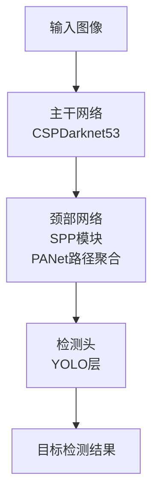

# YOLOv4原理与代码实例讲解

## 1.背景介绍

在计算机视觉领域,目标检测是一项重要且具有挑战性的任务。它旨在从图像或视频中定位并识别出感兴趣的目标对象。随着深度学习技术的不断发展,基于卷积神经网络(CNN)的目标检测算法已经取得了令人瞩目的成就,并在多个领域得到了广泛应用,如安防监控、自动驾驶、机器人视觉等。

在众多目标检测算法中,YOLO(You Only Look Once)系列算法凭借其独特的设计理念和卓越的性能,成为了目标检测领域中最受欢迎和广泛使用的算法之一。YOLO算法的核心思想是将目标检测任务转化为一个回归问题,通过单次评估直接预测出目标的边界框位置和类别,从而实现高效的端到端目标检测。

YOLOv4是YOLO系列算法的最新版本,它在保留了YOLO算法简单高效的优势的同时,通过一系列创新和改进,进一步提升了算法的检测精度和运行速度。本文将深入探讨YOLOv4的核心原理、关键技术细节以及实际应用,为读者提供全面的理解和实践指导。

## 2.核心概念与联系

在深入探讨YOLOv4的细节之前,我们先来回顾一下目标检测任务的核心概念,以及YOLOv4与其他目标检测算法之间的联系。

### 2.1 目标检测任务

目标检测任务的目标是从给定的图像或视频中找出感兴趣目标的位置(通过预测边界框坐标)和类别。它可以被视为图像分类和目标定位两个子任务的结合。传统的目标检测算法通常采用两阶段的方式:首先生成大量候选区域,然后对每个候选区域进行分类。这种方法虽然可以获得较高的检测精度,但计算效率较低。

### 2.2 YOLO系列算法

YOLO(You Only Look Once)算法的核心思想是将目标检测任务转化为一个回归问题,通过单次评估直接预测出目标的边界框位置和类别,从而实现高效的端到端目标检测。YOLO算法将输入图像划分为若干个网格,每个网格负责预测其覆盖区域内的目标。通过这种设计,YOLO算法能够极大地提高目标检测的速度,同时保持较高的检测精度。

YOLOv4是YOLO系列算法的最新版本,它在保留了YOLO算法简单高效的优势的同时,通过一系列创新和改进,进一步提升了算法的检测精度和运行速度。YOLOv4的主要改进包括:

1. 采用了更强大的主干网络(如CSPDarknet53)和更高效的网络结构(如SPP模块和PANet路径聚合)
2. 引入了更有效的数据增强和正则化技术(如Mosaic数据增强和DropBlock正则化)
3. 优化了损失函数和目标分配策略
4. 支持更多的训练技巧(如自对抗训练和对抗性迁移学习)

通过这些创新,YOLOv4在保持了YOLO算法高效的同时,检测精度和鲁棒性都得到了显著提升,使其成为目前最先进的实时目标检测算法之一。

## 3.核心算法原理具体操作步骤

### 3.1 网络架构

YOLOv4的网络架构可以分为三个主要部分:主干网络(Backbone)、颈部网络(Neck)和检测头(Head)。

1. **主干网络(Backbone)**:YOLOv4采用了CSPDarknet53作为主干网络,用于从输入图像中提取特征。CSPDarknet53是一种高效的卷积神经网络架构,它通过交叉阶段部分连接(Cross Stage Partial Connection)和残差连接(Residual Connection)等技术,实现了更好的梯度传播和特征重用,从而提高了网络的性能和收敛速度。

2. **颈部网络(Neck)**:颈部网络的作用是对主干网络提取的特征进行融合和增强,以获得更加丰富和有效的特征表示。YOLOv4采用了两种关键技术:SPP(Spatial Pyramid Pooling)模块和PANet(Path Aggregation Network)路径聚合。
   - SPP模块通过不同尺度的池化操作,能够捕获不同尺度的上下文信息,从而增强特征的表达能力。
   - PANet路径聚合则通过自适应地融合不同层次的特征,实现了更好的特征融合和传播。

3. **检测头(Head)**:检测头是YOLOv4的核心部分,它负责根据输入的特征预测出目标的边界框位置、类别和置信度。YOLOv4采用了YOLO层作为检测头,它将输入图像划分为若干个网格,每个网格负责预测其覆盖区域内的目标。具体来说,对于每个网格,YOLO层会预测出以下信息:
   - 边界框坐标(x, y, w, h)
   - 目标类别概率分布
   - 目标置信度(表示该边界框内是否包含目标)

通过这种设计,YOLOv4能够实现高效的端到端目标检测,同时保持较高的检测精度。

### 3.2 训练过程

YOLOv4的训练过程包括以下几个关键步骤:

1. **数据准备**:首先需要准备好标注好的训练数据集,通常采用VOC或COCO等公开数据集。

2. **数据增强**:为了增强模型的泛化能力,YOLOv4采用了多种数据增强技术,如Mosaic数据增强、混合精度训练、自对抗训练等。

3. **损失函数**:YOLOv4使用了一种改进的复合损失函数,包括边界框回归损失、分类损失和置信度损失三个部分。

4. **优化器和学习率调度**:YOLOv4通常采用SGD或Adam等优化器,并使用warmup策略和余弦退火等学习率调度方法。

5. **正则化**:为了防止过拟合,YOLOv4引入了多种正则化技术,如DropBlock正则化、Label Smoothing等。

6. **模型微调**:在训练过程中,通常需要对预训练模型进行微调,以进一步提高模型在特定数据集上的性能。

7. **模型评估**:使用标准的评估指标(如mAP)对训练好的模型进行评估,并根据评估结果进行模型调优。

通过上述步骤,YOLOv4能够在各种数据集上实现出色的目标检测性能。

## 4.数学模型和公式详细讲解举例说明

在YOLOv4的算法实现中,涉及到了多个数学模型和公式,下面将对其中几个关键部分进行详细讲解。

### 4.1 边界框编码

YOLOv4采用了一种高效的边界框编码方式,将边界框表示为(x, y, w, h)四个值,分别代表边界框中心坐标(x, y)和宽高(w, h)。具体来说,对于一个给定的网格单元(i, j),边界框的编码方式如下:

$$
\begin{aligned}
b_x &= \sigma(t_x) + c_x \\
b_y &= \sigma(t_y) + c_y \\
b_w &= p_w e^{t_w} \\
b_h &= p_h e^{t_h}
\end{aligned}
$$

其中:

- $(t_x, t_y, t_w, t_h)$是网络预测的边界框参数
- $(c_x, c_y)$是当前网格单元的左上角坐标
- $(p_w, p_h)$是先验边界框的宽高
- $\sigma$是sigmoid函数,用于将$t_x$和$t_y$的值限制在[0, 1]范围内

这种编码方式能够有效地捕获目标的位置和大小信息,并且通过引入先验边界框,能够加速模型的收敛。

### 4.2 损失函数

YOLOv4采用了一种改进的复合损失函数,包括边界框回归损失、分类损失和置信度损失三个部分。具体来说,对于一个给定的网格单元(i, j),损失函数定义如下:

$$
\begin{aligned}
\mathcal{L}_{(i,j)}^{obj} &= \lambda_{coord} \sum_{n=0}^{N-1} \mathbb{1}_{ij}^{obj} \left[ (1 - \hat{p}_{ij})^2 + \sum_{m \in \{x, y, w, h\}} (t_{ij}^m - \hat{t}_{ij}^m)^2 \right] \\
\mathcal{L}_{(i,j)}^{cls} &= \lambda_{noobj} \sum_{n=0}^{N-1} \mathbb{1}_{ij}^{noobj} \left[ (\hat{p}_{ij})^2 + \sum_{c \in \text{classes}} (p_{ij}(c) - \hat{p}_{ij}(c))^2 \right] \\
\mathcal{L}_{(i,j)}^{conf} &= \sum_{n=0}^{N-1} \mathbb{1}_{ij}^{obj} \sum_{c \in \text{classes}} (p_{ij}(c) - \hat{p}_{ij}(c))^2
\end{aligned}
$$

其中:

- $\mathbb{1}_{ij}^{obj}$和$\mathbb{1}_{ij}^{noobj}$分别表示当前网格单元是否包含目标对象
- $\hat{p}_{ij}$是网络预测的置信度
- $t_{ij}^m$和$\hat{t}_{ij}^m$分别表示真实和预测的边界框参数
- $p_{ij}(c)$和$\hat{p}_{ij}(c)$分别表示真实和预测的类别概率
- $\lambda_{coord}$和$\lambda_{noobj}$是超参数,用于平衡不同损失项的权重

通过这种复合损失函数,YOLOv4能够同时优化边界框回归、分类和置信度预测,从而获得更好的目标检测性能。

### 4.3 非极大值抑制(NMS)

在目标检测过程中,通常会出现多个边界框重叠的情况,这时需要使用非极大值抑制(Non-Maximum Suppression, NMS)算法来消除冗余的边界框。YOLOv4采用了一种改进的NMS算法,能够更好地处理不同大小和不同纵横比的目标。

具体来说,对于一组预测的边界框$B = \{b_1, b_2, \ldots, b_n\}$,NMS算法的步骤如下:

1. 根据置信度对边界框进行排序,得到有序列表$B' = \{b'_1, b'_2, \ldots, b'_n\}$,其中$b'_1$具有最高置信度。

2. 选择置信度最高的边界框$b'_1$,并将其加入最终输出列表。

3. 对于剩余的边界框$b'_i(i = 2, 3, \ldots, n)$,计算其与$b'_1$的IoU(交并比)。如果IoU大于预设阈值,则将$b'_i$移除。

4. 重复步骤2和3,直到所有边界框都被处理完毕。

在这个过程中,YOLOv4引入了一种基于纵横比的IoU计算方式,能够更好地处理不同形状的目标。具体来说,对于两个边界框$b_1$和$b_2$,IoU的计算公式如下:

$$
\text{IoU}(b_1, b_2) = \frac{\text{Area}(b_1 \cap b_2)}{\text{Area}(b_1 \cup b_2)} \times \exp(-\rho(b_1, b_2))
$$

其中$\rho(b_1, b_2)$是两个边界框的纵横比差异,定义为:

$$
\rho(b_1, b_2) = \frac{4}{\pi^2} \left( \arctan \frac{w_1}{h_1} - \arctan \frac{w_2}{h_2} \right)^2
$$

通过这种改进的NMS算法,YOLOv4能够更好地处理不同形状和大小的目标,从而提高目标检测的精