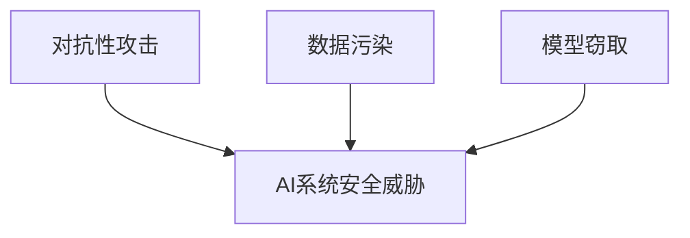

# YOLOv6的安全性：抵御攻击，确保模型安全

## 1.背景介绍

### 1.1 人工智能系统的安全风险

随着人工智能(AI)系统在各个领域的广泛应用,确保这些系统的安全性和可靠性变得至关重要。AI系统面临着来自不同方面的安全威胁,包括对抗性攻击、数据污染、模型窃取等。这些攻击可能会导致AI系统做出错误的预测或决策,从而产生严重的后果。

### 1.2 计算机视觉系统的安全挑战

计算机视觉是AI的一个重要应用领域,它赋予机器以"视觉"能力,使其能够从图像或视频中获取有用信息。然而,计算机视觉系统也面临着独特的安全挑战。例如,对抗性样本(adversarial examples)可能会欺骗目标检测或图像分类模型,导致它们做出错误的预测。

### 1.3 YOLOv6简介

YOLOv6是一种先进的实时目标检测系统,它建立在YOLO(You Only Look Once)系列模型的基础之上。YOLOv6在准确性和速度方面都取得了卓越的成绩,使其成为各种计算机视觉应用的理想选择。然而,就像其他AI系统一样,YOLOv6也面临着安全威胁,需要采取适当的措施来保护其免受攻击。

## 2.核心概念与联系

### 2.1 对抗性攻击

对抗性攻击是指通过对输入数据进行精心设计的微小扰动,来欺骗机器学习模型做出错误预测的攻击方式。这些扰动可能是肉眼无法察觉的,但却足以使模型产生严重的错误。对抗性攻击可以分为以下几种类型:

1. **白盒攻击**:攻击者完全了解目标模型的结构和参数。
2. **黑盒攻击**:攻击者只能访问模型的输入和输出,而无法获取模型内部信息。
3. **灰盒攻击**:攻击者部分了解目标模型的信息。

### 2.2 数据污染

数据污染是指在训练数据中故意引入错误或有害的样本,从而影响机器学习模型的性能和安全性。这种攻击可能会导致模型产生偏差,或者使其更容易受到对抗性攻击的影响。

### 2.3 模型窃取

模型窃取是指攻击者试图复制或重建一个已训练好的机器学习模型,以获取其中包含的知识产权或敏感信息。这种攻击可能会导致模型所有者的利益受损,同时也可能被用于进一步的攻击。

### 2.4 核心概念之间的联系

上述三种攻击方式虽然有所不同,但它们都旨在破坏AI系统的安全性和可靠性。对抗性攻击直接针对模型的预测结果,而数据污染和模型窃取则是从训练数据和模型参数的角度进行攻击。这些攻击手段往往会相互结合,形成更加复杂和危险的威胁。因此,确保YOLOv6及其他AI系统的安全性需要综合考虑各种攻击方式,并采取全面的防御措施。



## 3.核心算法原理具体操作步骤

### 3.1 对抗性攻击生成算法

生成对抗性样本的算法通常包括以下步骤:

1. **选择目标模型**:选择要攻击的机器学习模型,可以是白盒、黑盒或灰盒模型。
2. **定义攻击目标**:确定攻击的目标,例如使模型将某个特定的输入样本误分类为另一个类别。
3. **计算损失函数**:定义一个损失函数,用于衡量生成的对抗性样本与攻击目标之间的差距。
4. **生成对抗性样本**:使用优化算法(如梯度下降)来最小化损失函数,从而生成对抗性样本。
5. **评估攻击效果**:在目标模型上测试生成的对抗性样本,评估攻击的成功率。

常见的对抗性攻击算法包括快速梯度符号方法(FGSM)、投射梯度下降(PGD)、Carlini&Wagner攻击等。

### 3.2 数据污染攻击算法

数据污染攻击的基本思路是在训练数据中引入有害样本,从而影响模型的学习过程。一种常见的数据污染攻击算法如下:

1. **选择目标模型**:选择要攻击的机器学习模型。
2. **定义攻击目标**:确定攻击的目标,例如降低模型的准确性或使其对某些输入产生特定的预测结果。
3. **生成有害样本**:使用对抗性攻击算法或其他方法生成一些有害样本。
4. **污染训练数据**:将生成的有害样本注入到训练数据中。
5. **训练受污染模型**:使用受污染的训练数据来训练目标模型。
6. **评估攻击效果**:在测试数据上评估受污染模型的性能,确定攻击是否成功。

### 3.3 模型窃取攻击算法

模型窃取攻击的目标是复制或重建一个已训练好的机器学习模型。一种常见的模型窃取算法包括以下步骤:

1. **获取目标模型的输出**:通过查询目标模型获取一定数量的输入-输出对。
2. **训练替代模型**:使用获取的输入-输出对作为训练数据,训练一个替代模型。
3. **评估替代模型**:在测试数据上评估替代模型的性能,确定它是否成功复制了目标模型的行为。
4. **优化替代模型**:如果替代模型的性能不理想,可以尝试不同的模型架构或训练方法,重复上述步骤。

## 4.数学模型和公式详细讲解举例说明

### 4.1 对抗性攻击的数学模型

对抗性攻击通常可以formalized为一个优化问题,目标是找到一个扰动$\delta$,使得对抗性样本$x' = x + \delta$能够欺骗目标模型$f$,同时满足某些约束条件。

$$\begin{aligned}
\underset{\delta}{\operatorname{argmin}} & \quad \mathcal{L}(f(x+\delta), y) \\
\text{s.t.} & \quad \|\delta\|_p \leq \epsilon
\end{aligned}$$

其中,$\mathcal{L}$是损失函数,用于衡量模型预测与真实标签$y$之间的差距。$\|\delta\|_p$是扰动的$\ell_p$范数,用于限制扰动的大小。$\epsilon$是一个超参数,控制扰动的强度。

不同的对抗性攻击算法采用不同的优化方法来求解上述优化问题。例如,FGSM使用一步梯度更新,而PGD则采用多步梯度下降。

### 4.2 数据污染攻击的数学模型

数据污染攻击的目标是找到一组有害样本$\{(x_i', y_i')\}$,将它们注入到训练数据$\{(x_i, y_i)\}$中,使得在受污染的训练数据$\{(x_i, y_i)\} \cup \{(x_i', y_i')\}$上训练的模型$f'$满足攻击者的目标。

一种常见的数据污染攻击策略是最大化受污染模型$f'$与原始模型$f$在测试数据$\{(x_j, y_j)\}$上的差异:

$$\underset{\{(x_i', y_i')\}}{\operatorname{argmax}} \sum_j \mathcal{L}(f'(x_j), y_j) - \mathcal{L}(f(x_j), y_j)$$

其中,$\mathcal{L}$是损失函数,用于衡量模型预测与真实标签之间的差距。

### 4.3 模型窃取攻击的数学模型

模型窃取攻击的目标是找到一个替代模型$f'$,使其在查询集$\{(x_i, y_i)\}$上的预测结果尽可能接近目标模型$f$的预测结果。这可以formalized为一个优化问题:

$$\underset{f'}{\operatorname{argmin}} \sum_i \mathcal{L}(f'(x_i), f(x_i))$$

其中,$\mathcal{L}$是损失函数,用于衡量替代模型$f'$与目标模型$f$在查询集上预测结果的差异。

在实践中,由于无法直接访问目标模型$f$的预测结果,攻击者通常会构建一个代理数据集$\{(x_i, \hat{y}_i)\}$,其中$\hat{y}_i = f(x_i)$是通过查询目标模型获得的输出。然后,攻击者在代理数据集上训练替代模型$f'$,目标是最小化:

$$\underset{f'}{\operatorname{argmin}} \sum_i \mathcal{L}(f'(x_i), \hat{y}_i)$$

## 5.项目实践：代码实例和详细解释说明

在这一部分,我们将提供一些代码示例,演示如何实现对抗性攻击、数据污染攻击和模型窃取攻击。这些示例使用Python和PyTorch框架,并基于YOLOv6目标检测模型。

### 5.1 对抗性攻击示例

以下代码演示了如何使用FGSM算法生成对抗性样本,并评估其对YOLOv6模型的影响:

```python
import torch
import torch.nn as nn
import torchvision.transforms as transforms
from yolov6.models.yolo import YOLOv6
from yolov6.utils.general import non_max_suppression

# 加载YOLOv6模型
model = YOLOv6(weights='yolov6s.pt')
model.eval()

# 定义FGSM攻击
epsilon = 0.1
attack = FGSM(model, epsilon)

# 加载图像并进行预处理
img = Image.open('image.jpg')
img = transforms.ToTensor()(img)
img = img.unsqueeze(0)

# 生成对抗性样本
adv_img = attack(img, target_label=None)

# 使用YOLOv6进行目标检测
with torch.no_grad():
    pred = model(adv_img)[0]
    pred = non_max_suppression(pred)[0]

# 可视化结果
plot_bboxes(adv_img, pred)
```

在上述示例中,我们首先加载了YOLOv6模型。然后,我们定义了FGSM攻击器,并使用它生成了一个对抗性样本`adv_img`。接下来,我们将`adv_img`输入到YOLOv6模型中进行目标检测,并可视化结果。

### 5.2 数据污染攻击示例

以下代码演示了如何实现一种简单的数据污染攻击,将对抗性样本注入到训练数据中:

```python
import torch
from torchvision import datasets, transforms
from yolov6.models.yolo import YOLOv6
from yolov6.utils.general import non_max_suppression
from adversarial_attack import FGSM

# 加载原始训练数据
train_data = datasets.ImageFolder('train_data', transform=transforms.ToTensor())
train_loader = torch.utils.data.DataLoader(train_data, batch_size=64, shuffle=True)

# 加载YOLOv6模型
model = YOLOv6(weights='yolov6s.pt')

# 定义FGSM攻击
epsilon = 0.1
attack = FGSM(model, epsilon)

# 生成对抗性样本并注入训练数据
poisoned_data = []
for img, label in train_loader:
    adv_img = attack(img, target_label=None)
    poisoned_data.append((adv_img, label))

# 使用受污染的训练数据训练YOLOv6模型
poisoned_loader = torch.utils.data.DataLoader(poisoned_data, batch_size=64, shuffle=True)
optimizer = torch.optim.SGD(model.parameters(), lr=0.01)
for epoch in range(10):
    for img, label in poisoned_loader:
        pred = model(img)
        loss = nn.CrossEntropyLoss()(pred, label)
        loss.backward()
        optimizer.step()
        optimizer.zero_grad()
```

在上述示例中,我们首先加载了原始训练数据。然后,我们使用FGSM攻击生成了一组对抗性样本,并将它们与原始训练数据合并,形