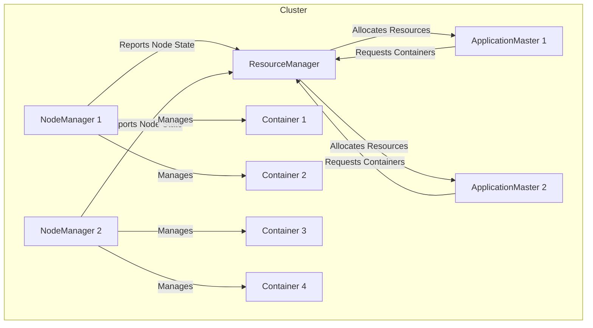

# Yarn 原理与代码实例讲解

## 1.背景介绍

在大规模分布式系统中，资源管理和任务调度是两个关键的基础组件。Apache Hadoop的资源管理器和任务调度器曾长期担任这一重要角色,但随着技术的发展和业务需求的变化,它们已经无法完全满足现代数据应用的需求。因此,Apache Hadoop 3.x 版本中引入了一种全新的资源协调框架 —— Apache Yarn(Yet Another Resource Negotiator),旨在构建一个通用的资源管理和任务调度系统。

Yarn 将资源管理和任务调度解耦,提供了一个统一的资源管理和调度平台。它不仅支持 MapReduce 作业,还支持其他类型的分布式应用程序,如 Spark、Flink、Hive 等,为构建新型数据处理应用提供了基础。Yarn 的出现极大地提高了 Hadoop 集群的资源利用率和系统吞吐量,成为大数据生态系统中不可或缺的核心组件。

## 2.核心概念与联系

Yarn 的核心概念主要包括以下几个方面:

### 2.1 ResourceManager (RM)

ResourceManager 是 Yarn 集群的主体部分,负责整个集群的资源管理和调度。它主要有以下两个组件:

1. **Scheduler**: 调度器根据特定的调度策略(如 FIFO、公平调度等)为应用程序分配资源。

2. **ApplicationsManager**: 负责管理应用程序的整个生命周期,包括应用程序提交、启动、监控和重启等。

### 2.2 NodeManager (NM)

NodeManager 运行在每个节点上,负责管理该节点上的资源和容器。它主要有以下几个职责:

1. **管理节点资源**: 监控节点上的 CPU、内存等资源使用情况。

2. **启动/监控容器**: 根据 ResourceManager 的指令启动或终止容器。

3. **跟踪容器状态**: 定期向 ResourceManager 报告容器的运行状态。

### 2.3 ApplicationMaster (AM)

ApplicationMaster 是每个应用程序的"大脑",负责协调应用程序的执行。它主要有以下职责:

1. **协调容器资源**: 根据应用程序需求向 ResourceManager 申请资源。

2. **监控任务进度**: 监控任务的执行进度,处理任务失败等异常情况。

3. **提供服务**: 为应用程序提供必要的服务,如数据拆分、进度报告等。

### 2.4 Container

Container 是 Yarn 中的资源抽象,它封装了一定数量的资源(如 CPU、内存等),用于运行应用程序的任务。每个容器都由 NodeManager 进行管理和监控。

这些核心概念之间的关系如下所示:



## 3.核心算法原理具体操作步骤

Yarn 的核心算法原理主要包括资源管理和任务调度两个方面。

### 3.1 资源管理算法

Yarn 采用了一种称为"容器化"的资源管理方式。它将集群中的资源抽象为一个个容器,每个容器封装了一定数量的 CPU、内存等资源。应用程序需要向 ResourceManager 申请容器资源,才能运行任务。

资源管理的具体步骤如下:

1. **资源发现**: NodeManager 定期向 ResourceManager 报告节点的资源使用情况,包括可用 CPU、内存等。

2. **资源请求**: ApplicationMaster 根据应用程序需求向 ResourceManager 申请容器资源。

3. **资源分配**: ResourceManager 根据特定的调度策略(如 FIFO、公平调度等)为应用程序分配容器资源。

4. **容器启动**: NodeManager 根据 ResourceManager 的指令在节点上启动容器,并监控容器的运行状态。

5. **资源释放**: 当容器任务完成或失败时,NodeManager 会释放容器占用的资源,供其他应用程序使用。

这种"容器化"的资源管理方式使得 Yarn 能够高效地共享和利用集群资源,提高了资源利用率。

### 3.2 任务调度算法

Yarn 中的任务调度算法由 ResourceManager 中的 Scheduler 组件实现。Scheduler 根据特定的调度策略为应用程序分配资源。

Yarn 提供了多种调度策略,包括:

1. **FIFO 调度器**: 先来先服务,按照应用程序提交的顺序分配资源。

2. **公平调度器**: 根据应用程序的权重和资源使用情况,公平地分配资源。

3. **容量调度器**: 将集群资源划分为多个队列,每个队列根据配置的资源比例分配资源。

4. **延迟调度器**: 根据数据的本地性和延迟等因素进行调度,提高任务执行效率。

无论采用何种调度策略,调度器都会遵循以下基本步骤:

1. **资源请求**: ApplicationMaster 向 ResourceManager 申请容器资源。

2. **资源分配**: Scheduler 根据调度策略从可用资源池中为应用程序分配容器资源。

3. **容器分发**: ResourceManager 将分配的容器资源分发给相应的 NodeManager。

4. **任务执行**: ApplicationMaster 在容器中启动任务,并监控任务进度。

5. **资源回收**: 任务完成后,容器资源将被回收,供其他应用程序使用。

通过合理的调度策略,Yarn 能够有效地利用集群资源,提高整体系统吞吐量。

## 4.数学模型和公式详细讲解举例说明

在 Yarn 的资源管理和任务调度过程中,涉及到一些数学模型和公式,用于量化和优化资源分配。

### 4.1 资源模型

Yarn 将集群资源抽象为一个资源向量,包括 CPU、内存等多种资源类型。资源向量可以用以下公式表示:

$$\vec{R} = (r_1, r_2, \dots, r_n)$$

其中,$$r_i$$ 表示第 $$i$$ 种资源的数量。

对于每个容器,它所需的资源也可以用一个资源向量表示:

$$\vec{C} = (c_1, c_2, \dots, c_n)$$

容器只有在满足以下条件时才能被分配资源:

$$\vec{R} \geq \vec{C}$$

也就是说,集群的可用资源必须大于或等于容器所需的资源。

### 4.2 公平调度模型

公平调度器的目标是为所有应用程序公平地分配资源。它采用了一种称为"最大-最小公平共享"的算法,确保每个应用程序获得的资源与其权重成正比。

设有 $$m$$ 个应用程序,第 $$i$$ 个应用程序的权重为 $$w_i$$,已分配的资源为 $$\vec{r}_i$$,则公平调度器需要最大化以下目标函数:

$$\max \min_{1 \leq i \leq m} \frac{\vec{r}_i}{w_i}$$

subject to:

$$\sum_{i=1}^m \vec{r}_i \leq \vec{R}$$

$$\vec{r}_i \geq 0$$

这个目标函数表示,公平调度器试图最大化所有应用程序的最小资源利用率。约束条件保证了资源分配不会超过集群的总资源,并且每个应用程序分配的资源都是非负的。

通过迭代求解这个优化问题,公平调度器可以得到一个相对公平的资源分配方案。

### 4.3 延迟调度模型

延迟调度器的目标是尽可能地将任务调度到数据所在的节点,从而减少数据传输延迟,提高任务执行效率。

设有 $$n$$ 个节点,第 $$j$$ 个节点上有 $$d_j$$ 个数据块,任务需要处理 $$D$$ 个数据块。我们定义一个代价函数 $$\text{cost}(j)$$,表示将任务调度到第 $$j$$ 个节点的代价:

$$\text{cost}(j) = D - d_j$$

延迟调度器试图最小化所有节点的代价之和:

$$\min \sum_{j=1}^n \text{cost}(j)$$

subject to:

$$\sum_{j=1}^n x_j = 1$$

$$x_j \in \{0, 1\}$$

其中,$$x_j$$ 是一个指示变量,表示任务是否被调度到第 $$j$$ 个节点。约束条件保证了任务只能被调度到一个节点。

通过求解这个整数规划问题,延迟调度器可以找到一个最优的任务调度方案,将任务尽可能地调度到数据所在的节点。

以上是 Yarn 中一些常见的数学模型和公式,它们为资源管理和任务调度提供了理论基础和量化支持。

## 5.项目实践:代码实例和详细解释说明

为了更好地理解 Yarn 的原理和实现,我们将通过一个简单的示例项目来展示如何在 Yarn 上运行分布式应用程序。

### 5.1 项目概述

我们将开发一个简单的 Word Count 应用程序,用于统计给定文本文件中每个单词出现的次数。该应用程序将在 Yarn 上运行,利用多个容器并行处理数据。

### 5.2 环境准备

1. 安装 Apache Hadoop 和 Apache Yarn。

2. 配置 Hadoop 和 Yarn 的环境变量。

3. 启动 Hadoop 和 Yarn 集群。

### 5.3 项目结构

```
word-count/
├── pom.xml
├── src/
│   ├── main/
│   │   ├── java/
│   │   │   └── com/
│   │   │       └── example/
│   │   │           ├── WordCount.java
│   │   │           ├── WordCountMapper.java
│   │   │           └── WordCountReducer.java
│   │   └── resources/
│   │       └── input/
│   │           └── sample.txt
└── yarn.sh
```

- `WordCount.java`: 应用程序的主入口点,用于提交 Yarn 作业。
- `WordCountMapper.java`: Map 阶段的实现,用于读取输入数据并生成 `<word, 1>` 键值对。
- `WordCountReducer.java`: Reduce 阶段的实现,用于汇总每个单词的计数。
- `sample.txt`: 示例输入文件。
- `yarn.sh`: 用于在 Yarn 上提交和运行应用程序的脚本。

### 5.4 核心代码实现

#### 5.4.1 WordCount.java

```java
public class WordCount extends Configured implements Tool {

    public static void main(String[] args) throws Exception {
        int res = ToolRunner.run(new Configuration(), new WordCount(), args);
        System.exit(res);
    }

    @Override
    public int run(String[] args) throws Exception {
        Configuration conf = getConf();
        Job job = Job.getInstance(conf, "word count");
        job.setJarByClass(WordCount.class);
        job.setMapperClass(WordCountMapper.class);
        job.setCombinerClass(WordCountReducer.class);
        job.setReducerClass(WordCountReducer.class);
        job.setOutputKeyClass(Text.class);
        job.setOutputValueClass(IntWritable.class);
        FileInputFormat.addInputPath(job, new Path(args[0]));
        FileOutputFormat.setOutputPath(job, new Path(args[1]));
        return job.waitForCompletion(true) ? 0 : 1;
    }
}
```

这是应用程序的主入口点。它继承自 `Configured` 和 `Tool` 接口,提供了运行 MapReduce 作业所需的基本配置和功能。

1. `main` 方法是程序的入口点,它调用 `ToolRunner.run` 方法来运行应用程序。

2. `run` 方法是应用程序的核心逻辑。它首先获取配置对象 `Configuration`,然后创建一个 `Job` 对象,并设置相关的配置,如 Mapper、Reducer、Combiner 类、输入/输出路径等。

3. 最后,它调用 `job.waitForCompletion` 方法来提交并等待作业完成。根据作业的完成状态,返回 0 (成功)或 1 (失败)