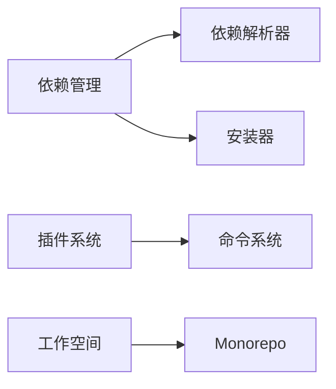

# Yarn原理与代码实例讲解

## 1. 背景介绍

### 1.1 Yarn的诞生背景
### 1.2 Yarn在前端工程化中的地位
### 1.3 Yarn与npm的异同点

## 2. 核心概念与联系

### 2.1 Yarn的核心概念
#### 2.1.1 依赖管理
#### 2.1.2 工作空间
#### 2.1.3 插件系统
### 2.2 Yarn各核心模块之间的联系
#### 2.2.1 依赖解析器与安装器
#### 2.2.2 插件系统与命令系统
#### 2.2.3 工作空间与Monorepo

## 3. 核心算法原理具体操作步骤

### 3.1 依赖解析算法
#### 3.1.1 构建依赖图
#### 3.1.2 依赖版本决议
#### 3.1.3 扁平化node_modules
### 3.2 插件机制原理
#### 3.2.1 插件注册与发现
#### 3.2.2 插件生命周期管理
#### 3.2.3 插件之间的交互
### 3.3 Workspace工作原理
#### 3.3.1 Workspace配置解析
#### 3.3.2 Workspace内依赖提升
#### 3.3.3 Workspace脚本执行

## 4. 数学模型和公式详细讲解举例说明

### 4.1 依赖图的数学表示
#### 4.1.1 有向无环图DAG
#### 4.1.2 邻接表与邻接矩阵
### 4.2 语义化版本的数学模型 
#### 4.2.1 版本号的数学定义
$版本号 ::= X.Y.Z$
$X ::= 非负整数$  
$Y ::= 非负整数$
$Z ::= 非负整数$
#### 4.2.2 版本范围的集合论表示
### 4.3 依赖决议的优化模型
#### 4.3.1 0-1整数规划模型
#### 4.3.2 启发式算法

## 5. 项目实践：代码实例和详细解释说明

### 5.1 基于Yarn创建一个Monorepo项目
#### 5.1.1 工作空间配置
#### 5.1.2 根目录package.json配置
#### 5.1.3 子Package配置
### 5.2 编写一个Yarn插件
#### 5.2.1 定义插件Manifest
#### 5.2.2 实现插件逻辑
#### 5.2.3 在项目中启用插件
### 5.3 编写Yarn脚本
#### 5.3.1 定义脚本
#### 5.3.2 传递参数
#### 5.3.3 在Workspace中执行脚本

## 6. 实际应用场景

### 6.1 大型前端Monorepo项目的依赖管理
### 6.2 构建定制化的前端工程化流程
### 6.3 优化CI/CD流水线

## 7. 工具和资源推荐

### 7.1 社区常用的Yarn插件推荐
### 7.2 与Yarn配合使用的工程化工具
### 7.3 官方文档与学习资源

## 8. 总结：未来发展趋势与挑战

### 8.1 Yarn的发展路线图
### 8.2 Yarn生态的机遇与挑战 
### 8.3 前端工程化的未来展望

## 9. 附录：常见问题与解答

### 9.1 Yarn安装与版本升级常见问题
### 9.2 Yarn使用过程中的常见报错分析
### 9.3 Yarn配置优化实践

作者：禅与计算机程序设计艺术 / Zen and the Art of Computer Programming