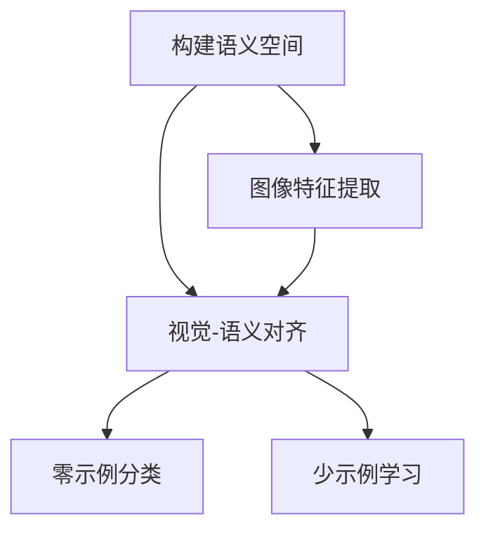

# Zero-shot Learning原理与代码实战案例讲解

## 1.背景介绍

在传统的机器学习中,模型需要大量的标记数据进行训练,这种方式存在一些局限性。首先,为了获得高质量的标记数据需要付出大量的人力和时间成本。其次,对于新的任务或领域,我们需要重新收集和标记数据,然后再训练新的模型,这种过程是低效和昂贵的。为了解决这些问题,Zero-shot Learning(零次学习)应运而生。

零次学习是一种机器学习范式,它允许模型在没有任何相关训练数据的情况下,直接对新的任务或领域进行推理和预测。这种方法的关键是利用先验知识和迁移学习的思想,将已有的知识迁移到新的任务上。零次学习极大地提高了模型的泛化能力,使其能够应对未知的情况,从而大大降低了数据获取和标注的成本。

## 2.核心概念与联系

零次学习的核心思想是利用语义表示来捕获概念之间的关系,从而实现跨领域的知识迁移。在这个过程中,有几个关键概念需要理解:

### 2.1 语义空间(Semantic Space)

语义空间是一个向量空间,其中每个概念都被映射为一个向量表示。这些向量能够捕获概念之间的相似性和关系。语义空间的构建通常基于大规模的文本数据,利用自然语言处理技术(如Word2Vec、GloVe等)来学习词向量表示。

### 2.2 视觉-语义对齐(Visual-Semantic Alignment)

视觉-语义对齐是将图像特征和语义概念向量对齐的过程。通过这种对齐,我们可以在同一个语义空间中表示图像和文本,从而实现跨模态的知识迁移。常见的对齐方法包括线性映射、深度神经网络等。

### 2.3 零示例(Zero-shot)和少示例(Few-shot)

零示例是指在没有任何相关训练数据的情况下进行预测。而少示例则是利用少量的示例数据进行微调或元学习,以提高模型的性能。这两种方法都属于零次学习的范畴,只是利用的先验知识不同。

## 3.核心算法原理具体操作步骤

零次学习算法的核心步骤如下:

1. **构建语义空间**: 利用大规模文本数据和自然语言处理技术(如Word2Vec)构建语义向量空间,每个概念都被映射为一个向量表示。

2. **图像特征提取**: 使用预训练的卷积神经网络(如VGG、ResNet等)提取图像的视觉特征向量。

3. **视觉-语义对齐**: 通过线性映射或深度神经网络等方法,将图像特征向量和语义概念向量对齐到同一个语义空间中。

4. **零示例分类**: 对于一个新的类别,我们只需要获取它的语义向量表示,然后在语义空间中查找与之最相似的图像特征向量,即可实现零示例分类。

此外,我们还可以利用少量的示例数据进行微调或元学习,以提高模型的性能。这种方法被称为少示例学习(Few-shot Learning)。



## 4.数学模型和公式详细讲解举例说明

在零次学习中,视觉-语义对齐是一个关键步骤。我们需要将图像特征向量 $\boldsymbol{x}$ 和语义概念向量 $\boldsymbol{a}$ 映射到同一个语义空间中。一种常见的方法是使用线性映射:

$$\boldsymbol{f}(\boldsymbol{x}) = \boldsymbol{W}\boldsymbol{x} + \boldsymbol{b}$$

其中 $\boldsymbol{W}$ 和 $\boldsymbol{b}$ 是可学习的参数。我们可以通过最小化以下损失函数来学习这些参数:

$$\mathcal{L}(\boldsymbol{W}, \boldsymbol{b}) = \sum_{i=1}^{N} \left\lVert \boldsymbol{f}(\boldsymbol{x}_i) - \boldsymbol{a}_i \right\rVert_2^2$$

这里 $N$ 是训练样本的数量, $\boldsymbol{x}_i$ 和 $\boldsymbol{a}_i$ 分别是第 $i$ 个样本的图像特征向量和语义概念向量。

一旦我们学习到了映射函数 $\boldsymbol{f}$,对于一个新的图像 $\boldsymbol{x}^*$,我们可以计算它在语义空间中的向量表示 $\boldsymbol{f}(\boldsymbol{x}^*)$。然后,我们可以在语义空间中查找与之最相似的语义概念向量 $\boldsymbol{a}^*$,即:

$$\boldsymbol{a}^* = \arg\min_{\boldsymbol{a}} \left\lVert \boldsymbol{f}(\boldsymbol{x}^*) - \boldsymbol{a} \right\rVert_2$$

这个最相似的语义概念向量 $\boldsymbol{a}^*$ 对应的就是图像 $\boldsymbol{x}^*$ 的预测类别。

以上是零次学习中视觉-语义对齐的一种基本方法。在实践中,我们还可以使用更复杂的深度神经网络来实现对齐,以捕获更加复杂的非线性映射关系。

## 5.项目实践:代码实例和详细解释说明

为了更好地理解零次学习的原理和实现,我们将通过一个实际的代码示例来演示如何在Python中实现一个简单的零次学习分类器。

在这个示例中,我们将使用CIFAR-10数据集进行实验。CIFAR-10是一个常用的图像分类数据集,包含10个类别:飞机、汽车、鸟类、猫、鹿、狗、青蛙、马、船和卡车。我们将使用预训练的ResNet-18模型提取图像特征,并使用Word2Vec获取类别名称的词向量作为语义向量。然后,我们将使用线性映射将视觉特征和语义向量对齐到同一个空间中,并实现零次学习分类。

### 5.1 导入所需库

```python
import torch
import torchvision
import torchvision.transforms as transforms
import torch.nn as nn
import torch.nn.functional as F
from torchvision.models import resnet18
import gensim.downloader as api
import numpy as np
```

### 5.2 加载数据集和预训练模型

```python
# 加载CIFAR-10数据集
transform = transforms.Compose([transforms.ToTensor(), transforms.Normalize((0.5, 0.5, 0.5), (0.5, 0.5, 0.5))])
trainset = torchvision.datasets.CIFAR10(root='./data', train=True, download=True, transform=transform)
testset = torchvision.datasets.CIFAR10(root='./data', train=False, download=True, transform=transform)

# 加载预训练的ResNet-18模型
model = resnet18(pretrained=True)
model.eval()

# 获取类别名称
classes = ('plane', 'car', 'bird', 'cat', 'deer', 'dog', 'frog', 'horse', 'ship', 'truck')
```

### 5.3 提取图像特征和语义向量

```python
# 提取图像特征
image_features = []
for data, _ in trainset:
    data = data.unsqueeze(0)
    feature = model(data).squeeze()
    image_features.append(feature.detach().numpy())

image_features = np.array(image_features)

# 加载Word2Vec模型并获取语义向量
word_vectors = api.load("word2vec-google-news-300")
semantic_vectors = [word_vectors[c] for c in classes]
semantic_vectors = np.array(semantic_vectors)
```

### 5.4 视觉-语义对齐

```python
# 线性映射
W = np.linalg.pinv(image_features.T @ image_features) @ image_features.T @ semantic_vectors
b = semantic_vectors.mean(axis=0) - (W @ image_features.mean(axis=0))

# 将图像特征映射到语义空间
image_features_aligned = image_features @ W.T + b
```

### 5.5 零次学习分类

```python
# 零次学习分类
def zeroshot_classifier(test_feature):
    distances = np.linalg.norm(image_features_aligned - test_feature, axis=1)
    predicted_class = classes[np.argmin(distances)]
    return predicted_class

# 在测试集上评估
correct = 0
total = 0
for data, target in testset:
    feature = model(data.unsqueeze(0)).squeeze()
    predicted = zeroshot_classifier(feature.detach().numpy())
    if predicted == classes[target]:
        correct += 1
    total += 1

print(f'Accuracy: {correct / total * 100:.2f}%')
```

在上述代码中,我们首先加载CIFAR-10数据集和预训练的ResNet-18模型。然后,我们提取训练集图像的特征向量,并使用Word2Vec获取类别名称的语义向量。接下来,我们使用线性映射将图像特征和语义向量对齐到同一个空间中。

在零次学习分类器 `zeroshot_classifier` 函数中,我们计算测试图像特征向量与所有训练图像特征向量对齐后的向量之间的距离,并选择距离最小的那个作为预测类别。

最后,我们在测试集上评估分类器的性能。需要注意的是,这只是一个简单的示例,实际应用中可能需要使用更复杂的对齐方法和优化策略来提高性能。

## 6.实际应用场景

零次学习由于其独特的优势,在许多实际应用场景中都有着广泛的应用前景:

1. **罕见类别识别**: 在一些领域,如医疗影像诊断、野生动物识别等,由于数据稀缺,很难获得足够的标记数据进行训练。零次学习可以利用已有的知识,对这些罕见类别进行识别和分类。

2. **个性化推荐系统**: 在推荐系统中,零次学习可以根据用户的兴趣和偏好,推荐他们可能感兴趣但从未接触过的新产品或内容。这种方法避免了对每个新产品或内容进行大量的用户反馈收集和模型重训练。

3. **机器人视觉**: 在机器人视觉领域,零次学习可以帮助机器人识别和理解它们从未见过的新物体,从而实现更好的环境理解和交互能力。

4. **自然语言处理**: 零次学习在自然语言处理领域也有广泛的应用,如实体识别、关系抽取、情感分析等。通过利用语义知识,模型可以更好地理解和处理未见过的词语或句子。

5. **多模态学习**: 零次学习可以帮助模型在不同模态之间进行知识迁移,如图像到文本、视频到音频等,从而实现更好的多模态理解和融合。

总的来说,零次学习为我们提供了一种新的思路,使机器学习模型能够更好地利用先验知识,提高泛化能力,从而在各种应用场景中发挥作用。

## 7.工具和资源推荐

如果你对零次学习感兴趣并希望进一步学习和实践,以下是一些推荐的工具和资源:

1. **Python库**:
   - [Gensim](https://radimrehurek.com/gensim/): 一个用于处理文本数据的Python库,包含了Word2Vec等词向量模型。
   - [PyTorch](https://pytorch.org/): 一个流行的深度学习框架,可用于构建和训练零次学习模型。
   - [scikit-learn](https://scikit-learn.org/stable/): 一个机器学习库,包含了一些常用的线性模型和距离度量方法。

2. **数据集**:
   - [CIFAR-10](https://www.cs.toronto.edu/~kriz/cifar.html): 一个常用的图像分类数据集,包含10个类别。
   - [ImageNet](http://www.image-net.org/): 一个大型的图像数据集,包含了数百万张图像和数千个类别。
   - [Word2Vec预训练模型](https://code.google.com/archive/p/word2vec/): 基于大规模语料库预训练的Word2Vec模型,可用于获取词向量表示。

3. **在线课程和教程**:
   - [Zero-Shot Learning with Modern Machine Learning](https://www.coursera.org/lecture/machine-learning-projects/zero-shot-learning-with-modern-machine-learning-cTXZW): Coursera上的一个