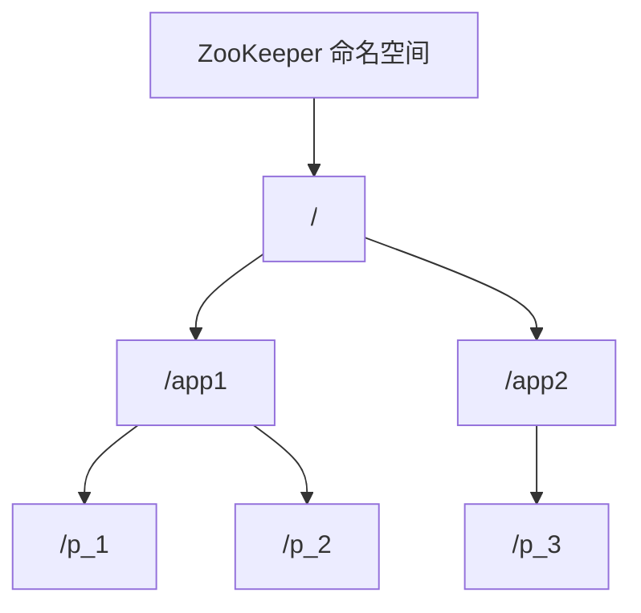
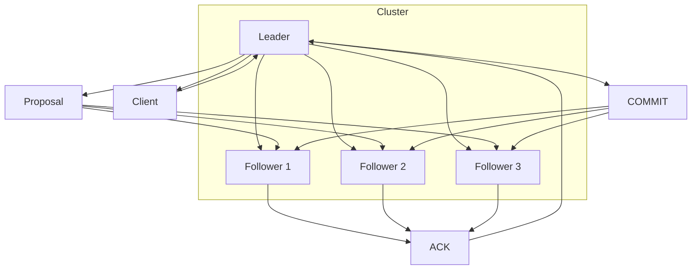

# Zookeeper分布式协调服务原理与代码实例讲解

## 1.背景介绍

在分布式系统中,需要有一个可靠的协调服务来管理和维护分布在多个节点上的数据。Apache ZooKeeper 就是这样一个分布式协调服务,它为分布式应用程序提供了高可用的数据管理、应用程序状态协调、分布式锁和配置管理等功能。

ZooKeeper 的设计目标是构建一个简单且高效的内核,并将非核心功能移植到使用 ZooKeeper 的分布式应用程序中。它最核心的功能是允许分布式进程通过一个共享的层次化命名空间相互协调,这个命名空间就像一个标准文件系统,允许进程在节点上读写数据。

### 1.1 ZooKeeper 的应用场景

ZooKeeper 可以广泛应用于各种需要进程协调的分布式系统中,例如:

- **配置管理**: 在集群环境中,ZooKeeper 可以用于维护和协调配置信息的更新。
- **命名服务**: 分布式系统中,ZooKeeper 可以为有层次命名结构的文件和目录提供命名服务。
- **分布式锁**: ZooKeeper 可以用于在集群服务器之间实现分布式锁。
- **集群管理**: ZooKeeper 可以用于集群管理,检测和监视集群中的节点状态。

### 1.2 ZooKeeper 的特点

ZooKeeper 具有以下关键特性:

- **顺序一致性**: 来自客户端的更新操作按顺序执行,这种顺序一致性简化了对状态的推理。
- **原子性**: 更新操作要么成功,要么失败,不存在中间状态。
- **单一系统映像**: 无论连接到哪个服务器,客户端看到的数据视图都是一致的。
- **可靠性**: 一旦操作成功,数据会一直存在,直到被明确删除。
- **实时性**: ZooKeeper 保证客户端视图是最新的。

## 2.核心概念与联系

为了理解 ZooKeeper 的工作原理,我们需要先了解一些核心概念:

### 2.1 数据模型

ZooKeeper 使用一种类似于文件系统的多层次命名空间来组织数据,这种命名空间被称为 ZNode(ZooKeeper 数据节点)。每个 ZNode 由路径标识,类似于文件系统中的路径,例如 `/app1/p_1`。ZNode 可以有子节点,也可以是叶子节点。

每个 ZNode 由以下几部分组成:

- **数据**: ZNode 存储的数据,可以是任意形式的数据,如配置文件或者状态信息。
- **ACL(Access Control List)**: 访问控制列表,用于控制谁可以对该 ZNode 执行何种操作。
- **stat**: 元数据,包括版本号、时间戳等。



### 2.2 会话(Session)

客户端需要先与 ZooKeeper 服务器建立会话,之后才能执行相关操作。会话的生命周期由会话超时时间决定,如果在会话超时时间内客户端与服务器之间没有任何通信,则会话将被认为已过期。

为了保证可靠性,ZooKeeper 采用了 ZAB(ZooKeeper Atomic Broadcast) 协议来复制数据。ZAB 协议基于主备模型,其中一个服务器充当领导者(Leader),其他服务器充当跟随者(Follower)。所有的写请求都需要由 Leader 处理,然后将写操作广播给所有的 Follower 服务器。只有当大多数服务器已经成功应用了更新,写操作才会被确认。

### 2.3 Watcher(监视器)

ZooKeeper 允许客户端在指定的 ZNode 上注册 Watcher,当该 ZNode 发生变化时(数据变更、节点删除等),ZooKeeper 会通知已注册的 Watcher。Watcher 是一次性的,一旦被触发后,就需要重新注册。

Watcher 是 ZooKeeper 实现分布式协调的关键机制之一,应用程序可以通过 Watcher 来监视指定的目标对象,并在状态发生变化时采取相应的操作,从而实现分布式系统的协调。

## 3.核心算法原理具体操作步骤

ZooKeeper 的核心算法是 ZAB(ZooKeeper Atomic Broadcast) 协议,它是一种原子消息广播协议。ZAB 协议基于主备模型,其中一个服务器充当领导者(Leader),其他服务器充当跟随者(Follower)。

ZAB 协议的工作原理如下:

1. **Leader 选举**: 当 ZooKeeper 集群启动或者 Leader 节点出现故障时,需要进行 Leader 选举。选举过程采用 ZAB 协议中的一种投票机制,每个服务器节点都会投出一个数据 ID,数据 ID 由服务器的 myid 和 zxid 组成。myid 是服务器的唯一标识,zxid 是服务器上最后处理的事务 ID。集群中所有服务器都会将自己的数据 ID 与其他服务器的数据 ID 进行对比,并投票选举出一个数据 ID 最大的服务器作为新的 Leader。

2. **发起写请求**: 客户端向 Leader 服务器发起写请求。

3. **Leader 广播提案**: Leader 服务器将客户端的写请求转化为一个提案(Proposal),并为该提案分配一个全局唯一的 ZXID(ZooKeeper Transaction Id),然后将提案广播给集群中的所有 Follower 服务器。

4. **Follower 服务器持久化**: Follower 服务器收到 Leader 的提案后,会先将提案持久化到磁盘中,然后向 Leader 发送 ACK 确认消息。

5. **Leader 等待确认**: Leader 服务器收到半数以上 Follower 的 ACK 确认消息后,会将提案提交给自己的内存数据库,并向所有 Follower 发送 COMMIT 消息,要求 Follower 也提交数据。

6. **Follower 提交数据**: Follower 收到 COMMIT 消息后,会将提案提交给自己的内存数据库,完成事务处理。

7. **响应客户端**: 当 Leader 收到大多数 Follower 的数据提交成功的消息后,会向客户端返回写操作结果。



ZAB 协议的核心思想是通过主备模型和两阶段提交协议,保证了数据的一致性。Leader 负责处理所有的写请求,并将更新广播给所有的 Follower。只有当大多数服务器已经成功应用了更新,写操作才会被确认。这种方式虽然会牺牲一些性能,但可以保证数据在任何时候都是一致的。

## 4.数学模型和公式详细讲解举例说明

在 ZooKeeper 的 ZAB 协议中,有一些重要的数学模型和公式,用于保证数据的一致性和可靠性。

### 4.1 Zxid(ZooKeeper Transaction Id)

Zxid 是 ZooKeeper 中用于标识事务的唯一序号,它由两部分组成:

$$
zxid = epoch \times 2^{64} + counter
$$

- `epoch`: 代表 Leader 服务器的任期号,每次 Leader 选举后会递增。
- `counter`: 代表事务计数器,每次事务递增。

Zxid 的作用是保证事务的全局有序性。Leader 服务器会为每个事务分配一个全局唯一的 Zxid,并按照 Zxid 的顺序执行事务。Follower 服务器在接收到 Leader 的提案时,会根据 Zxid 的大小来判断是否接受该提案。

### 4.2 Leader 选举算法

在 ZooKeeper 集群中,Leader 选举算法采用了一种基于 Zxid 的投票机制。每个服务器节点都会投出一个数据 ID,数据 ID 由服务器的 myid 和 zxid 组成:

$$
data\_id = (myid, zxid)
$$

- `myid`: 服务器的唯一标识。
- `zxid`: 服务器上最后处理的事务 ID。

所有服务器都会将自己的数据 ID 与其他服务器的数据 ID 进行对比,并投票选举出一个数据 ID 最大的服务器作为新的 Leader。

数据 ID 的大小比较规则如下:

1. 如果两个数据 ID 的 `zxid` 不同,则 `zxid` 较大的数据 ID 更大。
2. 如果两个数据 ID 的 `zxid` 相同,则 `myid` 较大的数据 ID 更大。

这种算法可以保证选举出的 Leader 服务器是最新的,从而避免数据回滚。

### 4.3 两阶段提交协议

ZAB 协议采用了两阶段提交协议(Two-Phase Commit)来保证数据的一致性。两阶段提交协议分为两个阶段:

1. **准备阶段(Prepare Phase)**

   Leader 服务器将提案广播给所有的 Follower 服务器,Follower 服务器收到提案后,会先将提案持久化到磁盘中,然后向 Leader 发送 ACK 确认消息。

2. **提交阶段(Commit Phase)**

   Leader 服务器收到半数以上 Follower 的 ACK 确认消息后,会将提案提交给自己的内存数据库,并向所有 Follower 发送 COMMIT 消息,要求 Follower 也提交数据。Follower 收到 COMMIT 消息后,会将提案提交给自己的内存数据库,完成事务处理。

两阶段提交协议可以保证数据在任何时候都是一致的。只有当大多数服务器已经成功应用了更新,写操作才会被确认。如果在准备阶段或提交阶段出现故障,事务将被中止,从而避免数据不一致的情况发生。

## 5.项目实践：代码实例和详细解释说明

为了更好地理解 ZooKeeper 的使用,我们将通过一个简单的示例来演示如何使用 ZooKeeper 实现分布式锁。

### 5.1 环境准备

首先,我们需要下载并安装 ZooKeeper。你可以从 Apache ZooKeeper 官网下载最新版本的二进制包。解压后,进入 `bin` 目录,启动 ZooKeeper 服务器:

```bash
./zkServer.sh start
```

### 5.2 Java 客户端示例

我们将使用 Java 编写一个简单的客户端程序,通过 ZooKeeper 实现分布式锁。

首先,创建一个 Maven 项目,并在 `pom.xml` 文件中添加 ZooKeeper 客户端依赖:

```xml
<dependency>
    <groupId>org.apache.zookeeper</groupId>
    <artifactId>zookeeper</artifactId>
    <version>3.7.0</version>
</dependency>
```

接下来,创建一个名为 `DistributedLock` 的类,实现分布式锁的功能:

```java
import org.apache.zookeeper.*;
import org.apache.zookeeper.data.Stat;

import java.io.IOException;
import java.util.Collections;
import java.util.List;
import java.util.concurrent.CountDownLatch;

public class DistributedLock {
    private static final String ZK_HOST = "localhost:2181";
    private static final String LOCK_NODE = "/lock";
    private ZooKeeper zk;
    private String currentLockNode;

    public DistributedLock() throws IOException, InterruptedException {
        CountDownLatch connectedSignal = new CountDownLatch(1);
        zk = new ZooKeeper(ZK_HOST, 5000, event -> {
            if (event.getState() == Watcher.Event.KeeperState.SyncConnected) {
                connectedSignal.countDown();
            }
        });
        connectedSignal.await();
    }

    public void acquireLock() throws KeeperException, InterruptedException {
        currentLockNode = zk.create(LOCK_NODE + "/lock_", new byte[0],
                ZooDefs.Ids.