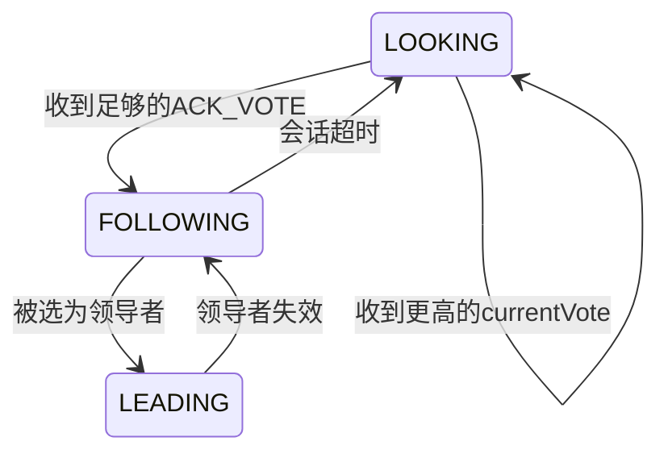
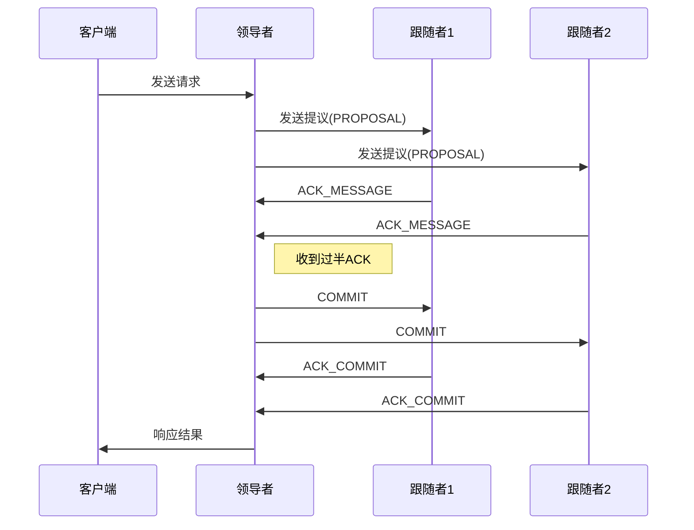

# Zookeeper客户端开发实战:命令行工具

## 1.背景介绍

Apache ZooKeeper是一个开源的分布式协调服务,为分布式系统提供一致性服务。它通过其简单的架构和接口,为需要进行协调的分布式进程提供了高性能的分布式锁服务、配置维护、域名服务等功能。ZooKeeper在诸多分布式系统中发挥着重要作用,如Hadoop、HBase、Kafka等。

随着分布式系统的日益普及,ZooKeeper的应用也越来越广泛。开发人员需要一种高效、便捷的方式与ZooKeeper进行交互,以管理和监控分布式应用程序。ZooKeeper提供了多种客户端,但是命令行工具由于其简单性和通用性而备受青睐。本文将深入探讨如何开发一个功能强大的ZooKeeper命令行客户端工具。

## 2.核心概念与联系

在开发ZooKeeper命令行客户端之前,我们需要了解一些核心概念:

### 2.1 数据模型

ZooKeeper采用树状层次结构来组织数据,类似于文件系统。每个节点可以存储数据,也可以拥有子节点。节点被标识为被命名的路径,如`/app1/instance`。

### 2.2 版本

每个节点都有一个版本号,用于实现乐观并发控制。当客户端执行更新操作时,需要提供当前版本号。如果版本号不匹配,更新将失败。

### 2.3 Watcher(监视器)

客户端可以在节点上设置Watcher,以便在节点发生变化时收到通知。这对于构建分布式应用程序至关重要,例如领导者选举、配置更新等。

### 2.4 ACL(访问控制列表)

ZooKeeper支持基于ACL的权限控制,可以为不同的客户端设置不同的权限。

### 2.5 会话

客户端通过创建会话与ZooKeeper服务器建立连接。会话具有超时时间,如果在规定时间内没有收到客户端的心跳,服务器将终止会话。

## 3.核心算法原理具体操作步骤

ZooKeeper命令行客户端需要实现以下核心功能:

1. **连接管理**: 建立与ZooKeeper服务器的连接,维护会话。
2. **节点操作**: 创建、删除、更新和读取节点数据。
3. **监视器管理**: 设置和处理Watcher事件。
4. **ACL管理**: 设置和查看节点的访问控制列表。

我们将使用Java语言开发命令行客户端,利用ZooKeeper提供的Java客户端库`org.apache.zookeeper`。

### 3.1 连接管理

首先,我们需要创建一个`ZooKeeper`实例,并指定连接字符串、会话超时时间和Watcher对象:

```java
CountDownLatch connectedSignal = new CountDownLatch(1);
ZooKeeper zk = new ZooKeeper("localhost:2181", 5000, event -> {
    if (event.getState() == Watcher.Event.KeeperState.SyncConnected) {
        connectedSignal.countDown();
    }
});
connectedSignal.await();
```

这段代码创建了一个连接到`localhost:2181`的`ZooKeeper`实例,会话超时时间为5秒。`CountDownLatch`用于等待连接建立完成。

### 3.2 节点操作

创建节点:

```java
zk.create("/myapp", "Application Data".getBytes(), ZooDefs.Ids.OPEN_ACL_UNSAFE, CreateMode.PERSISTENT);
```

读取节点数据:

```java
byte[] data = zk.getData("/myapp", null, null);
String appData = new String(data);
```

更新节点数据:

```java
int version = zk.exists("/myapp", true).getVersion();
zk.setData("/myapp", "Updated Data".getBytes(), version);
```

删除节点:

```java
zk.delete("/myapp", -1);
```

### 3.3 监视器管理

设置监视器:

```java
zk.getData("/myapp", event -> {
    // 处理节点变化事件
}, null);
```

### 3.4 ACL管理

创建节点时指定ACL:

```java
ArrayList<ACL> acls = new ArrayList<>();
acls.add(new ACL(ZooDefs.Perms.READ | ZooDefs.Perms.WRITE, ZooDefs.Ids.AUTH_IDS));
zk.create("/appconfig", "Initial Config".getBytes(), acls, CreateMode.PERSISTENT);
```

获取节点ACL:

```java
ACL[] nodeAcls = zk.getACL("/appconfig", null);
```

## 4.数学模型和公式详细讲解举例说明

ZooKeeper采用了Zab (Zookeeper Atomic Broadcast)协议来实现数据的一致性。Zab协议基于Paxos协议,但做了一些优化和简化。

在Zab协议中,服务器分为以下三种状态:

- **LOOKING**: 选举状态,用于选举新的领导者
- **FOLLOWING**: 跟随者状态,接收来自领导者的消息提议
- **LEADING**: 领导者状态,接收来自客户端的请求,并发出消息提议

当一个服务器启动时,它会进入LOOKING状态并发起一轮领导者选举。选举过程如下:

1. 服务器将其当前视图(currentVote)设置为自身的ID(myid)
2. 向所有服务器发送请求投票(REQUEST_VOTE)消息
3. 收到REQUEST_VOTE消息的服务器,将自己的currentVote与请求中的ID进行比较:
    - 如果请求ID大于currentVote,则重置currentVote为请求ID,并发送反馈(ACK_VOTE)消息
    - 如果请求ID小于等于currentVote,则不作任何响应
4. 发起投票请求的服务器收集ACK_VOTE消息,当收到足够多(过半)的ACK_VOTE时,它将成为新的领导者

领导者选举过程可以用下面的状态转换图来描述:



领导者选举完成后,Zab协议进入广播模式(Broadcast Mode),新的事务请求将被领导者广播给所有跟随者。每个跟随者在接收到提议后,会发送ACK_MESSAGE给领导者,表示已经持久化了该事务。当领导者收到过半的ACK_MESSAGE时,它会再次向所有服务器发送COMMIT消息,要求它们将事务应用到内存中。

Zab协议的广播模式可以用下面的流程图描述:



## 5.项目实践：代码实例和详细解释说明

在本节中,我们将实现一个简单的ZooKeeper命令行客户端,支持基本的节点操作。

### 5.1 项目结构

```
zk-cli
├── pom.xml
└── src
    └── main
        └── java
            └── com
                └── mycompany
                    └── zkcli
                        ├── Command.java
                        ├── CommandExecutor.java
                        ├── CommandParser.java
                        └── ZooKeeperClient.java
```

- `ZooKeeperClient.java`: 封装了与ZooKeeper服务器的交互
- `Command.java`: 定义了命令行命令的接口
- `CommandExecutor.java`: 执行具体命令的类
- `CommandParser.java`: 解析命令行输入的类

### 5.2 ZooKeeperClient

`ZooKeeperClient`封装了与ZooKeeper服务器的连接和基本操作:

```java
public class ZooKeeperClient {
    private ZooKeeper zk;

    public ZooKeeperClient(String connectString) throws IOException {
        zk = new ZooKeeper(connectString, 5000, event -> {
            // 处理连接事件
        });
    }

    public void create(String path, byte[] data) throws KeeperException, InterruptedException {
        zk.create(path, data, ZooDefs.Ids.OPEN_ACL_UNSAFE, CreateMode.PERSISTENT);
    }

    public byte[] getData(String path) throws KeeperException, InterruptedException {
        return zk.getData(path, null, null);
    }

    public void setData(String path, byte[] data) throws KeeperException, InterruptedException {
        int version = zk.exists(path, true).getVersion();
        zk.setData(path, data, version);
    }

    public void delete(String path) throws KeeperException, InterruptedException {
        zk.delete(path, -1);
    }

    // 其他方法...
}
```

### 5.3 Command

`Command`接口定义了命令行命令的基本结构:

```java
public interface Command {
    String getName();
    String getDescription();
    void execute(CommandExecutor executor, String[] args) throws Exception;
}
```

我们实现了几个基本命令:

- `CreateCommand`: 创建节点
- `GetDataCommand`: 读取节点数据
- `SetDataCommand`: 更新节点数据
- `DeleteCommand`: 删除节点

以`CreateCommand`为例:

```java
public class CreateCommand implements Command {
    @Override
    public String getName() {
        return "create";
    }

    @Override
    public String getDescription() {
        return "Create a ZNode";
    }

    @Override
    public void execute(CommandExecutor executor, String[] args) throws Exception {
        if (args.length < 2) {
            System.out.println("Usage: create <path> <data>");
            return;
        }

        String path = args[0];
        byte[] data = args[1].getBytes();

        executor.getZooKeeperClient().create(path, data);
        System.out.println("Node created: " + path);
    }
}
```

### 5.4 CommandExecutor

`CommandExecutor`负责执行具体的命令:

```java
public class CommandExecutor {
    private ZooKeeperClient zkClient;
    private Map<String, Command> commands = new HashMap<>();

    public CommandExecutor(String connectString) throws IOException {
        zkClient = new ZooKeeperClient(connectString);
        registerCommands();
    }

    private void registerCommands() {
        commands.put(new CreateCommand().getName(), new CreateCommand());
        commands.put(new GetDataCommand().getName(), new GetDataCommand());
        // 注册其他命令...
    }

    public ZooKeeperClient getZooKeeperClient() {
        return zkClient;
    }

    public void executeCommand(String commandLine) {
        String[] args = CommandParser.parseCommandLine(commandLine);
        String commandName = args[0];
        String[] commandArgs = Arrays.copyOfRange(args, 1, args.length);

        Command command = commands.get(commandName);
        if (command == null) {
            System.out.println("Unknown command: " + commandName);
            return;
        }

        try {
            command.execute(this, commandArgs);
        } catch (Exception e) {
            System.out.println("Error executing command: " + e.getMessage());
        }
    }
}
```

### 5.5 CommandParser

`CommandParser`负责解析命令行输入:

```java
public class CommandParser {
    public static String[] parseCommandLine(String commandLine) {
        return commandLine.split("\\s+");
    }
}
```

### 5.6 运行客户端

在`main`方法中,我们创建一个`CommandExecutor`实例,并进入命令行循环:

```java
public static void main(String[] args) throws IOException {
    CommandExecutor executor = new CommandExecutor("localhost:2181");
    Scanner scanner = new Scanner(System.in);

    while (true) {
        System.out.print("> ");
        String commandLine = scanner.nextLine();
        if (commandLine.equalsIgnoreCase("quit")) {
            break;
        }
        executor.executeCommand(commandLine);
    }
}
```

现在,您可以运行客户端并执行各种命令:

```
> create /myapp "Hello, World!"
Node created: /myapp
> getData /myapp
Hello, World!
> setData /myapp "Updated data"
Node data updated: /myapp
> delete /myapp
Node deleted: /myapp
```

## 6.实际应用场景

ZooKeeper命令行客户端可以在以下场景中发挥作用:

1. **开发和调试**: 开发人员可以使用命令行客户端快速验证分布式应用程序的行为,创建、修改和删除节点,并观察应用程序的反应。
2. **运维管理**: 运维人员可以使用命令行客户端监控和管理生产环境中的分布式系统,如查看配置数据、重新加载配置等。
3. **教学和学习**: 命令行客户端提供了一种简单直观的方式来理解ZooKeeper的工作原理,非常适合于教学和学习。

## 7.工具和资源推荐

- **Apache ZooKeeper官方网