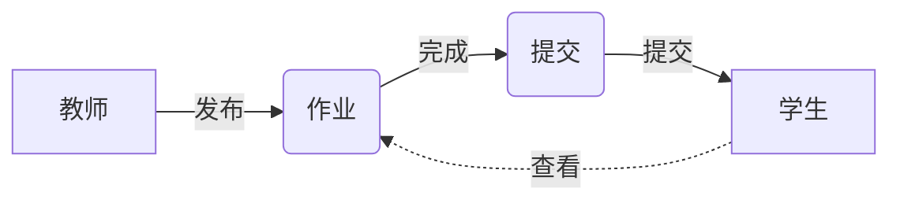

# SpringBoot作业管理系统

## 1. 背景介绍

在现代教育领域,作业管理是一个非常重要的环节。传统的作业管理方式效率低下,难以跟踪学生的学习进度,也给教师带来了很大的工作量。为了解决这些问题,我们可以利用SpringBoot框架开发一个高效、智能的作业管理系统。

### 1.1 作业管理的痛点
#### 1.1.1 学生角度
- 作业提交不便
- 作业反馈滞后 
- 缺乏学习动力

#### 1.1.2 教师角度 
- 作业收集困难
- 批改工作繁重
- 难以掌握学情

### 1.2 智能化作业管理的优势
#### 1.2.1 提高效率
- 线上提交作业
- 自动化批改
- 实时数据统计

#### 1.2.2 优化教学
- 个性化推荐
- 针对性辅导
- 促进师生互动

### 1.3 SpringBoot的技术优势
- 快速开发
- 组件丰富
- 易于集成
- 高度可定制

## 2. 核心概念与关联

在SpringBoot作业管理系统中,有几个核心概念需要了解:

### 2.1 作业(Assignment)
作业是教师布置给学生完成的任务,可以包含题目、要求、截止日期等属性。一个作业对应多个学生提交。

### 2.2 提交(Submission)  
提交是学生对作业完成情况的记录,包含提交的具体内容、提交时间、评分等信息。一个提交对应一个作业和一个学生。

### 2.3 学生(Student)
学生是系统的主要用户之一,可以查看作业、在线提交、查看反馈等。一个学生可以提交多个作业。

### 2.4 教师(Teacher) 
教师是系统的管理者,可以发布作业、批改作业、查看统计数据等。一个教师可以管理多个作业。

以下是核心概念的Mermaid关系图:


## 3. 核心算法原理与步骤

本系统的核心算法主要体现在作业的智能批改和个性化推荐方面。

### 3.1 智能批改算法
#### 3.1.1 文本相似度算法
对于主观题,我们可以使用文本相似度算法,将学生提交的答案与标准答案进行比对,得出相似度得分。常见的文本相似度算法有:
- TF-IDF
- Word2Vec
- BERT

#### 3.1.2 规则匹配算法
对于客观题,可以预设判分规则,将学生提交的答案与规则进行匹配,得出分数。常见的规则匹配方法有:
- 关键词匹配
- 正则表达式匹配

#### 3.1.3 算法步骤
1. 答案预处理:去除停用词、分词等
2. 特征提取:提取关键特征,如TF-IDF矩阵
3. 相似度计算:计算提交答案与标准答案的相似度
4. 规则匹配:对客观题进行规则匹配判分
5. 综合评分:结合主客观题得分,给出总分

### 3.2 个性化推荐算法
#### 3.2.1 协同过滤算法
协同过滤算法通过分析用户的历史行为,发现用户的兴趣偏好,从而给出个性化推荐。常见的协同过滤算法有:
- 基于用户的协同过滤
- 基于物品的协同过滤

#### 3.2.2 基于内容的推荐算法
基于内容的推荐算法通过分析物品的属性特征,给用户推荐相似的物品。在作业推荐场景下,可以根据作业的知识点、难度等属性进行推荐。

#### 3.2.3 算法步骤
1. 数据收集:收集学生的作业完成情况、成绩等数据
2. 用户画像:根据历史数据,给每个学生构建用户画像
3. 物品画像:对每个作业进行属性标注,构建作业画像
4. 相似度计算:计算学生与学生、作业与作业之间的相似度
5. 生成推荐:结合用户画像和物品画像,给学生推荐适合的作业

## 4. 数学模型与公式

在智能批改和个性化推荐算法中,涉及到一些常用的数学模型和公式。

### 4.1 文本相似度
#### 4.1.1 TF-IDF
TF-IDF用于衡量一个词语在一篇文档中的重要程度。TF表示词频,IDF表示逆文档频率。
- TF: $tf_{i,j} = \frac{n_{i,j}}{\sum_k n_{k,j}}$
- IDF: $idf_i = \log \frac{|D|}{|\{j:t_i \in d_j\}|}$
- TF-IDF: $tfidf_{i,j} = tf_{i,j} \times idf_i$

#### 4.1.2 余弦相似度
余弦相似度用于计算两个向量之间的夹角余弦值,值越大表示越相似。
$$\cos \theta = \frac{\vec{A} \cdot \vec{B}}{\|\vec{A}\| \|\vec{B}\|} = \frac{\sum_{i=1}^n A_i B_i}{\sqrt{\sum_{i=1}^n A_i^2} \sqrt{\sum_{i=1}^n B_i^2}}$$

### 4.2 协同过滤
#### 4.2.1 皮尔逊相关系数
皮尔逊相关系数用于度量两个变量之间的线性相关性,值越接近1或-1,相关性越强。
$$r = \frac{\sum_{i=1}^n (X_i-\bar{X})(Y_i-\bar{Y})}{\sqrt{\sum_{i=1}^n (X_i-\bar{X})^2} \sqrt{\sum_{i=1}^n (Y_i-\bar{Y})^2}}$$

#### 4.2.2 预测评分
利用其他用户对物品的评分,预测目标用户对物品的评分。
$$P_{u,i} = \bar{R_u} + \frac{\sum_{v \in S^k(u;i)} w_{uv}(R_{v,i} - \bar{R_v})}{\sum_{v \in S^k(u;i)} |w_{uv}|}$$

其中$S^k(u;i)$表示与用户u最相似的k个用户,$w_{uv}$表示用户u和用户v的相似度。

## 5. 项目实践

接下来,我们使用SpringBoot框架,实现一个简单的作业管理系统。

### 5.1 环境准备
- JDK 1.8+
- Maven 3.0+
- MySQL 5.7+
- IDEA 或 Eclipse

### 5.2 创建项目
使用IDEA创建一个SpringBoot项目,添加Web、MyBatis、MySQL等依赖。
```xml
<dependencies>
    <dependency>
        <groupId>org.springframework.boot</groupId>
        <artifactId>spring-boot-starter-web</artifactId>
    </dependency>
    <dependency>
        <groupId>org.mybatis.spring.boot</groupId>
        <artifactId>mybatis-spring-boot-starter</artifactId>
        <version>2.1.4</version>
    </dependency>
    <dependency>
        <groupId>mysql</groupId>
        <artifactId>mysql-connector-java</artifactId>
        <scope>runtime</scope>
    </dependency>
</dependencies>
```

### 5.3 配置数据库
在application.yml中配置数据库连接信息。
```yml
spring:
  datasource:
    url: jdbc:mysql://localhost:3306/assignment?useSSL=false
    username: root
    password: 123456
    driver-class-name: com.mysql.cj.jdbc.Driver
```

### 5.4 创建实体类
创建Student、Teacher、Assignment、Submission等实体类,并使用MyBatis的@Data注解。
```java
@Data
public class Student {
    private Long id;
    private String name;
    // 省略getter/setter
}
```

### 5.5 创建Mapper接口
创建StudentMapper、TeacherMapper、AssignmentMapper、SubmissionMapper等接口,并使用MyBatis的@Mapper注解。
```java
@Mapper
public interface StudentMapper {
    @Select("SELECT * FROM student")
    List<Student> getAllStudents();
}
```

### 5.6 创建Service类
创建StudentService、TeacherService、AssignmentService、SubmissionService等服务类,实现业务逻辑。
```java
@Service
public class StudentService {
    @Autowired
    private StudentMapper studentMapper;
    
    public List<Student> getAllStudents() {
        return studentMapper.getAllStudents();
    }
}
```

### 5.7 创建Controller类
创建StudentController、TeacherController、AssignmentController、SubmissionController等控制器类,提供RESTful API接口。
```java
@RestController
@RequestMapping("/students")
public class StudentController {
    @Autowired
    private StudentService studentService;
    
    @GetMapping
    public List<Student> getAllStudents() {
        return studentService.getAllStudents();
    }
}
```

## 6. 实际应用场景

SpringBoot作业管理系统可以应用于以下场景:

### 6.1 在线教育平台
在线教育平台可以使用该系统管理学生的作业,实现作业的自动批改和个性化推荐,提高教学效率和学习体验。

### 6.2 传统学校教学
传统学校可以使用该系统辅助教学,让教师在线布置和批改作业,学生在线提交作业,方便师生互动。

### 6.3 企业内部培训
企业可以使用该系统对员工进行在线培训和考核,通过作业管理系统跟踪员工的学习进度和效果。

## 7. 工具和资源推荐

以下是一些实现SpringBoot作业管理系统的常用工具和学习资源:

### 7.1 开发工具
- IDEA:Java开发神器,SpringBoot开发利器
- Postman:API测试工具,调试RESTful接口必备
- Navicat:数据库管理工具,支持MySQL等多种数据库

### 7.2 学习资源
- Spring官网:https://spring.io/projects/spring-boot
- MyBatis官网:https://mybatis.org/mybatis-3/
- 《Spring实战》:经典的Spring学习书籍,适合进阶
- 《MyBatis从入门到精通》:系统讲解MyBatis的使用技巧
- 慕课网SpringBoot课程:https://www.imooc.com/learn/1058

## 8. 总结与展望

SpringBoot作业管理系统通过智能批改和个性化推荐等功能,极大地提高了作业管理的效率和质量。未来,我们可以进一步探索更先进的人工智能算法,实现更加智能化的作业管理。

### 8.1 总结
- SpringBoot框架可以快速搭建作业管理系统
- 智能批改算法可以自动评阅学生提交的作业
- 个性化推荐算法可以为学生推荐适合的作业
- 作业管理系统可以应用于在线教育、传统教学等多种场景

### 8.2 展望
- 引入深度学习算法,实现更加精准的作业批改
- 利用知识图谱技术,构建学科知识体系,优化作业推荐
- 整合智能助教功能,为学生提供个性化的学习辅导
- 拓展系统功能,支持考试管理、成绩分析等更多场景

## 9. 附录:常见问题

### 9.1 如何实现作业批改的自动化?
作业批改的自动化可以通过智能算法实现,如文本相似度算法、规则匹配算法等。系统可以预先设置评分规则和标准答案,然后对学生提交的作业进行自动判分。

### 9.2 个性化推荐的原理是什么?
个性化推荐通常采用协同过滤或基于内容的推荐算法。协同过滤通过分析用户的历史行为,发现相似用户,从而给出推荐;基于内容的推荐则通过分析物品的属性特征,给用户推荐相似的物品。

### 9.3 系统如何保证评分的公平性?
为了保证评分的公平性,系统可以采取以下措施:
- 设置客观的评分规则和标准,尽量减少主观因素
- 对学生提交的作业进行匿名处理,防止教师的主观偏见
- 引入多个评分模型,综合多个模型的结果给出最终评分
- 设置申诉机制,允许学生对评分结果进行复议

### 9.4 系统的数据安全如何保障?
数据安全是系统必须重视的问题。可以采取以下措施加强数据安全:
- 对敏感数据进