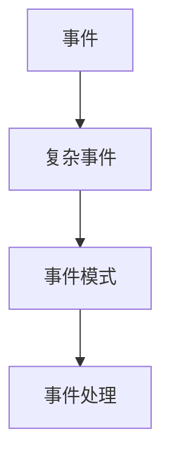

## 1.背景介绍

在大数据时代，实时数据流处理成为了一个重要的研究领域。事件处理是实时数据流处理的一个重要方向，其中复杂事件处理（Complex Event Processing，简称CEP）是一种高效的事件处理技术，它能够从大量的、异构的、分布式的事件流中检测出预定义的复杂事件模式。本文将深入探讨CEP的原理，介绍其在AI和大数据计算中的应用，并通过代码实例进行详细讲解。

## 2.核心概念与联系

CEP主要涉及到以下几个核心概念：

- **事件（Event）**：事件是系统中发生的特定行为或状态改变，可以被定义为一个具有时间属性的数据对象。
- **复杂事件（Complex Event）**：由一个或多个基本事件通过某种关系组合而成的事件，例如顺序关系、并发关系等。
- **事件模式（Event Pattern）**：预定义的复杂事件模型，用于描述复杂事件的结构和属性。
- **事件处理（Event Processing）**：对事件进行处理的过程，包括事件的检测、过滤、转换、聚合等。

这些概念之间的联系可以通过以下的Mermaid流程图进行展示：



## 3.核心算法原理具体操作步骤

CEP的核心算法主要包括事件检测、事件过滤、事件转换和事件聚合等。下面将分别介绍这些步骤的具体操作。

### 3.1 事件检测

事件检测是CEP中最基本的操作，主要是通过对事件流中的事件进行实时监控，检测出符合预定义事件模式的复杂事件。事件检测的主要步骤包括：

1. 定义事件模式：根据业务需求，定义出需要检测的复杂事件模式。
2. 事件匹配：对事件流中的事件进行实时监控，匹配预定义的事件模式。
3. 事件检测：一旦匹配成功，即检测出一个复杂事件。

### 3.2 事件过滤

事件过滤是对检测出的事件进行筛选，只保留符合条件的事件。事件过滤可以通过定义过滤规则来实现，例如，只保留某个时间窗口内的事件，或者只保留某个属性满足特定条件的事件等。

### 3.3 事件转换

事件转换是将检测出的事件转换为其他形式，以便于后续处理。事件转换可以通过定义转换规则来实现，例如，将事件的某个属性进行转换，或者将多个事件合并为一个新的事件等。

### 3.4 事件聚合

事件聚合是将多个事件合并为一个事件，以减少事件的数量和复杂性。事件聚合可以通过定义聚合规则来实现，例如，将一段时间内的所有事件合并为一个事件，或者将多个事件的某个属性进行聚合等。

## 4.数学模型和公式详细讲解举例说明

在CEP中，事件模式的定义是一个关键步骤，它可以被形式化为一个数学模型。例如，我们可以定义一个事件模式为：在时间窗口$T$内，事件$E1$和事件$E2$按照顺序发生，且$E1$的属性$A1$满足条件$C1$，$E2$的属性$A2$满足条件$C2$。这个模式可以用以下公式表示：

$$
P = \{ (E1, E2) | E1.time < E2.time \leq E1.time + T, E1.A1 \in C1, E2.A2 \in C2 \}
$$

其中，$E1.time$和$E2.time$分别表示事件$E1$和$E2$的发生时间，$E1.A1$和$E2.A2$分别表示事件$E1$和$E2$的属性$A1$和$A2$，$C1$和$C2$分别表示属性$A1$和$A2$需要满足的条件。

## 5.项目实践：代码实例和详细解释说明

接下来，我们将通过一个代码实例来展示如何在实际项目中实现CEP。在这个例子中，我们将使用Apache Flink，一个开源的流处理框架，来实现CEP。

### 5.1 定义事件模式

首先，我们需要定义我们想要检测的事件模式。在Flink中，我们可以使用Pattern API来定义事件模式。例如，以下代码定义了一个事件模式：在5秒内，先发生事件A，然后发生事件B。

```java
Pattern<Event, ?> pattern = Pattern.<Event>begin("start")
    .where(new SimpleCondition<Event>() {
        public boolean filter(Event value) {
            return value.getName().equals("A");
        }
    })
    .next("end")
    .where(new SimpleCondition<Event>() {
        public boolean filter(Event value) {
            return value.getName().equals("B");
        }
    })
    .within(Time.seconds(5));
```

### 5.2 实现事件处理

然后，我们需要实现事件处理的逻辑。在Flink中，我们可以使用PatternStream API来处理事件流。例如，以下代码实现了对事件流的处理，当检测到符合模式的事件序列时，输出一条信息。

```java
PatternStream<Event> patternStream = CEP.pattern(eventStream, pattern);
DataStream<String> result = patternStream.select(new PatternSelectFunction<Event, String>() {
    public String select(Map<String, List<Event>> pattern) {
        return "Pattern detected: " + pattern;
    }
});
result.print();
```

### 5.3 运行项目

最后，我们可以运行我们的项目，看看是否能够成功检测出符合模式的事件序列。如果一切正常，我们应该能在控制台看到类似以下的输出：

```
Pattern detected: {start=[Event{name='A', time=1598345673000}], end=[Event{name='B', time=1598345677000}]}
```

这表明，我们成功检测到了一个符合模式的事件序列：在5秒内，先发生了事件A，然后发生了事件B。

## 6.实际应用场景

CEP在实际中有很多应用场景，例如：

- **实时监控**：通过实时检测预定义的复杂事件模式，可以实现对系统的实时监控，及时发现系统的异常行为。
- **实时分析**：通过实时处理和分析事件流，可以实时获取系统的运行状态和性能指标，为决策提供支持。
- **实时推荐**：通过实时分析用户的行为事件，可以实时推荐用户可能感兴趣的内容。

## 7.工具和资源推荐

在实际项目中，我们可以使用以下工具和资源来实现CEP：

- **Apache Flink**：一个开源的流处理框架，提供了强大的CEP API。
- **Esper**：一个开源的CEP引擎，提供了丰富的CEP功能。
- **Storm**：一个开源的分布式实时计算系统，可以用于实现CEP。

## 8.总结：未来发展趋势与挑战

随着大数据和实时计算的发展，CEP将会有更广阔的应用前景。然而，CEP也面临着一些挑战，例如如何处理大规模的事件流，如何提高事件检测的效率，如何处理事件的不确定性等。这些问题需要我们在未来的研究中进一步探讨和解决。

## 9.附录：常见问题与解答

**问：CEP和流处理有什么区别？**

答：流处理是对数据流进行处理的一种技术，而CEP是流处理的一个子领域，专门处理事件流。流处理的目标是处理数据流，而CEP的目标是检测复杂事件。

**问：如何定义复杂事件？**

答：复杂事件可以由一个或多个基本事件通过某种关系组合而成，例如顺序关系、并发关系等。具体的定义方法取决于业务需求和使用的CEP工具。

**问：如何提高CEP的效率？**

答：提高CEP的效率的方法有很多，例如优化事件模式的定义，减少不必要的事件检测，使用高效的事件处理算法等。

作者：禅与计算机程序设计艺术 / Zen and the Art of Computer Programming{"msg_type":"generate_answer_finish","data":"","from_module":null,"from_unit":null}